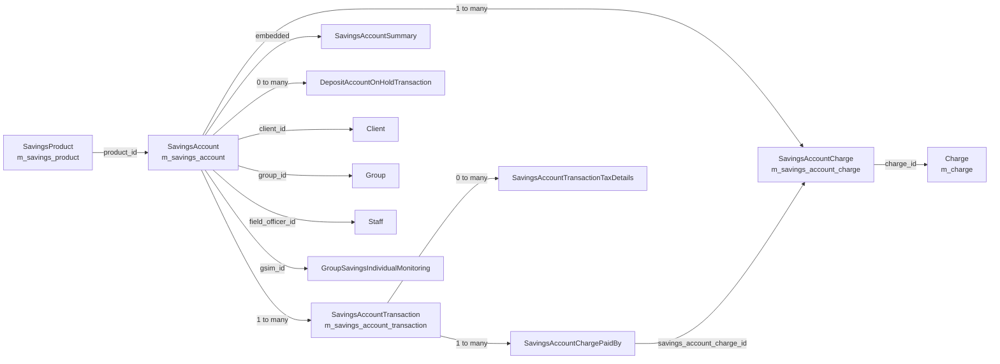
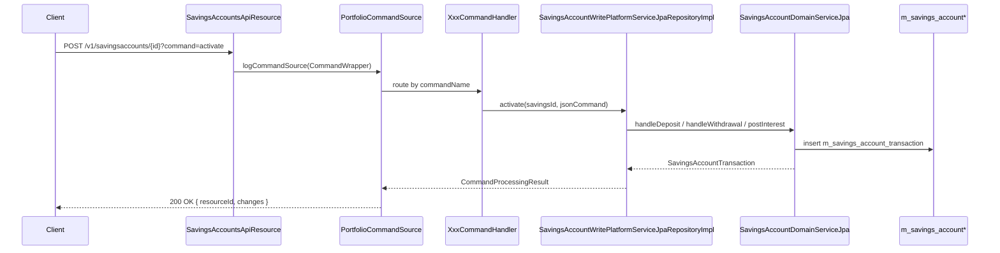

Apache Fineract groups all passbook savings, fixed deposit (FD) and recurring deposit (RD) functionality into a single rich aggregate built around `SavingsAccount`. Most of the persistent domain classes (`SavingsAccount`, `SavingsAccountTransaction`, `SavingsProduct`, `SavingsAccountCharge`, `FixedDepositAccount`, `RecurringDepositAccount`, the on-hold and tax-detail entities) live in the `fineract-savings` Gradle module under `org.apache.fineract.portfolio.savings.domain`. The HTTP layer, the JPA-backed write/read services, the Spring command handlers and the COB / scheduled jobs live in the `fineract-provider` module under the same package, while cross-cutting enumerations, DTOs and the API constant catalogue sit in `fineract-core` (`org.apache.fineract.portfolio.savings`).

This wiki section is the reference engineers and coding agents should reach for when working on savings: it covers the entity shape, the state machine, every command exposed over REST, the read service SQL, and how the schedulers and the [Close of Business](/cob/savings-cob-business-steps) pipeline drive interest posting and dormancy.

## What the savings module provides

<CardGroup cols={2}>
  <Card title="Passbook savings" icon="piggy-bank">
    Standard transactional savings accounts created from a `SavingsProduct` (discriminator `100`). Supports deposits, withdrawals, withdrawal fees, lock-in, optional overdraft and minimum-balance enforcement.
  </Card>
  <Card title="Fixed deposit (FD)" icon="vault">
    Term deposits with a maturity date, pre-closure penalty interest, interest charts (`InterestRateChart`) and optional GSIM grouping. Discriminator `200` on `m_savings_account` and `m_savings_product`.
  </Card>
  <Card title="Recurring deposit (RD)" icon="calendar-days">
    Schedule-driven deposit accounts with periodic instalments (`RecurringDepositScheduleInstallment`) and a `RecurringDepositProduct` template. Discriminator `300`.
  </Card>
  <Card title="Charges & holds" icon="receipt">
    `SavingsAccountCharge` for fees/penalties (specific, withdrawal, annual, monthly, no-activity) and `DepositAccountOnHoldTransaction` for amount holds / lien.
  </Card>
</CardGroup>

The three account flavours share one table (`m_savings_account`) via JPA single-table inheritance; `SavingsAccount` itself carries `@DiscriminatorValue("100")` and `FixedDepositAccount` / `RecurringDepositAccount` extend it.

```java
// fineract-savings/.../savings/domain/SavingsAccount.java
@Entity
@Table(name = "m_savings_account", uniqueConstraints = {
        @UniqueConstraint(columnNames = { "account_no" }, name = "sa_account_no_UNIQUE"),
        @UniqueConstraint(columnNames = { "external_id" }, name = "sa_external_id_UNIQUE") })
@Inheritance(strategy = InheritanceType.SINGLE_TABLE)
@DiscriminatorColumn(name = "deposit_type_enum", discriminatorType = DiscriminatorType.INTEGER)
@DiscriminatorValue("100")
public class SavingsAccount extends AbstractAuditableWithUTCDateTimeCustom<Long>
        implements IDepositAccountType {
```

## Module layout

The savings code is split between three Gradle modules. Knowing where each piece lives saves a lot of grep time:

<AccordionGroup>
  <Accordion title="fineract-savings (domain + simple services)">
    `org.apache.fineract.portfolio.savings`

    - `domain/` — JPA entities: `SavingsAccount`, `SavingsAccountTransaction`, `SavingsAccountCharge`, `SavingsAccountChargePaidBy`, `SavingsAccountSummary`, `SavingsAccountTransactionTaxDetails`, `SavingsProduct`, `FixedDepositProduct`, `RecurringDepositProduct`, `DepositAccountOnHoldTransaction`, `DepositAccountTermAndPreClosure`, `DepositAccountInterestRateChart`, `GroupSavingsIndividualMonitoring`, `SavingsOfficerAssignmentHistory`. Plus repositories and the `*Wrapper` "not found"-throwing variants.
    - `exception/` — `SavingsAccountNotFoundException`, `InsufficientAccountBalanceException`, `SavingsAccountBlockedException`, `SavingsAccountCreditsBlockedException`, `SavingsAccountDebitsBlockedException`, `SavingsAccountTransactionNotFoundException`, ...
    - `service/` — interface contracts: `SavingsAccountWritePlatformService`, `SavingsAccountReadPlatformService`, `SavingsAccountChargeReadPlatformService`, `DepositAccountWritePlatformService`, `SavingsAccountDomainService`, `SavingsApplicationProcessWritePlatformService`, `SavingsProductReadPlatformService`, etc.
    - `data/` — read-model DTOs that bridge JDBC ResultSets into JSON.
  </Accordion>
  <Accordion title="fineract-core (shared enums and DTOs)">
    `org.apache.fineract.portfolio.savings`

    - `SavingsAccountTransactionType` — 22-value enum tagging every monetary event.
    - `SavingsApiConstants` / `DepositsApiConstants` — parameter names and command tokens.
    - `SavingsCompoundingInterestPeriodType`, `SavingsPostingInterestPeriodType`, `SavingsInterestCalculationType`, `SavingsInterestCalculationDaysInYearType`, `SavingsPeriodFrequencyType`, `SavingsWithdrawalFeesType`, `DepositAccountType`, `DepositAccountOnHoldTransactionType`.
    - `domain/SavingsAccountStatusType`, `domain/SavingsAccountSubStatusEnum`.
    - `data/*Data` DTOs (`SavingsAccountData`, `SavingsAccountTransactionData`, `SavingsProductData`, `SavingsAccountChargeData`, ...).
  </Accordion>
  <Accordion title="fineract-provider (API, handlers, write impls, jobs)">
    `org.apache.fineract.portfolio.savings`

    - `api/` — JAX-RS resources: `SavingsAccountsApiResource` (`/v1/savingsaccounts`), `SavingsAccountTransactionsApiResource` (`/v1/savingsaccounts/{id}/transactions`), `SavingsAccountChargesApiResource` (`/v1/savingsaccounts/{id}/charges`), `SavingsProductsApiResource` (`/v1/savingsproducts`), plus FD/RD/GSIM variants and the `InternalSavingsAccountInformationApiResource` testing hook.
    - `handler/` — 80+ Spring `@CommandType` handlers that dispatch each `commands` row to the right write-service method (`DepositSavingsAccountCommandHandler`, `WithdrawSavingsAccountCommandHandler`, `ActivateSavingsAccountCommandHandler`, `PostInterestSavingsAccountCommandHandler`, `BlockCreditsToSavingsAccountCommandHandler`, ...).
    - `service/` — concrete implementations: `SavingsAccountWritePlatformServiceJpaRepositoryImpl`, `SavingsAccountReadPlatformServiceImpl`, `SavingsAccountDomainServiceJpa`, `SavingsAccountAssembler`, `SavingsAccountInterestPostingServiceImpl`, `SavingsSchedularInterestPoster`, `SavingsAccountChargeReadPlatformServiceImpl`, `SavingsAccountTemplateReadPlatformServiceImpl`, `SavingsApplicationProcessWritePlatformServiceJpaRepositoryImpl`, `DepositAccountWritePlatformServiceJpaRepositoryImpl`.
    - `jobs/` — Spring Batch step definitions: `postinterestforsavings`, `applyannualfeeforsavings`, `payduesavingscharges`, `updatedepositsaccountmaturitydetails`, `updatesavingsdormantaccounts`, `addaccrualtransactionforsavings`, `generaterdschedule`, `generateadhocclientschhedule`, `transferinteresttosavings`.
    - `starter/SavingsConfiguration.java` — `@Configuration` that wires the read/write services as Spring beans.
  </Accordion>
</AccordionGroup>

## Aggregate shape

The `SavingsAccount` aggregate is wide and chatty: it owns the lifecycle dates, derived balance, the cached `SavingsAccountSummary` (debits/credits/interest/fees totals), the transaction list and the charge set. Transactions and charges link back via `savings_account_id` with `orphanRemoval = true`.



Some key relations from `SavingsAccount.java`:

```java
@Embedded
protected SavingsAccountSummary summary;

@OrderBy(value = "dateOf, createdDate, id")
@OneToMany(cascade = CascadeType.ALL, mappedBy = "savingsAccount",
           orphanRemoval = true, fetch = FetchType.LAZY)
protected List<SavingsAccountTransaction> transactions = new ArrayList<>();

@OneToMany(cascade = CascadeType.ALL, mappedBy = "savingsAccount",
           orphanRemoval = true, fetch = FetchType.LAZY)
protected Set<SavingsAccountCharge> charges = new HashSet<>();

@OneToMany(cascade = CascadeType.ALL, mappedBy = "savingsAccount",
           orphanRemoval = true, fetch = FetchType.LAZY)
private Set<SavingsOfficerAssignmentHistory> savingsOfficerHistory = new HashSet<>();
```

`SavingsAccountTransaction` participates with a single explicit back-reference and orders by transaction date, creation date and id — that ordering is the canonical chronology used by interest posting and by the `SavingsAccountTransactionComparator`.

## High-level flow

The savings flow is bookended by the [commands framework](/core/commands-framework). Every state change comes in as a JSON-payload `commands` row, a Spring `@CommandType` handler maps it to a write-service method, the write service mutates the aggregate, persists, posts journal entries through the [accounting processors](/accounting/accounting-processors) and fires a business event.



## Sub-pages

<CardGroup cols={2}>
  <Card title="SavingsAccount domain" icon="database" href="/savings/savings-account-domain">
    Every column on `m_savings_account`, the status / sub-status enums, lock-in, overdraft, minimum balance, lien and dormancy fields.
  </Card>
  <Card title="Transactions" icon="arrow-right-arrow-left" href="/savings/savings-transactions">
    `SavingsAccountTransaction` entity, the 22-value type enum, reversal vs `is_reversal` adjustment, hold / release, running balance.
  </Card>
  <Card title="Write service" icon="pen-to-square" href="/savings/savings-write-service">
    `SavingsAccountWritePlatformServiceJpaRepositoryImpl` — deposit, withdraw, post interest, charge handling, hold, block/unblock, activate, close.
  </Card>
  <Card title="Read service" icon="magnifying-glass" href="/savings/savings-read-service">
    `SavingsAccountReadPlatformServiceImpl` JDBC mappers, the pagination SQL, transaction queries, template assembly.
  </Card>
  <Card title="Accounts API" icon="square-pen" href="/savings/savings-accounts-api">
    Every endpoint exposed by `SavingsAccountsApiResource` and the `?command=` matrix (approve, activate, postInterest, block, hold, ...).
  </Card>
  <Card title="Transactions API" icon="list" href="/savings/savings-transactions-api">
    `SavingsAccountTransactionsApiResource` — deposit, withdrawal, force-withdrawal, hold, undo, reverse, adjust, releaseAmount.
  </Card>
  <Card title="Product API" icon="folder-gear" href="/savings/savings-product-api">
    `SavingsProductsApiResource` and the `SavingsProduct` JPA entity field-by-field (interest, overdraft, dormancy, accounting, charges).
  </Card>
  <Card title="API surface map" icon="globe" href="/api/savings-apis">
    Cross-module map of every savings/FD/RD/GSIM URL the tenant exposes.
  </Card>
</CardGroup>

## Related references

- [COB savings business steps](/cob/savings-cob-business-steps) — how `ApplyChargeToOverdueSavingsAccount`, `UpdateSavingsDormancyStatus` and friends plug into the per-account COB loop.
- [Accounting processors](/accounting/accounting-processors) — how `postJournalEntries` is wired to the savings GL mapping (interest expense, fee income, control account, transfers in suspense).
- [Commands framework](/core/commands-framework) — how `CommandWrapperBuilder.savingsAccountActivation`, `.savingsAccountDeposit`, `.savingsAccountWithdrawal` etc. become rows in `m_portfolio_command_source`.
- [Business event](/core/event-business) — `SavingsActivateBusinessEvent`, `SavingsDepositBusinessEvent`, `SavingsWithdrawalBusinessEvent`, `SavingsPostInterestBusinessEvent`, `SavingsCloseBusinessEvent` raised by the write service.

## Enumerations cheat sheet

These four enums show up everywhere in the API JSON; readers and validators both translate to/from their integer codes (see `service/SavingsEnumerations`).

| Enum | Values | Stored on |
|------|--------|-----------|
| `SavingsAccountStatusType` | 100 SUBMITTED_AND_PENDING_APPROVAL, 200 APPROVED, 300 ACTIVE, 303 TRANSFER_IN_PROGRESS, 304 TRANSFER_ON_HOLD, 400 WITHDRAWN_BY_APPLICANT, 500 REJECTED, 600 CLOSED, 700 PRE_MATURE_CLOSURE, 800 MATURED | `m_savings_account.status_enum` |
| `SavingsAccountSubStatusEnum` | 0 NONE, 100 INACTIVE, 200 DORMANT, 300 ESCHEAT, 400 BLOCK, 500 BLOCK_CREDIT, 600 BLOCK_DEBIT | `m_savings_account.sub_status_enum` |
| `SavingsAccountTransactionType` | 1 DEPOSIT, 2 WITHDRAWAL, 3 INTEREST_POSTING, 4 WITHDRAWAL_FEE, 5 ANNUAL_FEE, 6 WAIVE_CHARGES, 7 PAY_CHARGE, 8 DIVIDEND_PAYOUT, 10 ACCRUAL, 12 INITIATE_TRANSFER, 13 APPROVE_TRANSFER, 14 WITHDRAW_TRANSFER, 15 REJECT_TRANSFER, 16 WRITTEN_OFF, 17 OVERDRAFT_INTEREST, 18 WITHHOLD_TAX, 19 ESCHEAT, 20 AMOUNT_HOLD, 21 AMOUNT_RELEASE | `m_savings_account_transaction.transaction_type_enum` |
| `DepositAccountType` | 100 SAVINGS_DEPOSIT, 200 FIXED_DEPOSIT, 300 RECURRING_DEPOSIT, 400 CURRENT_DEPOSIT | `m_savings_account.deposit_type_enum` |

`SavingsAccountTransactionType` is also tagged with `TransactionEntryType.CREDIT` / `DEBIT` to drive journal-entry direction — see `isCredit()` / `isDebit()` for the special-cased `AMOUNT_HOLD`, `AMOUNT_RELEASE` and `ESCHEAT` cases.

```java
public boolean isCredit() {
    // AMOUNT_RELEASE is not credit, because the account balance is not changed
    return isCreditEntryType() && !isAmountRelease();
}

public boolean isDebit() {
    // AMOUNT_HOLD, ESCHEAT are not debit, because the account balance is not changed
    return isDebitEntryType() && !isAmountOnHold() && !isEscheat();
}
```

## Where each command originates

The Java handler classes under `portfolio/savings/handler/` are the single source of truth for which command tokens exist. A handful that you will see in the API tables on the sub-pages:

| Handler | Command name | Write-service entry point |
|---------|--------------|---------------------------|
| `ActivateSavingsAccountCommandHandler` | `SAVINGSACCOUNT_ACTIVATE` | `activate(savingsId, command)` |
| `DepositSavingsAccountCommandHandler` | `SAVINGSACCOUNT_DEPOSIT` | `deposit(savingsId, command)` |
| `WithdrawSavingsAccountCommandHandler` | `SAVINGSACCOUNT_WITHDRAWAL` | `withdrawal(savingsId, command)` |
| `ForceWithdrawalSavingsAccountCommandHandler` | `SAVINGSACCOUNT_FORCEWITHDRAWAL` | `forceWithdrawal(savingsId, command)` |
| `PostInterestSavingsAccountCommandHandler` | `SAVINGSACCOUNT_INTERESTPOSTING` | `postInterest(command)` |
| `CalculateInterestSavingsAccountCommandHandler` | `SAVINGSACCOUNT_CALCULATEINTEREST` | `calculateInterest(savingsId)` |
| `CloseSavingsAccountCommandHandler` | `SAVINGSACCOUNT_CLOSE` | `close(savingsId, command)` |
| `HoldAmountSavingsAccountCommandHandler` | `SAVINGSACCOUNT_HOLDAMOUNT` | `holdAmount(savingsId, command)` |
| `ReleaseAmountSavingsAccountCommandHandler` | `SAVINGSACCOUNT_RELEASEAMOUNT` | `releaseAmount(savingsId, txnId)` |
| `BlockSavingsAccountCommandHandler` / `UnblockSavingsAccountCommandHandler` | `SAVINGSACCOUNT_BLOCK` / `UNBLOCK` | `blockAccount` / `unblockAccount` |
| `BlockCreditsToSavingsAccountCommandHandler` | `SAVINGSACCOUNT_BLOCKCREDIT` | `blockCredits` |
| `BlockDebitsFromSavingsAccountCommandHandler` | `SAVINGSACCOUNT_BLOCKDEBIT` | `blockDebits` |
| `AddSavingsAccountChargeCommandHandler` | `SAVINGSACCOUNTCHARGE_CREATE` | `addSavingsAccountCharge(command)` |
| `PaySavingsAccountChargeCommandHandler` | `SAVINGSACCOUNTCHARGE_PAY` | `payCharge(...)` |
| `WaiveSavingsAccountChargeCommandHandler` | `SAVINGSACCOUNTCHARGE_WAIVE` | `waiveCharge(...)` |
| `InactivateSavingsAccountChargeCommandHandler` | `SAVINGSACCOUNTCHARGE_INACTIVATE` | `inactivateCharge(...)` |

The full list (including GSIM, FD and RD variants) lives at `fineract-provider/src/main/java/org/apache/fineract/portfolio/savings/handler/`.

<Tip>
When you need to add a new command, the minimum touch is: (a) add a constant in `SavingsApiConstants`, (b) extend `CommandWrapperBuilder` with the builder shortcut, (c) write the handler annotated with `@CommandType(entity = "SAVINGSACCOUNT", action = "FOO")`, (d) add the write-service method, and (e) handle the new value in the right `?command=` branch in `SavingsAccountsApiResource` or `SavingsAccountTransactionsApiResource`.
</Tip>
