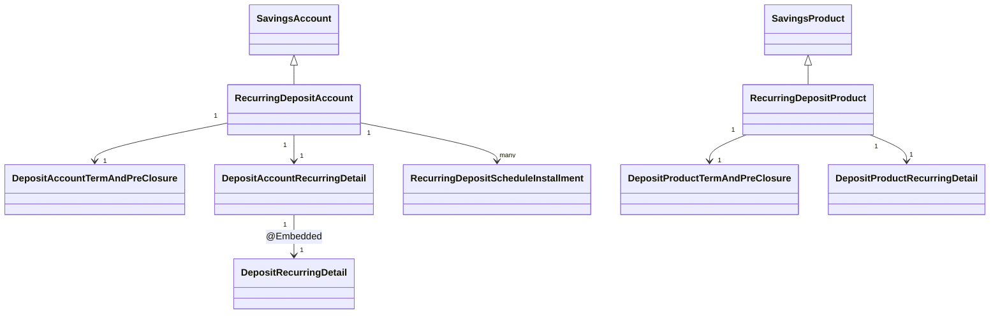
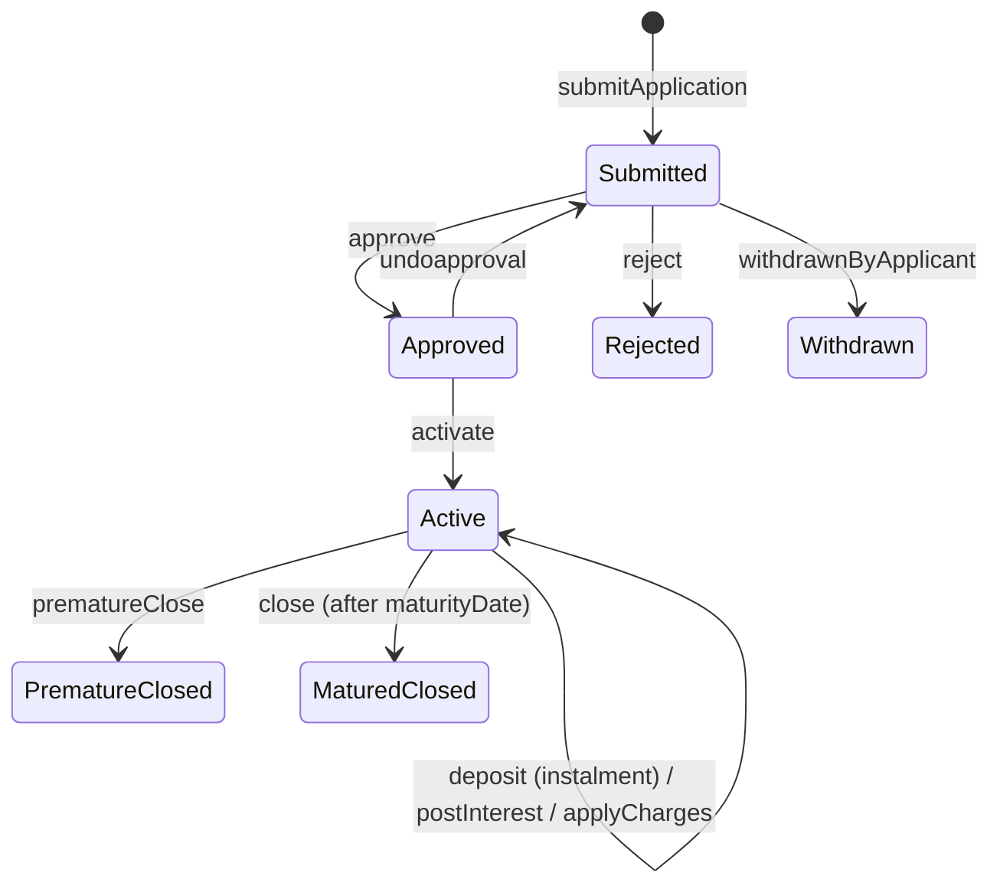

Apache Fineract models a recurring deposit (RD) as a `SavingsAccount` subtype that, on top of the FD term/preclosure model, owns an ordered set of `RecurringDepositScheduleInstallment` rows describing the mandatory periodic instalments the customer must pay. The persistent classes (`RecurringDepositAccount`, `RecurringDepositProduct`, `DepositAccountRecurringDetail`, `DepositRecurringDetail`, `RecurringDepositScheduleInstallment`) live across `fineract-savings` and `fineract-provider`, while the HTTP surface (`RecurringDepositAccountsApiResource`, `RecurringDepositAccountTransactionsApiResource`, `RecurringDepositProductsApiResource`) and the schedule-generation / overdue-update jobs live in `fineract-provider`.

This page is the engineering reference for the RD subtype: the inheritance shape, how the recurring instalment schedule is generated from the linked `Calendar`, how mandatory vs. recommended deposits are tracked, the deposit/withdrawal transactions API, and the full state-machine. Pair it with [Fixed Deposit](/savings/fixed-deposit) for the FD counterpart, [Savings Overview](/savings/overview) for the shared `SavingsAccount` base, and [Savings Transactions](/savings/savings-transactions) for the underlying transaction shape.

## Entity inheritance

`RecurringDepositAccount` extends `SavingsAccount` and uses the `300` discriminator value on `m_savings_account`:

```java
// fineract-provider/.../savings/domain/RecurringDepositAccount.java
@Entity
@DiscriminatorValue("300")
public class RecurringDepositAccount extends SavingsAccount {

    @OneToOne(fetch = FetchType.LAZY, cascade = CascadeType.ALL, mappedBy = "account")
    private DepositAccountTermAndPreClosure accountTermAndPreClosure;

    @OneToOne(fetch = FetchType.LAZY, cascade = CascadeType.ALL, mappedBy = "account")
    private DepositAccountRecurringDetail recurringDetail;

    @OneToOne(fetch = FetchType.LAZY, cascade = CascadeType.ALL, mappedBy = "account")
    protected DepositAccountInterestRateChart chart;

    @OneToMany(cascade = CascadeType.ALL, mappedBy = "account",
               orphanRemoval = true, fetch = FetchType.LAZY)
    @OrderBy(value = "installmentNumber")
    private List<RecurringDepositScheduleInstallment> depositScheduleInstallments
            = new ArrayList<>();
}
```

So an RD owns:

- a `DepositAccountTermAndPreClosure` (same shape as the FD aggregate — deposit amount, period, maturity, pre-closure rules, on-closure instruction);
- a `DepositAccountRecurringDetail` (RD-only — mandatory/recommended deposit, overdue counters, calendar inheritance flag);
- an optional `DepositAccountInterestRateChart` (slab/period interest table);
- an ordered list of `RecurringDepositScheduleInstallment` rows.



## `DepositAccountRecurringDetail`

This row carries the per-account recurring configuration and the live overdue tallies:

```java
// fineract-provider/.../savings/domain/DepositAccountRecurringDetail.java
@Entity
@Table(name = "m_deposit_account_recurring_detail")
public class DepositAccountRecurringDetail extends AbstractPersistableCustom<Long> {
    @Column(name = "mandatory_recommended_deposit_amount", scale = 6, precision = 19)
    private BigDecimal mandatoryRecommendedDepositAmount;
    @Column(name = "total_overdue_amount",     scale = 6, precision = 19) private BigDecimal totalOverdueAmount;
    @Column(name = "no_of_overdue_installments")                          private Integer    noOfOverdueInstallments;
    @Embedded private DepositRecurringDetail recurringDetail;
    @OneToOne @JoinColumn(name = "savings_account_id", nullable = false)
    private SavingsAccount account;
    @Column(name = "is_calendar_inherited", nullable = false) private boolean isCalendarInherited;
}
```

The embedded `DepositRecurringDetail` (from `fineract-savings`) holds three booleans that drive validation and the schedule:

```java
@Embeddable
public class DepositRecurringDetail {
    @Column(name = "is_mandatory")                       private boolean isMandatoryDeposit;
    @Column(name = "allow_withdrawal")                   private boolean allowWithdrawal;
    @Column(name = "adjust_advance_towards_future_payments") private boolean adjustAdvanceTowardsFuturePayments;
}
```

| Field | Meaning |
| --- | --- |
| `isMandatoryDeposit`              | When true, customer must pay `mandatoryRecommendedDepositAmount` every period. When false, the value is treated as a recommendation only and no overdue flag is raised. |
| `allowWithdrawal`                 | Whether interim withdrawals (before maturity) are permitted on the account. Mirrored by `RecurringDepositAccount.allowWithdrawal()`. |
| `adjustAdvanceTowardsFuturePayments` | If true, a payment exceeding the current instalment is allocated to the next due instalments. If false, the excess is treated as advance balance on the latest paid instalment. |

The `mandatoryRecommendedDepositAmount` field is the installment amount used by `generateSchedule` and updated through:

```java
public Map<String, Object> update(final JsonCommand command, …) {
    if (command.isChangeInBigDecimalParameterNamed(mandatoryRecommendedDepositAmountParamName,
                                                   this.mandatoryRecommendedDepositAmount)) {
        this.mandatoryRecommendedDepositAmount =
            command.bigDecimalValueOfParameterNamed(mandatoryRecommendedDepositAmountParamName);
    }
    …
}
```

## `RecurringDepositScheduleInstallment`

Each scheduled deposit is a row in `m_mandatory_savings_schedule`:

```java
// fineract-provider/.../savings/domain/RecurringDepositScheduleInstallment.java
@Entity
@Table(name = "m_mandatory_savings_schedule")
public class RecurringDepositScheduleInstallment extends AbstractPersistableCustom<Long> {
    @ManyToOne private RecurringDepositAccount account;
    @Column(name = "installment")    private Integer    installmentNumber;
    @Column(name = "fromdate")       private LocalDate  fromDate;
    @Column(name = "duedate")        private LocalDate  dueDate;
    @Column(name = "deposit_amount", scale = 6, precision = 19) private BigDecimal depositAmount;
    @Column(name = "deposit_amount_completed_derived", scale = 6, precision = 19)
                                     private BigDecimal depositAmountCompleted;
    @Column(name = "total_paid_in_advance_derived",    scale = 6, precision = 19)
                                     private BigDecimal totalPaidInAdvance;
    @Column(name = "total_paid_late_derived",          scale = 6, precision = 19)
                                     private BigDecimal totalPaidLate;
    @Column(name = "completed_derived") private boolean completed;
    @Column(name = "obligations_met_on_date") private LocalDate obligationsMetOnDate;
}
```

An instalment moves through three derived states:

| State              | Predicate |
| ------------------ | --------- |
| Outstanding        | `!completed && depositAmountCompleted < depositAmount` |
| Outstanding overdue| `!completed && dueDate < businessDate` |
| Fully paid         | `completed = true && obligationsMetOnDate = …` |

`RecurringDepositAccount.updateOverduePayments(LocalDate todayDate)` walks `depositScheduleInstallments` and updates the parent `recurringDetail.totalOverdueAmount` / `noOfOverdueInstallments`. This is invoked by the `updateMaturityDetails` job and at every deposit/withdrawal transaction.

## Period frequency and schedule generation

`generateSchedule(PeriodFrequencyType frequency, Integer recurringEvery, Calendar calendar)` is the single entry point for building the instalment plan:

```java
// fineract-provider/.../savings/domain/RecurringDepositAccount.java
public void generateSchedule(final PeriodFrequencyType frequency,
                             final Integer recurringEvery,
                             final Calendar calendar) {
    this.depositScheduleInstallments.clear();
    LocalDate installmentDate;
    if (this.isCalendarInherited()) {
        installmentDate = CalendarUtils.getNextScheduleDate(calendar, accountSubmittedOrActivationDate());
    } else {
        installmentDate = depositStartDate();
    }

    int installmentNumber = 1;
    final LocalDate maturityDate  = calcualteScheduleTillDate(frequency, recurringEvery);
    final BigDecimal depositAmount = this.recurringDetail.mandatoryRecommendedDepositAmount();

    while (DateUtils.isBefore(installmentDate, maturityDate)) {
        final RecurringDepositScheduleInstallment installment =
            RecurringDepositScheduleInstallment.installment(this, installmentNumber,
                                                            installmentDate, depositAmount);
        addDepositScheduleInstallment(installment);
        installmentDate = DepositAccountUtils.calculateNextDepositDate(
                              installmentDate, frequency, recurringEvery);
        installmentNumber += 1;
    }
    updateDepositAmount();
}
```

Two parameters drive the cadence:

- `PeriodFrequencyType frequency` — `DAYS(0)`, `WEEKS(1)`, `MONTHS(2)` or `YEARS(3)`.
- `Integer recurringEvery` — the multiplier. So `(WEEKS, 2)` means "every two weeks".

If `isCalendarInherited` is true the account follows the meeting calendar of the parent group/center (a `Calendar` row), and the next installment date is pulled from `CalendarUtils.getNextScheduleDate(...)` so that all members of a group pay on the same day. Otherwise the account uses its own `depositStartDate()` (either `expectedFirstDepositOnDate` or the activation date) as the seed.

`DepositAccountUtils.calculateNextDepositDate` shifts by the appropriate `ChronoUnit` increments; `calcualteScheduleTillDate` walks until the configured deposit period is exhausted or — for ad-hoc projections — until at least `GENERATE_MINIMUM_NUMBER_OF_FUTURE_INSTALMENTS` future installments exist.

### Calendar inheritance flag

`isCalendarInherited` lives on `DepositAccountRecurringDetail` and is set when the account is opened against a `clientId` belonging to a group with a Calendar that uses a `MEETING` calendar type. The `DepositApplicationProcessWritePlatformService` resolves the group calendar at submission and stores the flag for fast `generateSchedule` decisions later.

## `RecurringDepositProduct`

```java
// fineract-savings/.../savings/domain/RecurringDepositProduct.java
@Entity
@DiscriminatorValue("300")
public class RecurringDepositProduct extends SavingsProduct {
    @OneToOne(mappedBy = "product", cascade = CascadeType.ALL)
    private DepositProductTermAndPreClosure  productTermAndPreClosure;
    @OneToOne(mappedBy = "product", cascade = CascadeType.ALL)
    private DepositProductRecurringDetail   recurringDetail;
    @OneToMany(fetch = FetchType.LAZY, cascade = CascadeType.ALL)
    @JoinTable(name = "m_deposit_product_interest_rate_chart", …)
    protected Set<InterestRateChart> charts;
}
```

`DepositProductRecurringDetail` mirrors the per-account `DepositRecurringDetail` plus product-level defaults for recurring frequency, `recurringFrequency`, and `recurringFrequencyType`. These defaults are copied into the account when a new RD application is submitted.

## Account lifecycle



`RecurringDepositAccount` reuses every state from `FixedDepositAccount` but overrides `prematureClosure`, `close`, `activateWithBalance`, `postInterest`, `postMaturityInterest`, `postPreMaturityInterest`, `calculatePreMatureAmount` and `updateMaturityDateAndAmount` to take instalment progress into account.

`RecurringDepositAccount.activateWithBalance()` differs from FD — it requires `expectedFirstDepositOnDate` (or the activation date) to be set, then generates the full schedule using the product-supplied `recurringFrequencyType` / `recurringFrequency`.

## Transactions resource — `RecurringDepositAccountTransactionsApiResource`

```java
// fineract-provider/.../savings/api/RecurringDepositAccountTransactionsApiResource.java
@Path("/v1/recurringdepositaccounts/{recurringDepositAccountId}/transactions")
@Component
@Tag(name = "Recurring Deposit Account Transactions")
public class RecurringDepositAccountTransactionsApiResource { … }
```

### Endpoint catalogue

| Method | Path | Operation |
| --- | --- | --- |
| `GET`    | `…/transactions/template` | `retrieveTemplate` (defaults: today's date, currency, paymentTypeOptions) |
| `POST`   | `…/transactions?command=deposit`    | Mandatory or advance deposit toward the next outstanding instalment |
| `POST`   | `…/transactions?command=withdrawal` | Withdrawal — only honoured when `recurringDetail.allowWithdrawal` is true |
| `GET`    | `…/transactions/{transactionId}`     | `retrieveOne` |
| `POST`   | `…/transactions/{transactionId}?command=undo`   | Reverse the transaction and roll back schedule progress |
| `POST`   | `…/transactions/{transactionId}?command=modify` | Adjust transaction amount/date |

The dispatcher proves the limited command set:

```java
if (is(commandParam, "deposit")) {
    final CommandWrapper r = builder.recurringAccountDeposit(recurringDepositAccountId).build();
    result = this.commandsSourceWritePlatformService.logCommandSource(r);
} else if (is(commandParam, "withdrawal")) {
    final CommandWrapper r = builder.recurringAccountWithdrawal(recurringDepositAccountId).build();
    result = this.commandsSourceWritePlatformService.logCommandSource(r);
} else {
    throw new UnrecognizedQueryParamException("command", commandParam,
        new Object[] { "deposit", "withdrawal" });
}
```

### Deposit body

```json
{ "transactionDate": "01 May 2024",
  "transactionAmount": 1000.00,
  "paymentTypeId": 1,
  "accountNumber": "AC-001", "checkNumber": "…",
  "routingCode": "…",        "receiptNumber": "…",
  "bankNumber": "…",
  "locale": "en", "dateFormat": "dd MMM yyyy" }
```

`DepositAccountWritePlatformServiceJpaRepositoryImpl.depositToSavingsAccount(...)` validates the request, builds a `SavingsAccountTransactionDTO`, then calls `RecurringDepositAccount.handleScheduledDeposit(...)` which:

1. Finds the earliest unpaid `RecurringDepositScheduleInstallment` whose `dueDate <= transactionDate`.
2. Allocates `transactionAmount` to that installment, then — if `adjustAdvanceTowardsFuturePayments` is true — splits any remainder over subsequent installments.
3. Updates `depositAmountCompleted`, `totalPaidInAdvance`, `totalPaidLate`, `obligationsMetOnDate`, and the `completed` flag for each instalment touched.
4. Triggers `updateOverduePayments(today)` to refresh `noOfOverdueInstallments` / `totalOverdueAmount`.
5. Creates a `SavingsAccountTransaction` of type `DEPOSIT`.

### Adjust / undo flow

The transaction `POST /{transactionId}` endpoint shares one body schema. The handler dispatches:

```java
if (is(commandParam, DepositsApiConstants.COMMAND_UNDO_TRANSACTION)) {
    builder.undoRecurringAccountTransaction(recurringDepositAccountId, transactionId);
} else if (is(commandParam, DepositsApiConstants.COMMAND_ADJUST_TRANSACTION)) {
    builder.adjustRecurringAccountTransaction(recurringDepositAccountId, transactionId);
}
```

Undoing a deposit replays the schedule allocation algorithm in reverse, decrements completed installments and re-flags overdues; modifying replaces the original transaction with a new one and reruns the same allocation logic.

## Accounts resource — `RecurringDepositAccountsApiResource`

```java
// fineract-provider/.../savings/api/RecurringDepositAccountsApiResource.java
@Path("/v1/recurringdepositaccounts")
@Component
@Tag(name = "Recurring Deposit Account")
public class RecurringDepositAccountsApiResource { … }
```

| Method | Path | Operation |
| --- | --- | --- |
| `GET`  | `/v1/recurringdepositaccounts/template`                  | `retrieveTemplate` (calendars, products, charts, currencies, …) |
| `POST` | `/v1/recurringdepositaccounts`                           | `submitApplication` |
| `GET`  | `/v1/recurringdepositaccounts`                           | `retrieveAll` (`paged`, `limit`, `offset`, `sortOrder`) |
| `GET`  | `/v1/recurringdepositaccounts/{accountId}`               | `retrieveOne(associations)` |
| `PUT`  | `/v1/recurringdepositaccounts/{accountId}`               | `update` (submitted state) |
| `POST` | `/v1/recurringdepositaccounts/{accountId}?command=…`     | `handleCommands` (state machine — table below) |
| `DELETE` | `/v1/recurringdepositaccounts/{accountId}`             | `delete` (only submitted/withdrawn/rejected) |
| `GET`  | `/v1/recurringdepositaccounts/{accountId}/template`      | `accountClosureTemplate` |

The `handleCommands` dispatch accepts the same state-machine vocabulary as the FD resource, plus the RD-only `applyCharges` and `assignSavingsOfficer` / `unassignSavingsOfficer`:

```text
reject | withdrawnByApplicant | approve | undoapproval | activate
calculateInterest | postInterest | close | prematureClose | calculatePrematureAmount
```

### Submission body

```json
{ "clientId": 1, "productId": 5,
  "submittedOnDate": "01 May 2024",
  "depositAmount": 10000.00,
  "mandatoryRecommendedDepositAmount": 1000.00,
  "depositPeriod": 12, "depositPeriodFrequencyId": 2,    // MONTHS
  "recurringFrequency": 1, "recurringFrequencyType": 2,  // every 1 month
  "expectedFirstDepositOnDate": "01 May 2024",
  "isCalendarInherited": false,
  "interestCompoundingPeriodType": 1, "interestPostingPeriodType": 4,
  "interestCalculationType": 1, "interestCalculationDaysInYearType": 365,
  "lockinPeriodFrequency": 0, "lockinPeriodFrequencyType": 0,
  "transferInterestToSavings": false,
  "maturityInstructionId": 100,                          // WITHDRAW_DEPOSIT
  "isMandatoryDeposit": true,
  "allowWithdrawal": false,
  "adjustAdvanceTowardsFuturePayments": true,
  "locale": "en", "dateFormat": "dd MMM yyyy" }
```

The validator checks that:

- `depositPeriod` × `depositPeriodFrequencyId` is consistent with the product's `minDepositTerm` / `maxDepositTerm`.
- When `isCalendarInherited = true`, the parent group has at least one active `MEETING` calendar.
- `mandatoryRecommendedDepositAmount > 0` when `isMandatoryDeposit = true`.

## Products resource — `RecurringDepositProductsApiResource`

```java
@Path("/v1/recurringdepositproducts")
@Component
@Tag(name = "Recurring Deposit Product")
public class RecurringDepositProductsApiResource { … }
```

| Method | Path | Operation |
| --- | --- | --- |
| `GET`    | `/v1/recurringdepositproducts`                | `retrieveAll` |
| `POST`   | `/v1/recurringdepositproducts`                | `create` |
| `GET`    | `/v1/recurringdepositproducts/{productId}`    | `retrieveOne` |
| `PUT`    | `/v1/recurringdepositproducts/{productId}`    | `update` |
| `DELETE` | `/v1/recurringdepositproducts/{productId}`    | `delete` |
| `GET`    | `/v1/recurringdepositproducts/template`       | `template` |

A product create payload combines the savings shape with RD-specific:

```json
{ "name": "1Y RD", "shortName": "RD1Y", "currencyCode": "USD",
  "interestCompoundingPeriodType": 1, "interestPostingPeriodType": 4,
  "interestCalculationType": 1, "interestCalculationDaysInYearType": 365,
  "minDepositTerm": 6, "minDepositTermTypeId": 2,
  "maxDepositTerm": 24, "maxDepositTermTypeId": 2,
  "recurringFrequency": 1, "recurringFrequencyType": 2,
  "isMandatoryDeposit": true,
  "allowWithdrawal": false,
  "adjustAdvanceTowardsFuturePayments": true,
  "preClosurePenalApplicable": true,
  "preClosurePenalInterest": 1.0,
  "preClosurePenalInterestOnTypeId": 1,
  "charts": [ { … } ],
  "accountingRule": 2 }
```

## Pre-closure and maturity

Like FDs, RDs honour:

- `DepositPreClosureDetail` — penalty rate, `WHOLE_TERM` vs `TILL_PREMATURE_WITHDRAWAL`.
- `DepositTermDetail` — min/max/multiple constraints.
- `DepositAccountOnClosureType` — `WITHDRAW_DEPOSIT (100)`, `TRANSFER_TO_SAVINGS (200)`, `REINVEST (300)`.

`RecurringDepositAccount.calculatePreMatureAmount(preMatureDate, isPreMatureClosure, isSavingsInterestPostingAtCurrentPeriodEnd, financialYearBeginningMonth)` re-runs the posting calculation up to `preMatureDate` with the penalty applied; it powers `POST .../recurringdepositaccounts/{id}?command=calculatePrematureAmount`.

`RecurringDepositAccount.calculateMaturityDate()` adds `depositPeriod × depositPeriodFrequencyType` to `depositStartDate()`. `calculateMaturityAmount(...)` runs the schedule, applies interest periods using `nominalAnnualInterestRate` (or the chart-derived rate), and writes back `maturityDate` / `maturityAmount` to `accountTermAndPreClosure`.

## Scheduled jobs touching RDs

| Job (`JobName`) | What it does for RD |
| --- | --- |
| `GENERATE_RD_SCEHDULE` (display name *"Generate Mandatory Savings Schedule"* — note the intentional `SCEHDULE` typo in the enum constant) | Re-generates `depositScheduleInstallments` for any RD whose schedule is stale (after a product change or calendar update). |
| `UPDATE_DEPOSITS_ACCOUNT_MATURITY_DETAILS` | Re-projects maturity values and rolls fully matured RDs through the configured `DepositAccountOnClosureType`. |
| `POST_INTEREST_FOR_SAVINGS`           | Posts interest on Active RDs at the configured posting period. See [Interest Posting Job](/savings/interest-posting-job). |
| `TRANSFER_INTEREST_TO_SAVINGS`        | Sweeps posted interest into the linked savings account when `transferInterestToLinkedAccount = true`. |

## Cross references

<CardGroup cols={2}>
  <Card title="Savings overview" icon="map" href="/savings/overview">
    Shared `SavingsAccount` base, package layout and inheritance discriminator.
  </Card>
  <Card title="Fixed deposit" icon="vault" href="/savings/fixed-deposit">
    Sister page covering the FD subtype and shared term/preclosure model.
  </Card>
  <Card title="Savings transactions" icon="arrow-right-arrow-left" href="/savings/savings-transactions">
    `SavingsAccountTransaction` shape and reversal semantics referenced by RD deposit/withdrawal.
  </Card>
  <Card title="Savings charges" icon="receipt" href="/savings/savings-charges">
    Charges that can fire on RD activation, monthly anniversaries or withdrawal.
  </Card>
  <Card title="Interest posting job" icon="clock" href="/savings/interest-posting-job">
    POST_INTEREST_FOR_SAVINGS — drives RD interest posting.
  </Card>
  <Card title="Savings COB business steps" icon="calendar" href="/cob/savings-cob-business-steps">
    Daily COB pipeline that updates overdue RD instalments and dormancy.
  </Card>
</CardGroup>
