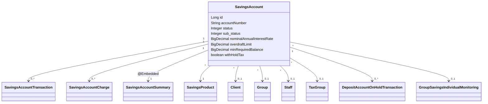

`SavingsAccount` is the central aggregate of the Apache Fineract savings module. It is a single-table inheritance root whose `@DiscriminatorValue("100")` represents passbook savings; `FixedDepositAccount` and `RecurringDepositAccount` extend it with their own discriminator and extra `@Embedded` term/recurring detail blocks. The class lives at `fineract-savings/src/main/java/org/apache/fineract/portfolio/savings/domain/SavingsAccount.java` and clocks in at almost 4000 lines because it carries the application timeline, the embedded `SavingsAccountSummary`, the cached transaction list, the charge set, all interest-calculation knobs and every state-transition method (`approveApplication`, `activate`, `close`, `block`, ...). This page walks the entity column by column and points to the matching API constant.

## Header — table and inheritance

```java
@Entity
@Table(name = "m_savings_account", uniqueConstraints = {
        @UniqueConstraint(columnNames = { "account_no" }, name = "sa_account_no_UNIQUE"),
        @UniqueConstraint(columnNames = { "external_id" }, name = "sa_external_id_UNIQUE") })
@Inheritance(strategy = InheritanceType.SINGLE_TABLE)
@DiscriminatorColumn(name = "deposit_type_enum", discriminatorType = DiscriminatorType.INTEGER)
@DiscriminatorValue("100")
@SuppressWarnings({ "MemberName" })
public class SavingsAccount extends AbstractAuditableWithUTCDateTimeCustom<Long>
        implements IDepositAccountType {

    @Version
    int version;
```

The `@Version` int is an optimistic-lock counter handled by Hibernate; callers don't touch it directly but it appears in every UPDATE statement issued from the write service.

`AbstractAuditableWithUTCDateTimeCustom` supplies the `id`, `createdDate`, `lastModifiedDate`, `createdBy`, `lastModifiedBy` columns that the rest of the platform expects (see [auditing and context](/core/auditing-and-context)).

## Identifying columns

| Field | Column | Type | Notes |
|-------|--------|------|-------|
| `accountNumber` | `account_no` | VARCHAR(20), unique, not null | Auto-generated via `RandomPasswordGenerator(19)` when blank on submittal; see `createNewApplicationForSubmittal`. |
| `externalId` | `external_id` | VARCHAR, unique | Wrapped `ExternalId` value object — `null` if not supplied. Used by `/external-id/...` resource paths. |
| `client` | `client_id` → `m_client.id` | nullable | Mutually exclusive with `group` for non-GSIM accounts. |
| `group` | `group_id` → `m_group.id` | nullable, LAZY | |
| `gsim` | `gsim_id` → `m_gsim.id` | nullable, LAZY | Set on Group Savings Individual Monitoring children. |
| `product` | `product_id` → `m_savings_product.id` | not null | Drives all defaulted interest / overdraft / charge parameters. |
| `savingsOfficer` | `field_officer_id` → `m_staff.id` | nullable, LAZY | Assigned via `assignSavingsOfficer` command. |

## Status / sub-status

```java
@Column(name = "status_enum", nullable = false)
protected Integer status;

@Column(name = "sub_status_enum", nullable = false)
protected Integer sub_status = 0;

@Column(name = "account_type_enum", nullable = false)
protected Integer accountType;
```

`status` stores a [`SavingsAccountStatusType`](/savings/overview#enumerations-cheat-sheet) integer; `sub_status` stores a `SavingsAccountSubStatusEnum` integer (default `NONE = 0`). `account_type_enum` is a `portfolio.accountdetails.domain.AccountType` (individual / JLG / group).

### Lifecycle transition methods

Every transition is a method on the entity that returns a `Map<String, Object>` of fields it changed; the write service persists the entity if the map is non-empty and emits that map as `changes` in the `CommandProcessingResult`.

| Method | Source line | Valid only from |
|--------|-------------|-----------------|
| `approveApplication(currentUser, command)` | 2295 | `SUBMITTED_AND_PENDING_APPROVAL` |
| `undoApplicationApproval(currentUser, command)` | ~2400 | `APPROVED` |
| `rejectApplication(currentUser, command)` | 2527 | `SUBMITTED_AND_PENDING_APPROVAL` |
| `applicantWithdrawsFromApplication` | ~2580 | `SUBMITTED_AND_PENDING_APPROVAL` |
| `activate(currentUser, command)` | 2649 | `APPROVED` (or `SUBMITTED_AND_PENDING_APPROVAL` for GSIM) |
| `close(currentUser, command)` | 2797 | `ACTIVE` with zero balance |
| `block()` | 3560 | `ACTIVE`; sets sub-status `BLOCK` |
| `unblock()` | 3585 | sub-status `BLOCK` |
| `blockCredits(currentSubstatus)` | 3614 | sub-status `NONE` or `BLOCK_DEBIT` |
| `unblockCredits()` | 3646 | sub-status `BLOCK_CREDIT` |
| `blockDebits(currentSubstatus)` | 3677 | sub-status `NONE` or `BLOCK_CREDIT` |
| `unblockDebits()` | 3709 | sub-status `BLOCK_DEBIT` |

Each transition also stamps a date / userid column. For example `activate()` writes:

```java
this.activatedOnDate = activationDate;
this.activatedBy = currentUser;
this.status = SavingsAccountStatusType.ACTIVE.getValue();
this.lockedInUntilDate = lockedInUntilLocalDate(activationDate);
```

### Application timeline columns

| Field | Column |
|-------|--------|
| `submittedOnDate` / `submittedBy` | `submittedon_date`, `submittedon_userid` |
| `rejectedOnDate` / `rejectedBy` | `rejectedon_date`, `rejectedon_userid` |
| `withdrawnOnDate` / `withdrawnBy` | `withdrawnon_date`, `withdrawnon_userid` |
| `approvedOnDate` / `approvedBy` | `approvedon_date`, `approvedon_userid` |
| `activatedOnDate` / `activatedBy` | `activatedon_date`, `activatedon_userid` |
| `closedOnDate` / `closedBy` | `closedon_date`, `closedon_userid` |

These appear in the read-side as `SavingsAccountApplicationTimelineData` and are joined into `SavingsAccountData` by `SavingAccountMapper`.

### Block / freeze metadata

```java
@Column(name = "reason_for_block", nullable = true)
protected String reasonForBlock;
```

Set by `blockAccount`, `blockCredits`, `blockDebits` and `holdAmount` in the write service:

```java
final String reasonForBlock = command.stringValueOfParameterNamed(
    SavingsApiConstants.reasonForBlockParamName);
validateReasonForHold(reasonForBlock);
account.updateReason(reasonForBlock);
```

## Currency

```java
@Embedded
protected MonetaryCurrency currency;
```

Embedded value object with `code`, `digitsAfterDecimal` and `inMultiplesOf`. Copied from the product at construction time and never mutated afterwards — see the constructor body:

```java
this.currency = product.currency();
```

Everywhere a `BigDecimal` is wrapped into `Money` the code calls `Money.of(account.getCurrency(), amount)`.

## Interest parameters

These five columns plus `nominalAnnualInterestRate` drive the per-account periodic interest engine implemented in `domain/interest/`.

```java
@Column(name = "nominal_annual_interest_rate", scale = 6, precision = 19, nullable = false)
protected BigDecimal nominalAnnualInterestRate;

@Column(name = "interest_compounding_period_enum", nullable = false)
protected Integer interestCompoundingPeriodType;   // SavingsCompoundingInterestPeriodType

@Column(name = "interest_posting_period_enum", nullable = false)
protected Integer interestPostingPeriodType;       // SavingsPostingInterestPeriodType

@Column(name = "interest_calculation_type_enum", nullable = false)
protected Integer interestCalculationType;         // SavingsInterestCalculationType

@Column(name = "interest_calculation_days_in_year_type_enum", nullable = false)
protected Integer interestCalculationDaysInYearType; // SavingsInterestCalculationDaysInYearType
```

| Enum | Allowed values |
|------|----------------|
| `SavingsCompoundingInterestPeriodType` | DAILY (1), MONTHLY (4), QUATERLY (5), BI_ANNUAL (6), ANNUAL (7) |
| `SavingsPostingInterestPeriodType` | MONTHLY (4), QUATERLY (5), BIANNUAL (6), ANNUAL (7) |
| `SavingsInterestCalculationType` | DAILY_BALANCE (1), AVERAGE_DAILY_BALANCE (2) |
| `SavingsInterestCalculationDaysInYearType` | DAYS_360 (360), DAYS_365 (365) |

The interest engine consumes these via `SavingsHelper` and `SavingsAccountInterestPostingServiceImpl`, producing a list of `PostingPeriod` objects which are then materialised as `INTEREST_POSTING` transactions by `postInterest`.

### Tracking columns

| Field | Column | Purpose |
|-------|--------|---------|
| `startInterestCalculationDate` | `start_interest_calculation_date` | Override starting from a later date (otherwise derived from activation). |
| `accruedTillDate` | `accrued_till_date` | High-water mark written by `addaccrualtransactionforsavings` job. |
| `lastClosedBusinessDate` | `last_closed_business_date` | Pivot date stamped by the COB step. |

## Opening balance and lock-in

```java
@Column(name = "min_required_opening_balance", scale = 6, precision = 19, nullable = true)
protected BigDecimal minRequiredOpeningBalance;

@Column(name = "lockin_period_frequency", nullable = true)
protected Integer lockinPeriodFrequency;

@Column(name = "lockin_period_frequency_enum", nullable = true)
protected Integer lockinPeriodFrequencyType;

// derived when the account becomes active
@Column(name = "lockedin_until_date_derived", nullable = true)
protected LocalDate lockedInUntilDate;
```

`lockinPeriodFrequencyType` is a `SavingsPeriodFrequencyType` (DAYS / WEEKS / MONTHS / YEARS). `lockedInUntilDate` is computed from the activation date during `activate()` and is consulted by the withdrawal validators in `SavingsAccount.validateWithdrawal*`.

<Note>
For FD/RD accounts the **deposit period** is held on the embedded `DepositAccountTermAndPreClosure` (`m_deposit_account_term_and_preclosure`) — not on `SavingsAccount` itself. See `FixedDepositAccount.accountTermAndPreClosure`.
</Note>

## Withdrawal fee for transfers

```java
@Column(name = "withdrawal_fee_for_transfer", nullable = true)
protected boolean withdrawalFeeApplicableForTransfer;
```

When `true`, an inter-account transfer triggered through the `accounttransfers` API behaves like a regular withdrawal and applies the configured WITHDRAWAL_FEE charge. This is consulted by `SavingsAccountDomainServiceJpa.handleWithdrawal` to decide whether to suppress the fee for internal transfers.

## Overdraft

```java
@Column(name = "allow_overdraft")
private boolean allowOverdraft;

@Column(name = "overdraft_limit", scale = 6, precision = 19, nullable = true)
private BigDecimal overdraftLimit;

@Column(name = "nominal_annual_interest_rate_overdraft", scale = 6, precision = 19, nullable = true)
protected BigDecimal nominalAnnualInterestRateOverdraft;

@Column(name = "min_overdraft_for_interest_calculation", scale = 6, precision = 19, nullable = true)
private BigDecimal minOverdraftForInterestCalculation;
```

`esnureOverdraftLimitsSetForOverdraftAccounts()` (sic — intentional method name in the source) is called by the constructor and by `modifyApplication` to null-out the limits when `allowOverdraft = false`. When overdraft is enabled and the running balance goes negative, the interest engine produces `OVERDRAFT_INTEREST` (type 17) DEBIT transactions instead of `INTEREST_POSTING` credits.

## Minimum balance and lien

```java
@Column(name = "enforce_min_required_balance")
private boolean enforceMinRequiredBalance;

@Column(name = "min_required_balance", scale = 6, precision = 19, nullable = true)
private BigDecimal minRequiredBalance;

@Column(name = "is_lien_allowed", nullable = false)
private boolean lienAllowed;

@Column(name = "max_allowed_lien_limit", scale = 6, precision = 19, nullable = true)
private BigDecimal maxAllowedLienLimit;

@Column(name = "min_balance_for_interest_calculation", scale = 6, precision = 19, nullable = true)
private BigDecimal minBalanceForInterestCalculation;
```

Three related-but-distinct concepts:

<Tabs>
  <Tab title="Enforce minimum required balance">
    Withdrawals are rejected by `validateAccountBalanceDoesNotBecomeNegative` if the post-withdrawal balance would dip below `minRequiredBalance`. When `enforceMinRequiredBalance = false`, the value still appears in the API response but is not enforced.
  </Tab>
  <Tab title="Lien">
    Lien overrides the minimum-balance / overdraft-limit checks for transactions that supply `lienAllowed = true` (used by court orders, regulator holds, etc.). The maximum the running balance can be pushed below the normal floor is bounded by `maxAllowedLienLimit`. Tag `is_lien_transaction` flows onto each `SavingsAccountTransaction`.
  </Tab>
  <Tab title="Enforce minimum to earn interest">
    `minBalanceForInterestCalculation` is the floor a day's end-of-day balance must exceed to count towards the interest calculation. If a day's balance is below it, that day's posting period contributes zero. Enforced inside `domain/interest/PostingPeriod` when building the periods.
  </Tab>
</Tabs>

## Tax withholding

```java
@Column(name = "withhold_tax", nullable = false)
protected boolean withHoldTax;

@ManyToOne
@JoinColumn(name = "tax_group_id")
private TaxGroup taxGroup;
```

When `withHoldTax = true`, every `INTEREST_POSTING` transaction generates a paired `WITHHOLD_TAX` (type 18, DEBIT) transaction whose component split lives in `SavingsAccountTransactionTaxDetails`. `TaxGroup` defines which `TaxComponent` rates apply at the posting date — see `TaxUtils.incomeFromTaxComponents` for the breakdown.

## On-hold / savings-on-hold totals

```java
@Column(name = "on_hold_funds_derived", scale = 6, precision = 19, nullable = true)
private BigDecimal onHoldFunds;

@Column(name = "total_savings_amount_on_hold", scale = 6, precision = 19, nullable = true)
private BigDecimal savingsOnHoldAmount;
```

Two separate buckets:

- `onHoldFunds` is the sum of `DepositAccountOnHoldTransaction` rows (typically standing orders, guarantor obligations, loan collateral on a savings account).
- `savingsOnHoldAmount` is the sum of `AMOUNT_HOLD` transactions issued via `POST /transactions?command=holdAmount`. Reduced by `releaseAmount`.

Both are subtracted from the `runningBalance` when computing the **withdrawable** balance.

## Embedded summary

```java
@Embedded
protected SavingsAccountSummary summary;
```

`SavingsAccountSummary` is an `@Embeddable` aggregating: `totalDeposits`, `totalWithdrawals`, `totalInterestEarned`, `totalInterestPosted`, `totalWithdrawalFees`, `totalAnnualFees`, `totalFeeCharge`, `totalPenaltyCharge`, `totalOverdraftInterestDerived`, `totalWithholdTax`, `accountBalance`, `runningBalanceOnPivotDate`, `interestPostedTillDate`. Every transaction insertion calls `updateSummaryWithTransactionDetails` to keep these in sync.

## Cached children

```java
@OrderBy(value = "dateOf, createdDate, id")
@OneToMany(cascade = CascadeType.ALL, mappedBy = "savingsAccount",
           orphanRemoval = true, fetch = FetchType.LAZY)
protected List<SavingsAccountTransaction> transactions = new ArrayList<>();

@OneToMany(cascade = CascadeType.ALL, mappedBy = "savingsAccount",
           orphanRemoval = true, fetch = FetchType.LAZY)
protected Set<SavingsAccountCharge> charges = new HashSet<>();

@OneToMany(cascade = CascadeType.ALL, mappedBy = "savingsAccount",
           orphanRemoval = true, fetch = FetchType.LAZY)
private Set<SavingsOfficerAssignmentHistory> savingsOfficerHistory = new HashSet<>();

@OneToMany(cascade = CascadeType.ALL, mappedBy = "account",
           orphanRemoval = true, fetch = FetchType.LAZY)
protected List<InteropIdentifier> identifiers = new ArrayList<>();
```

Notes:

- `transactions` is ordered by transaction date then creation date then id; this matters because interest calculation walks the list in date order.
- `charges` is a `Set` — uniqueness is enforced by `(savings_account_id, charge_id, charge_time_enum)` via business validation in `SavingsAccountChargeAssembler`.
- `identifiers` connects to the [interoperation](/api/interoperation-apis) layer (MSISDN, alias, IBAN).

## Transient infrastructure

```java
@Transient protected boolean accountNumberRequiresAutoGeneration = false;
@Transient protected SavingsAccountTransactionSummaryWrapper savingsAccountTransactionSummaryWrapper;
@Transient protected SavingsHelper savingsHelper;
@Transient protected List<SavingsAccountTransaction> savingsAccountTransactions = new ArrayList<>();
public transient ConfigurationDomainService configurationDomainService;
```

`SavingsAccountAssembler.setHelpers(account)` injects `SavingsHelper`, the summary wrapper and the configuration service into freshly-loaded entities. The second list `savingsAccountTransactions` is the "pivot-day" projection used when `backdatedTxnsAllowedTill` is enabled — only transactions newer than the last closed business date sit in it.

## Discriminator-related columns

```java
@Column(name = "deposit_type_enum", insertable = false, updatable = false)
private Integer depositType;
```

This is the read-only mirror of the discriminator column so domain code can ask `account.depositAccountType()` without reflection. `IDepositAccountType.isSavingsDeposit()` etc. use this value.

## Field-by-field column map

A condensed table for fast lookup, in the order they appear in the JPA file:

| Field | Column | Type | Default |
|-------|--------|------|---------|
| `version` | (Hibernate-managed) | int | 0 |
| `accountNumber` | `account_no` | VARCHAR(20) | random 19-digit if blank |
| `externalId` | `external_id` | VARCHAR | null |
| `client` | `client_id` | BIGINT | null |
| `group` | `group_id` | BIGINT | null |
| `gsim` | `gsim_id` | BIGINT | null |
| `product` | `product_id` | BIGINT | required |
| `savingsOfficer` | `field_officer_id` | BIGINT | null |
| `status` | `status_enum` | INT | 100 |
| `sub_status` | `sub_status_enum` | INT | 0 |
| `accountType` | `account_type_enum` | INT | from `AccountType` |
| `submittedOnDate` | `submittedon_date` | DATE | submittal date |
| `submittedBy` | `submittedon_userid` | BIGINT | logged-in user |
| `rejectedOnDate` / `rejectedBy` | `rejectedon_date` / `_userid` | DATE / BIGINT | null |
| `withdrawnOnDate` / `withdrawnBy` | `withdrawnon_*` | DATE / BIGINT | null |
| `approvedOnDate` / `approvedBy` | `approvedon_*` | DATE / BIGINT | null |
| `activatedOnDate` / `activatedBy` | `activatedon_*` | DATE / BIGINT | null |
| `closedOnDate` / `closedBy` | `closedon_*` | DATE / BIGINT | null |
| `reasonForBlock` | `reason_for_block` | VARCHAR | null |
| `currency` | `currency_code`, `currency_digits`, `currency_multiplesof` | embedded | from product |
| `nominalAnnualInterestRate` | `nominal_annual_interest_rate` | DECIMAL(19,6) | required |
| `interestCompoundingPeriodType` | `interest_compounding_period_enum` | INT | from product |
| `interestPostingPeriodType` | `interest_posting_period_enum` | INT | from product |
| `interestCalculationType` | `interest_calculation_type_enum` | INT | from product |
| `interestCalculationDaysInYearType` | `interest_calculation_days_in_year_type_enum` | INT | from product |
| `minRequiredOpeningBalance` | `min_required_opening_balance` | DECIMAL | null |
| `lockinPeriodFrequency` | `lockin_period_frequency` | INT | null |
| `lockinPeriodFrequencyType` | `lockin_period_frequency_enum` | INT | null |
| `lockedInUntilDate` | `lockedin_until_date_derived` | DATE | derived on activate |
| `withdrawalFeeApplicableForTransfer` | `withdrawal_fee_for_transfer` | BOOL | from product |
| `allowOverdraft` | `allow_overdraft` | BOOL | false |
| `overdraftLimit` | `overdraft_limit` | DECIMAL | null |
| `nominalAnnualInterestRateOverdraft` | `nominal_annual_interest_rate_overdraft` | DECIMAL | null |
| `minOverdraftForInterestCalculation` | `min_overdraft_for_interest_calculation` | DECIMAL | null |
| `enforceMinRequiredBalance` | `enforce_min_required_balance` | BOOL | false |
| `minRequiredBalance` | `min_required_balance` | DECIMAL | null |
| `lienAllowed` | `is_lien_allowed` | BOOL | false |
| `maxAllowedLienLimit` | `max_allowed_lien_limit` | DECIMAL | null |
| `onHoldFunds` | `on_hold_funds_derived` | DECIMAL | null |
| `startInterestCalculationDate` | `start_interest_calculation_date` | DATE | null |
| `depositType` | `deposit_type_enum` | INT | 100 (savings) / 200 (FD) / 300 (RD) |
| `minBalanceForInterestCalculation` | `min_balance_for_interest_calculation` | DECIMAL | null |
| `withHoldTax` | `withhold_tax` | BOOL | false |
| `taxGroup` | `tax_group_id` | BIGINT | null |
| `accruedTillDate` | `accrued_till_date` | DATE | null |
| `lastClosedBusinessDate` | `last_closed_business_date` | DATE | null |
| `savingsOnHoldAmount` | `total_savings_amount_on_hold` | DECIMAL | null |

## Construction

The two static factories on `SavingsAccount` are the only legal way to mint one in application code; the protected no-arg constructor exists only for Hibernate.

```java
public static SavingsAccount createNewApplicationForSubmittal(
        final Client client, final Group group, final SavingsProduct product,
        final Staff fieldOfficer, final String accountNo, final ExternalId externalId,
        final AccountType accountType, final LocalDate submittedOnDate, final AppUser submittedBy,
        final BigDecimal interestRate,
        final SavingsCompoundingInterestPeriodType interestCompoundingPeriodType,
        final SavingsPostingInterestPeriodType interestPostingPeriodType,
        final SavingsInterestCalculationType interestCalculationType,
        final SavingsInterestCalculationDaysInYearType interestCalculationDaysInYearType,
        final BigDecimal minRequiredOpeningBalance,
        final Integer lockinPeriodFrequency,
        final SavingsPeriodFrequencyType lockinPeriodFrequencyType,
        final boolean withdrawalFeeApplicableForTransfer,
        final Set<SavingsAccountCharge> savingsAccountCharges,
        final boolean allowOverdraft, final BigDecimal overdraftLimit,
        final boolean enforceMinRequiredBalance, final BigDecimal minRequiredBalance,
        final BigDecimal maxAllowedLienLimit, final boolean lienAllowed,
        final BigDecimal nominalAnnualInterestRateOverdraft,
        final BigDecimal minOverdraftForInterestCalculation,
        final boolean withHoldTax) {
    final SavingsAccountStatusType status = SavingsAccountStatusType.SUBMITTED_AND_PENDING_APPROVAL;
    return new SavingsAccount(client, group, product, fieldOfficer, accountNo, externalId, status,
            accountType, submittedOnDate, submittedBy, interestRate, interestCompoundingPeriodType,
            interestPostingPeriodType, interestCalculationType, interestCalculationDaysInYearType,
            minRequiredOpeningBalance, lockinPeriodFrequency, lockinPeriodFrequencyType,
            withdrawalFeeApplicableForTransfer, savingsAccountCharges, allowOverdraft, overdraftLimit,
            enforceMinRequiredBalance, minRequiredBalance, maxAllowedLienLimit, lienAllowed,
            nominalAnnualInterestRateOverdraft, minOverdraftForInterestCalculation, withHoldTax);
}
```

The assembler (`SavingsAccountAssembler.assembleFrom(JsonCommand)`) reads each named parameter from `SavingsApiConstants` (`nominalAnnualInterestRateParamName`, `interestCompoundingPeriodTypeParamName`, etc.), falls back to the `SavingsProduct` values where omitted, and then calls this factory.

## Relationships diagram



## Validation hooks

The entity itself validates structural constraints; cross-field validation lives in companion classes:

- `SavingsAccountDataValidator` — POST/PUT JSON parameter shape.
- `SavingsAccountTransactionDataValidator` — transaction-time business rules (`validateActivation`, `validateClosing`, `validateHoldAndAssembleForm`, `validateTransactionWithPivotDate`).
- `SavingsAccountChargeDataValidator` — charge add / update / pay / waive.

A representative excerpt from inside the entity for the post-activation overdraft check:

```java
private void esnureOverdraftLimitsSetForOverdraftAccounts() {
    this.overdraftLimit = this.allowOverdraft ? this.overdraftLimit : null;
    this.nominalAnnualInterestRateOverdraft =
        this.allowOverdraft ? this.nominalAnnualInterestRateOverdraft : null;
    this.minOverdraftForInterestCalculation =
        this.allowOverdraft ? this.minOverdraftForInterestCalculation : null;
}
```

## Pivot date and backdated transactions

The platform supports a "pivot config" — once `last_closed_business_date` is set, transactions before that date can only be added via the [COB savings business steps](/cob/savings-cob-business-steps). The write service calls `savingAccountAssembler.getPivotConfigStatus()` and, when true, asks the entity for `getSavingsAccountTransactionsWithPivotConfig()` so it only inserts/updates rows newer than the pivot, leaving the closed history untouched.

```java
final boolean backdatedTxnsAllowedTill = savingAccountAssembler.getPivotConfigStatus();
final SavingsAccount account =
    savingAccountAssembler.assembleFrom(savingsId, backdatedTxnsAllowedTill);
```

This pattern shows up in `deposit`, `withdrawal`, `holdAmount` and `releaseAmount` in the write service.

## Cross-links

- [`SavingsAccountTransaction`](/savings/savings-transactions) — the row-level event entity.
- [`SavingsAccountWritePlatformServiceJpaRepositoryImpl`](/savings/savings-write-service) — call site for every transition method on this entity.
- [`SavingsProduct`](/savings/savings-product-api) — supplier of the default interest, charge, overdraft and dormancy parameters.
- [COB savings steps](/cob/savings-cob-business-steps) — drivers for `last_closed_business_date`, interest posting and dormancy.
- [Accounting processors](/accounting/accounting-processors) — consume the produced transactions and write `acc_gl_journal_entry` rows.
