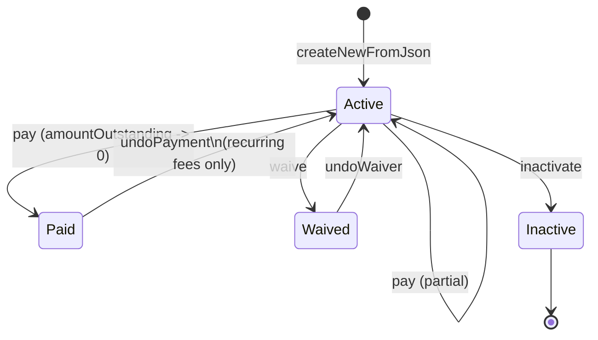
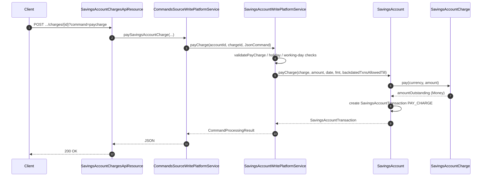
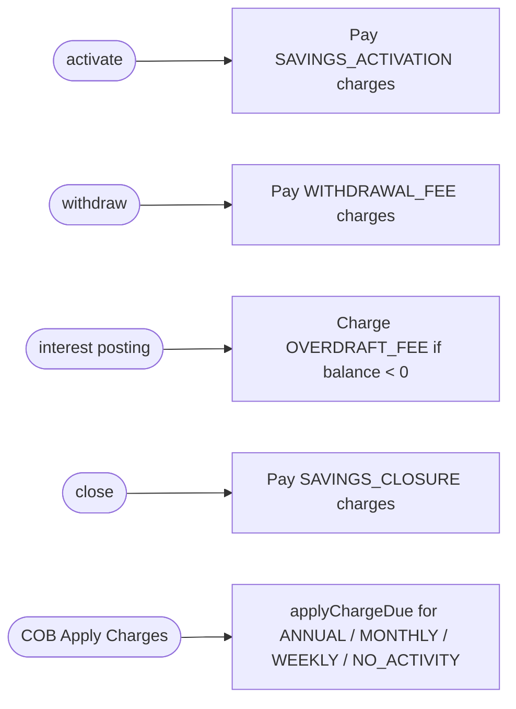

Apache Fineract attaches every fee or penalty applied to a passbook, fixed deposit or recurring deposit account to a `SavingsAccountCharge` row. The entity, its assembler, repository wrapper and the `m_savings_account_charge` table all live in the `fineract-savings` Gradle module under `org.apache.fineract.portfolio.savings.domain`, while the REST surface (`SavingsAccountChargesApiResource`) and the JPA write service that pays / waives / inactivates charges live in `fineract-provider`. The `ChargeTimeType` enum that drives when a charge fires is owned by `fineract-core` and is shared with the loan domain.

This page is the engineering reference for the charge sub-model: how a `SavingsAccountCharge` is built from a `Charge` product definition, how the pay / waive / inactivate state machine works, how recurring charges (annual, monthly, weekly) re-arm themselves, and every HTTP verb exposed by the charges API resource. Pair it with [Savings Account Domain](/savings/savings-account-domain) for the parent aggregate and [Savings Write Service](/savings/savings-write-service) for the surrounding command flow.

## Entity shape

`SavingsAccountCharge` is an `AbstractAuditableWithUTCDateTimeCustom<Long>` mapped to `m_savings_account_charge`. Each row holds the back-reference to the parent `SavingsAccount`, a `Charge` definition (the product-level fee template), the charge time discriminator, the calculation discriminator, the due date and the full money-tracking quartet (`amount`, `amountPaid`, `amountWaived`, `amountWrittenOff`, `amountOutstanding`).

```java
// fineract-savings/.../savings/domain/SavingsAccountCharge.java
@Entity
@Table(name = "m_savings_account_charge")
public class SavingsAccountCharge extends AbstractAuditableWithUTCDateTimeCustom<Long> {

    @ManyToOne(optional = false)
    @JoinColumn(name = "savings_account_id", nullable = false)
    private SavingsAccount savingsAccount;

    @ManyToOne(optional = false)
    @JoinColumn(name = "charge_id", nullable = false)
    private Charge charge;

    @Column(name = "charge_time_enum", nullable = false)
    private Integer chargeTime;

    @Column(name = "charge_calculation_enum")
    private Integer chargeCalculation;

    @Column(name = "charge_due_date")
    private LocalDate dueDate;

    @Column(name = "fee_on_month")
    private Integer feeOnMonth;
    @Column(name = "fee_on_day")
    private Integer feeOnDay;
    @Column(name = "fee_interval")
    private Integer feeInterval;

    @Column(name = "calculation_percentage", scale = 6, precision = 19)
    private BigDecimal percentage;

    @Column(name = "amount",                    scale = 6, precision = 19, nullable = false)
    private BigDecimal amount;
    @Column(name = "amount_paid_derived",       scale = 6, precision = 19)
    private BigDecimal amountPaid;
    @Column(name = "amount_waived_derived",     scale = 6, precision = 19)
    private BigDecimal amountWaived;
    @Column(name = "amount_writtenoff_derived", scale = 6, precision = 19)
    private BigDecimal amountWrittenOff;
    @Column(name = "amount_outstanding_derived",scale = 6, precision = 19, nullable = false)
    private BigDecimal amountOutstanding;

    @Column(name = "is_penalty",       nullable = false) private boolean penaltyCharge = false;
    @Column(name = "is_paid_derived",  nullable = false) private boolean paid = false;
    @Column(name = "waived",           nullable = false) private boolean waived = false;
    @Column(name = "is_active",        nullable = false) private boolean status = true;

    @Column(name = "inactivated_on_date") private LocalDate inactivationDate;

    @Column(name = "free_withdrawal_count") private Integer freeWithdrawalCount;
    @Column(name = "charge_reset_date")     private LocalDate chargeResetDate;
}
```

<Note>
Charges are derived from a product-level `Charge` row (in the `m_charge` table). When the request omits `amount`, `feeOnMonthDay` or `feeInterval`, the factory pulls those defaults from `Charge`. The `is_penalty` flag is copied straight from the source charge — there is no way to flip a fee into a penalty at the account level.
</Note>

### Constructing a charge

`SavingsAccountCharge.createNewFromJson` is the canonical factory used by `SavingsAccountChargeAssembler` when a user POSTs `/v1/savingsaccounts/{id}/charges`:

```java
public static SavingsAccountCharge createNewFromJson(
        final SavingsAccount savingsAccount,
        final Charge chargeDefinition,
        final JsonCommand command) {

    BigDecimal amount      = command.bigDecimalValueOfParameterNamed(amountParamName);
    LocalDate dueDate      = command.localDateValueOfParameterNamed(dueAsOfDateParamName);
    MonthDay feeOnMonthDay = command.extractMonthDayNamed(feeOnMonthDayParamName);
    Integer feeInterval    = command.integerValueOfParameterNamed(feeIntervalParamName);

    amount        = (amount        == null) ? chargeDefinition.getAmount()        : amount;
    feeOnMonthDay = (feeOnMonthDay == null) ? chargeDefinition.getFeeOnMonthDay() : feeOnMonthDay;
    feeInterval   = (feeInterval   == null) ? chargeDefinition.getFeeInterval()   : feeInterval;

    return new SavingsAccountCharge(savingsAccount, chargeDefinition, amount,
            /* chargeTime */ null, /* chargeCalculation */ null,
            dueDate, /* status */ true, feeOnMonthDay, feeInterval);
}
```

The private constructor validates the combination of `chargeTime`, `dueDate`, `feeOnMonthDay` and `feeInterval` and throws `SavingsAccountChargeWithoutMandatoryFieldException` when invariants are broken (for example a `SPECIFIED_DUE_DATE` charge without a `dueDate`, an `ANNUAL_FEE` / `MONTHLY_FEE` without `feeOnMonthDay`, or a `WEEKLY_FEE` without a starting `dueDate`).

## Charge time types

`ChargeTimeType` (in `fineract-core`, package `org.apache.fineract.portfolio.charge.domain`) catalogues every moment a charge can fire. The savings module uses the subset returned by `ChargeTimeType.validValuesForSavings`:

```java
// fineract-core/.../portfolio/charge/domain/ChargeTimeType.java
public static Integer[] validValuesForSavings() {
    return new Integer[] {
        ChargeTimeType.SPECIFIED_DUE_DATE.getValue(),
        ChargeTimeType.SAVINGS_ACTIVATION.getValue(),
        ChargeTimeType.SAVINGS_CLOSURE.getValue(),
        ChargeTimeType.WITHDRAWAL_FEE.getValue(),
        ChargeTimeType.ANNUAL_FEE.getValue(),
        ChargeTimeType.MONTHLY_FEE.getValue(),
        ChargeTimeType.OVERDRAFT_FEE.getValue(),
        ChargeTimeType.WEEKLY_FEE.getValue(),
        ChargeTimeType.SAVINGS_NOACTIVITY_FEE.getValue()
    };
}
```

| Enum value | Integer | Triggered by | Mandatory fields |
| --- | --- | --- | --- |
| `SPECIFIED_DUE_DATE` | 2 | One-shot charge billed on `dueDate` | `dueDate` |
| `SAVINGS_ACTIVATION` | 3 | `activate` command on the account | `amount` |
| `SAVINGS_CLOSURE` | 4 | `close` command | `amount` |
| `WITHDRAWAL_FEE` | 5 | Every withdrawal transaction | `amount` (% of withdrawal supported) |
| `ANNUAL_FEE` | 6 | Anniversary of `feeOnMonth/feeOnDay` | `feeOnMonthDay` |
| `MONTHLY_FEE` | 7 | Recurs `feeInterval` months after `dueDate` | `feeOnMonthDay`, optional `feeInterval` |
| `OVERDRAFT_FEE` | 10 | Each interest posting when overdrawn | `amount` |
| `WEEKLY_FEE` | 11 | Recurs `feeInterval` weeks after `dueDate` | `dueDate` |
| `SAVINGS_NOACTIVITY_FEE` | 16 | After `noActivityFee` inactivity window | `feeOnMonthDay` |

`SavingsAccountCharge` exposes one boolean predicate per kind (`isOnSpecifiedDueDate`, `isAnnualFee`, `isMonthlyFee`, `isWeeklyFee`, `isWithdrawalFee`, `isOverdraftFee`, `isSavingsActivation`, `isSavingsClosure`, `isSavingsNoActivityFee`). These read straight from the persisted `charge_time_enum`:

```java
public boolean isOnSpecifiedDueDate() {
    return ChargeTimeType.fromInt(this.chargeTime).isOnSpecifiedDueDate();
}
public boolean isAnnualFee()   { return ChargeTimeType.fromInt(this.chargeTime).isAnnualFee(); }
public boolean isMonthlyFee()  { return ChargeTimeType.fromInt(this.chargeTime).isMonthlyFee(); }
public boolean isWeeklyFee()   { return ChargeTimeType.fromInt(this.chargeTime).isWeeklyFee(); }
public boolean isWithdrawalFee(){return ChargeTimeType.fromInt(this.chargeTime).isWithdrawalFee(); }
public boolean isOverdraftFee(){ return ChargeTimeType.fromInt(this.chargeTime).isOverdraftFee(); }
```

### Calculation type

`ChargeCalculationType` (also `fineract-core`) tells the entity how to interpret `amount` and `percentage`. The supported modes for savings are `FLAT`, `PERCENT_OF_AMOUNT` and (for withdrawal/overdraft) `PERCENT_OF_AMOUNT_AND_INTEREST`. The `SavingsAccountCharge.updateNextDueDateForRecurringFees` and `updateWithdralFeeAmount` helpers consult the enum to recompute the outstanding amount when the underlying transaction changes.

## State machine

A `SavingsAccountCharge` is a tiny state machine of three booleans (`paid`, `waived`, `status`) that together with `amountOutstanding` describe its lifecycle.



The transitions are implemented as small methods on the entity. The two most interesting ones:

```java
public Money waive(final MonetaryCurrency currency) {
    Money amountWaivedToDate = Money.of(currency, this.amountWaived);
    Money amountOutstanding  = Money.of(currency, this.amountOutstanding);
    this.amountWaived       = amountWaivedToDate.plus(amountOutstanding).getAmount();
    this.amountOutstanding  = BigDecimal.ZERO;
    this.waived             = true;

    resetPropertiesForRecurringFees();
    updateNextDueDateForRecurringFees();
    return amountOutstanding;
}

public Money pay(final MonetaryCurrency currency, final Money amountPaid) {
    Money amountPaidToDate  = Money.of(currency, this.amountPaid).plus(amountPaid);
    Money amountOutstanding = Money.of(currency, this.amountOutstanding).minus(amountPaid);
    this.amountPaid        = amountPaidToDate.getAmount();
    this.amountOutstanding = amountOutstanding.getAmount();
    this.paid              = determineIfFullyPaid();

    if (BigDecimal.ZERO.compareTo(this.amountOutstanding) == 0) {
        // full outstanding is paid, update to next due date
        updateNextDueDateForRecurringFees();
        resetPropertiesForRecurringFees();
    }
    return Money.of(currency, this.amountOutstanding);
}
```

`resetPropertiesForRecurringFees()` zeroes `amountPaid`, `amountWaived` and rolls `amountOutstanding` back to `amount` so that the next occurrence of a monthly / weekly / annual fee can be billed on the next due date computed by `updateNextDueDateForRecurringFees`. For one-shot charges (`SPECIFIED_DUE_DATE`, `SAVINGS_ACTIVATION`, `SAVINGS_CLOSURE`) those calls are no-ops because `updateNextDueDateForRecurringFees` short-circuits.

### Pay flow over HTTP

When a tenant pays a charge with `POST /v1/savingsaccounts/{id}/charges/{chargeId}?command=paycharge`, the request lands in `SavingsAccountWritePlatformServiceJpaRepositoryImpl.payCharge` which validates the date against the holiday / non-working-day configuration and then delegates to the private `payCharge(SavingsAccountCharge, ...)` helper:

```java
// SavingsAccountWritePlatformServiceJpaRepositoryImpl.java
private SavingsAccountTransaction payCharge(
        final SavingsAccountCharge savingsAccountCharge,
        final LocalDate transactionDate,
        final BigDecimal amountPaid,
        final DateTimeFormatter formatter,
        final boolean backdatedTxnsAllowedTill) {
    final SavingsAccount account = savingsAccountCharge.savingsAccount();
    SavingsAccountTransaction chargeTransaction =
        account.payCharge(savingsAccountCharge, amountPaid, transactionDate, formatter,
                          backdatedTxnsAllowedTill);
    // … persist and post journal entries …
    return chargeTransaction;
}
```

The actual debit-from-balance plus charge-state transition happens on `SavingsAccount.payCharge`, which:

1. Calls `savingsAccountCharge.pay(currency, amount)` to update the charge's tracking fields.
2. Creates a `SavingsAccountTransaction` of type `PAY_CHARGE` (or `WITHDRAWAL_FEE` for withdrawal fees) and links it via a `SavingsAccountChargePaidBy` row.
3. Recalculates running balance and triggers a business event so accounting and the COB pipeline can react.



### Recurring fee bookkeeping

`updateNextDueDateForRecurringFees` is the heart of recurring charges. After the previous occurrence is fully paid (or waived), it advances `dueDate` by exactly one `feeInterval`:

```java
public void updateNextDueDateForRecurringFees() {
    if (isMonthlyFee() || isAnnualFee() || isWeeklyFee()) {
        // … compute LocalDate next from feeOnMonth / feeOnDay / feeInterval …
        this.dueDate = next;
    }
}

public void resetPropertiesForRecurringFees() {
    if (isMonthlyFee() || isAnnualFee() || isWeeklyFee()) {
        this.amountOutstanding = this.amount;
        this.amountPaid   = BigDecimal.ZERO;
        this.amountWaived = BigDecimal.ZERO;
        this.paid    = false;
        this.waived  = false;
    }
}
```

The `Apply Annual Fee For Savings` and `Pay Due Savings Charges` scheduled jobs (see `fineract-provider/.../savings/jobs/applyannualfeeforsavings/` and `payduesavingscharges/`) iterate accounts and call `SavingsAccountWritePlatformService.applyChargeDue` for any charge whose `dueDate` is on or before `DateUtils.getBusinessLocalDate()`.

## Charge payment audit (`SavingsAccountChargePaidBy`)

Every payment toward a charge is recorded on a `SavingsAccountChargePaidBy` join table so the system can reverse the payment cleanly when the underlying transaction is undone:

```java
// fineract-savings/.../savings/domain/SavingsAccountChargePaidBy.java
@Entity
@Table(name = "m_savings_account_charge_paid_by")
public class SavingsAccountChargePaidBy extends AbstractPersistableCustom<Long> {
    @ManyToOne private SavingsAccountTransaction savingsAccountTransaction;
    @ManyToOne private SavingsAccountCharge      savingsAccountCharge;
    @Column private BigDecimal amount;
}
```

When a `WITHDRAWAL`, `PAY_CHARGE` or `WITHDRAWAL_FEE` transaction is undone, the framework walks the `chargesPaidBy` collection and calls `savingsAccountCharge.updatePaidAmountBy(incrementBy.negate())` to roll the totals back.

## Withdrawal-fee specifics

A `WITHDRAWAL_FEE` charge supports the optional `freeWithdrawalCount` / `chargeResetDate` columns which together implement "the first N withdrawals per period are free". On every withdrawal the write service consults:

```java
public BigDecimal updateWithdralFeeAmount(final BigDecimal transactionAmount) {
    BigDecimal amountPaybale = BigDecimal.ZERO;
    if (ChargeCalculationType.fromInt(this.chargeCalculation).isFlat()) {
        amountPaybale = this.amount;
    } else if (ChargeCalculationType.fromInt(this.chargeCalculation).isPercentageOfAmount()) {
        amountPaybale = transactionAmount.multiply(this.percentage)
                                         .divide(BigDecimal.valueOf(100L));
    }
    this.amountOutstanding = amountPaybale;
    return amountPaybale;
}

public BigDecimal updateNoWithdrawalFee() {
    this.amountOutstanding = BigDecimal.ZERO;
    return this.amountOutstanding;
}
```

If `freeWithdrawalCount` is set, `SavingsAccount.payCharge` (the withdrawal path) decrements the counter and calls `updateNoWithdrawalFee()` instead of `updateWithdralFeeAmount(...)` until the budget is exhausted.

## `SavingsAccountChargesApiResource`

The REST surface for charges is small. Every verb is JAX-RS-annotated and delegates to `CommandsSourceWritePlatformService` so each mutation flows through Fineract's command/event infrastructure.

```java
// fineract-provider/.../savings/api/SavingsAccountChargesApiResource.java
@Path("/v1/savingsaccounts/{savingsAccountId}/charges")
@Component
@Tag(name = "Savings Charges")
public class SavingsAccountChargesApiResource { … }
```

### Endpoint catalogue

| Method | Path | Operation | Resource action |
| --- | --- | --- | --- |
| `GET`    | `/v1/savingsaccounts/{id}/charges`                              | `retrieveAllSavingsAccountCharges` (filter `chargeStatus=all\|active\|inactive`) | Read |
| `GET`    | `/v1/savingsaccounts/{id}/charges/template`                     | `retrieveTemplate` (returns applicable `ChargeData`)                              | Read |
| `GET`    | `/v1/savingsaccounts/{id}/charges/{chargeId}`                   | `retrieveSavingsAccountCharge`                                                    | Read |
| `POST`   | `/v1/savingsaccounts/{id}/charges`                              | `addSavingsAccountCharge`                                                         | `CREATE_SAVINGSACCOUNTCHARGE` |
| `PUT`    | `/v1/savingsaccounts/{id}/charges/{chargeId}`                   | `updateSavingsAccountCharge` (only when not paid/waived)                          | `UPDATE_SAVINGSACCOUNTCHARGE` |
| `POST`   | `/v1/savingsaccounts/{id}/charges/{chargeId}?command=paycharge` | `payOrWaiveSavingsAccountCharge` — pay flow                                       | `PAY_SAVINGSACCOUNTCHARGE` |
| `POST`   | `/v1/savingsaccounts/{id}/charges/{chargeId}?command=waive`     | `payOrWaiveSavingsAccountCharge` — waive flow                                     | `WAIVE_SAVINGSACCOUNTCHARGE` |
| `POST`   | `/v1/savingsaccounts/{id}/charges/{chargeId}?command=inactivate`| `payOrWaiveSavingsAccountCharge` — inactivate                                     | `INACTIVATE_SAVINGSACCOUNTCHARGE` |
| `DELETE` | `/v1/savingsaccounts/{id}/charges/{chargeId}`                   | `deleteSavingsAccountCharge` (only before approval)                               | `DELETE_SAVINGSACCOUNTCHARGE` |

### The combined `payOrWaiveSavingsAccountCharge` dispatcher

The pay / waive / inactivate endpoints share the same `POST` URI; the action is chosen by the `command` query parameter:

```java
public String payOrWaiveSavingsAccountCharge(
        @PathParam("savingsAccountId") final Long savingsAccountId,
        @PathParam("savingsAccountChargeId") final Long savingsAccountChargeId,
        @QueryParam("command") final String commandParam,
        final String apiRequestBodyAsJson) {

    String json = "";
    if (is(commandParam, COMMAND_WAIVE_CHARGE)) {
        final CommandWrapper r = new CommandWrapperBuilder()
                .waiveSavingsAccountCharge(savingsAccountId, savingsAccountChargeId)
                .withJson(apiRequestBodyAsJson).build();
        json = this.toApiJsonSerializer.serialize(
                this.commandsSourceWritePlatformService.logCommandSource(r));
    } else if (is(commandParam, COMMAND_PAY_CHARGE)) {
        final CommandWrapper r = new CommandWrapperBuilder()
                .paySavingsAccountCharge(savingsAccountId, savingsAccountChargeId)
                .withJson(apiRequestBodyAsJson).build();
        json = this.toApiJsonSerializer.serialize(
                this.commandsSourceWritePlatformService.logCommandSource(r));
    } else if (is(commandParam, COMMAND_INACTIVATE_CHARGE)) {
        final CommandWrapper r = new CommandWrapperBuilder()
                .inactivateSavingsAccountCharge(savingsAccountId, savingsAccountChargeId)
                .withJson(apiRequestBodyAsJson).build();
        json = this.toApiJsonSerializer.serialize(
                this.commandsSourceWritePlatformService.logCommandSource(r));
    } else {
        throw new UnrecognizedQueryParamException("command", commandParam,
                COMMAND_PAY_CHARGE, COMMAND_WAIVE_CHARGE, COMMAND_INACTIVATE_CHARGE);
    }
    return json;
}
```

<Warning>
The Swagger metadata for the pay verb requires `amount`, `dueDate`, `dateFormat` and `locale` in the request body. Even though `amount` defaults to `amountOutstanding` when the body is `{}`, omitting `dueDate` always fails validation in `SavingsAccountChargeDataValidator.validatePayCharge`.
</Warning>

### Request bodies (Swagger snippets)

The `SavingsAccountChargesApiResourceSwagger` companion class spells out the JSON contracts. The pay/waive/inactivate POST shares one schema (`PostSavingsAccountsSavingsAccountIdChargesSavingsAccountChargeIdRequest`):

```json
// Pay
{ "amount": 100.00, "dueDate": "23 December 2015",
  "dateFormat": "dd MMMM yyyy", "locale": "en" }

// Waive: no body required, command=waive

// Inactivate: no body required, command=inactivate
```

The create request (`POST /charges`) accepts:

```json
{ "chargeId": 5,
  "amount": 100.00,
  "dueDate": "12 December 2015",     // for SPECIFIED_DUE_DATE
  "feeOnMonthDay": "15 January",     // for ANNUAL_FEE/MONTHLY_FEE
  "monthDayFormat": "dd MMMM",
  "dateFormat": "dd MMMM yyyy",
  "locale": "en" }
```

## Read service — `SavingsAccountChargeReadPlatformService`

Read-side queries flow through `SavingsAccountChargeReadPlatformServiceImpl`, which composes a `SavingsAccountChargeMapper` and joins `m_savings_account_charge` to `m_charge`, `m_organisation_currency` and `m_savings_account` to return `SavingsAccountChargeData`. The status filter that the resource accepts maps directly onto SQL predicates:

```sql
-- chargeStatus=active
WHERE sac.savings_account_id = ?
  AND sac.is_active = true
-- chargeStatus=inactive
  AND sac.is_active = false
-- chargeStatus=all → no extra predicate
```

## Where charges plug into the account lifecycle

`SavingsAccount` keeps the live collection in a `@OneToMany(mappedBy = "savingsAccount", cascade = ALL, orphanRemoval = true) private Set<SavingsAccountCharge> charges`. Several account-level methods consult it:

- `activateWithBalance()` triggers `applyChargesDueAtSavingsActivation()` which pays every `isSavingsActivation()` charge from the opening balance.
- `processSavingsAccountTransaction(...)` (the withdrawal path) calls `payChargesDueAtSavingsWithdrawal()` so withdrawal fees are deducted in the same transaction.
- `close(...)` pays any outstanding `SAVINGS_CLOSURE` charge before zeroing the running balance.
- The interest posting routine (see [Interest Posting Job](/savings/interest-posting-job)) computes overdraft fees via the `OVERDRAFT_FEE` charges and posts a corresponding `SavingsAccountTransaction`.



## Inactivation rules

`SavingsAccountChargesApiResource` allows `command=inactivate` to be sent against an active charge — the write service then verifies:

1. The charge is currently `is_active = true`.
2. `amountOutstanding == 0` as of today (no current due bill).
3. If `amountPaid > amount` (overpaid through a paycharge), the corresponding `PAY_CHARGE` transactions are reversed before the charge flips to `is_active = false` and `inactivationDate = today`.

```java
// SavingsAccountCharge.java (excerpt)
public void inactivate(final LocalDate inactivationOnDate) {
    this.status = false;
    this.inactivationDate = inactivationOnDate;
}
```

Once inactivated, the charge stays on the account for audit but is skipped by every iteration over `account.charges()` that filters on `isActive()`.

## Validation surface

`SavingsAccountChargeDataValidator` lives next to the write service and enforces the request-shape rules. The most common error codes you will see:

- `validation.msg.savingsaccount.charge.invalid.due.date` — `SPECIFIED_DUE_DATE` charge without `dueDate`.
- `validation.msg.savingsaccount.charge.invalid.fee.on.month.day` — annual/monthly fee without `feeOnMonthDay`.
- `validation.msg.savingsaccount.charge.amount.greater.than.outstanding` — pay amount exceeds `amountOutstanding`.
- `transaction.not.allowed.transaction.date.is.on.holiday` — pay date falls on a holiday and `allowTransactionsOnHolidayEnabled = false`.
- `transaction.not.allowed.transaction.date.is.a.nonworking.day` — same, for working days configuration.

## Cross references

<CardGroup cols={2}>
  <Card title="Savings overview" icon="map" href="/savings/overview">
    Module tour, packaging across `fineract-savings` / `fineract-provider` / `fineract-core`.
  </Card>
  <Card title="Savings transactions" icon="arrow-right-arrow-left" href="/savings/savings-transactions">
    How `SavingsAccountTransaction` rows (including `PAY_CHARGE` and `WITHDRAWAL_FEE`) are built and reversed.
  </Card>
  <Card title="Savings write service" icon="pen" href="/savings/savings-write-service">
    `SavingsAccountWritePlatformServiceJpaRepositoryImpl.payCharge` flow and command handlers.
  </Card>
  <Card title="Savings COB business steps" icon="calendar" href="/cob/savings-cob-business-steps">
    Apply Charge Due / Pay Due Savings Charges automation.
  </Card>
  <Card title="Savings charges API" icon="code" href="/api/savings-account-charges">
    Generated reference for the public REST contracts.
  </Card>
  <Card title="Accounting overview" icon="book" href="/accounting/overview">
    Journal entries produced for `PAY_CHARGE`, `WITHDRAWAL_FEE` and `OVERDRAFT_FEE` postings.
  </Card>
</CardGroup>
