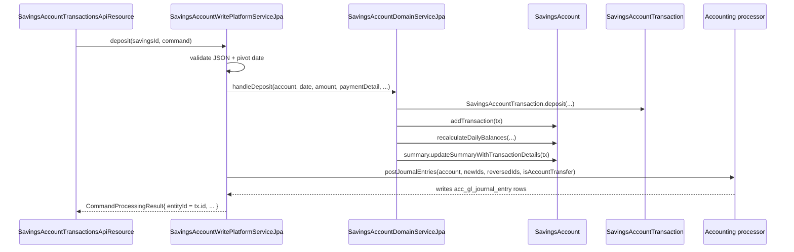

Every monetary event on an Apache Fineract savings, fixed deposit or recurring deposit account is one row in `m_savings_account_transaction`, modelled by the `SavingsAccountTransaction` JPA entity in `fineract-savings/.../portfolio/savings/domain/SavingsAccountTransaction.java`. Deposits, withdrawals, interest postings, fee charges, withholding tax, on-hold/release, transfer states and dormancy escheat all share this one entity — discriminated by `transaction_type_enum`. This page is the field-by-field reference, the type enum table and the rules around reversal, ordering and balance derivation.

## Entity declaration

```java
/**
 * All monetary transactions against a savings account are modelled through this entity.
 */
@Entity
@Table(name = "m_savings_account_transaction")
public final class SavingsAccountTransaction
        extends AbstractAuditableWithUTCDateTimeCustom<Long> {

    @ManyToOne(optional = false)
    @JoinColumn(name = "savings_account_id", referencedColumnName = "id", nullable = false)
    private SavingsAccount savingsAccount;

    @ManyToOne
    @JoinColumn(name = "office_id", nullable = false)
    private Office office;

    @ManyToOne(cascade = CascadeType.ALL, optional = true)
    @JoinColumn(name = "payment_detail_id", nullable = true)
    private PaymentDetail paymentDetail;
```

Two things to note:

1. The class is `final` — there is no subclass per transaction type. Behaviour depends entirely on the `typeOf` integer.
2. `savingsAccount` is a `@ManyToOne` (not bidirectional) but the matching collection on `SavingsAccount` is `@OneToMany(mappedBy = "savingsAccount", orphanRemoval = true, cascade = ALL)` ordered by `(dateOf, createdDate, id)`. So inserting into the list **or** persisting the transaction directly both work.

## Columns

```java
@Column(name = "transaction_type_enum", nullable = false)
private Integer typeOf;

@Column(name = "transaction_date", nullable = false)
private LocalDate dateOf;

@Column(name = "amount", scale = 6, precision = 19, nullable = false)
private BigDecimal amount;

@Column(name = "is_reversed", nullable = false)
private boolean reversed;

@Column(name = "running_balance_derived", scale = 6, precision = 19, nullable = true)
private BigDecimal runningBalance;

@Column(name = "cumulative_balance_derived", scale = 6, precision = 19, nullable = true)
private BigDecimal cumulativeBalance;

@Column(name = "balance_end_date_derived", nullable = true)
private LocalDate balanceEndDate;

@Column(name = "balance_number_of_days_derived", nullable = true)
private Integer balanceNumberOfDays;

@OneToMany(cascade = CascadeType.ALL, mappedBy = "savingsAccountTransaction",
           orphanRemoval = true, fetch = FetchType.EAGER)
private Set<SavingsAccountChargePaidBy> savingsAccountChargesPaid = new HashSet<>();

@Column(name = "overdraft_amount_derived", scale = 6, precision = 19, nullable = true)
private BigDecimal overdraftAmount;

@Deprecated
@Column(name = "created_date", nullable = true)
private LocalDateTime createdDateToRemove;

@Column(name = "submitted_on_date", nullable = false)
private LocalDate submittedOnDate;

@Column(name = "is_manual", length = 1, nullable = true)
private boolean isManualTransaction;

@Column(name = "is_loan_disbursement", length = 1, nullable = true)
private boolean isLoanDisbursement;

@OneToMany(cascade = CascadeType.ALL, orphanRemoval = true,
           fetch = FetchType.EAGER, mappedBy = "savingsAccountTransaction")
private List<SavingsAccountTransactionTaxDetails> taxDetails = new ArrayList<>();

@Column(name = "release_id_of_hold_amount", length = 20)
private Long releaseIdOfHoldAmountTransaction;

@Column(name = "reason_for_block", nullable = true)
private String reasonForBlock;

@Column(name = "is_reversal", nullable = false)
private boolean reversalTransaction;

@Column(name = "original_transaction_id")
private Long originalTxnId;

@Column(name = "is_lien_transaction")
private Boolean lienTransaction;

@Column(name = "ref_no", nullable = true)
private String refNo;
```

### Reference table

| Field | Column | Type | Set by |
|-------|--------|------|--------|
| `savingsAccount` | `savings_account_id` | FK BIGINT, not null | static factory |
| `office` | `office_id` | FK BIGINT, not null | passed by write-service from `account.office()` |
| `paymentDetail` | `payment_detail_id` | FK BIGINT, cascade ALL, nullable | `PaymentDetailWritePlatformService` from POST body |
| `typeOf` | `transaction_type_enum` | INT | static factory using `SavingsAccountTransactionType.getValue()` |
| `dateOf` | `transaction_date` | DATE | `transactionDate` parameter |
| `amount` | `amount` | DECIMAL(19,6) | from `Money` |
| `reversed` | `is_reversed` | BIT | `reverse()` (true) / construction (false) |
| `runningBalance` | `running_balance_derived` | DECIMAL(19,6) | `domain/interest/EndOfDayBalance` walk |
| `cumulativeBalance` | `cumulative_balance_derived` | DECIMAL(19,6) | average-daily-balance helper |
| `balanceEndDate` | `balance_end_date_derived` | DATE | balance period end |
| `balanceNumberOfDays` | `balance_number_of_days_derived` | INT | length of balance period |
| `overdraftAmount` | `overdraft_amount_derived` | DECIMAL(19,6) | overdraft slice of `runningBalance` if negative |
| `submittedOnDate` | `submitted_on_date` | DATE, not null | `DateUtils.getBusinessLocalDate()` |
| `isManualTransaction` | `is_manual` | BIT | flagged when produced from `postInterestAsOn` manual posting |
| `isLoanDisbursement` | `is_loan_disbursement` | BIT | `true` for disbursements credited from loans |
| `taxDetails` | `m_savings_account_transaction_tax_details` rows | one-to-many | `withHoldTax` factory |
| `releaseIdOfHoldAmountTransaction` | `release_id_of_hold_amount` | BIGINT | back-pointer set on the hold by `releaseAmount` |
| `reasonForBlock` | `reason_for_block` | VARCHAR | hold/release reason |
| `reversalTransaction` | `is_reversal` | BIT, not null | true on the **mirror** transaction that the framework inserts to negate a reversed original |
| `originalTxnId` | `original_transaction_id` | BIGINT | id of the reversed source |
| `lienTransaction` | `is_lien_transaction` | BIT | optional lien marker |
| `refNo` | `ref_no` | VARCHAR | external reference (idempotency key) |

The deprecated `created_date` mirror is still written so older audit consumers don't break; new code should use `AbstractAuditableWithUTCDateTimeCustom.getCreatedDate()`.

## SavingsAccountTransactionType — the full enum

From `fineract-core/src/main/java/org/apache/fineract/portfolio/savings/SavingsAccountTransactionType.java`:

```java
public enum SavingsAccountTransactionType {
    INVALID(0, "savingsAccountTransactionType.invalid"),
    DEPOSIT(1, "savingsAccountTransactionType.deposit",                   TransactionEntryType.CREDIT),
    WITHDRAWAL(2, "savingsAccountTransactionType.withdrawal",             TransactionEntryType.DEBIT),
    INTEREST_POSTING(3, "savingsAccountTransactionType.interestPosting",  TransactionEntryType.CREDIT),
    WITHDRAWAL_FEE(4, "savingsAccountTransactionType.withdrawalFee",      TransactionEntryType.DEBIT),
    ANNUAL_FEE(5, "savingsAccountTransactionType.annualFee",              TransactionEntryType.DEBIT),
    WAIVE_CHARGES(6, "savingsAccountTransactionType.waiveCharge"),
    PAY_CHARGE(7, "savingsAccountTransactionType.payCharge",              TransactionEntryType.DEBIT),
    DIVIDEND_PAYOUT(8, "savingsAccountTransactionType.dividendPayout",    TransactionEntryType.CREDIT),
    ACCRUAL(10, "savingsAccountTransactionType.accrual"),
    INITIATE_TRANSFER(12, "savingsAccountTransactionType.initiateTransfer"),
    APPROVE_TRANSFER(13, "savingsAccountTransactionType.approveTransfer"),
    WITHDRAW_TRANSFER(14, "savingsAccountTransactionType.withdrawTransfer"),
    REJECT_TRANSFER(15, "savingsAccountTransactionType.rejectTransfer"),
    WRITTEN_OFF(16, "savingsAccountTransactionType.writtenoff"),
    OVERDRAFT_INTEREST(17, "savingsAccountTransactionType.overdraftInterest", TransactionEntryType.DEBIT),
    WITHHOLD_TAX(18, "savingsAccountTransactionType.withholdTax",         TransactionEntryType.DEBIT),
    ESCHEAT(19, "savingsAccountTransactionType.escheat",                  TransactionEntryType.DEBIT),
    AMOUNT_HOLD(20, "savingsAccountTransactionType.onHold",               TransactionEntryType.DEBIT),
    AMOUNT_RELEASE(21, "savingsAccountTransactionType.release",           TransactionEntryType.CREDIT);
```

### Type matrix

| ID | Constant | Direction | Affects balance? | Typical origin |
|----|----------|-----------|------------------|----------------|
| 1 | `DEPOSIT` | CREDIT | ✅ | `POST /transactions?command=deposit` |
| 2 | `WITHDRAWAL` | DEBIT | ✅ | `POST /transactions?command=withdrawal` (or `force-withdrawal`) |
| 3 | `INTEREST_POSTING` | CREDIT | ✅ | `postInterestForSavings` job, `command=postInterest` |
| 4 | `WITHDRAWAL_FEE` | DEBIT | ✅ | auto-inserted next to a `WITHDRAWAL` when product has a withdrawal-fee charge |
| 5 | `ANNUAL_FEE` | DEBIT | ✅ | `applyAnnualFeeForSavings` job |
| 6 | `WAIVE_CHARGES` | neutral | charge bookkeeping only | `POST /charges/{id}?command=waive` |
| 7 | `PAY_CHARGE` | DEBIT | ✅ | `POST /charges/{id}?command=paycharge`, COB `ApplyChargeToOverdueSavingsAccount` |
| 8 | `DIVIDEND_PAYOUT` | CREDIT | ✅ | shares module dividend posting |
| 10 | `ACCRUAL` | neutral | accrual JE only | `addaccrualtransactionforsavings` job |
| 12 | `INITIATE_TRANSFER` | neutral | freezes balance | `accounttransfers` |
| 13 | `APPROVE_TRANSFER` | neutral | unfreezes balance on dest | `accounttransfers` approve |
| 14 | `WITHDRAW_TRANSFER` | neutral | rollback | `accounttransfers` undo |
| 15 | `REJECT_TRANSFER` | neutral | rollback | `accounttransfers` reject |
| 16 | `WRITTEN_OFF` | neutral | journal only | write-off command |
| 17 | `OVERDRAFT_INTEREST` | DEBIT | ✅ | when overdrawn portion accrues at `nominalAnnualInterestRateOverdraft` |
| 18 | `WITHHOLD_TAX` | DEBIT | ✅ | paired with each `INTEREST_POSTING` when `withHoldTax = true` |
| 19 | `ESCHEAT` | DEBIT (special-cased) | ❌ balance | `updatesavingsdormantaccounts` job after `daysToEscheat` |
| 20 | `AMOUNT_HOLD` | DEBIT (special-cased) | ❌ balance, ✅ on-hold | `POST /transactions?command=holdAmount` |
| 21 | `AMOUNT_RELEASE` | CREDIT (special-cased) | ❌ balance, ↓ on-hold | `POST /transactions/{txnId}?command=releaseAmount` |

The `entryType` field tags the *journal-entry* direction. The enum then carves out three special cases — `AMOUNT_HOLD`, `AMOUNT_RELEASE`, `ESCHEAT` — that look like debits/credits accounting-wise but must not move the **on-account** running balance:

```java
public boolean isCredit() {
    // AMOUNT_RELEASE is not credit, because the account balance is not changed
    return isCreditEntryType() && !isAmountRelease();
}

public boolean isDebit() {
    // AMOUNT_HOLD, ESCHEAT are not debit, because the account balance is not changed
    return isDebitEntryType() && !isAmountOnHold() && !isEscheat();
}
```

`isChargeTransaction()` returns true for `PAY_CHARGE`, `WITHDRAWAL_FEE` and `ANNUAL_FEE`. The accounting processor uses it to route the GL credit leg to *income-from-fees* vs *income-from-penalties* via the product mapping.

## Static factories

The entity exposes one factory per type so callers never juggle the integer code:

| Factory | Resulting type |
|---------|----------------|
| `deposit(account, office, paymentDetail, date, money, refNo)` | DEPOSIT |
| `deposit(account, office, paymentDetail, date, money, type, refNo)` | type-overridable variant |
| `withdrawal(account, office, paymentDetail, date, money, refNo)` | WITHDRAWAL |
| `interestPosting(account, office, date, money, isManual)` | INTEREST_POSTING |
| `overdraftInterest(account, office, date, money, isManual)` | OVERDRAFT_INTEREST |
| `withdrawalFee(account, office, date, money, refNo)` | WITHDRAWAL_FEE |
| `annualFee(account, office, date, money)` | ANNUAL_FEE |
| `charge(account, office, date, money)` | PAY_CHARGE |
| `waiver(account, office, date, money)` | WAIVE_CHARGES |
| `accrual(account, office, date, money, isManual, refNo)` | ACCRUAL |
| `initiateTransfer / approveTransfer / withdrawTransfer` | 12 / 13 / 14 |
| `withHoldTax(account, office, date, money, taxMap)` | WITHHOLD_TAX + child tax-detail rows |
| `escheat(account, date, accountTransaction)` | ESCHEAT |
| `holdAmount(account, office, paymentDetail, date, money, lien)` | AMOUNT_HOLD |
| `releaseAmount(source, transactionDate)` | AMOUNT_RELEASE |
| `copyTransaction(source)` | mirror constructor (used for accruals and reversals) |
| `reversal(source)` | mirror copy with `is_reversal = true`, `original_transaction_id = source.id` |

## Reversal handling

Fineract distinguishes **`is_reversed`** (the boolean on the original transaction) from **`is_reversal`** (the boolean on the *mirror* row inserted to neutralise it). This is the crux of the audit story:

```java
public static SavingsAccountTransaction reversal(SavingsAccountTransaction accountTransaction) {
    SavingsAccountTransaction sat = copyTransaction(accountTransaction);
    sat.reversed = false;          // the mirror itself is not reversed
    sat.setReversalTransaction(true);
    sat.originalTxnId = accountTransaction.getId();
    return sat;
}
```

So when an operator calls `POST /transactions/{id}?command=reverse`:

1. The write service flips `original.reversed = true` (`tx.reverse()`).
2. It builds `SavingsAccountTransaction.reversal(original)` — same amount, same type, same date but the **reversed copy** carries `is_reversal = true` and a back-pointer to the original via `original_transaction_id`.
3. Both rows are persisted; the running-balance recomputation walks the list ignoring rows where `tx.isNotReversed()` returns false.

The simpler `?command=undo` path *just* flips `reversed = true` on the source without inserting a mirror. Used when an operator wants to make the transaction disappear from the reconciled view without leaving a paired counter-entry.

`?command=modify` (a.k.a. *adjust transaction*) follows the same pattern as `reverse` and then inserts a brand-new transaction with the modified date / amount / payment-detail.

### Transaction-relationship row

| Pair | `is_reversed` (source) | `is_reversal` (mirror) | `original_transaction_id` |
|------|-----------------------|------------------------|---------------------------|
| Original transaction | `false` | `false` | `null` |
| After `undo` | `true` | (no mirror) | `null` |
| After `reverse` | `true` | new row `true` | mirror points at source |
| After `modify` | `true` | new row `true` for the negation; another new row with the modified figures | mirror points at source |
| Hold → Release | `false` (hold stays alive) | `false` on the release | release row's `release_id_of_hold_amount` patches the hold's column |

### Hold/release linkage

```java
@Column(name = "release_id_of_hold_amount", length = 20)
private Long releaseIdOfHoldAmountTransaction;

public void updateReleaseId(Long releaseId) {
    this.releaseIdOfHoldAmountTransaction = releaseId;
}
```

On `releaseAmount`, the write service patches the **source AMOUNT_HOLD** row with the new AMOUNT_RELEASE transaction id; this lets the read service stitch the pair back together in `SavingsAccountTransactionsMapper`.

## Running balance and cumulative balance

`runningBalance` is the end-of-account-balance after this transaction has been applied; `cumulativeBalance` is the day-weighted sum used by average-daily-balance interest calculations. Both are recomputed by `domain/interest/SavingsAccountTransactionDetailsForPostingPeriod` and friends every time a non-reversed, non-AMOUNT_HOLD/RELEASE transaction is inserted.

For overdrafts, `overdraft_amount_derived` holds the *negative* portion of `running_balance_derived` so it can be summed when computing `OVERDRAFT_INTEREST` independently of the positive interest base.

## Tax details

`SavingsAccountTransactionTaxDetails` (separate JPA entity) breaks down a `WITHHOLD_TAX` transaction into its components:

```java
public static SavingsAccountTransaction withHoldTax(final SavingsAccount account, final Office office,
        final LocalDate date, final Money amount, final Map<TaxComponent, BigDecimal> taxDetails) {
    SavingsAccountTransaction accountTransaction = new SavingsAccountTransaction(account, office,
        SavingsAccountTransactionType.WITHHOLD_TAX.getValue(), date, amount, false, false, false, null);
    updateTaxDetails(taxDetails, accountTransaction);
    return accountTransaction;
}
```

Each `(component, amount)` pair becomes one row in `m_savings_account_transaction_tax_details`. The breakdown is exposed by the API as the `taxDetails` array on a savings transaction response.

## Charge linkage

A charge-paying transaction (`PAY_CHARGE`, `WITHDRAWAL_FEE`, `ANNUAL_FEE`) carries one or more `SavingsAccountChargePaidBy` rows that connect it to the `SavingsAccountCharge` it satisfied. This is how, when an operator reverses a charge transaction, the write service knows which `SavingsAccountCharge` to mark un-paid:

```java
@OneToMany(cascade = CascadeType.ALL, mappedBy = "savingsAccountTransaction",
           orphanRemoval = true, fetch = FetchType.EAGER)
private Set<SavingsAccountChargePaidBy> savingsAccountChargesPaid = new HashSet<>();
```

## Predicate helpers

`SavingsAccountTransactionType` provides 20+ `isXxx()` predicates the interest engine and write service use to branch behaviour without sprinkling magic integers:

```java
public boolean isDeposit()             { return this == DEPOSIT; }
public boolean isWithdrawal()          { return this == WITHDRAWAL; }
public boolean isInterestPosting()     { return this == INTEREST_POSTING; }
public boolean isOverDraftInterestPosting() { return this == OVERDRAFT_INTEREST; }
public boolean isWithHoldTax()         { return this == WITHHOLD_TAX; }
public boolean isWithdrawalFee()       { return this == WITHDRAWAL_FEE; }
public boolean isAnnualFee()           { return this == ANNUAL_FEE; }
public boolean isPayCharge()           { return this == PAY_CHARGE; }
public boolean isChargeTransaction()   { return isPayCharge() || isWithdrawalFee() || isAnnualFee(); }
public boolean isWaiveCharge()         { return this == WAIVE_CHARGES; }
public boolean isTransferInitiation()  { return this == INITIATE_TRANSFER; }
public boolean isTransferApproval()    { return this == APPROVE_TRANSFER; }
public boolean isTransferRejection()   { return this == REJECT_TRANSFER; }
public boolean isTransferWithdrawal()  { return this == WITHDRAW_TRANSFER; }
public boolean isWrittenoff()          { return this == WRITTEN_OFF; }
public boolean isDividendPayout()      { return this == DIVIDEND_PAYOUT; }
public boolean isEscheat()             { return this == ESCHEAT; }
public boolean isAmountOnHold()        { return this == AMOUNT_HOLD; }
public boolean isAmountRelease()       { return this == AMOUNT_RELEASE; }
public boolean isAccrual()             { return this == ACCRUAL; }
```

There are equivalent helpers on the `SavingsAccountTransaction` instance (`isDeposit()`, `isWithdrawal()`, `isNotReversed()`, `isInterestPostingAndNotReversed()`, ...) that delegate to the enum.

## Ordering

`SavingsAccount.transactions` is annotated `@OrderBy("dateOf, createdDate, id")`. `SavingsAccountTransactionComparator` and `SavingsAccountTransactionDataComparator` use the same order for the read-side. Why all three keys?

1. `dateOf` (`transaction_date`) is the **value date** — the date the customer should see the money move.
2. `createdDate` (the audit timestamp) is the tie-breaker for transactions inserted on the same value date — important during reversal flows where the negating row gets the same `dateOf` but a strictly later `createdDate`.
3. `id` is the last-resort tie-breaker.

Interest posting walks the list in this order to derive the per-day balance — getting it wrong would produce a non-deterministic posting amount.

## Persistence patterns

The write service typically does one of:

```java
// 1. Create through the domain factory and let cascade do the insert
final SavingsAccountTransaction deposit =
    this.savingsAccountDomainService.handleDeposit(account, fmt, transactionDate,
        transactionAmount, paymentDetail, isAccountTransfer, isRegularTransaction,
        backdatedTxnsAllowedTill);
// the account's transaction list has the row; saveAndFlush(account) persists everything
```

```java
// 2. For hold / release, save the transaction directly to get an id before patching
this.savingsAccountTransactionRepository.saveAndFlush(transaction);
holdTransaction.updateReleaseId(transaction.getId());
```

The choice is dictated by whether the caller needs the database-assigned id before the surrounding aggregate is flushed.

## How transactions flow end-to-end



## Cross-links

- [SavingsAccount domain](/savings/savings-account-domain) — owner of the `transactions` list and `runningBalance` driver.
- [Write service](/savings/savings-write-service) — every method that produces a transaction.
- [Read service](/savings/savings-read-service) — SQL mapper for the transaction projection and the running-balance view.
- [Transactions API](/savings/savings-transactions-api) — REST endpoints and `?command=` matrix.
- [Accounting processors](/accounting/accounting-processors) — how each type lands in the chart of accounts.
- [COB savings business steps](/cob/savings-cob-business-steps) — schedulers that produce `INTEREST_POSTING`, `OVERDRAFT_INTEREST`, `ANNUAL_FEE`, `WITHHOLD_TAX`, `ACCRUAL` rows during close-of-business.
