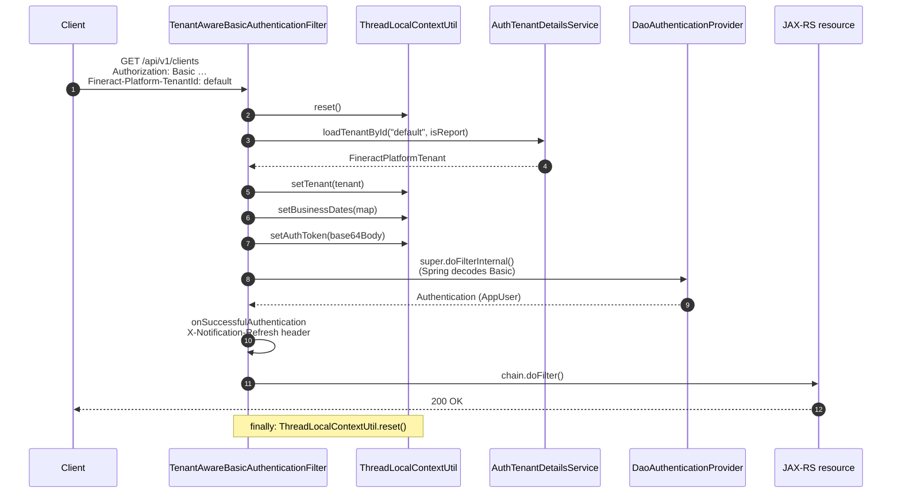

`fineract-security` ships three servlet filters that prepare the per-request state every JAX-RS resource and service depends on: the active `FineractPlatformTenant`, the authenticated `AppUser` principal, and the tenant's `BusinessDate` map. They run before Spring Security's authorization checks and are the only place where the `Fineract-Platform-TenantId` header is consumed.

| Filter | Used by | Trigger |
| --- | --- | --- |
| `TenantAwareBasicAuthenticationFilter` | Basic-auth chain (`SecurityConfig`) | `fineract.security.basicauth.enabled=true` |
| `TenantAwareAuthenticationFilter` | OAuth2 chain (`AuthorizationServerConfig`) | `fineract.security.oauth2.enabled=true` |
| `BusinessDateFilter` | OAuth2 chain (the basic-auth filter inlines the same work) | Always when in the OAuth2 chain |

## TenantAwareBasicAuthenticationFilter

Lives in `fineract-security/.../filter/TenantAwareBasicAuthenticationFilter.java`. It extends Spring's `BasicAuthenticationFilter`, so it inherits the standard `Basic` header parsing but wraps it with tenant + bookkeeping logic.

### Header and parameter contract

```java
private static final String TENANT_ID_REQUEST_HEADER = "Fineract-Platform-TenantId";
private static final boolean EXCEPTION_IF_HEADER_MISSING = true;
```

The filter expects the tenant identifier on `Fineract-Platform-TenantId`. If absent it falls back to the `tenantIdentifier` query parameter (handy for browser-based diagnostics and PDF report downloads):

```java
String tenantIdentifier = request.getHeader(TENANT_ID_REQUEST_HEADER);
if (org.apache.commons.lang3.StringUtils.isBlank(tenantIdentifier)) {
    tenantIdentifier = request.getParameter("tenantIdentifier");
}
if (tenantIdentifier == null && EXCEPTION_IF_HEADER_MISSING) {
    throw new InvalidTenantIdentifierException("No tenant identifier found: Add request header of '"
            + TENANT_ID_REQUEST_HEADER + "' or add the parameter 'tenantIdentifier' to query string of request URL.");
}
```

A missing identifier short-circuits to `HttpServletResponse.SC_BAD_REQUEST` with `WWW-Authenticate: Basic realm="Fineract Platform API"`.

### Per-request work



Key snippet:

```java
ThreadLocalContextUtil.reset();
if ("OPTIONS".equalsIgnoreCase(request.getMethod())) {
    filterChain.doFilter(request, response);    // preflight bypass
} else {
    if (requestMatcher.matches(request)) {
        // …parse tenantIdentifier…

        String pathInfo = request.getRequestURI();
        boolean isReportRequest = pathInfo != null && pathInfo.contains("report");
        final FineractPlatformTenant tenant =
                basicAuthTenantDetailsService.loadTenantById(tenantIdentifier, isReportRequest);
        ThreadLocalContextUtil.setTenant(tenant);

        HashMap<BusinessDateType, LocalDate> businessDates =
                businessDateReadPlatformService.getBusinessDates();
        ThreadLocalContextUtil.setBusinessDates(businessDates);

        String authToken = request.getHeader("Authorization");
        if (authToken != null && authToken.startsWith("Basic ")) {
            ThreadLocalContextUtil.setAuthToken(authToken.replaceFirst("Basic ", ""));
        }

        if (!FIRST_REQUEST_PROCESSED) {
            final String baseUrl = request.getRequestURL().toString()
                    .replace(request.getPathInfo(), "/");
            System.setProperty("baseUrl", baseUrl);

            final boolean ehcacheEnabled = configurationDomainService.isEhcacheEnabled();
            if (ehcacheEnabled) {
                cacheWritePlatformService.switchToCache(CacheType.SINGLE_NODE);
            } else {
                cacheWritePlatformService.switchToCache(CacheType.NO_CACHE);
            }
            FIRST_REQUEST_PROCESSED = true;
        }
    }
    super.doFilterInternal(request, response, filterChain);
}
```

Several things are worth highlighting:

1. **`isReportRequest`** is detected purely from the URL containing the string `"report"`. The flag is forwarded to `AuthTenantDetailsService.loadTenantById` so that the read-only schema can be used for reporting workloads. See [/tenancy/overview](/tenancy/overview) for the read-only datasource routing.
2. **Business dates** are loaded for every request and stashed in `ThreadLocalContextUtil`. Loan COB and any other service computing dates uses this map instead of `LocalDate.now()`.
3. **First-request bootstrap** picks up the base URL (used by report generators that need absolute links) and decides between EHCache and no-cache modes, based on `c_configuration` flags. The static `FIRST_REQUEST_PROCESSED` flag means this only happens once per JVM.
4. **`finally` always resets** the `ThreadLocalContextUtil` to prevent leakage across pooled threads — even on exceptions.

### Post-authentication hook

```java
@Override
protected void onSuccessfulAuthentication(HttpServletRequest request, HttpServletResponse response,
        Authentication authResult) throws IOException {
    super.onSuccessfulAuthentication(request, response, authResult);
    AppUser user = (AppUser) authResult.getPrincipal();

    if (userNotificationService.hasUnreadUserNotifications(user.getId())) {
        response.addHeader("X-Notification-Refresh", "true");
    } else {
        response.addHeader("X-Notification-Refresh", "false");
    }
}
```

Every successful request carries an `X-Notification-Refresh` header so that the web UI can avoid polling `/notifications` when nothing is new.

### Failure path

Tenant resolution failures (bad identifier, schema unreachable, etc.) are caught and turned into 400 Bad Request:

```java
} catch (final InvalidTenantIdentifierException e) {
    SecurityContextHolder.getContext().setAuthentication(null);
    response.addHeader("WWW-Authenticate", "Basic realm=\"" + "Fineract Platform API" + "\"");
    response.sendError(HttpServletResponse.SC_BAD_REQUEST, e.getMessage());
}
```

The authentication is explicitly cleared even though the request will never reach `SecurityContextHolderFilter` — this defends against any later filter that might inspect the context.

## TenantAwareAuthenticationFilter (OAuth2)

The OAuth2 flow needs the tenant **before** the JWT is validated, because the database lookup itself happens in the tenant's schema. `TenantAwareAuthenticationFilter` does a *non-validating* parse of the bearer JWT to pull the `tenant` claim out, then loads the tenant.

```java
@RequiredArgsConstructor
public class TenantAwareAuthenticationFilter extends OncePerRequestFilter {

    private final BearerTokenResolver resolver;
    private final AuthTenantDetailsService tenantDetailsService;

    @Override
    protected void doFilterInternal(HttpServletRequest request, HttpServletResponse response,
            FilterChain filterChain) throws ServletException, IOException {
        try {
            String token = resolver.resolve(request);
            String tenantId;
            if (token != null) {
                var jwt = JWTParser.parse(token); // not validated here!
                var claims = jwt.getJWTClaimsSet();
                tenantId = (String) claims.getClaim("tenant");
            } else {
                tenantId = request.getParameter("tenantId");
            }
            ThreadLocalContextUtil.setTenant(tenantDetailsService.loadTenantById(tenantId, false));
            filterChain.doFilter(request, response);
        } catch (Exception e) {
            filterChain.doFilter(request, response); // don't block; real auth will fail later
        } finally {
            ThreadLocalContextUtil.reset();
        }
    }
}
```

Important nuances:

- **The JWT is *not* validated here.** Signature/expiry validation happens later in Spring's `BearerTokenAuthenticationFilter` via the configured `JwtDecoder`. This filter only needs the `tenant` claim.
- **Failures swallow.** If the JWT can't be parsed or the tenant can't be loaded, the filter still calls `chain.doFilter(...)`. The downstream resource server will fail authentication with a 401 — there's no point producing a 400 from here.
- **`tenantId` query parameter fallback.** For form login (Spring's `/login` page used during the authorization-code flow), the parameter comes in as `tenantId` rather than the header.
- **No business dates** — the next filter (`BusinessDateFilter`) handles that.

### How the `tenant` claim gets into the JWT

`AuthorizationServerConfig.tokenCustomizer()` injects it during issuance:

```java
@Bean
public OAuth2TokenCustomizer<JwtEncodingContext> tokenCustomizer() {
    return context -> {
        UsernamePasswordAuthenticationToken authentication = context.getPrincipal();
        TenantAuthenticationDetails details = (TenantAuthenticationDetails) authentication.getDetails();
        AppUser appUser = (AppUser) authentication.getPrincipal();
        List<String> roles = appUser.getRoles().stream().map(Role::getName).toList();
        List<String> scope = appUser.getAuthorities().stream()
                .map(GrantedAuthority::getAuthority).collect(Collectors.toList());
        context.getClaims().claim("scope", scope).claim("role", roles)
                .claim("tenant", details.getTenantId());
    };
}
```

`TenantAuthenticationDetails` is populated by `AuthorizationServerConfig.tenantAuthDetailsSource()` from the `tenantId` form parameter on `/login`.

## BusinessDateFilter

A small one-shot that bridges `TenantAwareAuthenticationFilter` to the rest of the OAuth2 chain. The basic-auth filter inlines the same work, so this filter only runs in the OAuth2 stack.

```java
@RequiredArgsConstructor
public class BusinessDateFilter extends OncePerRequestFilter {

    private final BusinessDateReadPlatformService businessDateReadPlatformService;

    @Override
    protected void doFilterInternal(HttpServletRequest request, HttpServletResponse response,
            FilterChain filterChain) throws ServletException, IOException {
        if (ThreadLocalContextUtil.getTenant() != null) {
            HashMap<BusinessDateType, LocalDate> businessDates =
                    businessDateReadPlatformService.getBusinessDates();
            ThreadLocalContextUtil.setBusinessDates(businessDates);
        }
        filterChain.doFilter(request, response);
    }
}
```

It only attempts the load when a tenant is present in the thread-local — silently skipping when authentication is going to fail anyway saves a round-trip to the tenant schema.

## Chain ordering recap

### Basic-auth chain (`SecurityConfig`)

```text
TenantAwareBasicAuthenticationFilter (before SecurityContextHolderFilter)
└─ super.doFilterInternal → SecurityContextHolderFilter → … → ExceptionTranslationFilter
   └─ RequestResponseFilter (after ETF)
      └─ CallerIpTrackingFilter (optional, after RequestResponseFilter)
      └─ CorrelationHeaderFilter (after RequestResponseFilter)
         └─ TwoFactorAuthenticationFilter (optional, after CorrelationHeaderFilter)
         └─ FineractInstanceModeApiFilter
            └─ LoanCOBApiFilter (optional)
               └─ IdempotencyStoreFilter
```

### OAuth2 chain (`AuthorizationServerConfig`)

```text
SecurityContextHolderFilter → BearerTokenAuthenticationFilter (Spring)
└─ TenantAwareAuthenticationFilter (after SecurityContextHolderFilter)
   └─ BusinessDateFilter (after TenantAwareAuthenticationFilter)
      └─ ExceptionTranslationFilter
         └─ RequestResponseFilter
            └─ CorrelationHeaderFilter
               └─ TwoFactorAuthenticationFilter (optional)
               └─ FineractInstanceModeApiFilter
                  └─ LoanCOBApiFilter (optional)
                     └─ IdempotencyStoreFilter
```

## Tenant resolution: `AuthTenantDetailsService`

Both filters delegate to `AuthTenantDetailsService.loadTenantById(id, isReport)`. The default implementation, `AuthTenantDetailsServiceJdbc`, lives in `fineract-security/.../service`:

```java
@Service
public class AuthTenantDetailsServiceJdbc implements AuthTenantDetailsService {

    private final JdbcTemplate jdbcTemplate;

    public AuthTenantDetailsServiceJdbc(@Qualifier("hikariTenantDataSource") final DataSource dataSource) {
        this.jdbcTemplate = new JdbcTemplate(dataSource);
    }

    @Override
    @Cacheable(value = "tenantsById")
    public FineractPlatformTenant loadTenantById(final String tenantIdentifier, final boolean isReport) {
        try {
            final TenantMapper rm = new TenantMapper(isReport);
            final String sql = "select  " + rm.schema() + " where t.identifier = ?";
            return this.jdbcTemplate.queryForObject(sql, rm, new Object[] { tenantIdentifier });
        } catch (final EmptyResultDataAccessException e) {
            throw new InvalidTenantIdentifierException(/* … */);
        }
    }
}
```

- `@Qualifier("hikariTenantDataSource")` — this is the **tenants registry** datasource, not a tenant-specific one. The `fineract_tenants.tenants` table maps identifier → JDBC URL.
- `@Cacheable("tenantsById")` — repeated requests for the same tenant skip the SQL round-trip. When tenants are added at runtime, the cache must be cleared.
- `isReport` toggles whether the mapper returns the primary or read-only JDBC URL. This is what makes report queries hit a replica.

See [/tenancy/overview](/tenancy/overview) for the full tenant routing story including `TenantConnectionMapper`, `TenantConnection`, and the JDBC URL composition rules.

## When does the principal get into `SecurityContext`?

For basic auth, after `super.doFilterInternal(...)` completes — Spring's `BasicAuthenticationFilter` invokes the `AuthenticationManager` and pushes the `AppUser` into the context. For OAuth2, Spring's `BearerTokenAuthenticationFilter` runs the resource server's JWT decoder and invokes `FineractJwtAuthenticationTokenConverter` (see [/security/oauth2-authorization-server](/security/oauth2-authorization-server)) to produce a `FineractJwtAuthenticationToken`.

In both cases, by the time `TwoFactorAuthenticationFilter` runs, `SecurityContextHolder.getContext().getAuthentication().getPrincipal()` is an `AppUser`.

## Pitfalls and operational notes

<Warning>
The `FIRST_REQUEST_PROCESSED` static field in `TenantAwareBasicAuthenticationFilter` is **JVM-global, not tenant-scoped**. The first inbound request for any tenant decides EHCache vs no-cache for the whole process. In multi-tenant deployments where tenants disagree about caching, this is a known sharp edge — flip caching globally via `c_configuration` rather than expecting per-tenant behaviour.
</Warning>

<Warning>
`TenantAwareAuthenticationFilter` *intentionally* swallows JWT parse errors. If you see "tenant not found" warnings followed by 401 responses with no obvious cause, log at DEBUG to see the swallowed exception or instrument `JWTParser.parse` directly.
</Warning>

<Tip>
A client that sends `tenantIdentifier` as a query parameter when the URL contains the literal substring `report` will route through the read-only schema. This is fine for asynchronous PDF report downloads but surprising for arbitrary `report`-shaped paths. Avoid naming non-report endpoints with `report` in the URI.
</Tip>

## Related pages

- [Security configuration](/security/security-config)
- [OAuth2 authorization server](/security/oauth2-authorization-server)
- [Tenancy overview](/tenancy/overview)
- [User administration overview](/users/overview)
