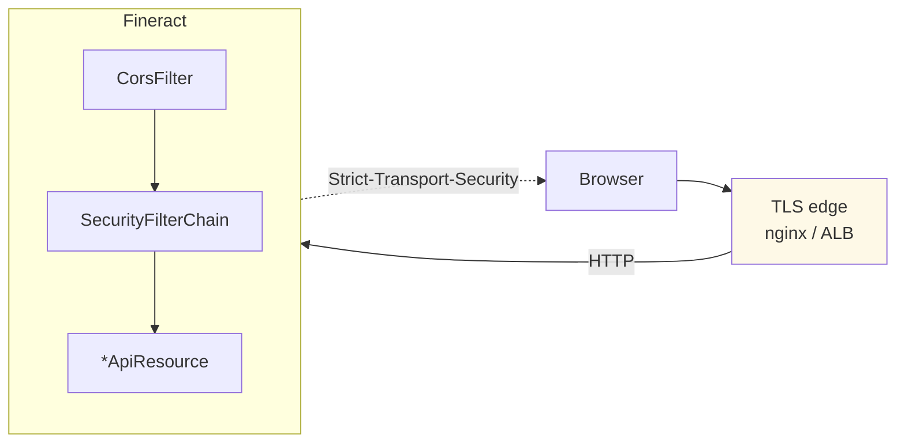
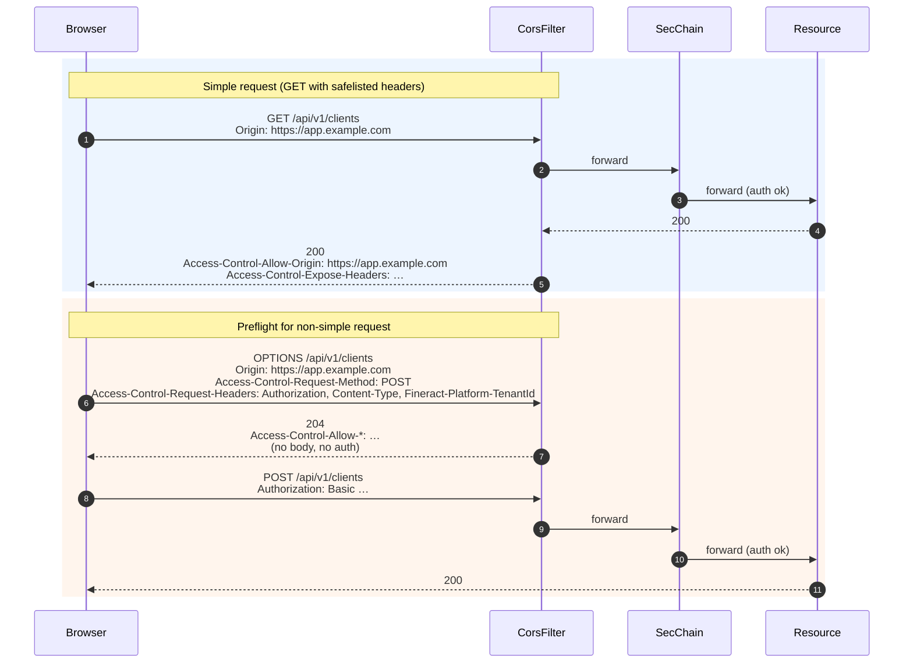

Both `SecurityConfig` (basic-auth mode) and `AuthorizationServerConfig` (OAuth2 mode) wire **CORS** and **HSTS** off the same `FineractProperties.Security` properties tree. The defaults shipped in `application.properties` are deliberately permissive so that developer machines work out of the box; production deployments must override almost every value. This page documents the property surface, the runtime wiring, and the headers each combination produces.

## Property reference

All keys are read by Spring Boot from `application.properties`, each with a `${VAR:default}` placeholder that lets you override via environment variables.

```properties
# CORS configuration
fineract.security.cors.enabled=${FINERACT_SECURITY_CORS_ENABLED:true}
fineract.security.cors.allowed-origin-patterns=${FINERACT_SECURITY_CORS_ALLOWED_ORIGIN_PATTERNS:*}
fineract.security.cors.allowed-methods=${FINERACT_SECURITY_CORS_ALLOWED_METHODS:*}
fineract.security.cors.allowed-headers=${FINERACT_SECURITY_CORS_ALLOWED_HEADERS:*}
fineract.security.cors.exposed-headers=${FINERACT_SECURITY_CORS_EXPOSED_HEADERS:*}
fineract.security.cors.allow-credentials=${FINERACT_SECURITY_CORS_ALLOW_CREDENTIALS:true}

# HSTS
fineract.security.hsts.enabled=${FINERACT_SECURITY_HSTS_ENABLED:false}
```

Summary:

| Property | Env var | Default | Purpose |
| --- | --- | --- | --- |
| `fineract.security.cors.enabled` | `FINERACT_SECURITY_CORS_ENABLED` | `true` | Wire `CorsFilter` into the security chain via `http.cors(Customizer.withDefaults())`. |
| `fineract.security.cors.allowed-origin-patterns` | `FINERACT_SECURITY_CORS_ALLOWED_ORIGIN_PATTERNS` | `*` | `CorsConfiguration.setAllowedOriginPatterns`. Wildcard match including subdomain patterns like `https://*.example.com`. |
| `fineract.security.cors.allowed-methods` | `FINERACT_SECURITY_CORS_ALLOWED_METHODS` | `*` | HTTP methods allowed cross-origin. |
| `fineract.security.cors.allowed-headers` | `FINERACT_SECURITY_CORS_ALLOWED_HEADERS` | `*` | Request headers a client may send. |
| `fineract.security.cors.exposed-headers` | `FINERACT_SECURITY_CORS_EXPOSED_HEADERS` | `*` | Response headers a browser may expose to JS. |
| `fineract.security.cors.allow-credentials` | `FINERACT_SECURITY_CORS_ALLOW_CREDENTIALS` | `true` | Allow `Authorization` headers / cookies on cross-origin requests. |
| `fineract.security.hsts.enabled` | `FINERACT_SECURITY_HSTS_ENABLED` | `false` | Emit `Strict-Transport-Security: max-age=31536000; includeSubDomains` and require HTTPS. |

The same properties are read by both authentication chains so behaviour does **not** depend on whether basic-auth or OAuth2 is active.

## How CORS is wired

### `CorsConfigurationSource` bean

Both `SecurityConfig` and `AuthorizationServerConfig` declare an identical bean. Excerpt from `SecurityConfig`:

```java
@Bean
public CorsConfigurationSource corsConfigurationSource() {
    CorsConfiguration config = new CorsConfiguration();
    FineractProperties.CorsProperties corsConfiguration = fineractProperties.getSecurity().getCors();
    config.setAllowedOriginPatterns(corsConfiguration.getAllowedOriginPatterns());
    config.setAllowedMethods(corsConfiguration.getAllowedMethods());
    config.setAllowedHeaders(corsConfiguration.getAllowedHeaders());
    config.setExposedHeaders(corsConfiguration.getExposedHeaders());
    config.setAllowCredentials(corsConfiguration.isAllowCredentials()); // if you use cookies / Authorization header

    UrlBasedCorsConfigurationSource source = new UrlBasedCorsConfigurationSource();
    source.registerCorsConfiguration("/**", config);
    return source;
}
```

Important nuances:

- **`setAllowedOriginPatterns` vs `setAllowedOrigins`.** Spring deliberately uses the *patterns* variant, which allows wildcards (`*` or `https://*.example.com`) together with `allowCredentials=true`. The browser-side restriction that bans `Access-Control-Allow-Origin: *` with credentials is dodged by **echoing the request origin** back to the client when it matches the pattern.
- **`/**` mapping**. The same CORS config applies to every URL, including `/oauth2/*`, `/login`, `/swagger-ui/**`, etc. There is no per-path CORS specialisation in core; if you need different rules per path you must replace this bean and register multiple `CorsConfiguration` entries.

### Activation switch

```java
if (fineractProperties.getSecurity().getCors().isEnabled()) {
    http.cors(Customizer.withDefaults());
}
```

When this line runs, Spring Security picks up the `CorsConfigurationSource` bean by type and inserts a `CorsFilter` early in the filter chain (before authentication). The filter's job is twofold:

1. **Pre-flight handling** for `OPTIONS` requests — return the appropriate `Access-Control-Allow-*` headers and short-circuit the chain. `SecurityConfig`'s authorization rule also has `requestMatchers(API_MATCHER.matcher(HttpMethod.OPTIONS, "/api/**")).permitAll()` so the preflight passes through without authentication.
2. **Header injection** for real responses — set `Access-Control-Allow-Origin`, `Access-Control-Expose-Headers`, etc. based on the matched config.

### Wildcard semantics

With the shipped defaults, the actual headers emitted for a cross-origin request from `https://ui.example.com` are:

```http
Access-Control-Allow-Origin: https://ui.example.com
Access-Control-Allow-Credentials: true
Access-Control-Allow-Methods: GET, POST, PUT, DELETE, OPTIONS, HEAD, PATCH, TRACE
Access-Control-Allow-Headers: <every header from Access-Control-Request-Headers>
Access-Control-Expose-Headers: *
Vary: Origin, Access-Control-Request-Method, Access-Control-Request-Headers
```

…because Spring's pattern matcher reflects the origin back rather than literally emitting `*`. The `Vary` header is set automatically.

## Hardening CORS for production

The defaults are unsuitable for production. Recommended overrides:

```bash
# Pin the front-end origin(s)
FINERACT_SECURITY_CORS_ALLOWED_ORIGIN_PATTERNS=https://app.example.com,https://admin.example.com

# Restrict methods to what the UI actually uses
FINERACT_SECURITY_CORS_ALLOWED_METHODS=GET,POST,PUT,DELETE,OPTIONS

# Pin headers the UI sends (and you must allow Authorization and the tenant header)
FINERACT_SECURITY_CORS_ALLOWED_HEADERS=Authorization,Content-Type,Fineract-Platform-TenantId,Fineract-Platform-TFA-Token,Idempotency-Key,X-Correlation-Id

# Be explicit about what JS can read
FINERACT_SECURITY_CORS_EXPOSED_HEADERS=X-Notification-Refresh,X-Correlation-Id

# Keep credentials on, since Basic / Bearer headers are credentials
FINERACT_SECURITY_CORS_ALLOW_CREDENTIALS=true
```

A few specifics to keep in mind:

- The `Authorization` header is **mandatory** in `allowed-headers` if your UI sends Basic/Bearer.
- `Fineract-Platform-TenantId` is mandatory for almost every business call.
- `Fineract-Platform-TFA-Token` is mandatory when 2FA is enabled — see [/security/two-factor-auth](/security/two-factor-auth).
- `Idempotency-Key` is mandatory if your UI participates in the idempotency-store feature.
- `X-Notification-Refresh` is set by `TenantAwareBasicAuthenticationFilter.onSuccessfulAuthentication` — exposing it lets the UI react.

## How HSTS is wired

`SecurityConfig`:

```java
if (serverProperties.getSsl().isEnabled()) {
    http.requiresChannel(channel -> channel.requestMatchers(API_MATCHER.matcher("/api/**")).requiresSecure());
}

if (fineractProperties.getSecurity().getHsts().isEnabled()) {
    http.requiresChannel(channel -> channel.anyRequest().requiresSecure())
        .headers(headers -> headers.httpStrictTransportSecurity(
            hsts -> hsts.includeSubDomains(true).maxAgeInSeconds(31536000)));
}
```

Two distinct concerns:

1. **`server.ssl.enabled=true`** (a stock Spring Boot property). Triggers `channel.requestMatchers("/api/**").requiresSecure()`. Plain-HTTP requests to `/api/**` are 302-redirected to the HTTPS scheme on the same host.
2. **`fineract.security.hsts.enabled=true`**. Stronger and broader:
   - `channel.anyRequest().requiresSecure()` — redirects **everything** (not just `/api/**`) to HTTPS.
   - Adds the `Strict-Transport-Security` header on every response with `max-age=31536000` (1 year) and `includeSubDomains`.

### Why HSTS is off by default

Most Fineract deployments terminate TLS at a load balancer (Apache, nginx, an AWS ALB, GCP HTTPS LB, etc.). In those topologies, the Fineract container often receives plain HTTP — `requiresSecure()` would loop redirect because `request.isSecure()` returns false. Setting HSTS server-side in that case is best done at the proxy, where the connection terminates.

When you can run with `server.ssl.enabled=true` (e.g. embedded TLS in dev or a direct-to-Fineract production setup), enabling HSTS is straightforward:

```bash
SERVER_SSL_ENABLED=true
FINERACT_SECURITY_HSTS_ENABLED=true
```

…will produce on every response:

```http
Strict-Transport-Security: max-age=31536000; includeSubDomains
```

### HSTS values

The values are hard-coded, not configurable:

| HSTS directive | Value |
| --- | --- |
| `max-age` | 31536000 seconds (1 year) |
| `includeSubDomains` | yes |
| `preload` | not emitted |

If you need different values (shorter `max-age` during initial rollout, or `preload` to submit to browser HSTS preload lists), replace the `httpStrictTransportSecurity` block with your own customiser.

## Interactions with the rest of the platform



- **CORS preflights** never get past `CorsFilter` to the authentication filter; they're answered with the precomputed headers and `204 No Content`.
- **HSTS** headers are added by `HeaderWriterFilter` (Spring's built-in), late enough in the chain that they apply to all responses including authentication errors.
- **Idempotency, correlation ID, and instance-mode filters** all run after CORS but before the resource — they do not interact with CORS headers, but their request-header dependencies (`Idempotency-Key`, `X-Correlation-Id`) must be declared in `allowed-headers`.

## When to deviate from the defaults

| Setting | Dev default | Prod recommendation |
| --- | --- | --- |
| `cors.enabled` | `true` | `true` if a SPA is on a different origin; otherwise `false` and serve assets same-origin. |
| `cors.allowed-origin-patterns` | `*` | Explicit list of front-end hostnames. |
| `cors.allowed-methods` | `*` | Explicit list (typically `GET,POST,PUT,DELETE,OPTIONS`). |
| `cors.allowed-headers` | `*` | Include `Authorization`, `Content-Type`, `Fineract-Platform-TenantId`, `Fineract-Platform-TFA-Token` (if 2FA), `Idempotency-Key`, `X-Correlation-Id`. |
| `cors.exposed-headers` | `*` | Pin to what the UI actually reads. |
| `cors.allow-credentials` | `true` | `true` (basic/bearer needs it). |
| `hsts.enabled` | `false` | `true` if TLS terminates in-process; otherwise set HSTS at the proxy. |
| `server.ssl.enabled` | `false` | `true` if Fineract terminates TLS. |

## CORS by request method

The behaviour observed by a browser depends on what kind of request it makes:



The preflight `OPTIONS` request bypasses authentication entirely because of the explicit `OPTIONS /api/**` permit-all rule in `SecurityConfig`.

## Pitfalls

<Warning>
Using `setAllowedOrigins("*")` with `allowCredentials=true` is forbidden by the CORS spec. Fineract avoids this by using `setAllowedOriginPatterns(...)` which echoes the matched origin back. If you swap in your own configurer that calls `setAllowedOrigins("*")`, browsers will reject the response.
</Warning>

<Warning>
Behind a TLS-terminating proxy that doesn't set `X-Forwarded-Proto`, `requiresSecure()` will see `request.isSecure()=false` and bounce the client into an HTTP→HTTPS→HTTP→… loop. Configure the proxy to forward `X-Forwarded-Proto: https` and enable `server.forward-headers-strategy=NATIVE` (or `FRAMEWORK`) in Spring Boot.
</Warning>

<Tip>
HSTS is a one-way commitment: once a browser has cached `max-age=31536000; includeSubDomains`, it will refuse plain-HTTP for that domain (and all subdomains) until the year is up. Roll out with a shorter `max-age` (e.g. `300`) by patching the customiser, validate everything works, then push to a year.
</Tip>

## Operational checklist

<CardGroup cols={2}>
  <Card title="Enable HSTS in-cluster" icon="lock">
    Set `SERVER_SSL_ENABLED=true` and `FINERACT_SECURITY_HSTS_ENABLED=true`. Confirm via `curl -I https://fineract/api/v1/echo` — response should include `Strict-Transport-Security`.
  </Card>
  <Card title="Pin allowed origins" icon="globe">
    Set `FINERACT_SECURITY_CORS_ALLOWED_ORIGIN_PATTERNS=https://app.example.com`. Verify by sending an `Origin: https://attacker.example` request — response should lack `Access-Control-Allow-Origin`.
  </Card>
  <Card title="Disable CORS entirely" icon="ban">
    `FINERACT_SECURITY_CORS_ENABLED=false` removes the filter. Useful when the front-end is served by the same origin (rare today).
  </Card>
  <Card title="Audit request headers" icon="list">
    Make sure your front-end's `Access-Control-Request-Headers` are reflected in `allowed-headers` — otherwise the preflight will reject the actual request.
  </Card>
</CardGroup>

## Inspecting at runtime

A handful of `curl` commands cover the diagnostic surface:

### CORS preflight

```bash
curl -i -X OPTIONS https://fineract/api/v1/clients \
  -H "Origin: https://app.example.com" \
  -H "Access-Control-Request-Method: POST" \
  -H "Access-Control-Request-Headers: Authorization, Content-Type, Fineract-Platform-TenantId"
```

Expected response (defaults):

```http
HTTP/1.1 204 No Content
Access-Control-Allow-Origin: https://app.example.com
Access-Control-Allow-Credentials: true
Access-Control-Allow-Methods: POST
Access-Control-Allow-Headers: Authorization, Content-Type, Fineract-Platform-TenantId
Vary: Origin, Access-Control-Request-Method, Access-Control-Request-Headers
```

### Verify HSTS

```bash
curl -i https://fineract/api/v1/echo
```

With `fineract.security.hsts.enabled=true`:

```http
HTTP/1.1 200 OK
Strict-Transport-Security: max-age=31536000; includeSubDomains
```

### Detect bad reverse-proxy config

If you see HTTP→HTTPS infinite redirects from `requiresSecure()`, the proxy is not forwarding `X-Forwarded-Proto`. Confirm with:

```bash
curl -i --resolve fineract:443:127.0.0.1 https://fineract/api/v1/echo
```

If the redirect count grows, fix the proxy and add `server.forward-headers-strategy=NATIVE`.

## Why CORS lives in two configs

It's reasonable to ask why `CorsConfigurationSource` is declared identically in both `SecurityConfig` and `AuthorizationServerConfig` instead of being lifted into a shared `@Configuration`. The constraint is `@ConditionalOnProperty`: each config class is only loaded under its specific auth scheme. Lifting the CORS bean would either create a dependency cycle (the CORS source would need to know about both chains) or require an unconditional class that overlapped responsibilities. The duplication is cheap and isolates each chain's lifecycle.

The trade-off you should know about: if you swap CORS rules per chain (e.g. tighter CORS in OAuth2 mode), you can replace the bean **only in the relevant config class** and the other chain is unaffected.

## Related pages

- [Security configuration](/security/security-config)
- [OAuth2 authorization server](/security/oauth2-authorization-server)
- [Basic and tenant filters](/security/basic-and-tenant-filters)
- [Configuration overview](/config/overview)
