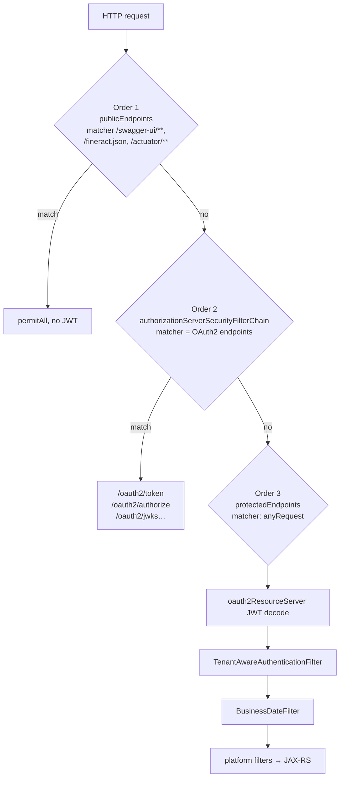
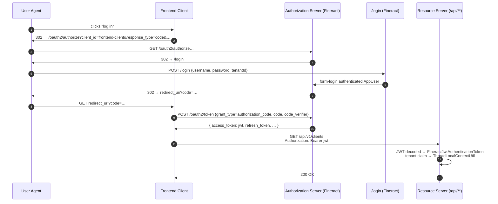

When `fineract.security.oauth2.enabled=true`, Fineract boots an embedded **OAuth2 Authorization Server** alongside the resource server that protects `/api/**`. The configuration lives in `fineract-provider/src/main/java/org/apache/fineract/infrastructure/security/config/AuthorizationServerConfig.java` and replaces `SecurityConfig` (which is `@ConditionalOnProperty("fineract.security.basicauth.enabled")` and therefore disabled in this mode).

This page walks the three `SecurityFilterChain` beans declared by `AuthorizationServerConfig`, the `RegisteredClientRepository` bean fed from `fineract.security.oauth2.client.registrations.*`, and the JWT token customiser that embeds the tenant id, roles, and scopes into every issued bearer token.

## Class shape

```java
@Configuration
@EnableWebSecurity
@ConditionalOnProperty("fineract.security.oauth2.enabled")
@EnableConfigurationProperties(FineractProperties.class)
public class AuthorizationServerConfig {
    public static final String TENANT_ID = "tenantId";
    …
}
```

- `@EnableWebSecurity` enables Spring Security in WebMVC mode (form login lives here).
- The condition pin means this class **only** loads under the OAuth2 profile; the basic-auth `SecurityConfig` is mutually exclusive (enforced by `SecurityValidationConfig`).
- The constant `TENANT_ID = "tenantId"` is the form parameter name used by the login page to carry the tenant through to the authentication details source.

## Three filter chains, three orders

`@Order` on the `SecurityFilterChain` beans dictates which one wins for any given URL. Spring Security tries each chain in order until one's `securityMatcher` matches.



### Chain 1 — public endpoints (`@Order(1)`)

```java
@Bean
@Order(1)
public SecurityFilterChain publicEndpoints(HttpSecurity http) throws Exception {
    http.securityMatcher("/swagger-ui/**", "/fineract.json", "/actuator/**", "/legacy-docs/apiLive.htm")
        .authorizeHttpRequests(auth -> auth.anyRequest().permitAll())
        .csrf(AbstractHttpConfigurer::disable);

    if (fineractProperties.getSecurity().getCors().isEnabled()) {
        http.cors(Customizer.withDefaults());
    }
    return http.build();
}
```

These URLs serve documentation and ops surfaces. They are unauthenticated, CSRF-free, and CORS-aware. Note that the JWT decoder is **not** wired here — these requests do not get an `Authentication`.

### Chain 2 — authorization server endpoints (`@Order(2)`)

```java
@Bean
@Order(2)
public SecurityFilterChain authorizationServerSecurityFilterChain(HttpSecurity http) throws Exception {
    OAuth2AuthorizationServerConfigurer authorizationServerConfigurer = new OAuth2AuthorizationServerConfigurer();

    http.securityMatcher(authorizationServerConfigurer.getEndpointsMatcher())
        .authorizeHttpRequests(auth -> auth.anyRequest().authenticated())
        .csrf(AbstractHttpConfigurer::disable)
        .sessionManagement(session -> session.sessionCreationPolicy(SessionCreationPolicy.IF_REQUIRED))
        .exceptionHandling(exceptions -> exceptions.authenticationEntryPoint(new LoginUrlAuthenticationEntryPoint("/login")))
        .apply(authorizationServerConfigurer);

    if (fineractProperties.getSecurity().getCors().isEnabled()) {
        http.cors(Customizer.withDefaults());
    }
    return http.build();
}
```

This is what `spring-security-oauth2-authorization-server` brings to the table. `getEndpointsMatcher()` returns a matcher for the standard OAuth2 endpoints:

| Endpoint | Purpose |
| --- | --- |
| `POST /oauth2/token` | Exchange `authorization_code` or `refresh_token` for a JWT. |
| `GET /oauth2/authorize` | Authorization code grant initiation. |
| `GET /oauth2/jwks` | Public keys for JWT verification (auto-rotated). |
| `POST /oauth2/revoke` | Token revocation. |
| `POST /oauth2/introspect` | Token introspection. |
| `GET /.well-known/oauth-authorization-server` | Discovery document. |

Key choices:

- **Stateful**: `SessionCreationPolicy.IF_REQUIRED`. The authorization code flow uses an `HttpSession` to remember the user during consent.
- **CSRF disabled** (with a `TODO: make it configurable` comment from the maintainers). UIs driving the authorization code flow must implement their own CSRF protection.
- **Unauthenticated requests** to OAuth2 endpoints are redirected to `/login`, which is served by `LoginController.login()` and renders `templates/login.html`.

### Chain 3 — protected resource endpoints (`@Order(3)`)

```java
@Bean
@Order(3)
public SecurityFilterChain protectedEndpoints(HttpSecurity http) throws Exception {
    http
        .csrf(AbstractHttpConfigurer::disable)
        .authorizeHttpRequests(auth -> {
            auth.anyRequest().authenticated();
            if (fineractProperties.getSecurity().getTwoFactor().isEnabled()) {
                auth.anyRequest().hasAuthority("TWOFACTOR_AUTHENTICATED");
            }
        })
        .formLogin(form -> form.loginPage("/login")
            .authenticationDetailsSource(tenantAuthDetailsSource()).permitAll())
        .oauth2ResourceServer(resourceServer ->
            resourceServer.jwt(jwt -> jwt.jwtAuthenticationConverter(authenticationConverter())))
        .addFilterAfter(tenantAwareAuthenticationFilter(), SecurityContextHolderFilter.class)
        .addFilterAfter(businessDateFilter(), TenantAwareAuthenticationFilter.class)
        .addFilterAfter(requestResponseFilter(), ExceptionTranslationFilter.class)
        .addFilterAfter(correlationHeaderFilter(), RequestResponseFilter.class)
        .addFilterAfter(fineractInstanceModeApiFilter(), CorrelationHeaderFilter.class);
    // …optional Loan COB and idempotency filters, ip tracking, 2FA, CORS…
    return http.build();
}
```

This chain matches everything not picked up by chains 1 or 2 — most importantly `/api/**` and `/login`.

Notable bits:

- **`oauth2ResourceServer().jwt(...)`** plugs in the JWT decoder Spring auto-configures from the authorization server's signing keys.
- **`jwtAuthenticationConverter(authenticationConverter())`** uses Fineract's custom `FineractJwtAuthenticationTokenConverter` to translate the verified JWT into a `FineractJwtAuthenticationToken` whose principal is an `AppUser` (looked up by `jwt.getSubject()`).
- **`formLogin(/login)`** lets the authorization code flow's consent page authenticate the user with username + password + tenantId (via `tenantAuthDetailsSource()`).
- **Platform filters** are layered in the same order as `SecurityConfig` (`TenantAwareAuthenticationFilter` → `BusinessDateFilter` → `RequestResponseFilter` → `CorrelationHeaderFilter` → `FineractInstanceModeApiFilter`).

## The JWT authentication converter

`FineractJwtAuthenticationTokenConverter` lives in `fineract-security/.../converter`. It bridges the OAuth2 world (where principals are JWTs) and Fineract's world (where principals are `AppUser`s):

```java
@RequiredArgsConstructor
public class FineractJwtAuthenticationTokenConverter implements Converter<Jwt, FineractJwtAuthenticationToken> {

    private final TenantAwareJpaPlatformUserDetailsService userDetailsService;

    @Override
    public FineractJwtAuthenticationToken convert(Jwt jwt) {
        try {
            UserDetails user = userDetailsService.loadUserByUsername(jwt.getSubject());
            Collection<GrantedAuthority> authorities = new JwtGrantedAuthoritiesConverter().convert(jwt);
            return new FineractJwtAuthenticationToken(jwt, authorities, user);
        } catch (UsernameNotFoundException ex) {
            throw new OAuth2AuthenticationException(new OAuth2Error(OAuth2ErrorCodes.INVALID_TOKEN), ex);
        }
    }
}
```

Steps:

1. `jwt.getSubject()` is the username originally captured in the form login.
2. `loadUserByUsername` runs **in the tenant schema** — the `TenantAwareAuthenticationFilter` has already set the tenant on `ThreadLocalContextUtil` by the time the JWT filter runs.
3. `JwtGrantedAuthoritiesConverter().convert(jwt)` defaults to reading the `scope` (or `scp`) claim into a set of `GrantedAuthority`. The token customiser explicitly sets `scope` to the user's authorities, so the final authority set matches the authorities the user has in the tenant DB.
4. Failure to find the user becomes a 401 with OAuth2 error `invalid_token`.

The returned `FineractJwtAuthenticationToken` carries the original `Jwt` so `TwoFactorAuthenticationFilter` can rebuild it with extra authorities later.

## Token customisation: where does the `tenant` claim come from?

```java
@Bean
public OAuth2TokenCustomizer<JwtEncodingContext> tokenCustomizer() {
    return context -> {
        UsernamePasswordAuthenticationToken authentication = context.getPrincipal();
        TenantAuthenticationDetails details = (TenantAuthenticationDetails) authentication.getDetails();
        AppUser appUser = (AppUser) authentication.getPrincipal();
        List<String> roles = appUser.getRoles().stream().map(Role::getName).toList();
        List<String> scope = appUser.getAuthorities().stream()
                .map(GrantedAuthority::getAuthority).collect(Collectors.toList());
        context.getClaims().claim("scope", scope).claim("role", roles).claim("tenant", details.getTenantId());
    };
}
```

When the authorization server signs a JWT, the customiser:

1. Reads the `AppUser` principal that resulted from form-login authentication.
2. Pulls roles (a flat list of role names) and the full authority set (used as `scope`).
3. Reads the tenant id out of `TenantAuthenticationDetails`, which was attached by `tenantAuthDetailsSource()`:

```java
@Bean
@Scope("prototype")
public AuthenticationDetailsSource<HttpServletRequest, TenantAuthenticationDetails> tenantAuthDetailsSource() {
    return request -> {
        String tenantId = request.getParameter(TENANT_ID);
        String username = request.getParameter(UsernamePasswordAuthenticationFilter.SPRING_SECURITY_FORM_USERNAME_KEY);
        String password = request.getParameter(UsernamePasswordAuthenticationFilter.SPRING_SECURITY_FORM_PASSWORD_KEY);
        return new TenantAuthenticationDetails(username, tenantId, password);
    };
}
```

So the login form (`templates/login.html`) must POST `username`, `password`, and `tenantId`. The tenant ends up in the JWT as the `tenant` claim and is later read by `TenantAwareAuthenticationFilter` on every request.

## Registered clients (in-memory)

```java
@Bean
public RegisteredClientRepository registeredClientRepository(FineractProperties fineractProperties) {
    List<RegisteredClient> clients = fineractProperties.getSecurity().getOauth2().getClient().getRegistrations()
        .values().stream()
        .map(reg -> RegisteredClient.withId(UUID.randomUUID().toString())
            .clientId(reg.getClientId())
            .clientAuthenticationMethods(methods -> methods.add(ClientAuthenticationMethod.NONE))
            .scopes(scopes -> scopes.addAll(reg.getScopes()))
            .authorizationGrantTypes(grants -> reg.getAuthorizationGrantTypes()
                .forEach(grant -> grants.add(new AuthorizationGrantType(grant))))
            .redirectUris(uris -> uris.addAll(reg.getRedirectUris()))
            .clientSettings(ClientSettings.builder()
                .requireAuthorizationConsent(reg.isRequireAuthorizationConsent()).build())
            .build())
        .toList();
    return new InMemoryRegisteredClientRepository(clients);
}
```

Highlights:

- **In-memory only**. Restarting the server regenerates the `RegisteredClient.id` (a random UUID) but the `clientId` strings are stable. This is intended for development and embedded deployments; production setups should swap in a JDBC-backed repository.
- **`ClientAuthenticationMethod.NONE`**. All registrations are treated as **public clients** (PKCE-style) — no client secret is required, so secrets configured in `application.properties` would have no effect.
- **Scopes, grant types, redirect URIs** all come from the properties.
- **Consent screen** is toggled by `require-authorization-consent`.

## Property structure for client registrations

The property layout in `application.properties` maps directly onto `FineractProperties.Security.OAuth2.Client.Registration`. The shipped example (with the `frontend-client` registration) is:

```properties
# EXAMPLE: OAuth2 client configuration (frontend-client)
fineract.security.oauth2.client.registrations.frontend-client.client-id=${FINERACT_SECURITY_OAUTH2_CLIENTS_FRONTEND_ID:frontend-client}
fineract.security.oauth2.client.registrations.frontend-client.scopes=${FINERACT_SECURITY_OAUTH2_CLIENTS_FRONTEND_SCOPES:read,write}
fineract.security.oauth2.client.registrations.frontend-client.authorization-grant-types=${FINERACT_SECURITY_OAUTH2_CLIENTS_FRONTEND_GRANTS:authorization_code,refresh_token}
fineract.security.oauth2.client.registrations.frontend-client.redirect-uris=${FINERACT_SECURITY_OAUTH2_CLIENTS_FRONTEND_REDIRECT:http://localhost:3000/callback}
fineract.security.oauth2.client.registrations.frontend-client.require-authorization-consent=${FINERACT_SECURITY_OAUTH2_CLIENTS_FRONTEND_CONSENT:false}
```

Reading the structure:

| Key suffix | Type | Maps to |
| --- | --- | --- |
| `.client-id` | string | `RegisteredClient.clientId`. Must match what the OAuth2 client sends. |
| `.scopes` | comma-separated string | Allowed scopes (`read`, `write`, custom). |
| `.authorization-grant-types` | comma-separated string | OAuth2 grant types — typically `authorization_code,refresh_token`. |
| `.redirect-uris` | comma-separated string | Whitelisted redirect URIs for authorization code flow. |
| `.require-authorization-consent` | boolean | Show the consent screen. |

<Tip>
To register additional clients, repeat the block with a new key segment in place of `frontend-client`, e.g. `fineract.security.oauth2.client.registrations.mobile-app.client-id=…`. Spring Boot's relaxed binding will pick up each entry as a separate `Registration`.
</Tip>

<Warning>
No client secrets are honoured at runtime because every registration is wired as `ClientAuthenticationMethod.NONE`. The `application.properties` shipped with the project deliberately does not declare secret keys to avoid creating a sense of false security. If you fork the repo to require confidential clients, change the line `clientAuthenticationMethods(methods -> methods.add(ClientAuthenticationMethod.NONE))` and add the secret-binding logic.
</Warning>

## CORS, bearer resolver, and password encoder

```java
@Bean
public CorsConfigurationSource corsConfigurationSource() { /* identical to SecurityConfig */ }

@Bean
public BearerTokenResolver resolver() {
    return new DefaultBearerTokenResolver();
}

@Bean
public PasswordEncoder passwordEncoder() {
    return PasswordEncoderFactories.createDelegatingPasswordEncoder();
}
```

- The CORS configuration is identical to `SecurityConfig` so toggling `fineract.security.oauth2.enabled` doesn't change CORS behaviour. See [/security/cors-and-hsts](/security/cors-and-hsts).
- `DefaultBearerTokenResolver` accepts the `Authorization: Bearer …` header (no query-parameter fallback, which is the OAuth2 BCP). It's injected into `TenantAwareAuthenticationFilter` so that filter can peek at the JWT.
- The password encoder is the same delegating BCrypt encoder used everywhere else — see [/security/password-encoding](/security/password-encoding).

## Tenant + business date filters

```java
@Bean
public OncePerRequestFilter tenantAwareAuthenticationFilter() {
    return new TenantAwareAuthenticationFilter(resolver(), tenantDetailsService);
}

@Bean
public OncePerRequestFilter businessDateFilter() {
    return new BusinessDateFilter(businessDateReadPlatformService);
}
```

Both filters are described in [/security/basic-and-tenant-filters](/security/basic-and-tenant-filters). They run after `SecurityContextHolderFilter` so the JWT-driven authentication is already in place when `TenantAwareAuthenticationFilter` decodes the tenant claim and primes `ThreadLocalContextUtil`.

## Two-factor and instance-mode integration

The same conditionals seen in `SecurityConfig` are repeated:

```java
if (!Objects.isNull(loanCOBFilterHelper)) {
    http.addFilterAfter(loanCOBApiFilter(), FineractInstanceModeApiFilter.class)
        .addFilterAfter(idempotencyStoreFilter(), LoanCOBApiFilter.class);
    http.addFilterBefore(progressiveLoanModelCheckerFilter, LoanCOBApiFilter.class);
} else {
    http.addFilterAfter(idempotencyStoreFilter(), FineractInstanceModeApiFilter.class);
    http.addFilterAfter(progressiveLoanModelCheckerFilter, FineractInstanceModeApiFilter.class);
}

if (fineractProperties.getIpTracking().isEnabled()) {
    http.addFilterAfter(callerIpTrackingFilter(), RequestResponseFilter.class);
}
if (fineractProperties.getSecurity().getTwoFactor().isEnabled()) {
    http.addFilterAfter(twoFactorAuthenticationFilter(), CorrelationHeaderFilter.class);
}
if (fineractProperties.getSecurity().getCors().isEnabled()) {
    http.cors(Customizer.withDefaults());
}
```

The 2FA filter is conditional on `fineract.security.2fa.enabled` — see [/security/two-factor-auth](/security/two-factor-auth) for the OTP flow and how the filter mutates the authentication.

## End-to-end OAuth2 sequence



The JWT includes:

```json
{
  "sub": "mifos",
  "scope": ["READ_CLIENT", "CREATE_CLIENT", "…"],
  "role": ["Super user"],
  "tenant": "default",
  "exp": 1735689600
}
```

## Where to look in the test sources

The `oauth2-tests/` Gradle subproject under the repository root contains end-to-end integration tests that boot the platform with `FINERACT_SECURITY_OAUTH_ENABLED=true` and walk the authorization code flow with a test client. Use these as reference fixtures for client registration shape and JWT claim expectations.

## Related pages

- [Security configuration](/security/security-config) — the basic-auth mirror image.
- [Basic and tenant filters](/security/basic-and-tenant-filters) — what runs after JWT decode.
- [Two-factor authentication](/security/two-factor-auth)
- [Tenancy overview](/tenancy/overview)
- [User administration overview](/users/overview)
