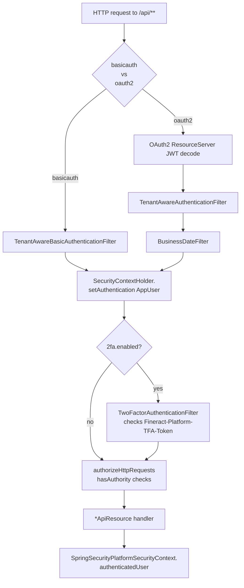

{/*
This page is the entry point into the security sub-tree. Keep it short on prose,
heavy on file-inventory tables, and link generously to the deep-dive sub-pages.
*/}

The `fineract-security` Gradle module is the authentication and request-context layer of Apache Fineract. It owns the servlet filters that intercept every `/api/**` call, the JAX-RS endpoints that issue and validate credentials, the OTP machinery for two-factor authentication, and the bridge between Spring Security's `SecurityContextHolder` and the multi-tenant `ThreadLocalContextUtil` that the rest of the platform relies on.

Everything an API request needs before reaching a `*ApiResource` — a resolved `FineractPlatformTenant`, a decoded `AppUser` principal, the active `BusinessDate` map, and (optionally) a validated `TWOFACTOR_AUTHENTICATED` authority — is wired up here. The module ships two parallel authentication stacks (HTTP Basic and OAuth2 Authorization Server) that are mutually exclusive at runtime and selected through `fineract.security.basicauth.enabled` / `fineract.security.oauth2.enabled` in `application.properties`.

<Info>
The Spring `SecurityFilterChain` beans themselves live in `fineract-provider` (`SecurityConfig`, `AuthorizationServerConfig`) because they need to compose with platform filters such as `LoanCOBApiFilter` and `IdempotencyStoreFilter`. The reusable security primitives — filters, services, data, and exceptions — live in `fineract-security`. The contract interfaces (`PlatformSecurityContext`, `SqlValidator`, `PasswordEncryptor`, `PlatformPasswordEncoder`, `PlatformUserDetailsService`) live in `fineract-core` so downstream modules can depend on them without pulling in Spring Security wiring.
</Info>

## Request lifecycle

Every `/api/**` call passes through one of two filter chains depending on which auth scheme is enabled. Both chains converge on the same `*ApiResource` after populating the SecurityContext and `ThreadLocalContextUtil`.

The basic-auth chain extracts `Fineract-Platform-TenantId` first, loads the tenant via `AuthTenantDetailsService`, decodes the `Authorization: Basic` header, and authenticates the user through `DaoAuthenticationProvider`. The OAuth2 chain instead parses the bearer JWT, reads its `tenant` claim, loads the tenant and the user, and produces a `FineractJwtAuthenticationToken`.

After the filter chain succeeds, every downstream service that needs the caller calls `platformSecurityContext.authenticatedUser()` — implemented by `SpringSecurityPlatformSecurityContext` — which returns the `AppUser` from `SecurityContextHolder.getContext().getAuthentication().getPrincipal()` and triggers `ResetPasswordException` if the user is past the password expiration window.

## File inventory — `fineract-security`

The module has no UI code; every class supports authentication, authorisation, or tenant resolution.

### `api/` — JAX-RS resources and the login MVC controller

| Class | Responsibility |
| --- | --- |
| `AuthenticationApiResource` | `POST /v1/authentication` — HTTP Basic login endpoint that returns `AuthenticatedUserData`. Active when `fineract.security.basicauth.enabled=true`. |
| `AuthenticationApiResourceSwagger` | OpenAPI request/response schemas referenced from `AuthenticationApiResource`. |
| `UserDetailsApiResource` | `GET /v1/userdetails` — bearer-token introspection that returns `AuthenticatedOauthUserData`. Active when `fineract.security.oauth2.enabled=true`. |
| `UserDetailsApiResourceSwagger` | OpenAPI schema for `UserDetailsApiResource`. |
| `TwoFactorApiResource` | `GET/POST /v1/twofactor` and sub-paths (`validate`, `invalidate`) for OTP issuing and access-token exchange. |
| `TwoFactorConfigurationApiResource` | `GET/PUT /v1/twofactor/configure` — tenant-level 2FA configuration. |
| `LoginController` | Spring MVC controller serving `GET /login` → `templates/login.html` for the OAuth2 authorization-code flow's form login. |

### `command/` — CommandSource handlers

| Class | Responsibility |
| --- | --- |
| `InvalidateTFAccessTokenCommandHandler` | Handles `INVALIDATE_TWOFACTOR_ACCESSTOKEN` command, invalidating a `TFAccessToken`. |
| `UpdateTwoFactorConfigCommandHandler` | Handles `UPDATE_TWOFACTOR_CONFIGURATION` command, persisting `TwoFactorConfiguration` changes. |

### `constants/`

| Class | Responsibility |
| --- | --- |
| `TenantConstants` | Property keys used to override the read-only schema (`FINERACT_RO_SCHEMA_*`). |
| `TwoFactorConfigurationConstants` | Parameter names recognised by `TwoFactorConfigurationApiResource` (e.g. `otp-token-length`, `access-token-live-time`). |
| `TwoFactorConstants` | Permission/authority names: `BYPASS_TWOFACTOR`, `TWOFACTOR_ACCESSTOKEN`, delivery method names. |

### `converter/`

| Class | Responsibility |
| --- | --- |
| `FineractJwtAuthenticationTokenConverter` | `Converter<Jwt, FineractJwtAuthenticationToken>` used by the OAuth2 resource server to look the subject up via `TenantAwareJpaPlatformUserDetailsService` and wrap the JWT in a Fineract-flavoured authentication. |

### `data/` — DTOs and authentication tokens

| Class | Responsibility |
| --- | --- |
| `AccessTokenData` | Wire DTO for a `TFAccessToken` (token string + valid-from/valid-to). |
| `AuthenticatedOauthUserData` | Response of `GET /v1/userdetails` — username, roles, permissions, access token. |
| `AuthenticatedUserData` | Response of `POST /v1/authentication` — username, base64 key, roles, permissions, 2FA flag. |
| `FineractJwtAuthenticationToken` | `AbstractAuthenticationToken` subclass storing the original `Jwt` and resolved `UserDetails`. |
| `OTPDeliveryMethod` | DTO describing an OTP transport (sms/email) and target. |
| `OTPMetadata` | Public-safe OTP metadata (delivery method, token length, valid time). |
| `OTPRequest` | In-memory record of an issued OTP — token, target user, delivery, expiry. |
| `PlatformRequestLog` | Wraps a `StopWatch` and request URI for debug logging from the basic-auth filter. |
| `TenantAuthenticationDetails` | OAuth2 form-login details object carrying `tenantId`, `username`, `password`. |
| `TwoFactorConfigurationValidator` | Validates `JsonCommand` payloads for `UpdateTwoFactorConfigCommandHandler`. |

### `domain/` — JPA entities and repositories

| Class | Responsibility |
| --- | --- |
| `OTPRequestRepository` | Tracks issued but unconsumed OTPs per user. |
| `PlatformUserRepository` | Domain-side lookup used by `TenantAwareJpaPlatformUserDetailsService` (`findByUsernameAndDeletedAndEnabled`). |
| `TFAccessToken` | JPA entity for an issued two-factor access token (token, user, validFrom, validTo). |
| `TFAccessTokenRepository` | Spring Data repository for `TFAccessToken`. |
| `TwoFactorConfiguration` | JPA entity for tenant-level 2FA configuration key/value pairs. |
| `TwoFactorConfigurationRepository` | Spring Data repository for `TwoFactorConfiguration`. |

### `exception/` — security exceptions

| Class | Responsibility |
| --- | --- |
| `AccessTokenInvalidIException` | Thrown by `TwoFactorService` when a TFA token cannot be validated. |
| `EscapeSqlLiteralException` | Wraps a JDBC `SQLException` from PostgreSQL's `Utils.escapeLiteral`. |
| `ForcePasswordResetException` | 403 mapped exception when password policy forces a renew. |
| `OTPDeliveryMethodInvalidException` | Raised when an unknown delivery method is requested. |
| `OTPTokenInvalidException` | Raised when an OTP cannot be matched/has expired. |
| `PasswordResetRequiredException` | Carries `AuthenticatedUserData` so the API still echoes user metadata when reset is required. |
| `PasswordResetRequiredExceptionMapper` | JAX-RS `ExceptionMapper` turning `PasswordResetRequiredException` into a 403 JSON response. |
| `ResetPasswordException` | Thrown by `SpringSecurityPlatformSecurityContext` mid-request when the principal's password is past expiry. |

### `filter/` — servlet filters added to the chain

| Class | Responsibility |
| --- | --- |
| `TenantAwareBasicAuthenticationFilter` | Extends Spring's `BasicAuthenticationFilter`, resolving `Fineract-Platform-TenantId`, populating `ThreadLocalContextUtil`, applying base URL bootstrap, and tagging `X-Notification-Refresh` on success. |
| `TenantAwareAuthenticationFilter` | OAuth2 equivalent: parses the bearer JWT (without validation here — that's done by the resource server) to extract the `tenant` claim and prime the tenant context. |
| `BusinessDateFilter` | Loads `BusinessDateReadPlatformService.getBusinessDates()` into `ThreadLocalContextUtil` after the tenant is set. |
| `TwoFactorAuthenticationFilter` | When 2FA is on, validates `Fineract-Platform-TFA-Token` and either appends `TWOFACTOR_AUTHENTICATED` to the current authentication or fails with 401. Users with `BYPASS_TWOFACTOR` are always granted the authority. |

### `service/`

| Class | Responsibility |
| --- | --- |
| `AccessTokenGenerationService` | Interface for OTP-derived access-token strings. |
| `UUIDAccessTokenGenerationService` | Default implementation — `UUID.randomUUID()` with dashes stripped. |
| `AuthTenantDetailsService` | Interface for tenant lookup by identifier. |
| `AuthTenantDetailsServiceJdbc` | JDBC-backed implementation using the tenants datasource and `TenantMapper`. Result is `@Cacheable("tenantsById")`. |
| `CustomAuthenticationFailureHandler` | OAuth2 form-login failure handler that preserves the `tenantId` query parameter. |
| `RandomOTPGenerator` | `SecureRandom`-backed alphanumeric OTP generator. |
| `SpringSecurityPlatformSecurityContext` | Bridges Spring Security's `SecurityContextHolder` to `PlatformSecurityContext`. Used everywhere the platform asks for "the current user". |
| `SqlInjectionPreventerServiceImpl` | Implements `SqlInjectionPreventerService` from `fineract-core` for MySQL/MariaDB and PostgreSQL literal and identifier quoting. |
| `TenantAwareJpaPlatformUserDetailsService` | Spring Security `UserDetailsService` implementation backed by `PlatformUserRepository`. Result is `@Cacheable("usersByUsername")`. |
| `TwoFactorConfigurationService` | Reads and updates `TwoFactorConfiguration` rows (token length, delivery methods, validity windows). |
| `TwoFactorService` | Drives the OTP lifecycle — issuing, validating, and exchanging for `TFAccessToken`. |

## Inbound header contract

Every authenticated `/api/**` request — regardless of authentication scheme — observes the same set of inbound headers. They are read and consumed at the filter layer before any JAX-RS resource sees the request.

| Header | Required | Read by | Purpose |
| --- | --- | --- | --- |
| `Authorization: Basic …` | basic-auth mode | `TenantAwareBasicAuthenticationFilter` → Spring's `BasicAuthenticationFilter` | Carries username:password (base64). |
| `Authorization: Bearer <jwt>` | OAuth2 mode | `BearerTokenAuthenticationFilter` | JWT signed by the embedded authorization server. |
| `Fineract-Platform-TenantId` | always (basic auth) | `TenantAwareBasicAuthenticationFilter` | Selects the tenant schema. Falls back to `?tenantIdentifier=` query parameter when missing. |
| `tenant` claim in JWT | always (OAuth2) | `TenantAwareAuthenticationFilter` | Sourced by `tokenCustomizer()` from `TenantAuthenticationDetails`. |
| `Fineract-Platform-TFA-Token` | when 2FA enabled | `TwoFactorAuthenticationFilter` | Two-factor access token issued by `POST /v1/twofactor/validate`. |
| `Idempotency-Key` | optional, command writes | `IdempotencyStoreFilter` (downstream of security) | Deduplicates write commands. |
| `X-Correlation-Id` | optional | `CorrelationHeaderFilter` (downstream of security) | Propagated to MDC and outbound calls. |

## Outbound headers

Successful responses can carry security-relevant headers depending on configuration:

| Header | When | Source |
| --- | --- | --- |
| `WWW-Authenticate: Basic realm="Fineract Platform API"` | 401 from basic auth | `BasicAuthenticationEntryPoint` configured in `SecurityConfig`. |
| `WWW-Authenticate: Basic realm="Fineract Platform API Two Factor"` | 401 from 2FA | `TwoFactorAuthenticationFilter.doFilter`. |
| `X-Notification-Refresh: true\|false` | Every successful basic-auth response | `TenantAwareBasicAuthenticationFilter.onSuccessfulAuthentication`. |
| `Strict-Transport-Security: max-age=31536000; includeSubDomains` | When HSTS enabled | Spring's HSTS writer enabled in `SecurityConfig`. |
| `Access-Control-Allow-*` | Cross-origin requests | `CorsFilter`, configured via `CorsConfigurationSource` bean. |

## Where it sits in the wider platform

- The tenant resolution that begins in `TenantAwareBasicAuthenticationFilter` / `TenantAwareAuthenticationFilter` flows into the multi-tenant connection-pool routing described in [/tenancy/overview](/tenancy/overview).
- `AppUser`, roles, and permissions referenced from the SecurityContext are managed by the user administration module — see [/users/overview](/users/overview) and the [password policy](/users/password-policy).
- The behavioural flags (`fineract.security.*`, CORS, HSTS, OAuth2 client registrations) are part of [/config/overview](/config/overview) and end up on `FineractProperties.Security`.

## How the pieces line up

### Module boundaries

The split between `fineract-core`, `fineract-security`, and `fineract-provider` is deliberate and is worth internalising:

- **`fineract-core`** owns *interfaces only*: `PlatformSecurityContext`, `PlatformUserDetailsService`, `PlatformPasswordEncoder`, `PasswordEncryptor`, `SqlValidator`, `SqlInjectionPreventerService`, and `RandomPasswordGenerator`. Everything downstream can depend on these without dragging in Spring Security or any servlet machinery.
- **`fineract-security`** provides the **implementations** of those contracts plus the JAX-RS resources and servlet filters. It depends on Spring Security, Spring Session, and the OAuth2 resource-server libraries. It does not configure `SecurityFilterChain` beans — that responsibility sits with the deployment-time wiring in `fineract-provider`.
- **`fineract-provider`** owns `SecurityConfig` and `AuthorizationServerConfig`. These are the *only* classes that know about the **complete platform filter list**: `LoanCOBApiFilter`, `IdempotencyStoreFilter`, `CorrelationHeaderFilter`, `RequestResponseFilter`, etc.

Concretely, that means a peripheral module wanting to add a security check can depend on `PlatformSecurityContext` from `fineract-core` and never reach into `fineract-security` types. Tests can stub the interfaces. And the basic-auth vs OAuth2 choice flips the `@ConditionalOnProperty` in `fineract-provider` without rebuilding anything else.

### Two authentication subjects

Across the codebase the word "user" refers to two different things:

| Subject | Where it appears | Notes |
| --- | --- | --- |
| `AppUser` (JPA entity) | User-administration module | Persisted in `m_appuser`, has roles, permissions, office, staff. |
| `PlatformUser` (interface) | `fineract-security/domain` | Minimal `UserDetails`-shaped interface used by `TenantAwareJpaPlatformUserDetailsService`. Implemented by `AppUser`. |

The `PlatformUser` interface exists so the security module can answer Spring Security's `UserDetailsService.loadUserByUsername` without depending on the full `AppUser` JPA graph. By the time the request reaches a JAX-RS resource, the principal in `SecurityContext` is the concrete `AppUser` (cast verified in `SpringSecurityPlatformSecurityContext.authenticatedUser()`).

### Where authorities come from

Two layers contribute authorities to the `Authentication`:

1. **Role-derived permissions** assigned in the user admin module — these are loaded into `AppUser.authorities` by JPA and become the bulk of the principal's `GrantedAuthority` set. The roles drive every per-resource `hasAnyAuthority(…)` rule in `SecurityConfig` (e.g. `READ_CLIENT`, `CREATE_LOAN`).
2. **Filter-injected authorities** — currently just `TWOFACTOR_AUTHENTICATED`, added by `TwoFactorAuthenticationFilter` when a valid OTP-derived token is presented (or always for users with `BYPASS_TWOFACTOR`).

The `ALL_FUNCTIONS`, `ALL_FUNCTIONS_READ`, `ALL_FUNCTIONS_WRITE` super-authorities are conventional shortcuts. Every per-resource matcher includes them so a single role granting `ALL_FUNCTIONS` covers everything. See [/users/overview](/users/overview).

## Common code paths

The most-asked questions about this module fall into a small set of "where does X happen" answers:

<AccordionGroup>
  <Accordion title="Where is `Fineract-Platform-TenantId` parsed?">
    `TenantAwareBasicAuthenticationFilter.doFilterInternal` for basic auth; `TenantAwareAuthenticationFilter.doFilterInternal` reads the JWT's `tenant` claim for OAuth2. Both delegate to `AuthTenantDetailsServiceJdbc.loadTenantById` and stash the result on `ThreadLocalContextUtil`.
  </Accordion>
  <Accordion title="Where is the password hash verified?">
    `DaoAuthenticationProvider` (configured in `SecurityConfig.authProvider`) uses Spring's `DelegatingPasswordEncoder` to call `BCryptPasswordEncoder.matches(raw, encoded)`. The encoder bean is defined in `SecurityConfig.passwordEncoder()` and reused by `AuthorizationServerConfig`.
  </Accordion>
  <Accordion title="Where does an `AppUser` get into the SecurityContext?">
    Basic auth: `BasicAuthenticationFilter.doFilterInternal` (the superclass of `TenantAwareBasicAuthenticationFilter`) calls `AuthenticationManager.authenticate` and writes the result into the context. 
    OAuth2: `BearerTokenAuthenticationFilter` uses `FineractJwtAuthenticationTokenConverter` to load the user and produces a `FineractJwtAuthenticationToken`.
  </Accordion>
  <Accordion title="Where is password expiry checked?">
    `SpringSecurityPlatformSecurityContext.authenticatedUser()` calls `doesPasswordHasToBeRenewed(currentUser)` on every lookup and throws `ResetPasswordException` if the user is past the policy window. The login resources surface it as `shouldRenewPassword` or a 403 `PasswordResetRequiredException`.
  </Accordion>
  <Accordion title="Where is SQL injection blocked?">
    Two layers — `SqlValidator` (regex profiles in `application.properties`) for statement bodies and `SqlInjectionPreventerService` for individual literals/identifiers. See [/security/sql-injection-prevention](/security/sql-injection-prevention).
  </Accordion>
</AccordionGroup>

## Tracing a request

When something authenticates "wrong", these are the lookups that matter.

### Basic-auth troubleshooting

1. **400 "No tenant identifier found"** — neither the header nor the `?tenantIdentifier=` query parameter was present. The filter rejects before ever touching the auth provider.
2. **400 "Invalid tenant identifier"** — `AuthTenantDetailsServiceJdbc.loadTenantById` produced `EmptyResultDataAccessException`. Confirm the row exists in `fineract_tenants.tenants` (or whatever your `fineract_tenants` schema is named).
3. **401 "Bad credentials"** — `DaoAuthenticationProvider` rejected. Could be wrong password, deleted/disabled user, or password hash mismatch (e.g. legacy hash that no longer matches the encoder defaults).
4. **403 with body `shouldRenewPassword: true`** — `SpringSecurityPlatformSecurityContext.doesPasswordHasToBeRenewed` returned `true`. Hit the user-admin password-change endpoint and retry.
5. **401 "Invalid two-factor access token provided"** — `Fineract-Platform-TFA-Token` was sent but expired or invalid. Re-issue via `POST /v1/twofactor` → `/v1/twofactor/validate`.
6. **403 with no body** — `authorizeHttpRequests` rule denied. Either the user lacks the role permission, or the `TWOFACTOR_AUTHENTICATED` authority is missing (2FA is on, no token was sent).

### OAuth2 troubleshooting

1. **401 with `invalid_token`** — JWT failed signature/expiry validation **or** the `FineractJwtAuthenticationTokenConverter` could not load the user by `jwt.subject`.
2. **401 `invalid_token`** with no body — the `tenant` claim was missing or the tenant didn't exist; `TenantAwareAuthenticationFilter` swallowed the exception so the resource server's downstream `loadUserByUsername` failed in a wrong tenant.
3. **403 access denied** — same as basic auth: missing role permission or missing `TWOFACTOR_AUTHENTICATED`.

## Module-level configuration matrix

The behavioural flags that matter:

| Flag | Pins | Behaviour |
| --- | --- | --- |
| `fineract.security.basicauth.enabled=true` + `fineract.security.oauth2.enabled=false` | `SecurityConfig` | HTTP Basic, `/v1/authentication`, no JWT decoder. Default. |
| `fineract.security.basicauth.enabled=false` + `fineract.security.oauth2.enabled=true` | `AuthorizationServerConfig` | Embedded OAuth2 authorization server, JWT-based resource server, `/v1/userdetails`, `/login` MVC. |
| Both `true` or both `false` | Boot fails | `SecurityValidationConfig` throws at `@PostConstruct`. |
| `fineract.security.2fa.enabled=true` | Adds `TwoFactorAuthenticationFilter` | Requires `TWOFACTOR_AUTHENTICATED` for `/api/**`; exposes `/v1/twofactor*`. |
| `fineract.security.hsts.enabled=true` | Adds HSTS + redirect-to-HTTPS | `Strict-Transport-Security` on every response. |
| `fineract.security.cors.enabled=true` | Adds CORS filter | Honours `allowed-origin-patterns`, `allowed-methods`, etc. Default `true`. |
| `fineract.ip-tracking.enabled=true` | Adds `CallerIpTrackingFilter` | Logs caller IP per request. |

Each flag has a corresponding `FINERACT_*` environment variable — see the property tables in the linked sub-pages.

## Sub-pages

<CardGroup cols={2}>
  <Card title="Security configuration" icon="shield" href="/security/security-config">
    `SecurityConfig.java` filter chain, CSRF, session policy, HSTS toggle.
  </Card>
  <Card title="Basic & tenant filters" icon="filter" href="/security/basic-and-tenant-filters">
    Anatomy of the per-request filters that resolve tenant + user.
  </Card>
  <Card title="OAuth2 authorization server" icon="key" href="/security/oauth2-authorization-server">
    `AuthorizationServerConfig`, JWT customisation, registered clients.
  </Card>
  <Card title="Two-factor authentication" icon="lock" href="/security/two-factor-auth">
    OTP issuance, `TFAccessToken`, configuration endpoints.
  </Card>
  <Card title="Authentication API" icon="user-check" href="/security/authentication-api">
    `POST /v1/authentication` and `AccessTokenGenerationService`.
  </Card>
  <Card title="User details API" icon="id-card" href="/security/user-details-api">
    `GET /v1/userdetails` for OAuth2-authenticated callers.
  </Card>
  <Card title="SQL injection prevention" icon="shield-check" href="/security/sql-injection-prevention">
    `SqlInjectionPreventerService`, `SqlValidator`, pattern profiles.
  </Card>
  <Card title="Password encoding" icon="key-skeleton" href="/security/password-encoding">
    BCrypt usage, `PlatformPasswordEncoder`, `DatabasePasswordEncryptor`.
  </Card>
  <Card title="CORS and HSTS" icon="globe" href="/security/cors-and-hsts">
    `fineract.security.cors.*`, `fineract.security.hsts.enabled` knobs.
  </Card>
</CardGroup>
