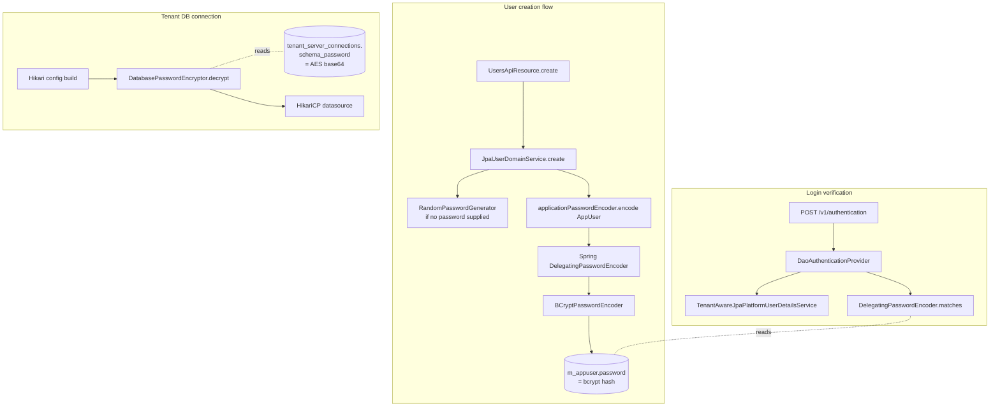

Fineract treats passwords in three distinct domains, each with its own contract:

| Domain | Interface | Default implementation | Algorithm |
| --- | --- | --- | --- |
| Login credentials for `AppUser` | `PlatformPasswordEncoder` (`fineract-core`) | `DefaultPlatformPasswordEncoder` (`fineract-provider`) | BCrypt via Spring's `DelegatingPasswordEncoder` |
| Tenant DB master passwords stored in `fineract_tenants.tenant_server_connections` | `PasswordEncryptor` (`fineract-core`) | `DatabasePasswordEncryptor` (`fineract-core`) | AES/CBC/PKCS5Padding + BCrypt for the master-password hash |
| Generated secrets for new accounts, share-account numbers, etc. | `RandomPasswordGenerator` (`fineract-core`) | The class itself | `SecureRandom` over lowercase letters |

This page walks each.

## PlatformPasswordEncoder — application user passwords

### Interface

`fineract-core/src/main/java/org/apache/fineract/infrastructure/security/service/PlatformPasswordEncoder.java`:

```java
public interface PlatformPasswordEncoder {
    String encode(PlatformUser appUser);
}
```

The interface takes a `PlatformUser` (the domain interface that `AppUser` implements) rather than a raw `CharSequence`. That's deliberate: the encoder can inspect user-scoped data (currently just the password, historically a per-user salt) without changing every call site.

### Default implementation

`fineract-provider/src/main/java/org/apache/fineract/infrastructure/core/domain/DefaultPlatformPasswordEncoder.java`:

```java
@Service(value = "applicationPasswordEncoder")
@Scope("singleton")
public class DefaultPlatformPasswordEncoder implements PlatformPasswordEncoder {

    private final PasswordEncoder passwordEncoder;

    @Autowired
    public DefaultPlatformPasswordEncoder(final PasswordEncoder passwordEncoder) {
        this.passwordEncoder = passwordEncoder;
    }

    @Override
    public String encode(final PlatformUser appUser) {
        return this.passwordEncoder.encode(appUser.getPassword());
    }
}
```

It delegates to Spring Security's `PasswordEncoder`, which `SecurityConfig` (and `AuthorizationServerConfig`) defines as:

```java
@Bean
public PasswordEncoder passwordEncoder() {
    return PasswordEncoderFactories.createDelegatingPasswordEncoder();
}
```

`PasswordEncoderFactories.createDelegatingPasswordEncoder()` returns a `DelegatingPasswordEncoder` whose default ID is `bcrypt` and that recognises legacy prefixes (`{noop}`, `{pbkdf2}`, `{scrypt}`, `{argon2}`, `{sha256}`, `{md5}`, `{md4}`). Stored hashes look like:

```text
{bcrypt}$2a$10$bRwLxIu5dxRTfPmKJvk1YO5o…
{pbkdf2}f2fcfd0c1f24…
```

New passwords are always encoded with BCrypt; legacy hashes from older Fineract installations remain verifiable.

### When does it get called?

`JpaUserDomainService.create(AppUser, sendPasswordToEmail)` is the canonical write path:

```java
@Transactional
@Override
public void create(final AppUser appUser, final Boolean sendPasswordToEmail) {

    generateKeyUsedForPasswordSalting(appUser);

    final String unencodedPassword = appUser.getPassword();

    final String encodePassword = this.applicationPasswordEncoder.encode(appUser);
    appUser.updatePassword(encodePassword);

    this.userRepository.saveAndFlush(appUser);

    if (sendPasswordToEmail.booleanValue()) {
        this.emailService.sendToUserAccount(appUser.getOffice().getName(),
                appUser.getFirstname(), appUser.getEmail(),
                appUser.getUsername(), unencodedPassword);
    }
}
```

The bean qualifier `applicationPasswordEncoder` matches `@Service(value = "applicationPasswordEncoder")` on `DefaultPlatformPasswordEncoder`. Note that the **raw password is captured before encoding** so it can be emailed; the persisted column is always BCrypted.

### Verification

Verification happens **automatically** inside `DaoAuthenticationProvider` (configured in `SecurityConfig.authProvider`):

```java
authProvider.setUserDetailsService(userDetailsService);
authProvider.setPasswordEncoder(passwordEncoder());
```

The `DelegatingPasswordEncoder.matches(rawPassword, encodedPassword)` reads the `{algorithm}` prefix and dispatches. Storage migrations are unnecessary — old hashes verify fine and are silently re-encoded if the encoder is configured to upgrade (which `createDelegatingPasswordEncoder` enables by default for the BCrypt path on successful match, depending on the version of Spring Security shipped).

## PasswordEncryptor — tenant DB master password

`fineract-core/src/main/java/org/apache/fineract/infrastructure/security/service/PasswordEncryptor.java`:

```java
public interface PasswordEncryptor {
    String encrypt(String plainPassword);
    String decrypt(String encryptedPassword);
}
```

The "password" here is the **database password for a tenant's MySQL/PostgreSQL connection**, stored in `tenant_server_connections.schema_password` (and the read-only equivalent). It needs to be reversible (so Fineract can actually connect to the schema), so this is **encryption**, not hashing.

### `DatabasePasswordEncryptor`

`fineract-core/src/main/java/org/apache/fineract/infrastructure/core/service/database/DatabasePasswordEncryptor.java`:

```java
@Component
@RequiredArgsConstructor
public class DatabasePasswordEncryptor implements PasswordEncryptor {

    public static final String DEFAULT_ENCRYPTION = "AES/CBC/PKCS5Padding";

    private final FineractProperties fineractProperties;

    @Override
    public String encrypt(String plainPassword) {
        String masterPassword = Optional.ofNullable(fineractProperties.getTenant())
                .map(FineractProperties.FineractTenantProperties::getMasterPassword)
                .orElse(fineractProperties.getDatabase().getDefaultMasterPassword());
        String encryption = Optional.ofNullable(fineractProperties.getTenant())
                .map(FineractProperties.FineractTenantProperties::getEncryption)
                .orElse(DEFAULT_ENCRYPTION);
        return EncryptionUtil.encryptToBase64(encryption, masterPassword, plainPassword);
    }

    @Override
    public String decrypt(String encryptedPassword) { /* mirror of encrypt */ }
}
```

Key points:

- **Algorithm**: `AES/CBC/PKCS5Padding` by default, configurable via `fineract.tenant.encrytion` (yes, the property name has a typo, preserved for backwards compat).
- **Master password**: `fineract.tenant.master-password` (env `FINERACT_DEFAULT_TENANTDB_MASTER_PASSWORD`, default `"fineract"`). This is the AES key derivation input.
- **Storage**: base64-encoded ciphertext goes into the tenants registry table.

### Master password verification (`BCrypt`)

Even though tenant DB passwords are AES-encrypted, the **master password itself** is fingerprinted with BCrypt so the platform can detect a wrong master at startup:

```java
public String getMasterPasswordHash() {
    String masterPassword = Optional.ofNullable(fineractProperties) //
            .map(FineractProperties::getTenant) //
            .map(FineractProperties.FineractTenantProperties::getMasterPassword) //
            .orElse(fineractProperties.getDatabase().getDefaultMasterPassword());
    return getPasswordHash(masterPassword);
}

private static String getPasswordHash(String masterPassword) {
    return BCrypt.hashpw(masterPassword.getBytes(StandardCharsets.UTF_8), BCrypt.gensalt());
}

public boolean isMasterPasswordHashValid(String hashed) {
    String masterPassword = Optional.ofNullable(fineractProperties) //
            .map(FineractProperties::getTenant) //
            .map(FineractProperties.FineractTenantProperties::getMasterPassword) //
            .orElse(fineractProperties.getDatabase().getDefaultMasterPassword());
    return BCrypt.checkpw(masterPassword, hashed);
}
```

Why both? AES needs the exact master plaintext to decrypt the schema password; BCrypt's `checkpw` lets the platform say "the configured master matches the one used when this tenant was registered" without ever holding the original plaintext after the first check. The hash lives in the same row as the encrypted schema password.

### Operator CLI

The class doubles as a tiny CLI for ops who need to seed a new tenant row:

```java
public static void main(String[] args) {
    if (args.length < 2) {
        System.out.println("Usage: java -cp fineract-provider.jar "
            + "-Dloader.main=org.apache.fineract.infrastructure.core.service.database.DatabasePasswordEncryptor "
            + "org.springframework.boot.loader.launch.PropertiesLauncher <masterPassword> <plainPassword>");
        System.exit(1);
    }
    String masterPassword = args[0];
    String plainPassword = args[1];
    String encryptedPassword = EncryptionUtil.encryptToBase64(DEFAULT_ENCRYPTION, masterPassword, plainPassword);
    System.out.println(MessageFormat.format("The encrypted password: {0}", encryptedPassword));
    System.out.println(MessageFormat.format("The master password hash is: {0}", getPasswordHash(masterPassword)));
}
```

Running this prints both values that need to go into the tenants registry for a new schema connection.

## RandomPasswordGenerator — bootstrap passwords and account numbers

`fineract-core/src/main/java/org/apache/fineract/infrastructure/security/service/RandomPasswordGenerator.java`:

```java
public class RandomPasswordGenerator {

    private final int numberOfCharactersInPassword;
    private static final SecureRandom secureRandom = new SecureRandom();

    public RandomPasswordGenerator(final int numberOfCharactersInPassword) {
        this.numberOfCharactersInPassword = numberOfCharactersInPassword;
    }

    public String generate() {
        final StringBuilder passwordBuilder = new StringBuilder(this.numberOfCharactersInPassword);
        for (int i = 0; i < this.numberOfCharactersInPassword; i++) {
            passwordBuilder.append((char) ((int) (secureRandom.nextDouble() * 26) + 97));
        }
        return passwordBuilder.toString();
    }
}
```

Specifics:

- **Alphabet**: lowercase letters only (`a–z`).
- **Random source**: shared static `SecureRandom`. Per-instance length is configurable.
- **Used for**:
  - Initial password assignment when an `AppUser` is created without one specified, before BCrypt encoding.
  - Generating share-account numbers (`new RandomPasswordGenerator(19).generate()` in `ShareAccount.assignNumber`).
  - Generating client account numbers (`Client.populateExternalIds`).

Because the generated string is later **either** BCrypted (for passwords) **or** stored as-is (for account numbers that happen to need a 19-char identifier), the lowercase-only alphabet is not a cryptographic weakness in either use case — but the password use case relies on subsequent BCrypt protection.

## How everything ties together



## Password policy and renewal

Forced password renewal is enforced inside `SpringSecurityPlatformSecurityContext.authenticatedUser()`:

```java
if (this.doesPasswordHasToBeRenewed(currentUser)) {
    throw new ResetPasswordException(currentUser.getId());
}
```

…and during login by `AuthenticationApiResource`:

```java
if (this.springSecurityPlatformSecurityContext.doesPasswordHasToBeRenewed(principal)) {
    authenticatedUserData = …
            .setShouldRenewPassword(true)
            …;
    throw new PasswordResetRequiredException(authenticatedUserData);
}
```

The expiration rules themselves come from the user administration module — see [/users/password-policy](/users/password-policy). When a user changes their password via the user-admin API, `JpaUserDomainService` re-encodes through `applicationPasswordEncoder` and stamps the new expiry.

`SpringSecurityPlatformSecurityContext.EXEMPT_FROM_PASSWORD_RESET_CHECK` lets the `changeUserPassword` command itself succeed even when the password is already expired:

```java
protected static final List<CommandWrapper> EXEMPT_FROM_PASSWORD_RESET_CHECK = new ArrayList<>(
    List.of(new CommandWrapperBuilder().changeUserPassword(null).build()));
```

## Operational checklist

<CardGroup cols={2}>
  <Card title="Rotate master password" icon="rotate">
    1. Pick new master.<br/>
    2. For each tenant row, decrypt with old master, re-encrypt with new master via the `DatabasePasswordEncryptor` CLI.<br/>
    3. Restart with `FINERACT_DEFAULT_TENANTDB_MASTER_PASSWORD=<new>`.
  </Card>
  <Card title="Migrate from legacy hashes" icon="arrow-up-right">
    No migration needed — `DelegatingPasswordEncoder` verifies legacy hashes by prefix, and `JpaUserDomainService.create` re-encodes with BCrypt on the next password change.
  </Card>
  <Card title="Generate a one-off password" icon="dice">
    `new RandomPasswordGenerator(16).generate()` — pure utility, no Spring wiring required.
  </Card>
  <Card title="Inspect a stored hash" icon="magnifying-glass">
    `SELECT password FROM m_appuser WHERE username = ?`. Prefix tells you the algorithm. Default `{bcrypt}` followed by the standard `$2a$10$…` BCrypt cost-and-salt encoding.
  </Card>
</CardGroup>

## Pitfalls

<Warning>
`fineract.tenant.encrytion` has a typo in the property name (missing `p`). Override via `FINERACT_DEFAULT_TENANTDB_ENCRYPTION` and accept that the underlying Spring property name is misspelt. Do not "fix" it in `application.properties` without coordinating an upgrade migration.
</Warning>

<Warning>
The default master password is the literal string `fineract`. **Always** override `FINERACT_DEFAULT_TENANTDB_MASTER_PASSWORD` in any non-dev environment, otherwise anyone with read access to the tenants registry can decrypt every schema password.
</Warning>

<Tip>
`PasswordEncoderFactories.createDelegatingPasswordEncoder()` exposes BCrypt with the Spring default cost (currently 10). If you need a higher cost factor for compliance, replace the `passwordEncoder()` bean in your own configuration with a `BCryptPasswordEncoder(12)` (or higher). Existing hashes remain verifiable thanks to the `{bcrypt}` prefix dispatching.
</Tip>

## Related pages

- [Authentication API](/security/authentication-api)
- [User details API](/security/user-details-api)
- [User administration overview](/users/overview)
- [Password policy](/users/password-policy)
- [Configuration overview](/config/overview)
- [Tenancy overview](/tenancy/overview)
