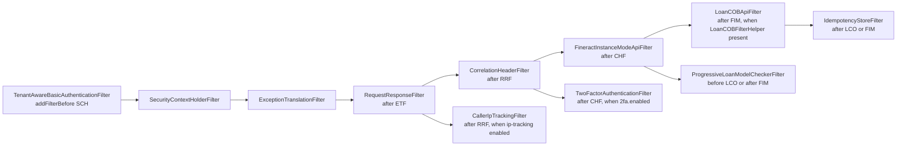

`fineract-provider/src/main/java/org/apache/fineract/infrastructure/core/config/SecurityConfig.java` declares the Spring Security `SecurityFilterChain` that protects `/api/**` when **HTTP Basic** authentication is enabled. Its sibling `SecurityValidationConfig` enforces the invariant that exactly one of `fineract.security.basicauth.enabled` or `fineract.security.oauth2.enabled` is true at boot. When OAuth2 is selected instead, `AuthorizationServerConfig` (see [/security/oauth2-authorization-server](/security/oauth2-authorization-server)) takes over and `SecurityConfig` is not even loaded.

This page annotates the `SecurityConfig` class and lists every behavioural switch it reads from `FineractProperties.Security`.

## Class-level annotations

```java
@Configuration
@ConditionalOnProperty("fineract.security.basicauth.enabled")
@EnableMethodSecurity
public class SecurityConfig {
```

- `@ConditionalOnProperty("fineract.security.basicauth.enabled")` — the entire bean is skipped when basic auth is disabled. The property must be **present and truthy**; the default in `application.properties` is `true`.
- `@EnableMethodSecurity` — enables `@PreAuthorize` / `@PostAuthorize` annotation processing. The platform uses path-based `authorizeHttpRequests` rules below, but this also picks up annotations on services.

`SecurityValidationConfig` complements this by failing fast at startup if both or neither auth schemes are enabled.

## SecurityValidationConfig

```java
@Configuration
public class SecurityValidationConfig {

    @Value("${fineract.security.basicauth.enabled}")
    private Boolean basicAuthEnabled;

    @Value("${fineract.security.oauth2.enabled}")
    private Boolean oauthEnabled;

    @PostConstruct
    public void validate() {
        if (!Boolean.TRUE.equals(basicAuthEnabled) && !Boolean.TRUE.equals(oauthEnabled)) {
            throw new IllegalArgumentException(
                "No authentication scheme selected. Please decide if you want to use basic OR OAuth2 authentication.");
        }
        if (basicAuthEnabled && oauthEnabled) {
            throw new IllegalArgumentException(
                "Too many authentication schemes selected. Please decide if you want to use basic OR OAuth2 authentication.");
        }
    }
}
```

The check happens in `@PostConstruct`, so misconfiguration produces an immediate boot failure rather than a confusing 401 cascade at runtime.

## The filter chain bean

The `filterChain(HttpSecurity http)` method is the heart of the basic-auth configuration. Strip away the (very long) list of per-resource authority rules and the skeleton is:

```java
http.securityMatcher(API_MATCHER.matcher("/api/**"))
    .authorizeHttpRequests(auth -> {
        // …large list of requestMatchers + hasAnyAuthority…
        auth.requestMatchers(API_MATCHER.matcher(HttpMethod.OPTIONS, "/api/**")).permitAll()
            .requestMatchers(API_MATCHER.matcher(HttpMethod.POST, "/api/*/echo")).permitAll()
            .requestMatchers(API_MATCHER.matcher(HttpMethod.POST, "/api/*/authentication")).permitAll()
            .requestMatchers(API_MATCHER.matcher(HttpMethod.PUT, "/api/*/instance-mode")).permitAll()
            …
            .requestMatchers(API_MATCHER.matcher("/api/**"))
            .access(allOf(authorizationManagers.toArray(new AuthorizationManager[0])));
    })
    .httpBasic(hb -> hb.authenticationEntryPoint(basicAuthenticationEntryPoint()))
    .csrf(AbstractHttpConfigurer::disable)
    .sessionManagement(smc -> smc.sessionCreationPolicy(SessionCreationPolicy.STATELESS))
    .addFilterBefore(tenantAwareBasicAuthenticationFilter(), SecurityContextHolderFilter.class)
    .addFilterAfter(requestResponseFilter(), ExceptionTranslationFilter.class)
    .addFilterAfter(correlationHeaderFilter(), RequestResponseFilter.class)
    .addFilterAfter(fineractInstanceModeApiFilter(), CorrelationHeaderFilter.class);
```

### Permit-listed endpoints

These are pre-authentication endpoints exempted from the authority checks:

| Method | Path | Why |
| --- | --- | --- |
| `OPTIONS` | `/api/**` | CORS preflight. |
| `POST` | `/api/*/echo` | Diagnostic ping. |
| `POST` | `/api/*/authentication` | Login itself — see [/security/authentication-api](/security/authentication-api). |
| `PUT` | `/api/*/instance-mode` | Switch read-only/write modes for ops. |

Every other `/api/**` request must satisfy the composed `AuthorizationManager`:

```java
List<AuthorizationManager<RequestAuthorizationContext>> authorizationManagers = new ArrayList<>();
authorizationManagers.add(fullyAuthenticated());

if (fineractProperties.getSecurity().getTwoFactor().isEnabled()) {
    authorizationManagers.add(hasAuthority("TWOFACTOR_AUTHENTICATED"));
}
```

When 2FA is on, the fallback `/api/**` matcher requires **both** "fully authenticated" and `TWOFACTOR_AUTHENTICATED`. The `TWOFACTOR_AUTHENTICATED` authority is granted by `TwoFactorAuthenticationFilter` once a valid `Fineract-Platform-TFA-Token` is presented (see [/security/two-factor-auth](/security/two-factor-auth)).

### Resource-specific authority rules

For every business resource (notes, documents, images, charts, staff, meetings, payment types, mix taxonomies, working days, etc.) the chain declares `requestMatchers(method, "/api/*/…")` and pins it to an authority triple of `ALL_FUNCTIONS`, `ALL_FUNCTIONS_READ` / `ALL_FUNCTIONS_WRITE`, and a specific permission. For example:

```java
// document: clients
.requestMatchers(API_MATCHER.matcher(HttpMethod.GET, "/api/*/clients/*/documents"))
    .hasAnyAuthority(ALL_FUNCTIONS, ALL_FUNCTIONS_READ, "READ_DOCUMENT")
.requestMatchers(API_MATCHER.matcher(HttpMethod.POST, "/api/*/clients/*/documents"))
    .hasAnyAuthority(ALL_FUNCTIONS, ALL_FUNCTIONS_WRITE, "CREATE_DOCUMENT")
```

This is **per-URL authorization** — the same authority is allowed by any of the wildcard "all functions" roles or by a fine-grained permission. The permissions themselves are seeded in `m_permission` and assigned through roles in [/users/overview](/users/overview).

The fallback line:

```java
.requestMatchers(API_MATCHER.matcher("/api/**"))
    .access(allOf(authorizationManagers.toArray(new AuthorizationManager[0])));
```

…ensures that any path **not** explicitly enumerated above is gated by the composed "fully authenticated [+ 2FA]" manager. JAX-RS resources that declare their own `@PreAuthorize`/permission checks rely on this fallback.

### Two-factor-only matchers

Two URLs need special handling because they must be reachable **before** the `TWOFACTOR_AUTHENTICATED` authority exists (otherwise the user could never obtain the OTP):

```java
.requestMatchers(API_MATCHER.matcher(HttpMethod.POST, "/api/*/twofactor/validate")).fullyAuthenticated()
.requestMatchers(API_MATCHER.matcher("/api/*/twofactor")).fullyAuthenticated()
```

These require a valid HTTP Basic principal but not yet the second factor.

## Session, CSRF, and HTTP Basic configuration

```java
.httpBasic(hb -> hb.authenticationEntryPoint(basicAuthenticationEntryPoint()))
.csrf(AbstractHttpConfigurer::disable)
.sessionManagement(smc -> smc.sessionCreationPolicy(SessionCreationPolicy.STATELESS))
```

- **HTTP Basic** is enabled with a custom entry point that sets the realm name. The Spring filter is replaced in chain order by `TenantAwareBasicAuthenticationFilter` (which extends `BasicAuthenticationFilter`).
- **CSRF is disabled** because the API is stateless and authenticated per-request via the `Authorization` header — there is no session cookie that could be CSRF'd. UIs using the API must handle their own CSRF.
- **`SessionCreationPolicy.STATELESS`** prevents Spring from creating an `HttpSession`. Every request must re-authenticate.

### The entry point and the auth provider

```java
@Bean
public BasicAuthenticationEntryPoint basicAuthenticationEntryPoint() {
    BasicAuthenticationEntryPoint basicAuthenticationEntryPoint = new BasicAuthenticationEntryPoint();
    basicAuthenticationEntryPoint.setRealmName("Fineract Platform API");
    return basicAuthenticationEntryPoint;
}

@Bean(name = "customAuthenticationProvider")
public DaoAuthenticationProvider authProvider() {
    DaoAuthenticationProvider authProvider = new DaoAuthenticationProvider();
    authProvider.setUserDetailsService(userDetailsService);
    authProvider.setPasswordEncoder(passwordEncoder());
    authProvider.setPostAuthenticationChecks(platformUserDetailsChecker);
    return authProvider;
}
```

The named bean `customAuthenticationProvider` is what `AuthenticationApiResource` injects directly to verify credentials on the explicit `/v1/authentication` endpoint. `platformUserDetailsChecker` is a `UserDetailsChecker` that runs **after** authentication to enforce account state (enabled/locked/expired).

### The password encoder

```java
@Bean
public PasswordEncoder passwordEncoder() {
    return PasswordEncoderFactories.createDelegatingPasswordEncoder();
}
```

`PasswordEncoderFactories.createDelegatingPasswordEncoder()` returns a `DelegatingPasswordEncoder` keyed on the `{bcrypt}`, `{noop}`, `{pbkdf2}`, etc. prefix in stored hashes. New passwords use BCrypt; legacy hashes are still verifiable. See [/security/password-encoding](/security/password-encoding) for details.

### The AuthenticationManager

```java
@Bean
public AuthenticationManager authenticationManagerBean() throws Exception {
    ProviderManager providerManager = new ProviderManager(authProvider());
    providerManager.setEraseCredentialsAfterAuthentication(false);
    return providerManager;
}
```

Credentials are **deliberately not erased** so that `TenantAwareBasicAuthenticationFilter.onSuccessfulAuthentication` can still see them long enough to set the `X-Notification-Refresh` header.

## Filter ordering

`SecurityConfig` slots Fineract's filters between Spring Security's standard ones. The relative order is:



The exact code:

```java
.addFilterBefore(tenantAwareBasicAuthenticationFilter(), SecurityContextHolderFilter.class)
.addFilterAfter(requestResponseFilter(), ExceptionTranslationFilter.class)
.addFilterAfter(correlationHeaderFilter(), RequestResponseFilter.class)
.addFilterAfter(fineractInstanceModeApiFilter(), CorrelationHeaderFilter.class);

if (loanCOBFilterHelper != null) {
    http.addFilterAfter(loanCOBApiFilter(), FineractInstanceModeApiFilter.class)
        .addFilterAfter(idempotencyStoreFilter(), LoanCOBApiFilter.class);
    http.addFilterBefore(progressiveLoanModelCheckerFilter, LoanCOBApiFilter.class);
} else {
    http.addFilterAfter(idempotencyStoreFilter(), FineractInstanceModeApiFilter.class);
    http.addFilterAfter(progressiveLoanModelCheckerFilter, FineractInstanceModeApiFilter.class);
}
if (fineractProperties.getIpTracking().isEnabled()) {
    http.addFilterAfter(callerIpTrackingFilter(), RequestResponseFilter.class);
}
if (fineractProperties.getSecurity().getTwoFactor().isEnabled()) {
    http.addFilterAfter(twoFactorAuthenticationFilter(), CorrelationHeaderFilter.class);
}
```

The Loan COB filter and idempotency filter are only added when their helper beans are available (i.e. when those features are enabled at the module level). This keeps the chain minimal in slimmed-down deployments.

## Channel security: SSL and HSTS

```java
if (serverProperties.getSsl().isEnabled()) {
    http.requiresChannel(channel -> channel.requestMatchers(API_MATCHER.matcher("/api/**")).requiresSecure());
}

if (fineractProperties.getSecurity().getHsts().isEnabled()) {
    http.requiresChannel(channel -> channel.anyRequest().requiresSecure())
        .headers(headers -> headers.httpStrictTransportSecurity(
            hsts -> hsts.includeSubDomains(true).maxAgeInSeconds(31536000)));
}
```

- When `server.ssl.enabled=true`, plain-HTTP `/api/**` requests are redirected to HTTPS.
- When `fineract.security.hsts.enabled=true`, **all** requests are forced to HTTPS **and** every response carries `Strict-Transport-Security: max-age=31536000; includeSubDomains`. See [/security/cors-and-hsts](/security/cors-and-hsts) for the full HSTS rationale and how to roll this out behind a load balancer that terminates TLS.

## CORS

```java
if (fineractProperties.getSecurity().getCors().isEnabled()) {
    http.cors(Customizer.withDefaults());
}
```

The `CorsConfigurationSource` bean below pulls allowed origins/methods/headers/exposed headers from `FineractProperties.CorsProperties`:

```java
@Bean
public CorsConfigurationSource corsConfigurationSource() {
    CorsConfiguration config = new CorsConfiguration();
    FineractProperties.CorsProperties corsConfiguration = fineractProperties.getSecurity().getCors();
    config.setAllowedOriginPatterns(corsConfiguration.getAllowedOriginPatterns());
    config.setAllowedMethods(corsConfiguration.getAllowedMethods());
    config.setAllowedHeaders(corsConfiguration.getAllowedHeaders());
    config.setExposedHeaders(corsConfiguration.getExposedHeaders());
    config.setAllowCredentials(corsConfiguration.isAllowCredentials());

    UrlBasedCorsConfigurationSource source = new UrlBasedCorsConfigurationSource();
    source.registerCorsConfiguration("/**", config);
    return source;
}
```

The defaults in `application.properties` allow everything (`*`) so dev environments work out of the box. Production deployments should pin the allow-list — see [/security/cors-and-hsts](/security/cors-and-hsts).

## The TenantAwareBasicAuthenticationFilter bean

```java
public TenantAwareBasicAuthenticationFilter tenantAwareBasicAuthenticationFilter() throws Exception {
    TenantAwareBasicAuthenticationFilter filter = new TenantAwareBasicAuthenticationFilter(
            authenticationManagerBean(),
            basicAuthenticationEntryPoint(),
            toApiJsonSerializer,
            configurationDomainService,
            cacheWritePlatformService,
            userNotificationService,
            basicAuthTenantDetailsService,
            businessDateReadPlatformService);

    filter.setRequestMatcher(API_MATCHER.matcher("/api/**"));
    return filter;
}
```

The filter is wired with everything it needs to resolve the tenant, write to the cache (for first-request bootstrap), look up business dates, and fetch unread-notification counts. The `setRequestMatcher` call ensures it only runs for `/api/**` even though `addFilterBefore(... , SecurityContextHolderFilter.class)` would otherwise apply it to every request. See [/security/basic-and-tenant-filters](/security/basic-and-tenant-filters) for the filter's internal logic.

## Property switches read by SecurityConfig

The class touches the following `FineractProperties` paths, each backed by an environment variable as declared in `application.properties`:

| Property | Env var | Default | Effect |
| --- | --- | --- | --- |
| `fineract.security.basicauth.enabled` | `FINERACT_SECURITY_BASICAUTH_ENABLED` | `true` | Whether to load `SecurityConfig` at all. |
| `fineract.security.oauth2.enabled` | `FINERACT_SECURITY_OAUTH_ENABLED` | `false` | Mutually exclusive with the above; loads `AuthorizationServerConfig` instead. |
| `fineract.security.2fa.enabled` | `FINERACT_SECURITY_2FA_ENABLED` | `false` | Adds `TwoFactorAuthenticationFilter`, requires `TWOFACTOR_AUTHENTICATED` for `/api/**`, and gates `/v1/twofactor*` and `/v1/twofactor/configure` resources via `@ConditionalOnProperty`. |
| `fineract.security.hsts.enabled` | `FINERACT_SECURITY_HSTS_ENABLED` | `false` | Forces HTTPS and emits HSTS. |
| `fineract.security.cors.enabled` | `FINERACT_SECURITY_CORS_ENABLED` | `true` | Wires `CorsFilter` into the chain via `http.cors(...)`. |
| `fineract.security.cors.allowed-origin-patterns` | `FINERACT_SECURITY_CORS_ALLOWED_ORIGIN_PATTERNS` | `*` | `CorsConfiguration.setAllowedOriginPatterns`. |
| `fineract.security.cors.allowed-methods` | `FINERACT_SECURITY_CORS_ALLOWED_METHODS` | `*` | `setAllowedMethods`. |
| `fineract.security.cors.allowed-headers` | `FINERACT_SECURITY_CORS_ALLOWED_HEADERS` | `*` | `setAllowedHeaders`. |
| `fineract.security.cors.exposed-headers` | `FINERACT_SECURITY_CORS_EXPOSED_HEADERS` | `*` | `setExposedHeaders`. |
| `fineract.security.cors.allow-credentials` | `FINERACT_SECURITY_CORS_ALLOW_CREDENTIALS` | `true` | `setAllowCredentials`. |
| `fineract.ip-tracking.enabled` | `FINERACT_CLIENT_IP_TRACKING_ENABLED` | `false` | Adds `CallerIpTrackingFilter`. |
| `server.ssl.enabled` | (Spring Boot) | `false` | If on, `/api/**` requires HTTPS. |

<Tip>
Override these at deploy time via environment variables. The whole `${VAR:default}` chain in `application.properties` means you usually don't need a custom config file — set `FINERACT_SECURITY_OAUTH_ENABLED=true` and `FINERACT_SECURITY_BASICAUTH_ENABLED=false` to flip the authentication stack.
</Tip>

## What this config does **not** do

- It does not perform tenant routing — `TenantAwareBasicAuthenticationFilter` does that. See [/security/basic-and-tenant-filters](/security/basic-and-tenant-filters).
- It does not configure JWT decoding or the `oauth2ResourceServer()` — that lives in `AuthorizationServerConfig` and only loads when `fineract.security.oauth2.enabled=true`. See [/security/oauth2-authorization-server](/security/oauth2-authorization-server).
- It does not seed permissions or roles — those come from Liquibase migrations and the role administration APIs in [/users/overview](/users/overview).
- It does not check password expiration on every request — `SpringSecurityPlatformSecurityContext.authenticatedUser()` does that lazily when the caller is fetched.

## Related pages

- [Basic and tenant filters](/security/basic-and-tenant-filters)
- [OAuth2 authorization server](/security/oauth2-authorization-server)
- [Two-factor authentication](/security/two-factor-auth)
- [CORS and HSTS](/security/cors-and-hsts)
- [Configuration overview](/config/overview)
