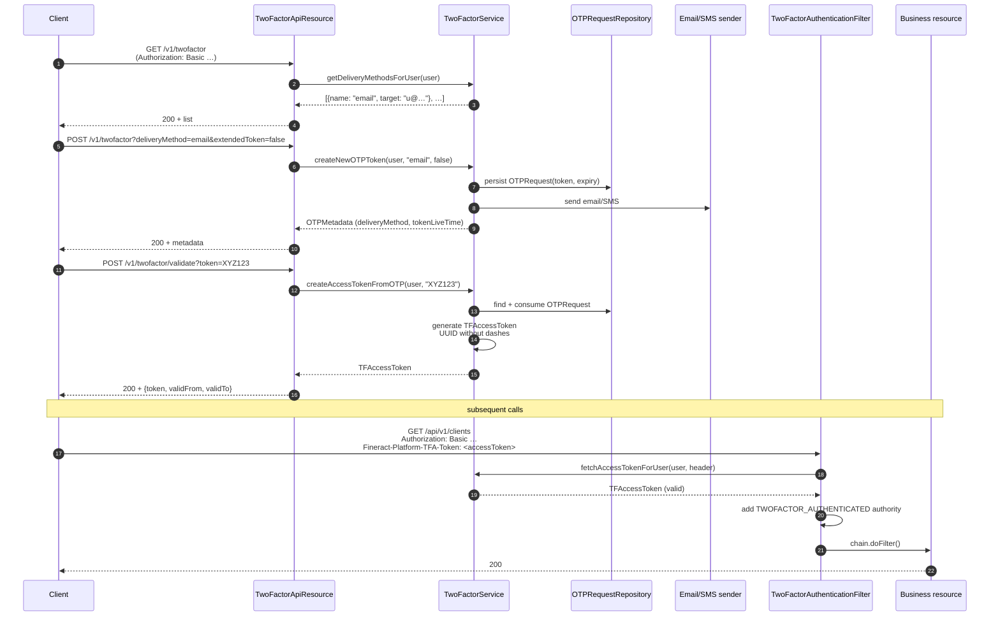

When `fineract.security.2fa.enabled=true`, every authenticated `/api/**` request must additionally carry a valid `Fineract-Platform-TFA-Token` header (or be issued to a user with the `BYPASS_TWOFACTOR` permission). Two-factor authentication in Fineract is **OTP-based**: a one-time password is issued to the user via SMS or email, exchanged for a short-lived access token, and presented on every subsequent API call until the token expires.

This page covers the moving parts: the `TwoFactorAuthenticationFilter` that gates `/api/**`, the `TwoFactorService` that drives the OTP lifecycle, the `TwoFactorConfigurationService` that exposes tenant-level knobs, and the JAX-RS endpoints in `TwoFactorApiResource` / `TwoFactorConfigurationApiResource`.

## Activation

| Property | Default | Effect |
| --- | --- | --- |
| `fineract.security.2fa.enabled` | `false` | Loads the filter, the two `*ApiResource` beans, and inserts `TWOFACTOR_AUTHENTICATED` into the `/api/**` authorization requirements. |

When the flag is `false`, the filter and the resources are skipped via `@ConditionalOnProperty`, and `SecurityConfig` / `AuthorizationServerConfig` do not add the `hasAuthority("TWOFACTOR_AUTHENTICATED")` requirement.

## OTP flow



## TwoFactorAuthenticationFilter

`fineract-security/.../filter/TwoFactorAuthenticationFilter.java`. Slotted into both `SecurityConfig` and `AuthorizationServerConfig` after `CorrelationHeaderFilter`:

```java
@RequiredArgsConstructor
public class TwoFactorAuthenticationFilter extends GenericFilterBean {

    private final TwoFactorService twoFactorService;

    @Override
    public void doFilter(ServletRequest req, ServletResponse res, FilterChain chain)
            throws IOException, ServletException {

        final HttpServletRequest request = (HttpServletRequest) req;
        final HttpServletResponse response = (HttpServletResponse) res;

        SecurityContext context = SecurityContextHolder.getContext();
        Authentication authentication = (context != null) ? context.getAuthentication() : null;

        if (authentication != null && authentication.isAuthenticated()
                && authentication.getPrincipal() instanceof AppUser) {
            AppUser user = (AppUser) authentication.getPrincipal();
            if (user == null) return;

            if (!user.hasSpecificPermissionTo(TwoFactorConstants.BYPASS_TWO_FACTOR_PERMISSION)) {
                String token = request.getHeader("Fineract-Platform-TFA-Token");
                if (token != null) {
                    TFAccessToken accessToken = twoFactorService.fetchAccessTokenForUser(user, token);
                    if (accessToken == null || !accessToken.isValid()) {
                        response.addHeader("WWW-Authenticate",
                                "Basic realm=\"Fineract Platform API Two Factor\"");
                        response.sendError(HttpServletResponse.SC_UNAUTHORIZED,
                                "Invalid two-factor access token provided");
                        return;
                    }
                } else {
                    chain.doFilter(req, res);
                    return;
                }
            }

            List<GrantedAuthority> updatedAuthorities = new ArrayList<>(authentication.getAuthorities());
            updatedAuthorities.add(new SimpleGrantedAuthority("TWOFACTOR_AUTHENTICATED"));
            context.setAuthentication(createUpdatedAuthentication(authentication, updatedAuthorities));
        }
        chain.doFilter(req, res);
    }
```

Behaviour summary:

1. **No authentication yet** → pass through. The `authorizeHttpRequests` rules will deny the request later because the `TWOFACTOR_AUTHENTICATED` authority is absent.
2. **`BYPASS_TWOFACTOR` permission** → unconditionally grant `TWOFACTOR_AUTHENTICATED`. Useful for service accounts and tenant admins who can't realistically receive OTPs.
3. **Header present** → resolve via `TwoFactorService.fetchAccessTokenForUser`. If the token is missing or expired, return **401** with a `WWW-Authenticate: Basic realm="Fineract Platform API Two Factor"` header (which distinguishes a 2FA failure from a basic-auth failure on the client).
4. **Header missing** → pass through *without* the extra authority. The downstream authorization rule then denies the request unless it's one of the always-allowed paths (e.g. `/api/*/twofactor*`).
5. **Authority injection** — the existing `Authentication` is replaced with a new one carrying `TWOFACTOR_AUTHENTICATED`. The replacement strategy depends on the auth type:

```java
private Authentication createUpdatedAuthentication(Authentication currentAuthentication,
        List<GrantedAuthority> updatedAuthorities) throws ServletException {
    if (currentAuthentication instanceof UsernamePasswordAuthenticationToken) {
        return new UsernamePasswordAuthenticationToken(
                currentAuthentication.getPrincipal(),
                currentAuthentication.getCredentials(),
                updatedAuthorities);
    } else if (currentAuthentication instanceof FineractJwtAuthenticationToken jwtAuth) {
        return new FineractJwtAuthenticationToken(
                jwtAuth.getToken(),
                updatedAuthorities,
                (UserDetails) currentAuthentication.getPrincipal());
    } else {
        throw new ServletException("Unknown authentication type: "
                + currentAuthentication.getClass().getName());
    }
}
```

This is the only place in the codebase that knowingly mutates an authority list mid-chain — both basic-auth and JWT code paths are supported.

## Why `/v1/twofactor` is special-cased in SecurityConfig

The `/v1/twofactor*` endpoints must be reachable **before** the user has obtained the second factor; otherwise the user can never bootstrap it. `SecurityConfig` declares:

```java
.requestMatchers(API_MATCHER.matcher(HttpMethod.POST, "/api/*/twofactor/validate")).fullyAuthenticated()
.requestMatchers(API_MATCHER.matcher("/api/*/twofactor")).fullyAuthenticated()
```

The composed `allOf(fullyAuthenticated(), hasAuthority("TWOFACTOR_AUTHENTICATED"))` rule does **not** apply to these matchers — only base authentication is required.

## TwoFactorApiResource — endpoints

`fineract-security/.../api/TwoFactorApiResource.java`. Mounted at `/v1/twofactor` and loaded when `fineract.security.2fa.enabled=true`.

| Method | Path | Handler | Returns |
| --- | --- | --- | --- |
| `GET` | `/v1/twofactor` | `getOTPDeliveryMethods` | `List<OTPDeliveryMethod>` (which channels are configured and applicable to the user). |
| `POST` | `/v1/twofactor?deliveryMethod=…&extendedToken=…` | `requestToken` | `OTPMetadata` (channel name, target hint, expiry). |
| `POST` | `/v1/twofactor/validate?token=…` | `validate` | `AccessTokenData` (the token to be sent in `Fineract-Platform-TFA-Token`). |
| `POST` | `/v1/twofactor/invalidate` | `updateConfiguration` (invalidate handler) | `CommandProcessingResult`. |

Snippet:

```java
@GET
@Produces(MediaType.APPLICATION_JSON)
public String getOTPDeliveryMethods(@Context UriInfo uriInfo) {
    AppUser user = context.authenticatedUser();
    List<OTPDeliveryMethod> otpDeliveryMethods = twoFactorService.getDeliveryMethodsForUser(user);
    return this.otpDeliveryMethodSerializer.serialize(otpDeliveryMethods);
}

@POST
@Produces(MediaType.APPLICATION_JSON)
public String requestToken(@QueryParam("deliveryMethod") final String deliveryMethod,
        @QueryParam("extendedToken") @DefaultValue("false") boolean extendedAccessToken,
        @Context UriInfo uriInfo) {
    final AppUser user = context.authenticatedUser();
    final OTPRequest request = twoFactorService.createNewOTPToken(user, deliveryMethod, extendedAccessToken);
    return this.otpRequestSerializer.serialize(request.getMetadata());
}

@Path("validate")
@POST
@Produces(MediaType.APPLICATION_JSON)
public String validate(@QueryParam("token") final String token) {
    final AppUser user = context.authenticatedUser();
    TFAccessToken accessToken = twoFactorService.createAccessTokenFromOTP(user, token);
    return accessTokenSerializer.serialize(accessToken.toTokenData());
}

@Path("invalidate")
@POST
@Produces(MediaType.APPLICATION_JSON)
public String updateConfiguration(final String apiRequestBodyAsJson) {
    final CommandWrapper commandRequest = new CommandWrapperBuilder()
            .invalidateTwoFactorAccessToken().withJson(apiRequestBodyAsJson).build();
    final CommandProcessingResult result = this.commandsSourceWritePlatformService.logCommandSource(commandRequest);
    return this.toApiJsonSerializer.serialize(result);
}
```

### Extended tokens

`extendedToken=true` swaps the standard `getAccessTokenLiveTime()` window for `getAccessTokenExtendedLiveTime()` — useful for "remember this device" semantics. Both are minutes-valued integers stored in `c_configuration`.

### Invalidate

The `invalidate` endpoint goes through `PortfolioCommandSourceWritePlatformService`, recording a `CommandSource` row and dispatching to `InvalidateTFAccessTokenCommandHandler` (in `fineract-security/.../command/`). This means token invalidations show up in the audit log and are subject to the normal command-source maker/checker pipeline.

## TwoFactorConfigurationApiResource — endpoints

```java
@Path("/v1/twofactor/configure")
@Consumes(MediaType.APPLICATION_JSON)
@Produces(MediaType.APPLICATION_JSON)
@Component
@ConditionalOnProperty("fineract.security.2fa.enabled")
@RequiredArgsConstructor
public class TwoFactorConfigurationApiResource {

    private static final String RESOURCE_NAME_FOR_PERMISSIONS = "TWOFACTOR_CONFIG";
    …

    @GET
    public String retrieveAll() {
        this.context.authenticatedUser().validateHasReadPermission(RESOURCE_NAME_FOR_PERMISSIONS);
        Map<String, Object> configurationMap = configurationService.retrieveAll();
        return toApiJsonSerializer.serialize(configurationMap);
    }

    @PUT
    public String updateConfiguration(final String apiRequestBodyAsJson) {
        final CommandWrapper commandRequest = new CommandWrapperBuilder()
                .updateTwoFactorConfiguration().withJson(apiRequestBodyAsJson).build();
        final CommandProcessingResult result = this.commandsSourceWritePlatformService.logCommandSource(commandRequest);
        return this.toApiJsonSerializer.serialize(result);
    }
}
```

| Method | Path | Handler | Auth |
| --- | --- | --- | --- |
| `GET` | `/v1/twofactor/configure` | `retrieveAll` | `READ_TWOFACTOR_CONFIG` permission. |
| `PUT` | `/v1/twofactor/configure` | `updateConfiguration` | Dispatched as command — `UPDATE_TWOFACTOR_CONFIG` permission. |

The `PUT` payload accepts the keys defined in `TwoFactorConfigurationConstants`:

| Key | Type | Meaning |
| --- | --- | --- |
| `otp-delivery-email-enable` | boolean | Allow email OTPs. |
| `otp-delivery-email-subject` | string | Email subject template. |
| `otp-delivery-email-body` | string | Email body template. |
| `otp-delivery-sms-enable` | boolean | Allow SMS OTPs. |
| `otp-delivery-sms-provider` | number | `m_sms_campaign` provider id. |
| `otp-delivery-sms-text` | string | SMS body template. |
| `otp-token-live-time` | number | Seconds the OTP remains valid. |
| `otp-token-length` | number | Length of generated OTP. |
| `access-token-live-time` | number | Seconds the TFAccessToken remains valid. |
| `access-token-live-time-extended` | number | Seconds when `extendedToken=true` is requested. |

```java
public static final Set<String> REQUEST_DATA_PARAMETERS = Collections.unmodifiableSet(new HashSet<>(Arrays.asList(
    ENABLE_EMAIL_DELIVERY, EMAIL_SUBJECT, EMAIL_BODY,
    ENABLE_SMS_DELIVERY, SMS_PROVIDER_ID, SMS_MESSAGE_TEXT,
    OTP_TOKEN_LIVE_TIME, OTP_TOKEN_LENGTH,
    ACCESS_TOKEN_LIVE_TIME, ACCESS_TOKEN_LIVE_TIME_EXTENDED)));
```

`TwoFactorConfigurationValidator` (in `fineract-security/.../data`) enforces type expectations on the JSON.

## TwoFactorService interface

`fineract-security/.../service/TwoFactorService.java`:

```java
public interface TwoFactorService {

    List<OTPDeliveryMethod> getDeliveryMethodsForUser(AppUser user);

    OTPRequest createNewOTPToken(AppUser user, String deliveryMethodName, boolean extendedAccessToken);

    TFAccessToken createAccessTokenFromOTP(AppUser user, String otpToken);

    void validateTwoFactorAccessToken(AppUser user, String token);

    TFAccessToken fetchAccessTokenForUser(AppUser user, String token);

    TFAccessToken invalidateAccessToken(AppUser user, JsonCommand command);
}
```

Method responsibilities:

| Method | Behaviour |
| --- | --- |
| `getDeliveryMethodsForUser` | Returns delivery methods enabled tenant-wide **and** available to the user (email present, mobile number present). Empty list → user cannot use 2FA. |
| `createNewOTPToken` | Calls `RandomOTPGenerator.generate()`, persists an `OTPRequest`, dispatches to SMS/email, returns `OTPMetadata` (no raw token). |
| `createAccessTokenFromOTP` | Validates OTP, computes validity window from configuration, allocates a UUID-derived token via `UUIDAccessTokenGenerationService`, persists `TFAccessToken`. |
| `validateTwoFactorAccessToken` | Throws `AccessTokenInvalidIException` if token is missing/expired/disabled — used in places that need imperative checks rather than filter-driven ones. |
| `fetchAccessTokenForUser` | Repository lookup with no side effects. Used by `TwoFactorAuthenticationFilter` per request. |
| `invalidateAccessToken` | Command-handler path: flips `enabled=false` so subsequent `fetchAccessTokenForUser` returns "invalid". |

### RandomOTPGenerator

```java
public class RandomOTPGenerator {
    private static final String allowedCharacters = "0123456789ABCDEFGHIJKLMNOPQRSTUVQXYZ";
    private final int tokenLength;
    private final SecureRandom secureRandom = new SecureRandom();

    public RandomOTPGenerator(int tokenLength) { this.tokenLength = tokenLength; }

    public String generate() {
        StringBuilder builder = new StringBuilder();
        for (int i = 0; i < tokenLength; i++) {
            builder.append(allowedCharacters.charAt(
                (int) (secureRandom.nextDouble() * allowedCharacters.length())));
        }
        return builder.toString();
    }
}
```

A few observations:

- Alphabet is 36 characters, uppercase + digits (notice the dataset error: `…UVQXYZ` — `W` is missing and `Q` is duplicated — a long-standing quirk; the entropy is unaffected enough not to matter for short-lived OTPs).
- Token length is per-call so it can be driven by `otp-token-length`.
- `SecureRandom` is the cryptographic choice; do not swap for `Random`.

### UUIDAccessTokenGenerationService

```java
@Service
public class UUIDAccessTokenGenerationService implements AccessTokenGenerationService {
    @Override
    public String generateRandomToken() {
        return UUID.randomUUID().toString().replaceAll("-", "");
    }
}
```

A 32-character hexadecimal string. The fixed `length=32` column on `TFAccessToken.token` matches exactly.

### TFAccessToken entity

```java
@Entity
@Table(name = "twofactor_access_token", uniqueConstraints = {
    @UniqueConstraint(columnNames = {"token", "appuser_id"}, name = "token_appuser_UNIQUE")})
public class TFAccessToken extends AbstractPersistableCustom<Long> {

    @Column(name = "token", nullable = false, length = 32)
    private String token;

    @ManyToOne @JoinColumn(name = "appuser_id", nullable = false)
    private AppUser user;

    @Column(name = "valid_from", nullable = false)
    private LocalDateTime validFrom;

    @Column(name = "valid_to", nullable = false)
    private LocalDateTime validTo;

    @Column(name = "enabled", nullable = false)
    private boolean enabled;
}
```

A row is **valid** when `enabled=true`, `validFrom <= now <= validTo`. `isValid()` (defined in the entity) encapsulates this — the filter never duplicates the check.

## TwoFactorConfigurationService interface

```java
public interface TwoFactorConfigurationService {

    Map<String, Object> retrieveAll();

    boolean isSMSEnabled();
    Integer getSMSProviderId();
    String getSmsText();

    boolean isEmailEnabled();
    String getEmailSubject();
    String getEmailBody();

    String getFormattedEmailSubjectFor(AppUser user, OTPRequest request);
    String getFormattedEmailBodyFor(AppUser user, OTPRequest request);
    String getFormattedSmsTextFor(AppUser user, OTPRequest request);

    Integer getOTPTokenLength();
    Integer getOTPTokenLiveTime();
    Integer getAccessTokenLiveTime();
    Integer getAccessTokenExtendedLiveTime();

    Map<String, Object> update(JsonCommand command);
}
```

The `getFormatted*For` methods perform template substitution against `{user}`, `{token}`, etc. — so admins can include the OTP and the recipient's name in messages.

## Failure modes

| Symptom | Cause | Where |
| --- | --- | --- |
| 401 with `WWW-Authenticate: Basic realm="Fineract Platform API Two Factor"` | Header `Fineract-Platform-TFA-Token` present but invalid/expired. | `TwoFactorAuthenticationFilter`. |
| 403 Forbidden on `/api/**` after basic auth succeeds | No TFA token header presented and user lacks `BYPASS_TWOFACTOR`. | `authorizeHttpRequests` rule denies because `TWOFACTOR_AUTHENTICATED` missing. |
| `OTPTokenInvalidException` on `/v1/twofactor/validate` | OTP doesn't match the persisted `OTPRequest` (typo or expired). | `TwoFactorService.createAccessTokenFromOTP`. |
| `OTPDeliveryMethodInvalidException` on `POST /v1/twofactor` | Requested method is disabled for the tenant or the user has no email/mobile. | `TwoFactorService.createNewOTPToken`. |

## Bypass permission

```java
public static final String BYPASS_TWO_FACTOR_PERMISSION = "BYPASS_TWOFACTOR";
```

Any role granting `BYPASS_TWOFACTOR` will:

1. Cause `TwoFactorAuthenticationFilter` to skip OTP validation and unconditionally grant `TWOFACTOR_AUTHENTICATED`.
2. Be reflected in the `isTwoFactorAuthenticationRequired` flag returned by `AuthenticationApiResource` / `UserDetailsApiResource`.

This is the supported escape hatch for system integration accounts that authenticate via headless basic auth and cannot receive an OTP. Grant sparingly.

## Test harness

The `twofactor-tests/` subproject under the repository root contains integration tests that boot Fineract with `FINERACT_SECURITY_2FA_ENABLED=true`, configure email/SMS delivery, and walk the OTP-to-access-token exchange end to end. Use those fixtures as reference clients.

## Related pages

- [Security configuration](/security/security-config)
- [Authentication API](/security/authentication-api)
- [User details API](/security/user-details-api)
- [User administration overview](/users/overview)
