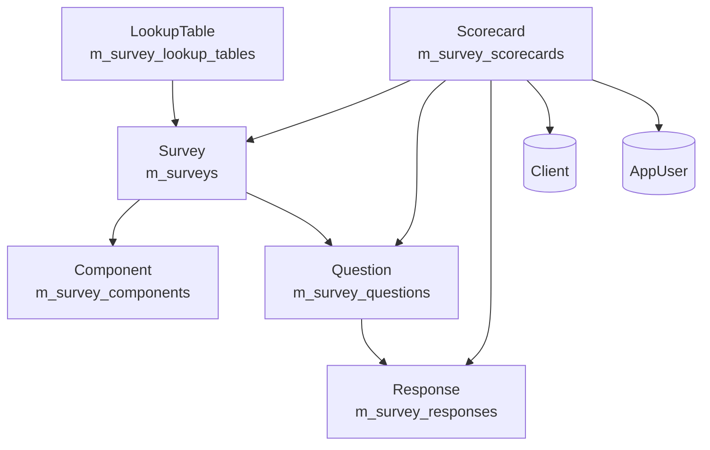

Fineract ships two cooperating subsystems for collecting client-level
social-performance data. The newer `org.apache.fineract.spm` package (under
`fineract-provider`) implements a generic survey/questionnaire engine with
strongly typed JPA entities, while the older
`org.apache.fineract.infrastructure.survey` package implements the
**Progress out of Poverty Index (PPI)** workflow on top of dynamic
`x_registered_table` datatables. Together they make up the SPM module mapped
on this page, and both are exposed under `/v1/surveys`, `/v1/survey`,
`/v1/likelihood`, and `/v1/povertyLine` paths in the JAX-RS layer.

## Package layout

| Package | Module | Purpose |
| --- | --- | --- |
| `org.apache.fineract.spm.api` | provider | JAX-RS endpoints for surveys, scorecards, lookup tables |
| `org.apache.fineract.spm.domain` | provider | JPA entities: `Survey`, `Component`, `Question`, `Response`, `Scorecard`, `LookupTable` |
| `org.apache.fineract.spm.data` | provider | DTOs used in/out of the API resources |
| `org.apache.fineract.spm.service` | provider | `SpmService`, `ScorecardService`, `ScorecardReadPlatformService`, `LookupTableService` |
| `org.apache.fineract.spm.util` | provider | `SurveyMapper`, `ScorecardMapper`, `LookupTableMapper` |
| `org.apache.fineract.spm.exception` | provider | Module-specific exceptions (`SurveyNotFoundException`, `LookupTableNotFoundException`) |
| `org.apache.fineract.infrastructure.survey.api` | provider | `SurveyApiResource`, `LikelihoodApiResource`, `PovertyLineApiResource` (PPI datatable approach) |
| `org.apache.fineract.infrastructure.survey.domain` | provider | `Likelihood` entity (`ppi_likelihoods_ppi`) |
| `org.apache.fineract.infrastructure.survey.data` | provider | `LikelihoodData`, `PovertyLineData`, `PpiPovertyLineData`, `LikeliHoodPovertyLineData`, `ClientScoresOverview`, `SurveyDataTableData`, `LikelihoodDataValidator` |
| `org.apache.fineract.infrastructure.survey.service` | provider | `ReadSurveyService`, `WriteSurveyService`, `PovertyLineService`, `ReadLikelihoodService`, `WriteLikelihoodService` |
| `org.apache.fineract.infrastructure.survey.handler` | provider | `UpdateLikelihoodCommandHandler` |

## Two SPM implementations side-by-side

The two implementations exist for historical reasons and target different use
cases:

| Aspect | `spm.*` (Survey/Scorecard) | `infrastructure.survey.*` (PPI) |
| --- | --- | --- |
| Storage | Strongly typed JPA tables `m_surveys`, `m_survey_components`, `m_survey_questions`, `m_survey_responses`, `m_survey_scorecards`, `m_survey_lookup_tables` | Dynamic datatables registered via `x_registered_table` with category = `CATEGORY_PPI` |
| Survey creation | `POST /v1/surveys` with full `SurveyData` payload | `PUT /v1/survey/register/{surveyName}/{apptable}` registers an existing datatable |
| Scoring | Each response carries an `Integer` value; aggregated client-side or via `ScorecardReadPlatformService` | Built-in poverty-line lookup against `ppi_scores`, `ppi_poverty_line`, `ppi_likelihoods`, `ppi_likelihoods_ppi` |
| Country/cohort | Per-survey `country_code` and validity dates | Per-PPI `Likelihood` rows that can be enabled/disabled |
| Primary clients | Custom SPM forms, MFI questionnaires | Microfinance PPI assessments via standard PPI tables |

Both implementations may be active simultaneously in the same tenant; they do
not share tables. Permission-wise both are governed by
`SurveyApiConstants.SURVEY_RESOURCE_NAME = "Survey"` for the PPI implementation
and by general `authenticatedUser()` checks for the `spm.*` package.

## Survey/Scorecard entity model (typed JPA)



A survey owns a list of `Component` groupings and a list of `Question`s;
each question owns a list of valid `Response`s. A `Scorecard` records one
client's answer to one question for a given survey, attributed to the
`AppUser` who captured it. `LookupTable` rows encode `[validFrom, validTo]`
integer ranges that map total scores to a label/score (`Double`).

See [Survey API & entities](/surveys/survey-api) for the full schema and the
full JAX-RS surface, and [SPM Scorecards](/surveys/spm-scorecards) for
scoring details.

## PPI datatable model

The PPI side relies on dynamic datatables. A survey is just a datatable
registered with the `CATEGORY_PPI` category in `x_registered_table` and joined
to four fixed PPI tables:

| Table | Purpose |
| --- | --- |
| `ppi_likelihoods` | Catalogue of likelihood labels (name + code) |
| `ppi_likelihoods_ppi` | Per-PPI binding of a likelihood (with `enabled` flag) |
| `ppi_scores` | Score ranges (`score_from`, `score_to`) for a PPI |
| `ppi_poverty_line` | Poverty line value per `(likelihood_ppi, score)` |

`ReadSurveyServiceImpl.retrieveClientSurveyScoreOverview` joins the registered
PPI datatable to these tables to produce `ClientScoresOverview` records:

```java
// from ReadSurveyServiceImpl
"SELECT  tz.id, lkh.name, lkh.code, poverty_line, tz.date, tz.score FROM ? tz"
    + " JOIN ppi_likelihoods_ppi lkp on lkp.ppi_name = ? AND enabled = ? "
    + " JOIN ppi_scores sc on score_from  <= tz.score AND score_to >=tz.score"
    + " JOIN ppi_poverty_line pvl on pvl.likelihood_ppi_id = lkp.id AND pvl.score_id = sc.id"
    + " JOIN ppi_likelihoods lkh on lkh.id = lkp.likelihood_id "
    + " WHERE  client_id = ? "
```

See [Survey API](/surveys/survey-api), [Likelihood API](/surveys/likelihood-api),
and [Poverty Line API](/surveys/poverty-line-api) for the specific endpoints.

## REST endpoint map

| Resource | Method | Path | Implementation |
| --- | --- | --- | --- |
| `SpmApiResource` | `GET` | `/v1/surveys` | List surveys (filter `isActive=true`) |
| `SpmApiResource` | `GET` | `/v1/surveys/{id}` | Retrieve one survey |
| `SpmApiResource` | `POST` | `/v1/surveys` | Create survey |
| `SpmApiResource` | `PUT` | `/v1/surveys/{id}` | Update survey |
| `SpmApiResource` | `POST` | `/v1/surveys/{id}?command=activate\|deactivate` | Toggle activation |
| `ScorecardApiResource` | `GET` | `/v1/surveys/scorecards/{surveyId}` | List entries for a survey |
| `ScorecardApiResource` | `POST` | `/v1/surveys/scorecards/{surveyId}` | Add scorecard entry |
| `ScorecardApiResource` | `GET` | `/v1/surveys/scorecards/{surveyId}/clients/{clientId}` | Per client+survey |
| `ScorecardApiResource` | `GET` | `/v1/surveys/scorecards/clients/{clientId}` | All scorecards for client |
| `LookupTableApiResource` | `GET` | `/v1/surveys/{surveyId}/lookuptables` | Lookup table entries |
| `LookupTableApiResource` | `GET` | `/v1/surveys/{surveyId}/lookuptables/{key}` | One lookup table key |
| `LookupTableApiResource` | `POST` | `/v1/surveys/{surveyId}/lookuptables` | Create lookup table entry |
| `SurveyApiResource` | `GET` | `/v1/survey` | List PPI datatables |
| `SurveyApiResource` | `GET` | `/v1/survey/{surveyName}` | Retrieve PPI datatable definition |
| `SurveyApiResource` | `POST` | `/v1/survey/{surveyName}/{apptableId}` | Fulfill survey (insert entry) |
| `SurveyApiResource` | `GET` | `/v1/survey/{surveyName}/{clientId}` | Client overview |
| `SurveyApiResource` | `GET` | `/v1/survey/{surveyName}/{clientId}/{entryId}` | Single entry |
| `SurveyApiResource` | `PUT` | `/v1/survey/register/{surveyName}/{apptable}` | Register survey datatable |
| `SurveyApiResource` | `DELETE` | `/v1/survey/{surveyName}/{clientId}/{fulfilledId}` | Delete survey entry |
| `LikelihoodApiResource` | `GET` | `/v1/likelihood/{ppiName}` | List PPI likelihoods |
| `LikelihoodApiResource` | `GET` | `/v1/likelihood/{ppiName}/{likelihoodId}` | One likelihood |
| `LikelihoodApiResource` | `PUT` | `/v1/likelihood/{ppiName}/{likelihoodId}` | Update (enable/disable) |
| `PovertyLineApiResource` | `GET` | `/v1/povertyLine/{ppiName}` | Poverty lines per PPI |
| `PovertyLineApiResource` | `GET` | `/v1/povertyLine/{ppiName}/{likelihoodId}` | Poverty lines for one likelihood |

## Command flow vs direct service flow

The two implementations route writes very differently. `SpmApiResource` and
`ScorecardApiResource` call domain services **directly** (no `CommandWrapper`)
because they predate the maker-checker framework integration for SPM:

```java
// SpmApiResource.createSurvey
final Survey survey = SurveyMapper.map(surveyData, new Survey());
this.spmService.createSurvey(survey);
return getResponse(survey.getId());
```

`LikelihoodApiResource.update`, by contrast, wraps the call in a
`CommandWrapper` so it participates in [the command pipeline](/command/overview)
and may be approved via maker-checker:

```java
final CommandWrapper commandRequest = new CommandWrapperBuilder() //
        .updateLikelihood(likelihoodId) //
        .withJson(apiRequestBodyAsJson) //
        .build();

final CommandProcessingResult result =
        this.commandsSourceWritePlatformService.logCommandSource(commandRequest);
```

The handler `UpdateLikelihoodCommandHandler` in
`org.apache.fineract.infrastructure.survey.handler` resolves the action key
defined in the `CommandWrapperBuilder`.

## Domain integrations

| Used by SPM | Source |
| --- | --- |
| `Client` | `org.apache.fineract.portfolio.client.domain.ClientRepositoryWrapper` — see [Portfolio shared domain](/core/portfolio-shared-domain) |
| `AppUser` | `org.apache.fineract.useradministration.domain.AppUser` — see [User administration domain](/core/useradministration-domain) |
| `JsonCommand` | `org.apache.fineract.infrastructure.core.api.JsonCommand` used to materialize `Likelihood` updates |
| `DefaultToApiJsonSerializer` | Standard JSON envelope serializer |
| `PlatformSecurityContext` | Authentication and read-permission checks |

The `Scorecard` entity directly references `Client` and `AppUser`, anchoring
each captured response to the surveyor and the surveyed client:

```java
@ManyToOne(fetch = FetchType.LAZY)
@JoinColumn(name = "user_id")
private AppUser appUser;

@ManyToOne(fetch = FetchType.LAZY)
@JoinColumn(name = "client_id")
private Client client;
```

## Security and permissions

| Resource | Permission key |
| --- | --- |
| `SurveyApiResource` | `READ_Survey`, `ALL_FUNCTIONS`, `ALL_FUNCTIONS_READ`, or `READ_{registered_table_name}` |
| `LikelihoodApiResource` | `READ_PovertyLine` (uses `PovertyLineApiConstants.POVERTY_LINE_RESOURCE_NAME`) |
| `PovertyLineApiResource` | `READ_PovertyLine` |
| `SpmApiResource` / `ScorecardApiResource` / `LookupTableApiResource` | Only `securityContext.authenticatedUser()` |

The SQL in `ReadSurveyServiceImpl.retrieveAllSurveys` enforces datatable-level
permissions by joining on `m_appuser_role`, `m_role`, `m_role_permission`, and
`m_permission`.

## Where to go next

- [Survey API](/surveys/survey-api) — `SurveyApiResource`, `Survey`, `Question`,
  `Response` schemas
- [Likelihood API](/surveys/likelihood-api) — PPI likelihoods, enable/disable
- [Poverty Line API](/surveys/poverty-line-api) — `PovertyLineData`,
  `LikeliHoodPovertyLineData`, PPI score bands
- [SPM Scorecards](/surveys/spm-scorecards) — `Scorecard`, `LookupTable`, PPI
  scoring formulas
- [`/api/surveys-and-spm-apis`](/api/surveys) — public API
  reference
- [Commands framework](/command/overview) — write path used by
  `LikelihoodApiResource`
