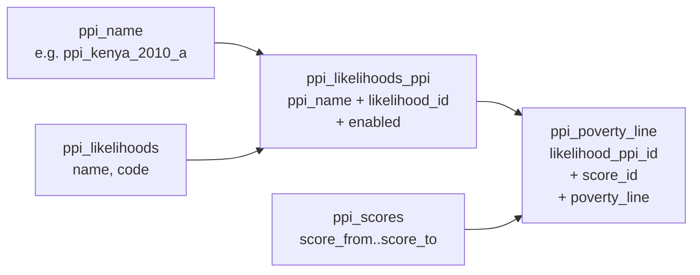

The Poverty Line API serves precomputed poverty-likelihood values for a
**Progress out of Poverty Index (PPI)** survey. Each PPI has multiple
*likelihoods* (calibration models), and each likelihood has a series of
score bands — typically 0–4, 5–9, 10–14, … 95–100 — that map a raw survey
score to a poverty likelihood percentage. The REST surface is implemented in
`org.apache.fineract.infrastructure.survey.api.PovertyLineApiResource` under
the path `/v1/povertyLine`, part of the `fineract-provider` module.

> Note: this codebase does not include an `OfficePovertyLine` entity or
> office-scoped poverty-line override table. Poverty-line values are global
> per (PPI, likelihood, score band). Office-level aggregation, where
> needed, happens at reporting time by joining client records against the
> PPI tables described below.

## Resource summary

Source: `infrastructure/survey/api/PovertyLineApiResource.java`.

```java
@Path("/v1/povertyLine")
@Component
@Tag(name = "Poverty Line", description = "")
@RequiredArgsConstructor
public class PovertyLineApiResource {

    private final DefaultToApiJsonSerializer<PpiPovertyLineData> toApiJsonSerializer;
    private final DefaultToApiJsonSerializer<LikeliHoodPovertyLineData> likelihoodToApiJsonSerializer;
    private final PlatformSecurityContext context;
    private final PovertyLineService readService;
```

| Method | Path | Operation | Returns |
| --- | --- | --- | --- |
| `GET` | `/v1/povertyLine/{ppiName}` | `retrieveAll(ppiName)` | `PpiPovertyLineData` |
| `GET` | `/v1/povertyLine/{ppiName}/{likelihoodId}` | `retrieveAll(ppiName, likelihoodId)` | `LikeliHoodPovertyLineData` |

Both endpoints check `READ_PovertyLine`:

```java
this.context.authenticatedUser()
        .validateHasReadPermission(PovertyLineApiConstants.POVERTY_LINE_RESOURCE_NAME);
```

where `PovertyLineApiConstants.POVERTY_LINE_RESOURCE_NAME = "PovertyLine"`.

No write endpoints are exposed: poverty-line tables are static seed data
loaded via Liquibase changesets. To activate or deactivate a calibration row
use the [Likelihood API](/surveys/likelihood-api).

## Underlying tables

The PPI poverty-line subsystem uses four fixed tables:

| Table | Purpose |
| --- | --- |
| `ppi_likelihoods` | Catalogue: `id`, `name`, `code` (e.g. "Below \$1.25/day") |
| `ppi_likelihoods_ppi` | Per-PPI binding: `id`, `ppi_name`, `likelihood_id` → `ppi_likelihoods.id`, `enabled` |
| `ppi_scores` | Score bands: `id`, `score_from`, `score_to` |
| `ppi_poverty_line` | Computed value: `id`, `likelihood_ppi_id`, `score_id`, `poverty_line` |

A "row" in the API response represents one `(likelihood, score band)` pair
and its `poverty_line` value (a `Double`, percentage 0–100).



## DTOs

### PovertyLineData

Source: `infrastructure/survey/data/PovertyLineData.java`. One score band.

```java
@Data @NoArgsConstructor @Accessors(chain = true)
public class PovertyLineData {
    Long   resourceId;
    Long   scoreFrom;
    Long   scoreTo;
    Double povertyLine;
}
```

| Field | Source column |
| --- | --- |
| `resourceId` | `ppi_poverty_line.id` |
| `scoreFrom` | `ppi_scores.score_from` |
| `scoreTo` | `ppi_scores.score_to` |
| `povertyLine` | `ppi_poverty_line.poverty_line` (percentage) |

### LikeliHoodPovertyLineData

Source: `infrastructure/survey/data/LikeliHoodPovertyLineData.java`. One
likelihood with all its score bands.

```java
@Data @NoArgsConstructor @Accessors(chain = true)
public class LikeliHoodPovertyLineData {
    long   resourceId;
    String likeliHoodName;
    String likeliHoodCode;
    long   enabled;
    List<PovertyLineData> povertyLineData;
}
```

### PpiPovertyLineData

Source: `infrastructure/survey/data/PpiPovertyLineData.java`. The outermost
response of `GET /v1/povertyLine/{ppiName}` — the PPI plus all its
likelihoods.

```java
@Data @NoArgsConstructor @Accessors(chain = true)
public class PpiPovertyLineData {
    String ppi;
    List<LikeliHoodPovertyLineData> likeliHoodPovertyLineData;
}
```

## PovertyLineServiceImpl

Source: `infrastructure/survey/service/PovertyLineServiceImpl.java`. This is
the only service backing the resource — there is no `Write` companion.

### retrieveAll(ppiName)

The aggregation requires two queries:

```java
// Likelihoods (all)
"SELECT lkp.id, lkh.code , lkh.name, lkp.enabled "
    + " FROM ppi_likelihoods lkh "
    + " JOIN ppi_likelihoods_ppi lkp on lkp.likelihood_id = lkh.id ";

// Poverty lines for the given PPI name
"SELECT pl.id, sc.score_from, sc.score_to , pl.poverty_line,lkh.code ,  lkh.name , lkp.ppi_name "
    + " FROM ppi_poverty_line pl "
    + " JOIN ppi_likelihoods lkh on lkh.id = pl.likelihood_ppi_id "
    + " JOIN ppi_likelihoods_ppi lkp on lkp.id = pl.likelihood_ppi_id "
    + " JOIN ppi_scores sc on sc.id = pl.score_id "
    + " WHERE lkp.ppi_name = ? ";
```

The service then iterates likelihoods, and for each one rewinds the poverty
line cursor with `povertyLines.beforeFirst()` and collects matching rows by
likelihood `code`:

```java
while (likelihoods.next()) {
    final String codeName = likelihoods.getString("code");
    List<PovertyLineData> povertyLineDatas = new ArrayList<>();

    while (povertyLines.next()) {
        String likelihoodCode = povertyLines.getString("code");
        if (likelihoodCode.equals(codeName)) {
            povertyLineDatas.add(new PovertyLineData()
                .setResourceId(povertyLines.getLong("id"))
                .setScoreFrom(povertyLines.getLong("score_from"))
                .setScoreTo(povertyLines.getLong("score_to"))
                .setPovertyLine(povertyLines.getDouble("poverty_line")));
        }
    }
    povertyLines.beforeFirst();
    ...
}
```

The final wrap:

```java
PpiPovertyLineData ppiPovertyLineData = new PpiPovertyLineData()
    .setLikeliHoodPovertyLineData(listOfLikeliHoodPovertyLineData)
    .setPpi(ppiName);
```

### retrieveForLikelihood(ppiName, likelihoodId)

The single-likelihood variant uses a focused SQL:

```java
"SELECT pl.id, sc.score_from, sc.score_to , pl.poverty_line,"
    + "lkh.code , lkp.enabled, lkp.id as likelihood_id , lkh.name , lkp.ppi_name "
    + " FROM ppi_poverty_line pl "
    + " JOIN ppi_likelihoods_ppi lkp on lkp.id = pl.likelihood_ppi_id "
    + " JOIN ppi_likelihoods lkh on lkh.id = lkp.likelihood_id "
    + " JOIN ppi_scores sc on sc.id = pl.score_id "
    + " WHERE pl.likelihood_ppi_id = ? ";
```

It then builds a single `LikeliHoodPovertyLineData` with all its
`PovertyLineData` children.

## Sample responses

### GET /v1/povertyLine/ppi_kenya_2010_a

```json
{
  "ppi": "ppi_kenya_2010_a",
  "likeliHoodPovertyLineData": [
    {
      "resourceId": 17,
      "likeliHoodName": "Below $1.25/day (2005 PPP)",
      "likeliHoodCode": "pli125",
      "enabled": 200,
      "povertyLineData": [
        { "resourceId": 101, "scoreFrom": 0,  "scoreTo": 4,  "povertyLine": 95.7 },
        { "resourceId": 102, "scoreFrom": 5,  "scoreTo": 9,  "povertyLine": 84.6 },
        { "resourceId": 103, "scoreFrom": 10, "scoreTo": 14, "povertyLine": 70.1 }
      ]
    },
    {
      "resourceId": 18,
      "likeliHoodName": "Below $2.50/day (2005 PPP)",
      "likeliHoodCode": "pli250",
      "enabled": 100,
      "povertyLineData": [ /* ... */ ]
    }
  ]
}
```

### GET /v1/povertyLine/ppi_kenya_2010_a/17

```json
{
  "resourceId": 17,
  "likeliHoodName": "Below $1.25/day (2005 PPP)",
  "likeliHoodCode": "pli125",
  "enabled": 200,
  "povertyLineData": [
    { "resourceId": 101, "scoreFrom": 0,  "scoreTo": 4,  "povertyLine": 95.7 },
    { "resourceId": 102, "scoreFrom": 5,  "scoreTo": 9,  "povertyLine": 84.6 }
  ]
}
```

## How scoring uses these tables

When a client fulfils a PPI survey, the score is matched against
`ppi_scores.score_from`/`score_to` and then joined into `ppi_poverty_line`
through `likelihood_ppi_id`. This is exactly what
`ReadSurveyServiceImpl.retrieveClientSurveyScoreOverview` does (see
[Survey API](/surveys/survey-api)):

```java
" JOIN ppi_likelihoods_ppi lkp on lkp.ppi_name = ? AND enabled = ? "
    + " JOIN ppi_scores sc on score_from  <= tz.score AND score_to >=tz.score"
    + " JOIN ppi_poverty_line pvl on pvl.likelihood_ppi_id = lkp.id "
    + "   AND pvl.score_id = sc.id"
```

Only the `enabled = 200` likelihood for the PPI contributes — the join
filters out disabled rows automatically. This is why the activation
invariant in [`WriteLikelihoodServiceImpl.update`](/surveys/likelihood-api)
is critical: at most one likelihood should be enabled per `ppi_name`.

## Office-level reporting

This module does not ship an entity called `OfficePovertyLine`. To compute
office-level statistics (average poverty likelihood by client, by branch),
operators typically build SQL reports that join `m_client.office_id` with
the fulfilled survey datatable and the joined PPI tables, or use stock
reports installed in `stretchy_report`.

A typical office-level query has shape:

```sql
SELECT o.name AS office_name,
       AVG(pvl.poverty_line) AS avg_poverty_likelihood,
       COUNT(*)              AS surveyed_clients
FROM <ppi_datatable> tz
JOIN m_client c               ON c.id = tz.client_id
JOIN m_office  o              ON o.id = c.office_id
JOIN ppi_likelihoods_ppi lkp  ON lkp.ppi_name = '<ppi_datatable>' AND lkp.enabled = 200
JOIN ppi_scores sc            ON sc.score_from <= tz.score AND sc.score_to >= tz.score
JOIN ppi_poverty_line pvl     ON pvl.likelihood_ppi_id = lkp.id AND pvl.score_id = sc.id
GROUP BY o.id;
```

This is consistent with how `ReadSurveyServiceImpl` builds its
`ClientScoresOverview` records — just aggregated rather than per-row.

## Permission and constants

| Constant | Value |
| --- | --- |
| `PovertyLineApiConstants.POVERTY_LINE_RESOURCE_NAME` | `"PovertyLine"` |

Required permission for reads: `READ_PovertyLine` (or `ALL_FUNCTIONS` /
`ALL_FUNCTIONS_READ`). See
[user administration domain](/core/useradministration-domain).

## Lifecycle

There is no `WritePovertyLineService` — poverty-line values are seed data.
Operators who need to recalibrate a PPI should:

1. Insert a new `ppi_likelihoods_ppi` row with the new calibration (still
   `enabled = 100`).
2. Insert matching `ppi_poverty_line` rows.
3. Use [PUT /v1/likelihood/{ppiName}/{likelihoodId}](/surveys/likelihood-api)
   with `{"active":true}` to enable the new model, which automatically
   disables peers.

## See also

- [Likelihood API](/surveys/likelihood-api)
- [Survey API](/surveys/survey-api)
- [SPM Scorecards](/surveys/spm-scorecards) for typed `Scorecard` scoring
- [SPM overview](/surveys/overview)
- [`/api/surveys`](/api/surveys)
