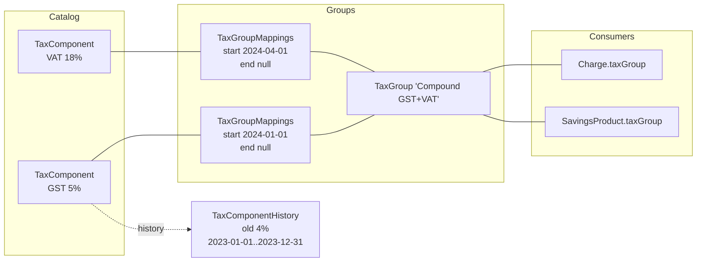
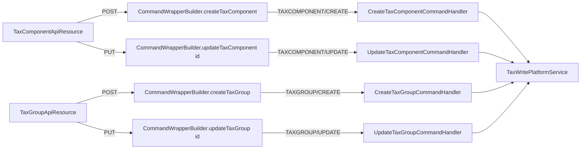
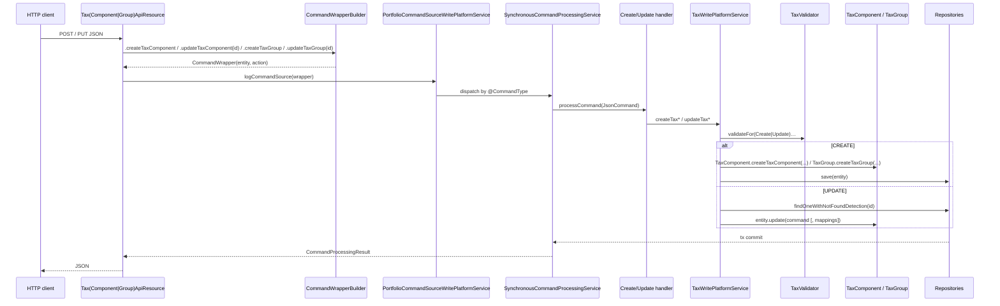

`fineract-tax` is the Apache Fineract Gradle module that owns **value-added tax modeling** for fees and interest. The module is intentionally small: two persisted tables (`m_tax_component`, `m_tax_group`), one association table (`m_tax_group_mappings`), one history table (`m_tax_component_history`), two Jersey resources, four command handlers, and a `TaxValidator` that doubles as the JSON deserializer.

Use this overview to navigate:

- The percentage-versioned tax atom → [TaxComponent](/tax/tax-component).
- Grouping atoms into a composite tax with effective windows → [TaxGroup](/tax/tax-group).
- REST surface → [Tax API resources](/tax/tax-api-resources).
- How `Charge` consumes a `TaxGroup` → [Charge domain](/charge/charge-domain).

## Module layout

```text
fineract-tax/
└── src/main/java/org/apache/fineract/portfolio/tax/
    ├── api/
    │   ├── TaxApiConstants.java
    │   ├── TaxComponentApiResource.java     ← @Path("/v1/taxes/component")
    │   ├── TaxComponentApiResourceSwagger.java
    │   ├── TaxGroupApiResource.java         ← @Path("/v1/taxes/group")
    │   └── TaxGroupApiResourceSwagger.java
    ├── domain/
    │   ├── TaxComponent.java                ← @Entity m_tax_component
    │   ├── TaxComponentHistory.java         ← @Entity m_tax_component_history
    │   ├── TaxComponentRepository.java
    │   ├── TaxComponentRepositoryWrapper.java
    │   ├── TaxGroup.java                    ← @Entity m_tax_group
    │   ├── TaxGroupMappings.java            ← @Entity m_tax_group_mappings
    │   ├── TaxGroupRepository.java
    │   └── TaxGroupRepositoryWrapper.java
    ├── exception/
    │   ├── TaxComponentNotFoundException.java
    │   ├── TaxGroupNotFoundException.java
    │   └── TaxMappingNotFoundException.java
    ├── handler/
    │   ├── CreateTaxComponentCommandHandler.java
    │   ├── UpdateTaxComponentCommandHandler.java
    │   ├── CreateTaxGroupCommandHandler.java
    │   └── UpdateTaxGroupCommandHandler.java
    ├── mapper/                              ← MapStruct DTO mappers
    │   ├── TaxComponentMapper.java
    │   ├── TaxGroupMapper.java
    │   └── TaxGroupMappingsMapper.java
    ├── serialization/
    │   └── TaxValidator.java                ← JSON deserializer + entity factory
    └── service/
        ├── TaxReadPlatformService.java
        ├── TaxUtils.java                    ← shared tax calculation helpers
        └── TaxWritePlatformService.java
```

`TaxComponentData` and `TaxGroupData` (the read-side DTOs returned by the resources) live in `fineract-core/src/main/java/org/apache/fineract/portfolio/tax/data/` so charges, loans, and savings — which all need to display tax info — can consume them without a hard dependency on `fineract-tax`.

## Conceptual model



Key shape:

- A **`TaxComponent`** is a single tax rate that **versions itself** over time. When the percentage is updated, the old value is moved into `m_tax_component_history` with `(start_date, end_date)`. Asking for the rate applicable on a specific date walks the history chain.
- A **`TaxGroup`** is a named bundle of components, joined through **`TaxGroupMappings`** that carry per-mapping `start_date` / `end_date`. A mapping with `end_date IS NULL` is open-ended.
- The active rate for a charge on a given date is the **sum** of `TaxComponent.getApplicablePercentage(date)` for every mapping in the group whose `(start_date, end_date]` covers that date.

The composition is **additive percentage**: GST 5% + VAT 18% with both mappings open at the date of the charge fires the charge gross plus 23% of that gross — see `TaxUtils` in the service package for the rounding mode and the recursive composition.

## How charges consume tax groups

`Charge.taxGroup` (`@ManyToOne` on `tax_group_id`) is the only entry point. `Charge.update(...)` allows setting the tax group **only when the current value is null**:

```java
if (command.isChangeInLongParameterNamed(ChargesApiConstants.taxGroupIdParamName, getTaxGroupId())) {
    final Long newValue = command.longValueOfParameterNamed(ChargesApiConstants.taxGroupIdParamName);
    actualChanges.put(ChargesApiConstants.taxGroupIdParamName, newValue);
    if (taxGroup != null) {
        baseDataValidator.reset().parameter(ChargesApiConstants.taxGroupIdParamName)
            .failWithCode("modification.not.supported");
    }
}
```

This is intentional — once a charge has been issued with a particular tax group, swapping the group out would change historical settlements. The same rule appears for savings products that bind a tax group.

For the full charge field map see [Charge domain](/charge/charge-domain).

## Command-handler topology



Each handler is roughly five lines:

```java
@Service
@AllArgsConstructor
@CommandType(entity = "TAXCOMPONENT", action = "CREATE")
public class CreateTaxComponentCommandHandler implements NewCommandSourceHandler {
    private final TaxWritePlatformService taxWritePlatformService;
    @Override
    public CommandProcessingResult processCommand(JsonCommand jsonCommand) {
        return this.taxWritePlatformService.createTaxComponent(jsonCommand);
    }
}
```

There is **no delete handler** — both tax components and tax groups are immutable from the API. To stop a tax from applying to new charges, an operator either updates the percentage to `0`, end-dates the corresponding `TaxGroupMappings.end_date`, or stops attaching the group to new products.

## Validator

`TaxValidator` (under `serialization/`) is the single class that:

1. Validates inbound JSON for create / update on both tax-component and tax-group endpoints.
2. Builds `TaxComponent` and `TaxGroup` instances from the validated JSON.
3. Validates updates against an existing entity (e.g. enforces "end date must be ≥ start date").

The four handler classes wire to it through `TaxWritePlatformService`. The validator is wired with `FromJsonHelper` and the `TaxComponentRepositoryWrapper` so it can resolve component ids referenced from a group payload.

## Read services

`TaxReadPlatformService` exposes:

```java
List<TaxComponentData> retrieveAllTaxComponents();
TaxComponentData      retrieveTaxComponentData(Long id);
TaxComponentData      retrieveTaxComponentTemplate();

List<TaxGroupData>    retrieveAllTaxGroups();
TaxGroupData          retrieveTaxGroupData(Long id);
TaxGroupData          retrieveTaxGroupTemplate();
TaxGroupData          retrieveTaxGroupWithTemplate(Long id);
```

The `*Template` calls return the dropdown options that drive the maintenance UI: a list of existing tax components, GL accounts (for the debit/credit pair), and account-type enums.

## Permissions

`TaxComponentApiResource` uses the resource name `TAXCOMPONENT`; `TaxGroupApiResource` uses `TAXGROUP`. Standard `CREATE_*`, `UPDATE_*` permission rows seeded by Liquibase apply.

## Exceptions

| Exception | Trigger |
| --- | --- |
| `TaxComponentNotFoundException` | `TaxComponentRepositoryWrapper.findOneWithNotFoundDetection(id)` for missing id. |
| `TaxGroupNotFoundException` | `TaxGroupRepositoryWrapper.findOneWithNotFoundDetection(id)` for missing id. |
| `TaxMappingNotFoundException` | Update payload references a `TaxGroupMappings.id` not in the group. |

All three are translated to HTTP 404 (or 400 when wrapped by a validator).

## End-to-end create flow



The same pipeline is used by every other catalog-style resource in Fineract — only the `(entity, action)` pair and the handler implementation change. The reuse is intentional: it gives every catalog write a uniform audit log row in `m_command_source` and the same maker-checker treatment when the `*_CHECKER` permission rows exist.

## Why versioning is split across two layers

It is worth restating the split between `TaxComponentHistory` and `TaxGroupMappings` because the two solve overlapping but different problems:

- **`TaxComponentHistory` answers "what was the GST rate on day D?"** — even if the rate has changed five times since. Each rate change adds a row in the history table; `getApplicablePercentage(D)` walks the history to find the row covering `D`.
- **`TaxGroupMappings` answers "which taxes were in this group on day D?"** — even if the group's composition has shifted. Each membership has its own `(start_date, end_date)`; the mapping is end-dated when a component leaves the group, never deleted.

A single charge fired on day D therefore consults both: walk the group's mappings to find the active ones, then ask each active component for its rate on D. The output (sum of applicable rates × gross amount) is deterministic for D — replaying a historical settlement years later still produces the original number.

## Tax write service responsibilities

`TaxWritePlatformService` is the seam between handlers and the validator/entity layer:

```java
public interface TaxWritePlatformService {
    CommandProcessingResult createTaxComponent(JsonCommand command);
    CommandProcessingResult updateTaxComponent(Long taxComponentId, JsonCommand command);
    CommandProcessingResult createTaxGroup(JsonCommand command);
    CommandProcessingResult updateTaxGroup(Long taxGroupId, JsonCommand command);
}
```

Each method:

1. Runs the relevant `TaxValidator.validateFor*` method against the inbound JSON.
2. Resolves referenced FKs through `*RepositoryWrapper.findOneWithNotFoundDetection(...)`.
3. Calls the entity-level factory or `update(...)` method.
4. Persists.
5. Returns a `CommandProcessingResult` whose `.changes` map is the entity's own change tracking output.

This pattern keeps the entities in charge of their own invariants — the handler is just transaction demarcation, the validator is the JSON-shape gate, and the entity owns the business rules. Most of the bugs that surface here over time are in the entity (e.g. the `taxGroup` "modification.not.supported" guard), not in the handler or validator.

## Quick reference — fields, FKs and tables

| Concern | Where it lives |
| --- | --- |
| Catalog tables | `m_tax_component`, `m_tax_component_history`, `m_tax_group`, `m_tax_group_mappings`. |
| JPA entities | `TaxComponent`, `TaxComponentHistory`, `TaxGroup`, `TaxGroupMappings` (all `AbstractAuditableCustom`). |
| Read DTOs (cross-module) | `TaxComponentData`, `TaxComponentHistoryData`, `TaxGroupData`, `TaxGroupMappingsData` — in `fineract-core/.../portfolio/tax/data`. |
| Read service | `TaxReadPlatformService` (JDBC-backed). |
| Write service | `TaxWritePlatformService`. |
| JSON validator | `TaxValidator` (also acts as DTO→entity builder for `TaxComponent` and `TaxGroup`). |
| Repository wrappers | `TaxComponentRepositoryWrapper`, `TaxGroupRepositoryWrapper` — preferred over raw `*Repository.findById`. |
| `@CommandType` handlers | `CreateTaxComponentCommandHandler`, `UpdateTaxComponentCommandHandler`, `CreateTaxGroupCommandHandler`, `UpdateTaxGroupCommandHandler`. |
| Cross-module FKs | `m_charge.tax_group_id`, `m_savings_product.tax_group_id`. |
| Liquibase seed data | None — operators define their own taxes. |
| Permissions | `READ_TAXCOMPONENT`, `CREATE_TAXCOMPONENT`, `UPDATE_TAXCOMPONENT`, `READ_TAXGROUP`, `CREATE_TAXGROUP`, `UPDATE_TAXGROUP` (+ `*_CHECKER` when maker-checker enabled). |

## Worked example — applying a compound tax group

Suppose a charge of `100.00` is realised on `2024-12-15`. The attached `TaxGroup` has two mappings:

- Mapping #1 → `TaxComponent "GST"` (current `percentage=5%`, `startDate=2024-01-01`), mapping `start=2024-01-01, end=null`.
- Mapping #2 → `TaxComponent "VAT"` (current `percentage=18%`, `startDate=2024-04-01`; history row `(percentage=15%, start=2024-01-01, end=2024-04-01)`), mapping `start=2024-04-01, end=null`.

Evaluation on `2024-12-15`:

| Step | Outcome |
| --- | --- |
| `mapping1.occursOnDayFromAndUpToAndIncluding(2024-12-15)` | `true` (start `2024-01-01` < target, end null). |
| `mapping1.taxComponent.getApplicablePercentage(2024-12-15)` | `5%` (target is after the component's current `startDate`). |
| `mapping2.occursOnDayFromAndUpToAndIncluding(2024-12-15)` | `true` (start `2024-04-01` < target, end null). |
| `mapping2.taxComponent.getApplicablePercentage(2024-12-15)` | `18%` (current rate applies). |
| Sum of applicable rates | `23%`. |
| Tax on `100.00` | `23.00`. |

If the same charge had instead been realised on `2024-02-15`:

| Step | Outcome |
| --- | --- |
| Mapping #1 active | yes (5%). |
| Mapping #2 active | `false` — its `startDate=2024-04-01` is not before `2024-02-15`. |
| Sum | `5%`. |
| Tax on `100.00` | `5.00`. |

And on a hypothetical replay for `2024-04-15` (mapping #2 just joined, VAT was still 15%):

| Step | Outcome |
| --- | --- |
| Mapping #1 active | yes (5%). |
| Mapping #2 active | yes. |
| `getApplicablePercentage(2024-04-15)` for VAT | not "current" (`startDate=2024-04-01` is not strictly before `2024-04-15` — wait, it is: `2024-04-15 > 2024-04-01`), so the current rate applies → `18%`. |
| Sum | `23%`. |

The transition between the historical 15% and the current 18% rate happens at the component's own `startDate=2024-04-01`. A transaction **on** `2024-04-01` (i.e. `target == startDate`) does **not** match `occursOnDayFrom(target)` (which is strict `>`); the history row that covers up to and including `2024-04-01` wins, so the tax is `15%` on that date. The transition is strictly forward.

This is consistent across all consumers (`TaxComponent.getApplicablePercentage`, `TaxComponentHistory.occursOnDayFromAndUpToAndIncluding`, `TaxGroupMappings.occursOnDayFromAndUpToAndIncluding`). The convention is "open on start, closed on end" — i.e. a window is `(start, end]`.

## What the module does not own

- **Delete semantics** — neither tax components nor groups can be deleted via API. Components can be "retired" by ending all their mappings; groups can be retired by not assigning them to new charges. Direct SQL is required for true deletes.
- **Recursive taxes** — there is no support for taxes that have their own taxes. Each component's percentage is applied to the base amount the consumer passes in.
- **Inclusive vs exclusive** — the `chargeIncludesTaxParamName` constant in `TaxApiConstants` is exposed but is consumed by `fineract-charge`, not here. The toggle decides whether a charge's `amount` is gross-of-tax or net-of-tax; the tax module just produces the percentage to apply.
- **Per-customer or per-jurisdiction routing** — the same `TaxGroup` applies regardless of customer geography. Operators that need jurisdictional rules typically maintain multiple groups and bind them per product.

## Cross-references

- For the entity model and percentage versioning: [TaxComponent](/tax/tax-component).
- For composition rules and date windows: [TaxGroup](/tax/tax-group).
- For the Jersey endpoints: [Tax API resources](/tax/tax-api-resources).
- For how charges consume tax groups: [Charge domain](/charge/charge-domain).
- For shared `EnumOptionData` / `JsonCommand` / `DataValidatorBuilder` machinery: [Portfolio shared domain](/core/portfolio-shared-domain).
- For the API surface of fees and the relationship between charges and tax: [Configuration and code APIs](/api/global-configuration).
