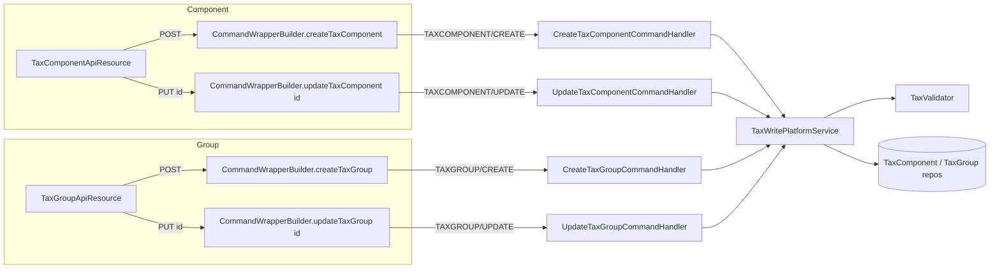

The Apache Fineract `fineract-tax` module exposes two Jersey resources: `TaxComponentApiResource` at `/v1/taxes/component` and `TaxGroupApiResource` at `/v1/taxes/group`. Both are thin REST shims: reads call `TaxReadPlatformService` directly, writes build a `CommandWrapper` via `CommandWrapperBuilder` and dispatch to the matching `@CommandType` handler.

For the underlying entities see [TaxComponent](/tax/tax-component) and [TaxGroup](/tax/tax-group).

## Endpoint summary

### `/v1/taxes/component`

| HTTP | Path | Handler / read service | Purpose |
| --- | --- | --- | --- |
| `GET` | `/v1/taxes/component` | `TaxReadPlatformService.retrieveAllTaxComponents` | List all components. |
| `GET` | `/v1/taxes/component/{id}` | `TaxReadPlatformService.retrieveTaxComponentData(id)` | Fetch one component (and its history). |
| `GET` | `/v1/taxes/component/template` | `TaxReadPlatformService.retrieveTaxComponentTemplate` | Dropdowns for create form. |
| `POST` | `/v1/taxes/component` | `CreateTaxComponentCommandHandler` | Create a new component. |
| `PUT` | `/v1/taxes/component/{id}` | `UpdateTaxComponentCommandHandler` | Update `name` and / or `percentage` (debit/credit GL accounts are immutable). |

### `/v1/taxes/group`

| HTTP | Path | Handler / read service | Purpose |
| --- | --- | --- | --- |
| `GET` | `/v1/taxes/group` | `TaxReadPlatformService.retrieveAllTaxGroups` | List all groups. |
| `GET` | `/v1/taxes/group/{id}` | `TaxReadPlatformService.retrieveTaxGroupData(id)` (or `retrieveTaxGroupWithTemplate` when `?template=true`) | Fetch one group. |
| `GET` | `/v1/taxes/group/template` | `TaxReadPlatformService.retrieveTaxGroupTemplate` | Dropdowns for create form. |
| `POST` | `/v1/taxes/group` | `CreateTaxGroupCommandHandler` | Create a new group. |
| `PUT` | `/v1/taxes/group/{id}` | `UpdateTaxGroupCommandHandler` | Append new mappings and / or end-date existing mappings; rename group. |

There is **no DELETE** on either resource. Once persisted, components and groups are append-only; effective stop is via `end_date` on the mapping (group) or by raising the rate to `0` (component).

## `TaxComponentApiResource` — class declaration

```java
@Path("/v1/taxes/component")
@Component
@Tag(name = "Tax Components", description = "This defines the Tax Components")
@RequiredArgsConstructor
public class TaxComponentApiResource {

    private static final String RESOURCE_NAME_FOR_PERMISSIONS = "TAXCOMPONENT";

    private final PlatformSecurityContext context;
    private final TaxReadPlatformService readPlatformService;
    private final PortfolioCommandSourceWritePlatformService commandsSourceWritePlatformService;
    private final DefaultToApiJsonSerializer<String> toApiJsonSerializer;
    // ...
}
```

### `GET /v1/taxes/component`

```java
@GET
@Operation(summary = "List Tax Components", description = "List Tax Components")
public List<TaxComponentData> retrieveAllTaxComponents() {
    context.authenticatedUser().validateHasReadPermission(RESOURCE_NAME_FOR_PERMISSIONS);
    return readPlatformService.retrieveAllTaxComponents();
}
```

`TaxComponentData` (in `fineract-core/.../portfolio/tax/data/`) carries:

- `id`, `name`, `percentage`, `startDate`
- `debitAccountType`, `debitAccount` (`GLAccountData`)
- `creditAccountType`, `creditAccount`
- `taxComponentHistories` (list of `(percentage, startDate, endDate)`)

### `GET /v1/taxes/component/{taxComponentId}`

```java
@GET
@Path("{taxComponentId}")
public TaxComponentData retrieveTaxComponent(@PathParam("taxComponentId") final Long taxComponentId) {
    context.authenticatedUser().validateHasReadPermission(RESOURCE_NAME_FOR_PERMISSIONS);
    return readPlatformService.retrieveTaxComponentData(taxComponentId);
}
```

Throws `TaxComponentNotFoundException` (HTTP 404) on miss.

### `GET /v1/taxes/component/template`

```java
@GET
@Path("template")
public TaxComponentData retrieveTemplate() {
    context.authenticatedUser().validateHasReadPermission(RESOURCE_NAME_FOR_PERMISSIONS);
    return readPlatformService.retrieveTaxComponentTemplate();
}
```

Returns an empty `TaxComponentData` with:

- `debitAccountTypeOptions` / `creditAccountTypeOptions` — `GLAccountType` enums.
- `glAccountOptions.*` — `GLAccount` rows partitioned by type.

### `POST /v1/taxes/component`

```java
@POST
@Operation(summary = "Create a new Tax Component", description = "Creates a new Tax Component\n\n"
        + "Mandatory Fields: name, percentage\n\n"
        + "Optional Fields: debitAccountType, debitAccountId, creditAccountType, creditAccountId, startDate")
@RequestBody(required = true, content = @Content(schema = @Schema(implementation = TaxComponentApiResourceSwagger.PostTaxesComponentsRequest.class)))
public CommandProcessingResult createTaxComponent(@Parameter(hidden = true) TaxComponentRequest taxComponentRequest) {
    final CommandWrapper commandRequest = new CommandWrapperBuilder().createTaxComponent()
            .withJson(toApiJsonSerializer.serialize(taxComponentRequest)).build();
    return commandsSourceWritePlatformService.logCommandSource(commandRequest);
}
```

The handler is:

```java
@Service
@AllArgsConstructor
@CommandType(entity = "TAXCOMPONENT", action = "CREATE")
public class CreateTaxComponentCommandHandler implements NewCommandSourceHandler {
    private final TaxWritePlatformService taxWritePlatformService;
    @Override
    public CommandProcessingResult processCommand(JsonCommand jsonCommand) {
        return this.taxWritePlatformService.createTaxComponent(jsonCommand);
    }
}
```

Sample request:

```json
POST /fineract-provider/api/v1/taxes/component
{
  "name":             "GST 5%",
  "percentage":       5,
  "locale":           "en",
  "debitAccountType": 1,
  "debitAccountId":   42,
  "creditAccountType":2,
  "creditAccountId":  77,
  "startDate":        "2024-01-01",
  "dateFormat":       "yyyy-MM-dd"
}
```

When `startDate` is omitted, the tenant's business local date is used.

### `PUT /v1/taxes/component/{taxComponentId}`

```java
@PUT
@Path("{taxComponentId}")
@Operation(summary = "Update Tax Component", description = "Updates Tax component. Debit and credit account details cannot be modified. All the future tax components would be replaced with the new percentage.")
public CommandProcessingResult updateTaxCompoent(
        @PathParam("taxComponentId") final Long taxComponentId,
        @Parameter(hidden = true) TaxComponentRequest taxComponentRequest) {
    final CommandWrapper commandRequest = new CommandWrapperBuilder().updateTaxComponent(taxComponentId)
            .withJson(toApiJsonSerializer.serialize(taxComponentRequest)).build();
    return commandsSourceWritePlatformService.logCommandSource(commandRequest);
}
```

The matching handler:

```java
@Service
@AllArgsConstructor
@CommandType(entity = "TAXCOMPONENT", action = "UPDATE")
public class UpdateTaxComponentCommandHandler implements NewCommandSourceHandler {
    private final TaxWritePlatformService taxWritePlatformService;
    @Override
    public CommandProcessingResult processCommand(JsonCommand jsonCommand) {
        return this.taxWritePlatformService.updateTaxComponent(jsonCommand.entityId(), jsonCommand);
    }
}
```

The write service runs `TaxValidator.validateForUpdateTaxComponent(json)`, loads the component via `TaxComponentRepositoryWrapper.findOneWithNotFoundDetection`, then calls `taxComponent.update(command)`. Only `name` and `percentage` are mutable. When `percentage` changes:

1. The current `(percentage, startDate)` is copied into a fresh `TaxComponentHistory`.
2. `startDate` becomes the supplied date (or the business date if omitted).
3. `percentage` is replaced.

See [TaxComponent](/tax/tax-component) for the full update method body.

Sample request:

```json
PUT /fineract-provider/api/v1/taxes/component/12
{
  "percentage": 7,
  "locale":     "en",
  "startDate":  "2024-12-01",
  "dateFormat": "yyyy-MM-dd"
}
```

## `TaxGroupApiResource` — class declaration

```java
@Path("/v1/taxes/group")
@Component
@Tag(name = "Tax Group", description = "This defines the Tax Group")
@RequiredArgsConstructor
public class TaxGroupApiResource {

    private static final String RESOURCE_NAME_FOR_PERMISSIONS = "TAXGROUP";

    private final PlatformSecurityContext context;
    private final TaxReadPlatformService readPlatformService;
    private final DefaultToApiJsonSerializer<String> toApiJsonSerializer;
    private final ApiRequestParameterHelper apiRequestParameterHelper;
    private final PortfolioCommandSourceWritePlatformService commandsSourceWritePlatformService;
    // ...
}
```

### `GET /v1/taxes/group`

```java
@GET
@Operation(summary = "List Tax Group", description = "List Tax Group")
public List<TaxGroupData> retrieveAllTaxGroups() {
    context.authenticatedUser().validateHasReadPermission(RESOURCE_NAME_FOR_PERMISSIONS);
    return readPlatformService.retrieveAllTaxGroups();
}
```

`TaxGroupData` carries the group `id`, `name`, and a list of `TaxGroupMappingsData` (`{id, taxComponentId, taxComponentName, startDate, endDate}`).

### `GET /v1/taxes/group/{taxGroupId}`

```java
@GET
@Path("{taxGroupId}")
public TaxGroupData retrieveTaxGroup(@PathParam("taxGroupId") final Long taxGroupId,
                                     @Context final UriInfo uriInfo) {
    context.authenticatedUser().validateHasReadPermission(RESOURCE_NAME_FOR_PERMISSIONS);
    final ApiRequestJsonSerializationSettings settings = apiRequestParameterHelper.process(uriInfo.getQueryParameters());
    return settings.isTemplate() ? readPlatformService.retrieveTaxGroupWithTemplate(taxGroupId)
                                 : readPlatformService.retrieveTaxGroupData(taxGroupId);
}
```

The `?template=true` variant adds the list of tax components available for assignment.

### `GET /v1/taxes/group/template`

```java
@GET
@Path("template")
public TaxGroupData retrieveTemplate() {
    context.authenticatedUser().validateHasReadPermission(RESOURCE_NAME_FOR_PERMISSIONS);
    return readPlatformService.retrieveTaxGroupTemplate();
}
```

Returns an empty `TaxGroupData` whose `taxComponents` array contains every `TaxComponent` row currently in the catalog — the maintenance UI uses this list to drive a multi-select.

### `POST /v1/taxes/group`

```java
@POST
@Operation(summary = "Create a new Tax Group", description = "Create a new Tax Group\n"
        + "Mandatory Fields: name and taxComponents\n"
        + "Mandatory Fields in taxComponents: taxComponentId\n"
        + "Optional Fields in taxComponents: id, startDate and endDate")
@RequestBody(required = true, content = @Content(schema = @Schema(implementation = TaxGroupApiResourceSwagger.PostTaxesGroupRequest.class)))
public CommandProcessingResult createTaxGroup(@Parameter(hidden = true) TaxGroupRequest taxGroupRequest) {
    final CommandWrapper commandRequest = new CommandWrapperBuilder().createTaxGroup()
            .withJson(toApiJsonSerializer.serialize(taxGroupRequest)).build();
    return commandsSourceWritePlatformService.logCommandSource(commandRequest);
}
```

Handler:

```java
@Service
@AllArgsConstructor
@CommandType(entity = "TAXGROUP", action = "CREATE")
public class CreateTaxGroupCommandHandler implements NewCommandSourceHandler {
    private final TaxWritePlatformService taxWritePlatformService;
    @Override
    public CommandProcessingResult processCommand(JsonCommand jsonCommand) {
        return this.taxWritePlatformService.createTaxGroup(jsonCommand);
    }
}
```

Sample request — compound group with two components:

```json
POST /fineract-provider/api/v1/taxes/group
{
  "name":   "Standard sales tax",
  "locale": "en",
  "dateFormat": "yyyy-MM-dd",
  "taxComponents": [
    { "taxComponentId": 12, "startDate": "2024-01-01" },
    { "taxComponentId": 18, "startDate": "2024-04-01" }
  ]
}
```

The validator resolves each `taxComponentId` via `TaxComponentRepositoryWrapper.findOneWithNotFoundDetection(id)` and creates a fresh `TaxGroupMappings(taxComponent, startDate, endDate=null)` for each entry. If `startDate` is omitted, the business local date is used.

### `PUT /v1/taxes/group/{taxGroupId}`

```java
@PUT
@Path("{taxGroupId}")
@Operation(summary = "Update Tax Group", description = "Updates Tax Group. Only end date can be up-datable and can insert new tax components.")
public CommandProcessingResult updateTaxGroup(@PathParam("taxGroupId") final Long taxGroupId,
                                              @Parameter(hidden = true) TaxGroupRequest taxGroupRequest) {
    final CommandWrapper commandRequest = new CommandWrapperBuilder().updateTaxGroup(taxGroupId)
            .withJson(toApiJsonSerializer.serialize(taxGroupRequest)).build();
    return commandsSourceWritePlatformService.logCommandSource(commandRequest);
}
```

Handler:

```java
@Service
@AllArgsConstructor
@CommandType(entity = "TAXGROUP", action = "UPDATE")
public class UpdateTaxGroupCommandHandler implements NewCommandSourceHandler {
    private final TaxWritePlatformService taxWritePlatformService;
    @Override
    public CommandProcessingResult processCommand(JsonCommand jsonCommand) {
        return this.taxWritePlatformService.updateTaxGroup(jsonCommand.entityId(), jsonCommand);
    }
}
```

Update body semantics (enforced by `TaxValidator` + `TaxGroup.update`):

- The top-level `name` may be changed.
- Each entry in `taxComponents`:
  - **With `id`** → reference an existing mapping; only `endDate` may be supplied. Setting `endDate` on a mapping that already has one is a no-op (the entity method `TaxGroupMappings.update` only writes when `this.endDate == null`). Missing `id` ⇒ `TaxMappingNotFoundException`.
  - **Without `id`** → a new mapping is appended. Requires `taxComponentId`; `startDate` defaults to business local date.

Sample request — end-date one mapping, add another:

```json
PUT /fineract-provider/api/v1/taxes/group/3
{
  "name":   "Standard sales tax (rev)",
  "locale": "en",
  "dateFormat": "yyyy-MM-dd",
  "taxComponents": [
    { "id": 11, "endDate": "2024-12-31" },
    { "taxComponentId": 22, "startDate": "2025-01-01" }
  ]
}
```

Response:

```json
{
  "officeId": null,
  "resourceId": 3,
  "changes": {
    "name": "Standard sales tax (rev)",
    "addComponents": [22],
    "modifiedComponents": [
      { "endDate": "2024-12-31", "taxComponentId": 12 }
    ]
  }
}
```

The `addComponents` and `modifiedComponents` keys are produced by `TaxGroup.update(...)` itself (see [TaxGroup](/tax/tax-group)).

## Handler ↔ resource topology



## Errors

| HTTP | Cause |
| --- | --- |
| 400 | `PlatformApiDataValidationException` from `TaxValidator` for any malformed / missing field. |
| 400 | `TaxMappingNotFoundException` when an update body's mapping `id` is not in the group. |
| 401 / 403 | Missing `READ_TAXCOMPONENT` / `READ_TAXGROUP` / `CREATE_*` / `UPDATE_*` permission. |
| 404 | `TaxComponentNotFoundException` or `TaxGroupNotFoundException`. |

## Cross-references

- For the percentage versioning model and `TaxComponentHistory` semantics: [TaxComponent](/tax/tax-component).
- For mapping date windows and how groups compose components: [TaxGroup](/tax/tax-group).
- For how charges bind to a tax group: [Charge domain](/charge/charge-domain) and the linked write rule "modification.not.supported".
- For the shared `CommandWrapper` / `CommandWrapperBuilder` / `PortfolioCommandSourceWritePlatformService` pipeline: [Portfolio shared domain](/core/portfolio-shared-domain).
- For the broader API surface, including how `taxGroupId` shows up on `Charge`, `LoanProduct` and `SavingsProduct` JSON: [Configuration and code APIs](/api/global-configuration).
