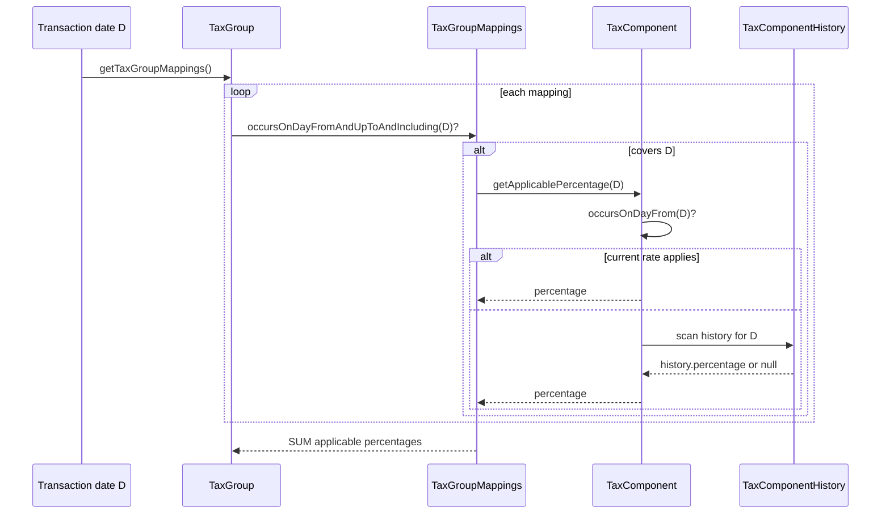
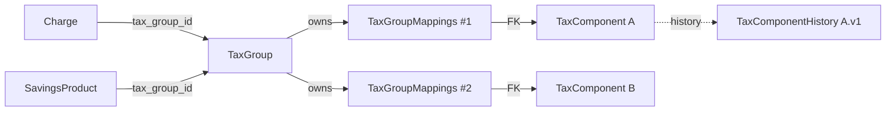

A `TaxGroup` is the Apache Fineract aggregation entity that bundles one or more `TaxComponent` rows under a single name and exposes them as a unit to charges and savings products. The entity lives at `fineract-tax/.../domain/TaxGroup.java` and maps to `m_tax_group`; each membership is a `TaxGroupMappings` row (`m_tax_group_mappings`) carrying its own `start_date` / `end_date`.

For the per-rate atom see [TaxComponent](/tax/tax-component); for the REST endpoints see [Tax API resources](/tax/tax-api-resources).

## Entity declarations

### `TaxGroup`

```java
@Entity
@Table(name = "m_tax_group")
public class TaxGroup extends AbstractAuditableCustom {

    @Column(name = "name", length = 100)
    private String name;

    @OneToMany(cascade = CascadeType.ALL, orphanRemoval = true, fetch = FetchType.EAGER, mappedBy = "taxGroup")
    private Set<TaxGroupMappings> taxGroupMappings = new HashSet<>();

    protected TaxGroup() {}

    private TaxGroup(final String name, final Set<TaxGroupMappings> taxGroupMappings) {
        this.name = name;
        this.taxGroupMappings = taxGroupMappings;
        taxGroupMappings.forEach(m -> m.setTaxGroup(this));
    }

    public static TaxGroup createTaxGroup(final String name, final Set<TaxGroupMappings> taxGroupMappings) {
        return new TaxGroup(name, taxGroupMappings);
    }
    // ...
}
```

Notes:

- `taxGroupMappings` is `CascadeType.ALL` with `orphanRemoval=true`. New mappings are added to the set; removed-from-the-set mappings are deleted.
- The constructor **back-references** the group on each mapping (`m.setTaxGroup(this)`), so callers don't have to wire both ends.
- The class is `Getter`-less by default — the public read API is just `getName()` and `getTaxGroupMappings()`.

### `TaxGroupMappings`

```java
@Entity
@Getter
@Table(name = "m_tax_group_mappings")
public class TaxGroupMappings extends AbstractAuditableCustom {

    @ManyToOne
    @JoinColumn(name = "tax_group_id", nullable = false)
    private TaxGroup taxGroup;

    @ManyToOne
    @JoinColumn(name = "tax_component_id", nullable = false)
    private TaxComponent taxComponent;

    @Column(name = "start_date", nullable = false)
    private LocalDate startDate;

    @Column(name = "end_date", nullable = true)
    private LocalDate endDate;

    protected TaxGroupMappings() {}

    private TaxGroupMappings(final TaxComponent taxComponent, final LocalDate startDate, final LocalDate endDate) {
        this.taxComponent = taxComponent;
        this.startDate    = startDate;
        this.endDate      = endDate;
    }

    public static TaxGroupMappings createTaxGroupMappings(final TaxComponent taxComponent, final LocalDate startDate) {
        return new TaxGroupMappings(taxComponent, startDate, null);
    }

    public static TaxGroupMappings createTaxGroupMappings(final Long id, final TaxComponent taxComponent, final LocalDate endDate) {
        TaxGroupMappings groupMappings = new TaxGroupMappings(taxComponent, null, endDate);
        groupMappings.setId(id);
        return groupMappings;
    }
    // ...
}
```

Two factory shapes:

1. `createTaxGroupMappings(taxComponent, startDate)` — **fresh** mapping; used when a new component joins the group.
2. `createTaxGroupMappings(id, taxComponent, endDate)` — **end-dating** an existing mapping; carries the existing primary key and **only the new end_date**.

The mapping update method is correspondingly narrow:

```java
public void update(final LocalDate endDate, final List<Map<String, Object>> changes) {
    if (endDate != null && this.endDate == null) {
        this.endDate = endDate;
        Map<String, Object> map = new HashMap<>(2);
        map.put(TaxApiConstants.endDateParamName, endDate);
        map.put(TaxApiConstants.taxComponentIdParamName, this.getTaxComponent().getId());
        changes.add(map);
    }
}
```

So once a mapping has an `end_date`, **it cannot be re-opened or shifted**. This is intentional: ending a mapping is a one-way operation and clients rebuilding state should rely on the (start, end) chain as immutable history.

## Group update semantics — append + end-date

```java
public Map<String, Object> update(final JsonCommand command, final Set<TaxGroupMappings> taxGroupMappings) {
    final Map<String, Object> changes = new HashMap<>();

    if (command.isChangeInStringParameterNamed(TaxApiConstants.nameParamName, this.name)) {
        final String newValue = command.stringValueOfParameterNamed(TaxApiConstants.nameParamName);
        changes.put(TaxApiConstants.nameParamName, newValue);
        this.name = StringUtils.defaultIfEmpty(newValue, null);
    }

    List<Long> taxComponentList = new ArrayList<>();
    final List<Map<String, Object>> modifications = new ArrayList<>();

    for (TaxGroupMappings groupMappings : taxGroupMappings) {
        TaxGroupMappings mappings = findOneBy(groupMappings);
        if (mappings == null) {
            this.taxGroupMappings.add(groupMappings);
            taxComponentList.add(groupMappings.getTaxComponent().getId());
        } else {
            mappings.update(groupMappings.getEndDate(), modifications);
        }
    }

    if (!taxComponentList.isEmpty())     changes.put("addComponents", taxComponentList);
    if (!modifications.isEmpty())        changes.put("modifiedComponents", modifications);

    return changes;
}

public TaxGroupMappings findOneBy(final TaxGroupMappings groupMapping) {
    if (groupMapping.getId() != null) {
        for (TaxGroupMappings groupMappings : this.taxGroupMappings) {
            if (groupMappings.getId().equals(groupMapping.getId())) {
                return groupMappings;
            }
        }
        throw new TaxMappingNotFoundException(groupMapping.getId());
    }
    return null;
}
```

Update rules:

- **`name`** — straight overwrite.
- For each inbound mapping:
  - If `id == null` → it's a **new** mapping: add to the group (the validator already populated `startDate`).
  - If `id != null` → look it up via `findOneBy`:
    - Found → `mappings.update(endDate, ...)` (only sets `end_date` if currently null).
    - Not found → `TaxMappingNotFoundException` is thrown (HTTP 404 / 400).
- **Existing mappings are never replaced**. There is no way to change `(taxComponent, startDate)` on an existing row through the API — clients must end-date the row and add a new one.

The returned `Map<String, Object>` contains `addComponents` (list of newly added component ids) and `modifiedComponents` (list of `{taxComponentId, endDate}` entries) so the `CommandProcessingResult.changes` payload reflects exactly what changed.

## Date windows and what "applicable on day D" means

A consumer of a tax group on a particular `LocalDate D` walks every mapping and picks out those whose window covers `D`:

```java
public boolean occursOnDayFromAndUpToAndIncluding(final LocalDate target) {
    return DateUtils.isAfter(target, startDate())
        && (endDate == null || !DateUtils.isAfter(target, endDate()));
}
```

That is, `startDate < D <= endDate` (open on the start, closed on the end). Each active mapping's component is then queried for its **then-current rate** via `TaxComponent.getApplicablePercentage(D)`. The overall tax for the group on `D` is the **sum** of the applicable rates of all active mappings; null returns are skipped.



`TaxUtils` does the actual aggregation and rounding when this is applied to a base amount. Different consumers feed different base amounts:

- **Charges** — `Charge.taxGroup` × the gross fee amount at the time the fee is realised.
- **Savings products** — `SavingsProduct.taxGroup` × interest posted, when "tax on interest" is enabled.

## Why start/end on the mapping (not on the group)?

The mapping carries its own window so individual components can be **swapped in and out** without recreating the group:

- "VAT 18% has applied since 2020-01-01, GST 5% joined on 2024-04-01" → two mappings, both `end_date IS NULL`, different `start_date`.
- "VAT 18% is being replaced by VAT 20% on 2024-12-31" → end-date the 18% mapping at 2024-12-31, add a new mapping for the 20% component starting 2024-12-31.

Versioning the component itself (via `TaxComponentHistory`) is for **percentage changes on the same conceptual component**; versioning the mapping is for **changing which component is in the group**.

## Cascade behaviour

- `TaxGroup.taxGroupMappings` is `cascade=ALL` + `orphanRemoval=true`. Adding a mapping persists it on flush; removing one would delete it.
- `TaxComponent.taxGroupMappings` is `cascade=DETACH` + `orphanRemoval=false`. The set is **read-only from the component side** — components are not allowed to evict themselves from a group.

The asymmetry is deliberate: groups own their mappings; components merely have a navigable reference for read-side queries.

## Cross-references between this entity and others



`Charge.taxGroup` (`tax_group_id` column on `m_charge`) is a `@ManyToOne` reference. Once set, `Charge.update(...)` rejects reassignment via `failWithCode("modification.not.supported")`. See [Charge domain](/charge/charge-domain).

## Validator interaction

`TaxValidator` (under `fineract-tax/.../serialization`):

- For create — validates `name` (`notBlank`, `notExceedingLengthOf(100)`) and a non-empty `taxComponents` array. For each member, it requires `taxComponentId` and optionally accepts `startDate`. The resolved `TaxComponent` is loaded via `TaxComponentRepositoryWrapper.findOneWithNotFoundDetection(id)`.
- For update — accepts `name` + `taxComponents`. For each member:
  - If `id` is present → match an existing mapping (loaded inside `TaxGroup.findOneBy`) and accept only `endDate`.
  - If `id` is absent → require `taxComponentId` + optional `startDate`; this builds a new mapping.

`TaxValidator` also enforces:

- **End date ≥ start date** on the mapping being updated.
- The referenced `TaxComponent.startDate ≤ mapping.startDate` — a mapping cannot begin before the component itself exists.

## Repository wrapper

```java
public interface TaxGroupRepositoryWrapper {
    TaxGroup findOneWithNotFoundDetection(Long id);
}
```

Throws `TaxGroupNotFoundException` on miss. Always use the wrapper from cross-module code (e.g. `ChargeWritePlatformService` when it resolves the `taxGroupId` parameter on a charge create).

## Exceptions

| Exception | Trigger |
| --- | --- |
| `TaxGroupNotFoundException` | `findOneWithNotFoundDetection(id)` for missing id. |
| `TaxMappingNotFoundException` | Update body references a mapping `id` not in the group. |

## Worked example — composing GST and VAT into one group

Suppose two `TaxComponent` rows exist:

- `id=12, name="GST", percentage=5, startDate=2024-01-01`
- `id=18, name="VAT", percentage=18, startDate=2024-04-01`

Create a group on `2024-04-01`:

```json
POST /v1/taxes/group
{
  "name": "Standard sales tax",
  "locale": "en",
  "dateFormat": "yyyy-MM-dd",
  "taxComponents": [
    { "taxComponentId": 12, "startDate": "2024-01-01" },
    { "taxComponentId": 18, "startDate": "2024-04-01" }
  ]
}
```

Storage:

```
m_tax_group(id=3, name="Standard sales tax")
m_tax_group_mappings(id=101, tax_group_id=3, tax_component_id=12, start_date=2024-01-01, end_date=null)
m_tax_group_mappings(id=102, tax_group_id=3, tax_component_id=18, start_date=2024-04-01, end_date=null)
```

On `2024-12-31` the customer wants to drop VAT and switch to a new "Service tax" component (`id=22, percentage=9, startDate=2025-01-01`). They send:

```json
PUT /v1/taxes/group/3
{
  "locale": "en",
  "dateFormat": "yyyy-MM-dd",
  "taxComponents": [
    { "id": 102, "endDate": "2024-12-31" },
    { "taxComponentId": 22, "startDate": "2025-01-01" }
  ]
}
```

Inside `TaxGroup.update(command, parsedMappings)`:

1. The entry with `id=102` matches mapping #102 → its `endDate=null` is replaced with `2024-12-31`. Recorded in `modifiedComponents`.
2. The entry with `taxComponentId=22` has no `id` → a new mapping is appended (`id=103, tax_component_id=22, start_date=2025-01-01, end_date=null`). Recorded in `addComponents`.

Storage after the update:

```
m_tax_group_mappings(id=101, tax_group_id=3, tax_component_id=12, start_date=2024-01-01, end_date=null)
m_tax_group_mappings(id=102, tax_group_id=3, tax_component_id=18, start_date=2024-04-01, end_date=2024-12-31)
m_tax_group_mappings(id=103, tax_group_id=3, tax_component_id=22, start_date=2025-01-01, end_date=null)
```

A charge on `2024-08-15` evaluates the group:

- Mapping #101 → `occursOnDayFromAndUpToAndIncluding(2024-08-15)` → `true` (`2024-01-01 < 2024-08-15`, end null). Component GST → `5%` (current rate applies).
- Mapping #102 → `true` (`2024-04-01 < 2024-08-15 <= 2024-12-31`). Component VAT → `18%`.
- Mapping #103 → `false` (`2025-01-01` is not before `2024-08-15`).
- Sum: `23%`.

A charge on `2025-02-15`:

- Mapping #101 → `true`. GST → `5%`.
- Mapping #102 → `false` (`2025-02-15 > 2024-12-31`).
- Mapping #103 → `true` (`2025-01-01 < 2025-02-15`). Service tax → `9%`.
- Sum: `14%`.

A replay for `2024-12-31` (a transaction posted on the last day of VAT):

- Mapping #101 → `true`. GST → `5%`.
- Mapping #102 → `2024-04-01 < 2024-12-31 && 2024-12-31 <= 2024-12-31` → `true`. VAT → `18%`.
- Mapping #103 → `false`.
- Sum: `23%`.

So `endDate` is closed on the end — a transaction on the end date still picks up the mapping. The next-day transaction (`2025-01-01`) loses it.

## Cross-references

- For the per-rate atom and its versioning: [TaxComponent](/tax/tax-component).
- For the REST endpoints that drive these entities: [Tax API resources](/tax/tax-api-resources).
- For how charges bind to a tax group (and the once-only rule): [Charge domain](/charge/charge-domain).
- For the data validation helpers and the `JsonCommand` adapter: [Portfolio shared domain](/core/portfolio-shared-domain).
- For tax application on loans and savings: [Loan charges](/loan/loan-charges), [Savings charges](/savings/savings-charges).
