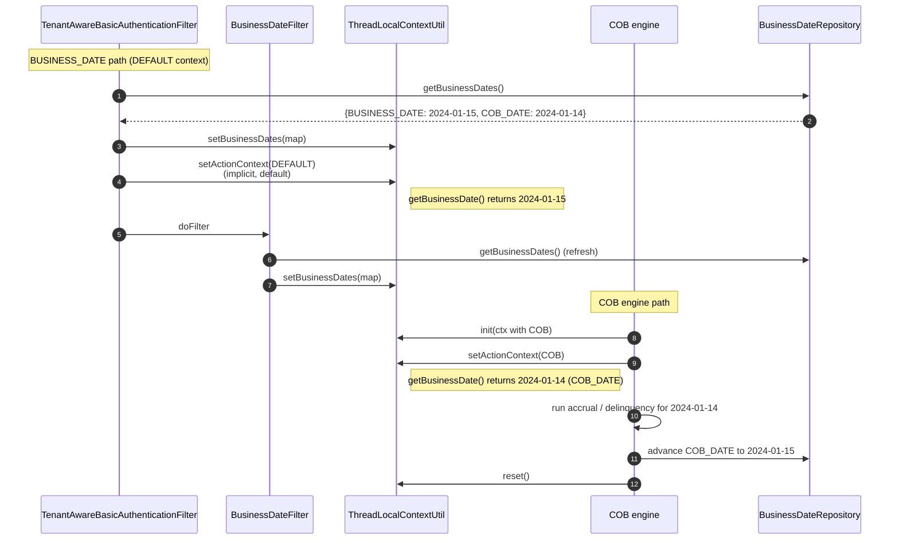

Apache Fineract draws a sharp line between **today's business date** (the date as the financial institution perceives it — used for interactive operations, REST writes, and most reads) and **the COB date** (the date that the close-of-business job is currently processing, which can lag behind business date). Both live in `ThreadLocalContextUtil`, and which one is returned by `getBusinessDate()` depends on the `ActionContext` flag also living in the thread. This page documents that pair, the `BusinessDateType` enum, and the places that flip between them.

## BusinessDateType — the two slots

`BusinessDateType` (in `fineract-core`) is a small enum:

```java
public enum BusinessDateType {
    BUSINESS_DATE,
    COB_DATE
}
```

Both are persisted as rows in `m_business_date` in each tenant DB:

```xml
<!-- db/changelog/tenant/parts/0015_add_business_date.xml -->
<changeSet author="fineract" id="1">
    <createTable tableName="m_business_date">
        <column autoIncrement="true" name="id" type="BIGINT">
            <constraints nullable="false" primaryKey="true"/>
        </column>
        <column name="type" type="VARCHAR(100)">
            <constraints unique="true" nullable="false"/>
        </column>
        <column name="date" type="DATE">
            <constraints unique="false" nullable="false"/>
        </column>
        ...
    </createTable>
</changeSet>
```

So at most two rows: one with `type = 'BUSINESS_DATE'` and one with `type = 'COB_DATE'`. Both are read at the start of every request (via `BusinessDateReadPlatformService.getBusinessDates()`) and cached on the thread:

```java
// ThreadLocalContextUtil
private static final ThreadLocal<HashMap<BusinessDateType, LocalDate>> businessDateContext = new ThreadLocal<>();

public static HashMap<BusinessDateType, LocalDate> getBusinessDates() {
    Assert.notNull(businessDateContext.get(), "Business dates cannot be null!");
    return businessDateContext.get();
}

public static void setBusinessDates(HashMap<BusinessDateType, LocalDate> dates) {
    Assert.notNull(dates, "Business dates cannot be null!");
    businessDateContext.set(dates);
}

public static LocalDate getBusinessDateByType(BusinessDateType businessDateType) {
    Assert.notNull(businessDateType, "Business date type cannot be null!");
    LocalDate localDate = getBusinessDates().get(businessDateType);
    Assert.notNull(localDate,
        String.format("Business date with type `%s` is not initialised!", businessDateType));
    return localDate;
}
```

The map is `HashMap` (not `Map`) because the contract is that it must be `Serializable` — `FineractContext` is sent across thread boundaries (async executors, batch steps) and `Map` is not guaranteed serializable.

## ActionContext — which date is "the" date

```java
@Getter
@AllArgsConstructor
public enum ActionContext {
    DEFAULT(0, "Default context", BusinessDateType.BUSINESS_DATE),
    COB(1, "Close of Business context", BusinessDateType.COB_DATE);

    private final int order;
    private final String description;
    private final BusinessDateType businessDateType;
}
```

Two values:

| ActionContext | businessDateType returned by `getBusinessDate()` | Used by |
| ------------- | ------------------------------------------------ | ------- |
| `DEFAULT` | `BUSINESS_DATE` | All interactive REST traffic, integration tests by default |
| `COB` | `COB_DATE` | The close-of-business batch job and its workflow steps |

The bridge is `ThreadLocalContextUtil.getBusinessDate()`:

```java
public static LocalDate getBusinessDate() {
    BusinessDateType businessDateType = getActionContext().getBusinessDateType();
    return getBusinessDateByType(businessDateType);
}

public static ActionContext getActionContext() {
    return actionContext.get() == null ? ActionContext.DEFAULT : actionContext.get();
}
```

So `getBusinessDate()` is a *polymorphic* date — its meaning depends on whether you're in a normal request (`DEFAULT` → `BUSINESS_DATE`) or inside the COB engine (`COB` → `COB_DATE`). Domain code that wants to be neutral always uses `getBusinessDate()`; code that *insists* on the literal today calls `getBusinessDateByType(BUSINESS_DATE)`.

## Why two dates?

The split exists because Fineract's close-of-business workflow is **not instant**. When a tenant rolls over from 31 Dec to 1 Jan, you do not want to:

1. Stop accepting REST writes for "today" (the new day).
2. Run COB jobs against "today" with mixed pre-COB and post-COB state.

So the platform separates:

- **`BUSINESS_DATE`**: monotonic, advances forward as soon as the day rolls over. REST writes use this. New transactions are dated `BUSINESS_DATE`.
- **`COB_DATE`**: lags behind `BUSINESS_DATE` until the COB engine has caught up. The COB job processes one day at a time — accruals, delinquency, etc. — with `ActionContext.COB` set, so its writes are tagged with `COB_DATE`. When it finishes a day, it advances `COB_DATE` to the next day. The auto-advancement is gated by the `enable_automatic_cob_date_adjustment` configuration flag:

```xml
<!-- 0015_add_business_date.xml -->
<insert tableName="c_configuration">
    <column name="name" value="enable_business_date"/>
    ...
    <column name="enabled" valueBoolean="false"/>
    <column name="description" value="Whether the logical business date functionality is enabled in the system"/>
</insert>
<insert tableName="c_configuration">
    <column name="name" value="enable_automatic_cob_date_adjustment"/>
    ...
    <column name="enabled" valueBoolean="true"/>
    <column name="description" value="Whether the cob date will be automatically recalculated based on the business date"/>
</insert>
```

When `enable_business_date` is `false` the platform falls back to `LocalDate.now(tenantTimezone)` — no logical date concept. When `true`, the rows in `m_business_date` win.

## Where each date is set



| Site | Sets `BUSINESS_DATE` map | Sets `ActionContext` |
| ---- | ------------------------ | -------------------- |
| `TenantAwareBasicAuthenticationFilter.doFilterInternal` | Yes — `businessDateReadPlatformService.getBusinessDates()` after `setTenant` | Leaves as `DEFAULT` (null → default) |
| `BusinessDateFilter.doFilterInternal` | Yes — refresh after tenant is set | No |
| `TenantAwareAuthenticationFilter` (OAuth2) | No — deferred to `BusinessDateFilter` | No |
| COB job runner / Spring Batch step | Yes (via `FineractContext.init`) | `setActionContext(COB)` on step start, `setActionContext(DEFAULT)` on step end |
| Async executor with `FineractContext` | Whatever the calling thread had | Inherits caller's `ActionContext` |
| Manual unit test helper (`ThreadLocalContextUtilHelper`) | Yes | Configurable |

The COB engine is the only place that ever sets `ActionContext.COB`. See [COB Overview](/cob/overview) for the Spring Batch job structure.

## Configuration toggles

Two `c_configuration` rows control the date subsystem:

| Name | Default | Effect when enabled |
| ---- | ------- | ------------------- |
| `enable_business_date` | `false` | `BusinessDateReadPlatformService` reads from `m_business_date` instead of returning the JVM clock |
| `enable_automatic_cob_date_adjustment` | `true` | When `BUSINESS_DATE` is advanced (manually or by a scheduler), `COB_DATE` is automatically set to `BUSINESS_DATE - 1` if it was behind |

Both are inserted by `0015_add_business_date.xml`. They are tenant-scoped (one row per tenant DB), so a single deployment can run with logical dates for some tenants and clock-driven dates for others.

## REST API surface

The dates are exposed via `/api/v1/businessdate` (read) and `/api/v1/businessdate/{type}` (write). The write endpoint is gated by the `UPDATE_BUSINESS_DATE` permission (inserted by changeset `3` of `0015_add_business_date.xml`):

```xml
<insert tableName="m_permission">
    <column name="grouping" value="organisation"/>
    <column name="code" value="READ_BUSINESS_DATE"/>
    <column name="entity_name" value="BUSINESS_DATE"/>
    <column name="action_name" value="READ"/>
    <column name="can_maker_checker" valueBoolean="false"/>
</insert>
<insert tableName="m_permission">
    <column name="grouping" value="organisation"/>
    <column name="code" value="UPDATE_BUSINESS_DATE"/>
    <column name="entity_name" value="BUSINESS_DATE"/>
    <column name="action_name" value="UPDATE"/>
    <column name="can_maker_checker" valueBoolean="false"/>
</insert>
```

A typical day-rollover:

```http
POST /api/v1/businessdate
Content-Type: application/json
Fineract-Platform-TenantId: default

{ "type": "BUSINESS_DATE", "date": "16 January 2024", "dateFormat": "dd MMMM yyyy", "locale": "en" }
```

If `enable_automatic_cob_date_adjustment` is `true`, the platform also advances `COB_DATE` to `15 January 2024` in the same transaction (only if it was earlier than that).

## The default fallback

If `enable_business_date` is `false`, `BusinessDateReadPlatformService.getBusinessDates()` returns:

```java
{
    BUSINESS_DATE -> LocalDate.now(tenant.timezone),
    COB_DATE      -> LocalDate.now(tenant.timezone)
}
```

So `getBusinessDate()` is always equal to wall-clock today. The COB job in that mode runs against "today" rather than "yesterday or earlier". This is the legacy behaviour pre-1.4 and is the default on fresh installs until an operator explicitly enables logical dates.

## Implications for code

| Don't do | Do |
| -------- | -- |
| `LocalDate.now()` in domain code | `ThreadLocalContextUtil.getBusinessDate()` |
| `DateUtils.getLocalDateOfTenant()` for "today" of a write | `ThreadLocalContextUtil.getBusinessDate()` (it already accounts for timezone) |
| `getBusinessDateByType(BUSINESS_DATE)` in code that *should* be COB-aware | `getBusinessDate()` (which honours `ActionContext`) |
| Mutate the returned `HashMap` | Treat it as read-only; call `setBusinessDates` with a new map |
| Forget `reset()` after `setActionContext(COB)` | Always wrap in `try/finally` |

The COB engine is the canonical example of doing it right:

```java
FineractContext priorCtx = ThreadLocalContextUtil.getContext();
try {
    ThreadLocalContextUtil.setActionContext(ActionContext.COB);
    // ... process one day's COB work ...
} finally {
    ThreadLocalContextUtil.init(priorCtx); // restores ActionContext.DEFAULT
}
```

## Async hand-off

`FineractContext` bundles all five `ThreadLocal` slots so they can ride a task:

```java
public static FineractContext getContext() {
    return new FineractContext(getDataSourceContext(), getTenant(), getAuthToken(),
                               getBusinessDates(), getActionContext());
}

public static void init(final FineractContext fineractContext) {
    Assert.notNull(fineractContext, "FineractContext cannot be null during synchronisation!");
    setDataSourceContext(fineractContext.getContextHolder());
    setTenant(fineractContext.getTenantContext());
    setAuthToken(fineractContext.getAuthTokenContext());
    setBusinessDates(fineractContext.getBusinessDateContext());
    setActionContext(fineractContext.getActionContext());
}
```

So any async work that needs business-date awareness must capture-then-restore:

```java
FineractContext ctx = ThreadLocalContextUtil.getContext();
executor.submit(() -> {
    try {
        ThreadLocalContextUtil.init(ctx);
        // tenant + dates + action context all set
    } finally {
        ThreadLocalContextUtil.reset();
    }
});
```

Without `init(ctx)`, the async thread sees a `null` tenant, `null` business dates, and `ActionContext.DEFAULT`. Any call to `getBusinessDate()` will throw because of the `Assert.notNull` guards.

## Cross-references

- [Tenancy / Overview](/tenancy/overview)
- [Tenancy / Tenant-Aware Filters](/tenancy/tenant-aware-filters)
- [Core / Business Date](/core/business-date)
- [COB / Overview](/cob/overview)
- [Security / Basic and Tenant Filters](/security/basic-and-tenant-filters)
