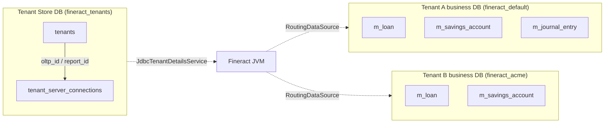
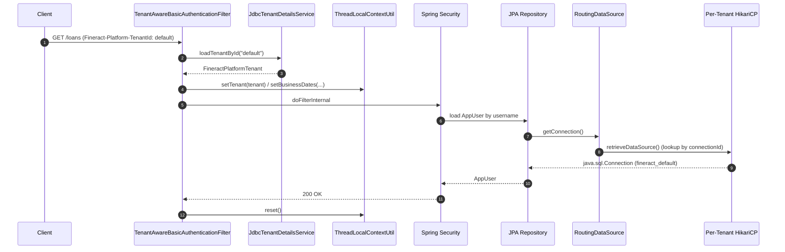

Apache Fineract is built as a **shared-application / shared-everything-except-data** multi-tenant platform. A single deployed JVM serves many financial institutions ("tenants") by routing every JDBC connection through a tenant-aware data source that is selected from a `ThreadLocal` at request time. This page is the umbrella reference for that subsystem — it ties together the master `fineract_tenants` registry, the per-tenant business database, the `ThreadLocalContextUtil` that propagates context across threads, and the HTTP filters that populate it from incoming requests.

The other pages in this section drill into each component:

| Page | Scope |
| ---- | ----- |
| [Tenant Details Service](/tenancy/tenant-details-service) | `JdbcTenantDetailsService`, the `tenants`/`tenant_server_connections` row model |
| [Tenant Database Routing](/tenancy/tenant-database-routing) | `RoutingDataSource`, `TomcatJdbcDataSourcePerTenantService`, HikariCP pool reuse |
| [Tenant-Aware Filters](/tenancy/tenant-aware-filters) | `TenantAwareBasicAuthenticationFilter`, `TenantAwareAuthenticationFilter`, `BusinessDateFilter` |
| [Tenant Store vs Tenant DB](/tenancy/tenant-store-vs-tenant-db) | Master DB (`fineract_tenants`) vs per-tenant business DB |
| [Business Date and COB Context](/tenancy/business-date-and-cob-context) | `BUSINESS_DATE` vs `COB_DATE`, `ActionContext.DEFAULT` vs `ActionContext.COB` |

## The two-tier database model

Fineract operates on **two logically separate kinds of database**:

1. A single **tenant store** (a.k.a. tenant registry, conventionally `fineract_tenants`). It hosts two tables:
   - `tenants` — one row per tenant, holding the tenant identifier, display name, timezone, and a foreign-key `oltp_id` / `report_id` to a connection row.
   - `tenant_server_connections` — one row per physical DB connection (host, port, schema, username, encrypted password, pool sizing, optional read-only replica).
2. **Per-tenant business databases** — one schema per tenant, holding actual business data (loans, savings, clients, journal entries, etc.). Convention is `fineract_<tenantIdentifier>` (e.g. `fineract_default`).



The application connects to the tenant store on bootstrap via the `hikariTenantDataSource` bean (configured by `spring.datasource.hikari.*` and pointed at `jdbc:mariadb://localhost:3306/fineract_tenants` by default). Every business request, by contrast, is routed to a HikariCP pool that was lazily created for the tenant referenced in the `Fineract-Platform-TenantId` header.

## The request lifecycle

A typical authenticated REST request flows through these stages:

1. **`TenantAwareBasicAuthenticationFilter`** reads the `Fineract-Platform-TenantId` header (or the `tenantIdentifier` query parameter), resolves the tenant via `AuthTenantDetailsService` → `JdbcTenantDetailsService` → tenant store DB, and writes the `FineractPlatformTenant` into `ThreadLocalContextUtil`. It also pre-loads business dates from the tenant DB.
2. Spring Security validates basic-auth credentials *against the tenant DB* — the credentials live in the per-tenant `m_appuser` table, so the routing data source already needs to be tenant-aware by this point. That works because credentials are looked up *after* the tenant context is populated.
3. **JPA/JDBC code** runs. Every `EntityManager` operation goes through `RoutingDataSource.getConnection()`, which delegates to `RoutingDataSourceServiceFactory` → `TomcatJdbcDataSourcePerTenantService` → the per-tenant HikariCP pool computed from `ThreadLocalContextUtil.getTenant().getConnection().getConnectionId()`.
4. **`BusinessDateFilter`** (registered after authentication) refreshes business dates inside the tenant DB scope if needed, so that any service that calls `ThreadLocalContextUtil.getBusinessDate()` sees the correct date for the request's `ActionContext`.
5. On exit, `TenantAwareBasicAuthenticationFilter.doFilterInternal()` calls `ThreadLocalContextUtil.reset()` in a `finally` block to wipe the thread before it returns to Tomcat's pool.



## The four ThreadLocals

`ThreadLocalContextUtil` (in `fineract-core`) holds the entire per-thread context. It exposes five logical slots, backed by four `ThreadLocal` fields:

```java
public final class ThreadLocalContextUtil {
    public static final String CONTEXT_TENANTS = "tenants";
    private static final ThreadLocal<String> contextHolder = new ThreadLocal<>();
    private static final ThreadLocal<FineractPlatformTenant> tenantContext = new ThreadLocal<>();
    private static final ThreadLocal<String> authTokenContext = new ThreadLocal<>();
    private static final ThreadLocal<HashMap<BusinessDateType, LocalDate>> businessDateContext = new ThreadLocal<>();
    private static final ThreadLocal<ActionContext> actionContext = new ThreadLocal<>();
    ...
}
```

| Slot | Type | Set by | Read by |
| ---- | ---- | ------ | ------- |
| `contextHolder` | `String` (e.g. `"tenants"`) | Liquibase migration, batch jobs targeting the master DB | `RoutingDataSourceServiceFactory.determineDataSourceService()` |
| `tenantContext` | `FineractPlatformTenant` | `TenantAwareBasicAuthenticationFilter`, `TenantAwareAuthenticationFilter`, scheduler context manager | `TomcatJdbcDataSourcePerTenantService.retrieveDataSource()`, every repository |
| `authTokenContext` | `String` (basic-auth value) | `TenantAwareBasicAuthenticationFilter` | Audit, request log |
| `businessDateContext` | `HashMap<BusinessDateType, LocalDate>` | `TenantAwareBasicAuthenticationFilter`, `BusinessDateFilter`, COB job | `ThreadLocalContextUtil.getBusinessDate()` from product/accounting code |
| `actionContext` | `ActionContext` (`DEFAULT` or `COB`) | COB job runner, integration tests | `ThreadLocalContextUtil.getBusinessDate()` to pick `BUSINESS_DATE` vs `COB_DATE` |

The `FineractContext` record bundles all five for serialization across thread boundaries (e.g. into a `@Async` executor or a batch step), and `ThreadLocalContextUtil.init(FineractContext)` rehydrates them on the receiving thread. See [Business Date and COB Context](/tenancy/business-date-and-cob-context) for the date/action slot semantics and [COB Overview](/cob/overview) for how the batch close-of-business job switches `ActionContext` to `COB`.

## Tenant resolution

Two authentication filters can populate the tenant slot. They never both run in a single chain — the deployment picks one Spring Security profile.

### Basic-auth path

```java
String tenantIdentifier = request.getHeader(TENANT_ID_REQUEST_HEADER);
if (org.apache.commons.lang3.StringUtils.isBlank(tenantIdentifier)) {
    tenantIdentifier = request.getParameter("tenantIdentifier");
}
if (tenantIdentifier == null && EXCEPTION_IF_HEADER_MISSING) {
    throw new InvalidTenantIdentifierException("No tenant identifier found: Add request header of '"
            + TENANT_ID_REQUEST_HEADER + "' or add the parameter 'tenantIdentifier' to query string of request URL.");
}
...
final FineractPlatformTenant tenant = basicAuthTenantDetailsService.loadTenantById(tenantIdentifier, isReportRequest);
ThreadLocalContextUtil.setTenant(tenant);
```

The constant `TENANT_ID_REQUEST_HEADER = "Fineract-Platform-TenantId"` is hard-coded in `TenantAwareBasicAuthenticationFilter`. Reports take a different code path (`isReportRequest = pathInfo.contains("report")`) so that the `TenantMapper` can join `tenant_server_connections` on `t.report_Id` instead of `t.oltp_Id`, picking up the optional read-only replica connection.

### OAuth2 / JWT path

`TenantAwareAuthenticationFilter` (used with the OAuth2 profile) parses the bearer JWT and reads a `tenant` claim:

```java
String token = resolver.resolve(request);
String tenantId;
if (token != null) {
    var jwt = JWTParser.parse(token); // not validated here!
    var claims = jwt.getJWTClaimsSet();
    tenantId = (String) claims.getClaim("tenant");
} else {
    tenantId = request.getParameter("tenantId");
}
ThreadLocalContextUtil.setTenant(tenantDetailsService.loadTenantById(tenantId, false));
```

Note the comment in source: the JWT is not validated in this filter — Spring Security's resource-server filter validates it later. The tenant claim is read in advance so the right DB is in use when token claims are joined against the per-tenant `m_appuser` row.

## Routing the data source

Once `ThreadLocalContextUtil.getTenant()` is populated, all JPA/JDBC traffic flows through the `dataSource` bean — which is `RoutingDataSource`, marked `@Primary`:

```java
@Service(value = "dataSource")
@Primary
public class RoutingDataSource extends AbstractDataSource {
    @Autowired
    private RoutingDataSourceServiceFactory dataSourceServiceFactory;

    @Override
    public Connection getConnection() throws SQLException {
        return determineTargetDataSource().getConnection();
    }

    public DataSource determineTargetDataSource() {
        return this.dataSourceServiceFactory.determineDataSourceService().retrieveDataSource();
    }
}
```

`RoutingDataSourceServiceFactory` picks between two `RoutingDataSourceService` beans:

- `"tomcatJdbcDataSourcePerTenantService"` (default) — returns the per-tenant Hikari pool keyed on `FineractPlatformTenantConnection.getConnectionId()`.
- `"dataSourceForTenants"` — selected when `ThreadLocalContextUtil.getDataSourceContext()` equals `CONTEXT_TENANTS` (`"tenants"`). This forces the master `hikariTenantDataSource` and is used during Liquibase migrations of the tenant store.

```java
public RoutingDataSourceService determineDataSourceService() {
    String serviceName = "tomcatJdbcDataSourcePerTenantService";
    if (ThreadLocalContextUtil.CONTEXT_TENANTS.equalsIgnoreCase(ThreadLocalContextUtil.getDataSourceContext())) {
        serviceName = "dataSourceForTenants";
    }
    return this.applicationContext.getBean(serviceName, RoutingDataSourceService.class);
}
```

`TomcatJdbcDataSourcePerTenantService` keeps a `ConcurrentHashMap<Long, DataSource>` keyed by `connectionId`, so the second request for a tenant reuses the same pool — see [Tenant Database Routing](/tenancy/tenant-database-routing).

## Bootstrapping tenants

On startup, `TenantDatabaseUpgradeService` (in `fineract-provider`) loops over `tenantDetailsService.findAllTenants()` and runs Liquibase against each tenant DB. It uses three Liquibase contexts that map cleanly to the changelog layout:

| Context | Purpose | Target DB |
| ------- | ------- | --------- |
| `tenant_store_db` | Master registry schema | `fineract_tenants` |
| `tenant_db` | Per-tenant business schema | `fineract_<id>` for each tenant |
| `initial_switch` | One-shot run that imports the legacy Flyway baseline (`0001_initial_schema.xml`, `0002_initial_data.xml`) so older deployments can switch to Liquibase cleanly | Both |

The master changelog `db/changelog/db.changelog-master.xml` glues these together:

```xml
<include file="tenant-store/initial-switch-changelog-tenant-store.xml" relativeToChangelogFile="true"
         context="tenant_store_db AND initial_switch"/>
<include file="tenant-store/changelog-tenant-store.xml" relativeToChangelogFile="true"
         context="tenant_store_db AND !initial_switch"/>
<include file="tenant/initial-switch-changelog-tenant.xml" relativeToChangelogFile="true"
         context="tenant_db AND initial_switch"/>
<include file="tenant/changelog-tenant.xml" relativeToChangelogFile="true"
         context="tenant_db AND !initial_switch"/>
<include file="db/changelog/tenant/module/loan/module-changelog-master.xml" context="tenant_db AND !initial_switch"/>
<include file="db/changelog/tenant/module/investor/module-changelog-master.xml" context="tenant_db AND !initial_switch"/>
...
```

See [Database / Per-Module Changelogs](/database/per-module-changelogs) for the full module list and ordering.

## Defaults and environment knobs

Both the master DB and the seed tenant are configured through `application.properties`, which honors `FINERACT_DEFAULT_TENANTDB_*` environment variables (see [JDBC env variables](/config/jdbc-env-variables)):

```properties
fineract.tenant.host=${FINERACT_DEFAULT_TENANTDB_HOSTNAME:localhost}
fineract.tenant.port=${FINERACT_DEFAULT_TENANTDB_PORT:3306}
fineract.tenant.username=${FINERACT_DEFAULT_TENANTDB_UID:root}
fineract.tenant.password=${FINERACT_DEFAULT_TENANTDB_PWD:mysql}
fineract.tenant.identifier=${FINERACT_DEFAULT_TENANTDB_IDENTIFIER:default}
fineract.tenant.name=${FINERACT_DEFAULT_TENANTDB_NAME:fineract_default}
fineract.tenant.master-password=${FINERACT_DEFAULT_TENANTDB_MASTER_PASSWORD:fineract}

spring.datasource.hikari.jdbcUrl=${FINERACT_HIKARI_JDBC_URL:jdbc:mariadb://localhost:3306/fineract_tenants}
spring.datasource.hikari.username=${FINERACT_HIKARI_USERNAME:root}
spring.datasource.hikari.password=${FINERACT_HIKARI_PASSWORD:mysql}
```

These are passed straight through to Liquibase via `spring.liquibase.parameters.fineract.tenant.*` properties so the initial-switch changeset can `INSERT INTO tenant_server_connections` and `INSERT INTO tenants` for the default seed tenant. After the first successful boot, you can add more tenants by inserting rows directly into the master DB (and creating their schemas), then restarting — `TenantDatabaseUpgradeService` will pick them up and run Liquibase against each one in parallel.

## Threading and async hand-off

Because the entire routing decision is keyed off a `ThreadLocal`, every place where Fineract crosses a thread boundary must explicitly carry the context with it. The pattern is:

```java
FineractContext ctx = ThreadLocalContextUtil.getContext();
executor.submit(() -> {
    try {
        ThreadLocalContextUtil.init(ctx);
        // run tenant-aware work
    } finally {
        ThreadLocalContextUtil.reset();
    }
});
```

The COB engine and Spring Batch jobs use this pattern verbatim through `FineractContext` plus a `TenantDataSourceContextHolder` task decorator. If you forget the `reset()` you will leak the previous request's tenant onto the next user of the worker thread — almost always a security incident.

## What this section does *not* cover

- **Cache isolation.** Fineract uses tenant-aware cache keys; see the cache section of the wiki.
- **Spring Batch sharing.** The batch metadata tables are stored in each tenant DB (see changeset `0021_add_spring_batch_db_structure.xml`).
- **Read-only replicas.** `FineractPlatformTenantConnection.readOnlySchemaServer` plus `fineract.mode.read-only` reroutes traffic to a follower; covered in [Tenant Database Routing](/tenancy/tenant-database-routing).

## Cross-references

- [Core / Datasource Tenant Routing](/core/datasource-tenant-routing)
- [Core / Business Date](/core/business-date)
- [Security / Basic and Tenant Filters](/security/basic-and-tenant-filters)
- [COB / Overview](/cob/overview)
- [Config / JDBC Environment Variables](/config/jdbc-env-variables)
