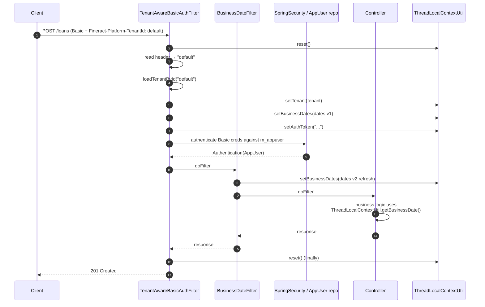

Apache Fineract's tenancy model relies on `ThreadLocalContextUtil` being populated *before* any business code runs. Two servlet filters from `fineract-security` are responsible for putting the right `FineractPlatformTenant` on the thread, and a third filter, `BusinessDateFilter`, refreshes the per-thread business-date map. This page documents all three end-to-end: the header they parse, the order they run in, and the exception path that converts misuse into HTTP errors.

## Filter chain shape

```mermaid
flowchart LR
    Req[HTTP request]
    CORS[CORS / OPTIONS]
    TenantAuth[TenantAwareBasicAuthenticationFilter<br/>or TenantAwareAuthenticationFilter]
    BD[BusinessDateFilter]
    AnonAuth[Other Spring Security filters]
    Controller[REST controller]
    Reset[ThreadLocalContextUtil.reset]
    Req --> CORS --> TenantAuth
    TenantAuth -->|sets tenant + dates| BD
    BD -->|refreshes dates| AnonAuth
    AnonAuth --> Controller
    Controller --> Reset
```



`TenantAwareBasicAuthenticationFilter` is for the default basic-auth profile; `TenantAwareAuthenticationFilter` is for the OAuth2 profile. They are mutually exclusive — the active Spring profile decides which one is in the chain.

## TenantAwareBasicAuthenticationFilter

The basic-auth variant extends Spring's `BasicAuthenticationFilter` so that, in a single filter, it can:

1. Reset the `ThreadLocal` to defeat thread reuse.
2. Resolve and set the tenant.
3. Prime the business-date map.
4. Stash the basic-auth credentials in `authTokenContext`.
5. Let `BasicAuthenticationFilter.doFilterInternal` perform actual credential validation — which now hits the *tenant* DB.

### Header / parameter contract

```java
private static final String TENANT_ID_REQUEST_HEADER = "Fineract-Platform-TenantId";
private static final boolean EXCEPTION_IF_HEADER_MISSING = true;
```

The constant is hard-coded. The header is **required** unless a `tenantIdentifier` query parameter is provided:

```java
String tenantIdentifier = request.getHeader(TENANT_ID_REQUEST_HEADER);
if (org.apache.commons.lang3.StringUtils.isBlank(tenantIdentifier)) {
    tenantIdentifier = request.getParameter("tenantIdentifier");
}
if (tenantIdentifier == null && EXCEPTION_IF_HEADER_MISSING) {
    throw new InvalidTenantIdentifierException("No tenant identifier found: Add request header of '"
            + TENANT_ID_REQUEST_HEADER + "' or add the parameter 'tenantIdentifier' to query string of request URL.");
}
```

| Source | Precedence | Example |
| ------ | ---------- | ------- |
| `Fineract-Platform-TenantId` header | First | `Fineract-Platform-TenantId: default` |
| `tenantIdentifier` query parameter | Fallback | `?tenantIdentifier=default` |
| Neither | `400 Bad Request` with `WWW-Authenticate` | — |

The query-parameter fallback is for browsers / report tools that cannot set custom headers.

### Full doFilterInternal flow

```java
@Override
@SuppressFBWarnings("SLF4J_SIGN_ONLY_FORMAT")
protected void doFilterInternal(HttpServletRequest request, HttpServletResponse response, FilterChain filterChain)
        throws ServletException, IOException {

    final StopWatch task = new StopWatch();
    task.start();

    try {
        ThreadLocalContextUtil.reset();
        if ("OPTIONS".equalsIgnoreCase(request.getMethod())) {
            // ignore to allow 'preflight' requests from AJAX applications
            filterChain.doFilter(request, response);
        } else {
            if (requestMatcher.matches(request)) {
                String tenantIdentifier = request.getHeader(TENANT_ID_REQUEST_HEADER);
                if (org.apache.commons.lang3.StringUtils.isBlank(tenantIdentifier)) {
                    tenantIdentifier = request.getParameter("tenantIdentifier");
                }
                if (tenantIdentifier == null && EXCEPTION_IF_HEADER_MISSING) {
                    throw new InvalidTenantIdentifierException("No tenant identifier found...");
                }

                String pathInfo = request.getRequestURI();
                boolean isReportRequest = false;
                if (pathInfo != null && pathInfo.contains("report")) {
                    isReportRequest = true;
                }
                final FineractPlatformTenant tenant =
                    basicAuthTenantDetailsService.loadTenantById(tenantIdentifier, isReportRequest);
                ThreadLocalContextUtil.setTenant(tenant);
                HashMap<BusinessDateType, LocalDate> businessDates =
                    businessDateReadPlatformService.getBusinessDates();
                ThreadLocalContextUtil.setBusinessDates(businessDates);
                String authToken = request.getHeader("Authorization");

                if (authToken != null && authToken.startsWith("Basic ")) {
                    ThreadLocalContextUtil.setAuthToken(authToken.replaceFirst("Basic ", ""));
                }

                if (!FIRST_REQUEST_PROCESSED) {
                    final String baseUrl = request.getRequestURL().toString().replace(request.getPathInfo(), "/");
                    System.setProperty("baseUrl", baseUrl);

                    final boolean ehcacheEnabled = configurationDomainService.isEhcacheEnabled();
                    if (ehcacheEnabled) {
                        cacheWritePlatformService.switchToCache(CacheType.SINGLE_NODE);
                    } else {
                        cacheWritePlatformService.switchToCache(CacheType.NO_CACHE);
                    }
                    TenantAwareBasicAuthenticationFilter.FIRST_REQUEST_PROCESSED = true;
                }
            }

            super.doFilterInternal(request, response, filterChain);
        }
    } catch (final InvalidTenantIdentifierException e) {
        SecurityContextHolder.getContext().setAuthentication(null);
        response.addHeader("WWW-Authenticate", "Basic realm=\"" + "Fineract Platform API" + "\"");
        response.sendError(HttpServletResponse.SC_BAD_REQUEST, e.getMessage());
    } finally {
        ThreadLocalContextUtil.reset();
        task.stop();
        final PlatformRequestLog msg = PlatformRequestLog.from(task, request);
        log.debug("{}", toApiJsonSerializer.serialize(msg));
    }
}
```

Step-by-step:

1. **`ThreadLocalContextUtil.reset()` (defensive).** Tomcat reuses worker threads, and any earlier request that crashed before its own `reset()` would leak. Doing it at the start guarantees a clean slate.
2. **CORS preflight bypass.** `OPTIONS` requests skip the entire flow so browsers can do the preflight without credentials.
3. **`requestMatcher.matches(request)` gate.** Defaults to `AnyRequestMatcher.INSTANCE`; can be tightened to skip certain paths.
4. **Resolve tenant.** Calls `AuthTenantDetailsService.loadTenantById(tenantIdentifier, isReportRequest)` which forwards to `JdbcTenantDetailsService`. The `isReportRequest` flag is set when the URI contains `report` — this swaps the `tenant_server_connections` join to `t.report_Id` so report queries land on the read replica.
5. **Set tenant.** `ThreadLocalContextUtil.setTenant(tenant)` — every subsequent JPA call now routes to the tenant DB.
6. **Prime business dates.** Calls `BusinessDateReadPlatformService.getBusinessDates()` (which now runs against the tenant DB) and stuffs the result into `ThreadLocalContextUtil`. The downstream `BusinessDateFilter` will refresh this again — defensive duplication.
7. **Capture basic auth.** The `Basic ` prefix is stripped and the base64 value is stored in `authTokenContext`. Used by audit logging.
8. **First-request setup.** On the very first request (across the JVM lifetime), capture `baseUrl` as a system property — used by reports that need to render absolute links — and switch caches into the right mode based on the tenant DB's `c_configuration` table.
9. **Delegate to Spring Security.** `super.doFilterInternal(request, response, filterChain)` is the inherited `BasicAuthenticationFilter` body, which parses the `Authorization` header, calls `AuthenticationManager.authenticate(...)`, and on success places the `Authentication` in `SecurityContextHolder`. The `AuthenticationProvider` queries `m_appuser` in the tenant DB.
10. **Error path.** `InvalidTenantIdentifierException` → clear the security context (so a half-built principal does not leak) and emit `400 Bad Request` with `WWW-Authenticate`. Note the realm string — `"Fineract Platform API"`.
11. **Always reset.** The `finally` block guarantees `ThreadLocalContextUtil.reset()` runs even on exception. Then the request is logged via `PlatformRequestLog` for the access log.

### Post-authentication hook

```java
@Override
protected void onSuccessfulAuthentication(HttpServletRequest request, HttpServletResponse response, Authentication authResult)
        throws IOException {
    super.onSuccessfulAuthentication(request, response, authResult);
    AppUser user = (AppUser) authResult.getPrincipal();

    if (userNotificationService.hasUnreadUserNotifications(user.getId())) {
        response.addHeader("X-Notification-Refresh", "true");
    } else {
        response.addHeader("X-Notification-Refresh", "false");
    }
}
```

Once Spring Security has authenticated the principal (an `AppUser`), the filter checks for unread notifications in the tenant DB and sets `X-Notification-Refresh` for the UI to consume.

## TenantAwareAuthenticationFilter (OAuth2 / JWT)

For OAuth2 deployments, the JWT-parsing variant runs in place of the basic-auth filter:

```java
@RequiredArgsConstructor
public class TenantAwareAuthenticationFilter extends OncePerRequestFilter {

    private final BearerTokenResolver resolver;
    private final AuthTenantDetailsService tenantDetailsService;

    @Override
    protected void doFilterInternal(@NonNull HttpServletRequest request, @NonNull HttpServletResponse response,
            @NonNull FilterChain filterChain) throws ServletException, IOException {
        try {
            String token = resolver.resolve(request);
            String tenantId;
            if (token != null) {
                var jwt = JWTParser.parse(token); // not validated here!
                var claims = jwt.getJWTClaimsSet();
                tenantId = (String) claims.getClaim("tenant");
            } else {
                tenantId = request.getParameter("tenantId");
            }
            ThreadLocalContextUtil.setTenant(tenantDetailsService.loadTenantById(tenantId, false));
            filterChain.doFilter(request, response);
        } catch (Exception e) {
            filterChain.doFilter(request, response); // don't block; real auth will fail later if token is bad
        } finally {
            ThreadLocalContextUtil.reset();
        }
    }
}
```

Notable differences vs the basic-auth filter:

| Concern | Basic auth | OAuth2 |
| ------- | ---------- | ------ |
| Tenant source | `Fineract-Platform-TenantId` header / `tenantIdentifier` query parameter | `tenant` JWT claim / `tenantId` query parameter |
| Token validation | Spring Security validates Basic creds against `m_appuser` after tenant set | This filter does **not** validate the JWT. Spring Security's resource-server filter validates it later. |
| Report routing | `isReportRequest` based on URI `contains("report")` | Always `false` (no report distinction) |
| Business date priming | Done inline | Deferred to `BusinessDateFilter` |
| Error handling | Throws `InvalidTenantIdentifierException` → 400 | Swallows all exceptions, lets Spring Security reject the bad token |

The OAuth2 filter is intentionally permissive about errors — it has no opinion on whether the request should succeed, only that the right tenant be on the thread *if possible*. A request with no token and no `tenantId` parameter results in `null` tenant, which then routes to the master DB and is virtually guaranteed to fail later — but in a way that produces a normal Spring Security `401`, not a custom `400`.

## BusinessDateFilter

```java
@RequiredArgsConstructor
public class BusinessDateFilter extends OncePerRequestFilter {

    private final BusinessDateReadPlatformService businessDateReadPlatformService;

    @Override
    protected void doFilterInternal(@NonNull HttpServletRequest request, @NonNull HttpServletResponse response,
            @NonNull FilterChain filterChain) throws ServletException, IOException {
        if (ThreadLocalContextUtil.getTenant() != null) {
            HashMap<BusinessDateType, LocalDate> businessDates = businessDateReadPlatformService.getBusinessDates();
            ThreadLocalContextUtil.setBusinessDates(businessDates);
        }
        filterChain.doFilter(request, response);
    }
}
```

Tiny but important:

- It runs **after** the tenant filter. `getTenant() != null` is the precondition — without a tenant, the date service would try to read from the master DB.
- It overwrites whatever the upstream filter put in `businessDateContext`. For the basic-auth profile, the upstream already set dates; this is a refresh after Spring Security may have done something asynchronous. For the OAuth2 profile, this is the *first* time the dates are loaded.
- It does **not** call `ThreadLocalContextUtil.reset()` — that responsibility stays with the upstream tenant filter's `finally` block.

`BusinessDateReadPlatformService.getBusinessDates()` reads from `m_business_date` in the tenant DB and returns the map keyed by `BusinessDateType`. The two stored types are `BUSINESS_DATE` and `COB_DATE`. See [Business Date and COB Context](/tenancy/business-date-and-cob-context).

## Order of operations

In the Spring Security filter chain, the order is set by `SecurityFilterChain` registration in `fineract-provider`. The conceptual order is:

| Position | Filter | Responsibility |
| -------- | ------ | -------------- |
| 1 | CORS / OPTIONS handler | Skip auth for preflight |
| 2 | `TenantAwareBasicAuthenticationFilter` *or* `TenantAwareAuthenticationFilter` | Set tenant, do credentials |
| 3 | `BusinessDateFilter` | Refresh business dates |
| 4 | OAuth2 `JwtAuthenticationFilter` (OAuth2 profile only) | Validate JWT |
| 5 | Authorization filters | Permission checks |
| 6 | Controller | Business logic |



## Failure scenarios

| Scenario | Filter | Outcome |
| -------- | ------ | ------- |
| Missing tenant header & parameter | `TenantAwareBasicAuthenticationFilter` | `400 Bad Request`, `WWW-Authenticate: Basic realm="Fineract Platform API"` |
| Unknown tenant identifier | `JdbcTenantDetailsService` → `InvalidTenantIdentifierException` → 400 | same as above |
| Master password mismatch (decryption fails) | `DataSourcePerTenantServiceFactory.createNewDataSourceFor` on first JPA call | `IllegalArgumentException` → 500 |
| Bad basic-auth credentials | Spring Security's inherited path | 401 Unauthorized |
| Invalid JWT | `TenantAwareAuthenticationFilter` swallows; later filter rejects | 401 Unauthorized |
| Business date service throws | `TenantAwareBasicAuthenticationFilter.setBusinessDates` raises | 500 (filter rethrows from `try` block) |
| Filter throws after `setTenant` | `finally` block guarantees `reset()` | clean thread for next request |

## Things that *can* break tenancy

- **Forgetting `ThreadLocalContextUtil.reset()` in custom filters.** Any filter that wraps the chain with its own `try/finally` must include `reset()` if it sets tenant.
- **`@Async` without context propagation.** Use `FineractContext` and `ThreadLocalContextUtil.init(ctx)` on the worker.
- **Spring Batch listeners** must call `init()` in `beforeStep` / `reset()` in `afterStep`. The COB engine does this; custom jobs must follow suit.
- **Manual `JdbcTemplate(new HikariDataSource(...))`** bypasses routing entirely. Always inject the routing `DataSource` bean.

## Cross-references

- [Tenancy / Overview](/tenancy/overview)
- [Tenancy / Tenant Details Service](/tenancy/tenant-details-service)
- [Tenancy / Business Date and COB Context](/tenancy/business-date-and-cob-context)
- [Security / Basic and Tenant Filters](/security/basic-and-tenant-filters)
- [Core / Business Date](/core/business-date)
- [COB / Overview](/cob/overview)
