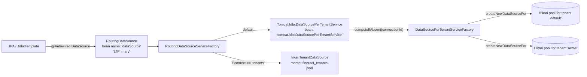
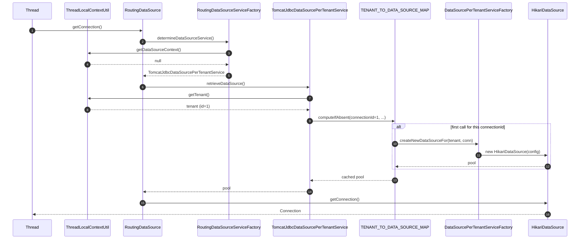

`RoutingDataSource` is the single `DataSource` bean that the entire Apache Fineract application — Spring Data, JdbcTemplate, EclipseLink, Spring Batch — sees as `dataSource`. Every JDBC call passes through it, and every call is dispatched to the correct **per-tenant HikariCP pool** based on the `FineractPlatformTenant` currently sitting in `ThreadLocalContextUtil`. This page traces that dispatch from `getConnection()` down to the per-tenant Hikari instance and explains how pools are created, cached, and (rarely) torn down.

## The bean graph



Three beans implement `DataSource`:

| Bean | Class | Role |
| ---- | ----- | ---- |
| `dataSource` | `RoutingDataSource` (`@Primary`) | The single entry point. Forwards to the chosen `RoutingDataSourceService`. |
| `hikariTenantDataSource` | `HikariDataSource` | The master pool that talks to `fineract_tenants`. Used by `JdbcTenantDetailsService` and as a fallback. |
| (anonymous, one per tenant) | `HikariDataSource` | Created on demand by `DataSourcePerTenantServiceFactory`. |

Plus two `RoutingDataSourceService` strategy beans (`tomcatJdbcDataSourcePerTenantService` is the default).

## RoutingDataSource

The class is short — a Spring `AbstractDataSource` that delegates everything to the strategy:

```java
@Service(value = "dataSource")
@Primary
public class RoutingDataSource extends AbstractDataSource {

    @Autowired
    private RoutingDataSourceServiceFactory dataSourceServiceFactory;

    @Override
    public Connection getConnection() throws SQLException {
        return determineTargetDataSource().getConnection();
    }

    public DataSource determineTargetDataSource() {
        return this.dataSourceServiceFactory.determineDataSourceService().retrieveDataSource();
    }

    @Override
    public Connection getConnection(final String username, final String password) throws SQLException {
        return determineTargetDataSource().getConnection(username, password);
    }
}
```

Inspired by Spring's `AbstractRoutingDataSource`, but unlike that helper class `RoutingDataSource` does not maintain its own `Map<Object, DataSource>`. The pool map lives one layer deeper, inside `TomcatJdbcDataSourcePerTenantService`, so that the routing **service** can be replaced without recreating routing **infrastructure**.

The `@Primary` annotation means `@Autowired DataSource` always resolves to this bean. If you genuinely want the master pool you must use `@Qualifier("hikariTenantDataSource")` explicitly.

## RoutingDataSourceServiceFactory

```java
@Component
public class RoutingDataSourceServiceFactory {

    @Autowired
    private ApplicationContext applicationContext;

    public RoutingDataSourceService determineDataSourceService() {
        String serviceName = "tomcatJdbcDataSourcePerTenantService";
        if (ThreadLocalContextUtil.CONTEXT_TENANTS.equalsIgnoreCase(ThreadLocalContextUtil.getDataSourceContext())) {
            serviceName = "dataSourceForTenants";
        }
        return this.applicationContext.getBean(serviceName, RoutingDataSourceService.class);
    }
}
```

The factory picks a bean name string-based — convenient for swap-in mocks but invisible to compile-time tools. There are two valid bean names:

| Bean name | Implementation | When chosen |
| --------- | -------------- | ----------- |
| `tomcatJdbcDataSourcePerTenantService` | `TomcatJdbcDataSourcePerTenantService` | Default. `ThreadLocalContextUtil.getDataSourceContext()` is null or anything other than `"tenants"`. |
| `dataSourceForTenants` | A thin wrapper that always returns the master pool (defined in `fineract-provider`). | When `ThreadLocalContextUtil.setDataSourceContext("tenants")` has been called — used by Liquibase migration code that needs to operate on the master schema while a request is in flight. |

The constant `ThreadLocalContextUtil.CONTEXT_TENANTS = "tenants"` is the only legal value besides `null`.

## TomcatJdbcDataSourcePerTenantService

Despite the historical "Tomcat JDBC" name (it predates Hikari), this class is now a thin Hikari-pool registry. The full source:

```java
@Slf4j
@Service
@RequiredArgsConstructor
public class TomcatJdbcDataSourcePerTenantService
        implements RoutingDataSourceService, ApplicationListener<ContextRefreshedEvent> {

    private static final Map<Long, DataSource> TENANT_TO_DATA_SOURCE_MAP = new ConcurrentHashMap<>();
    @Qualifier("hikariTenantDataSource")
    private final DataSource tenantDataSource;
    private final TenantDetailsService tenantDetailsService;
    private final DataSourcePerTenantServiceFactory dataSourcePerTenantServiceFactory;

    private final Set<Long> tenantMoneyInitializingSet = Sets.newConcurrentHashSet();
    @Autowired(required = false)
    private MoneyHelperInitializationService moneyHelperInitializationService;

    @Override
    public DataSource retrieveDataSource() {
        // default to tenant database datasource
        DataSource actualDataSource = this.tenantDataSource;

        final FineractPlatformTenant tenant = ThreadLocalContextUtil.getTenant();
        if (tenant != null) {
            final FineractPlatformTenantConnection tenantConnection = tenant.getConnection();
            Long tenantConnectionKey = tenantConnection.getConnectionId();
            actualDataSource = TENANT_TO_DATA_SOURCE_MAP.computeIfAbsent(tenantConnectionKey,
                (key) -> dataSourcePerTenantServiceFactory.createNewDataSourceFor(tenant, tenantConnection));
        }

        // money helper rounding mode init (one-time per tenant)
        if (moneyHelperInitializationService != null && tenant != null) {
            Long connectionId = tenant.getConnection().getConnectionId();
            if (!tenantMoneyInitializingSet.contains(connectionId)
                    && !moneyHelperInitializationService.isTenantInitialized(tenant)) {
                synchronized (tenantMoneyInitializingSet) {
                    if (!tenantMoneyInitializingSet.contains(connectionId)) {
                        tenantMoneyInitializingSet.add(connectionId);
                        moneyHelperInitializationService.initializeTenantRoundingMode(tenant);
                        tenantMoneyInitializingSet.remove(connectionId);
                    }
                }
            }
        }
        return actualDataSource;
    }
    ...
}
```

Key observations:

1. **The map is `static`.** All instances share one global pool registry. There is exactly one `TomcatJdbcDataSourcePerTenantService` bean per JVM, but the field is `static` so the map survives Spring context recreation in tests.
2. **The key is `connectionId`, not `tenantIdentifier`.** This means two tenants that share a `tenant_server_connections` row (e.g. two logical tenants residing in the same physical schema — uncommon but supported) will share a pool. The pool is sized for the **connection**, not the tenant.
3. **Fallback is the master pool.** If `ThreadLocalContextUtil.getTenant()` is `null` — which happens during early startup or in unit tests that forgot to set up the context — `retrieveDataSource()` returns the master `hikariTenantDataSource`. That is a footgun: queries against `m_loan` will fail with "Table 'fineract_tenants.m_loan' doesn't exist". Always set the tenant before calling JPA.
4. **One-shot rounding-mode init.** The first time the pool is touched for a tenant, the platform initializes its `MathContext`/rounding mode by reading `c_configuration` from the tenant DB. The `tenantMoneyInitializingSet` plus `synchronized` block guarantees that initialization runs only once per tenant, even under concurrent first-touch.

### Warm-up on context refresh

```java
@Override
public void onApplicationEvent(ContextRefreshedEvent event) {
    final List<FineractPlatformTenant> allTenants = tenantDetailsService.findAllTenants();
    for (final FineractPlatformTenant tenant : allTenants) {
        initializeDataSourceConnection(tenant);
    }
}

private void initializeDataSourceConnection(FineractPlatformTenant tenant) {
    log.debug("Initializing database connection for {}", tenant.getName());
    final FineractPlatformTenantConnection tenantConnection = tenant.getConnection();
    Long tenantConnectionKey = tenantConnection.getConnectionId();
    TENANT_TO_DATA_SOURCE_MAP.computeIfAbsent(tenantConnectionKey, (key) -> {
        DataSource tenantSpecificDataSource = dataSourcePerTenantServiceFactory.createNewDataSourceFor(tenant, tenantConnection);
        try (Connection connection = tenantSpecificDataSource.getConnection()) {
            String url = connection.getMetaData().getURL();
            log.debug("Established database connection with URL {}", url);
        } catch (SQLException e) {
            log.error("Error while initializing database connection for {}", tenant.getName(), e);
        }
        return tenantSpecificDataSource;
    });
}
```

The `ContextRefreshedEvent` handler iterates every tenant and forces pool creation up front. This catches misconfigured tenants at startup rather than on the first user request, and it pre-warms HikariCP's minimum-idle connection set.

## DataSourcePerTenantServiceFactory — pool creation

The actual `HikariDataSource` construction lives in `DataSourcePerTenantServiceFactory.createNewDataSourceFor()`:

```java
public DataSource createNewDataSourceFor(FineractPlatformTenant tenant, FineractPlatformTenantConnection tenantConnection) {
    if (!databasePasswordEncryptor.isMasterPasswordHashValid(tenantConnection.getMasterPasswordHash())) {
        throw new IllegalArgumentException(
            "Invalid master password on tenant connection %d.".formatted(tenantConnection.getConnectionId()));
    }
    String protocol = toProtocol(tenantDataSource);
    // Default properties for Writing
    String schemaServer = tenantConnection.getSchemaServer();
    String schemaPort = tenantConnection.getSchemaServerPort();
    String schemaName = tenantConnection.getSchemaName();
    String schemaUsername = tenantConnection.getSchemaUsername();
    String schemaPassword = tenantConnection.getSchemaPassword();
    String schemaConnectionParameters = tenantConnection.getSchemaConnectionParameters();
    // Properties for ReadOnly case
    if (fineractProperties.getMode().isReadOnlyMode()) {
        schemaServer = StringUtils.defaultIfBlank(tenantConnection.getReadOnlySchemaServer(), schemaServer);
        schemaPort = StringUtils.defaultIfBlank(tenantConnection.getReadOnlySchemaServerPort(), schemaPort);
        schemaName = StringUtils.defaultIfBlank(tenantConnection.getReadOnlySchemaName(), schemaName);
        schemaUsername = StringUtils.defaultIfBlank(tenantConnection.getReadOnlySchemaUsername(), schemaUsername);
        schemaPassword = StringUtils.defaultIfBlank(tenantConnection.getReadOnlySchemaPassword(), schemaPassword);
        schemaConnectionParameters = StringUtils.defaultIfBlank(
            tenantConnection.getReadOnlySchemaConnectionParameters(), schemaConnectionParameters);
    }
    String jdbcUrl = toJdbcUrl(protocol, schemaServer, schemaPort, schemaName, schemaConnectionParameters);

    HikariConfig config = new HikariConfig();
    config.setReadOnly(fineractProperties.getMode().isReadOnlyMode());
    config.setJdbcUrl(jdbcUrl);
    config.setPoolName(schemaName + "_pool");
    config.setUsername(schemaUsername);
    config.setPassword(databasePasswordEncryptor.decrypt(schemaPassword));
    config.setMinimumIdle(getMinPoolSize(tenantConnection));
    config.setMaximumPoolSize(getMaxPoolSize(tenantConnection));
    config.setValidationTimeout(tenantConnection.getValidationInterval());
    config.setDriverClassName(hikariConfig.getDriverClassName());
    config.setConnectionTestQuery(hikariConfig.getConnectionTestQuery());
    config.setAutoCommit(hikariConfig.isAutoCommit());

    config.setRegisterMbeans(true);
    meterRegistry.ifPresent(registry -> config.setMetricsTrackerFactory(
        new TenantConnectionPoolMetricsTrackerFactory(tenant.getTenantIdentifier(), registry)));

    config.setDataSourceProperties(hikariConfig.getDataSourceProperties());

    return hikariDataSourceFactory.create(config);
}
```

### Read-only mode

When `fineract.mode.read-only=true`, the factory rewrites every connection parameter to its `readOnlySchema*` counterpart **if present**. Missing read-only values fall back to the OLTP equivalents (`StringUtils.defaultIfBlank(...)`). It also sets `HikariConfig.setReadOnly(true)`, which propagates to the JDBC driver — for MariaDB and PostgreSQL this hints the driver to route to a replica when one is configured at the driver level.

There are three Fineract "modes" — write-enabled, read-only, and batch-only — controlled by `fineract.mode.*` properties. Read-only also disables Liquibase entirely.

### Pool-size overrides

Tenant-level pool sizes from `tenant_server_connections.pool_max_active` and `pool_initial_size` can be globally overridden via `FINERACT_CONFIG_MAX_POOL_SIZE` / `FINERACT_CONFIG_MIN_POOL_SIZE`:

```java
private int getMaxPoolSize(FineractPlatformTenantConnection tenantConnection) {
    FineractProperties.FineractConfigProperties configOverride = fineractProperties.getTenant().getConfig();
    if (configOverride.isMaxPoolSizeSet()) {
        int maxPoolSize = configOverride.getMaxPoolSize();
        log.info("Overriding tenant datasource maximum pool size configuration to {}", maxPoolSize);
        return maxPoolSize;
    } else {
        return tenantConnection.getMaxActive();
    }
}
```

So the precedence is: env var `FINERACT_CONFIG_*` > tenant registry row > defaults from `application.properties`. Useful in container environments where you don't want operators to need to update every `tenant_server_connections` row when a node's resource limits change.

### Metrics

If a Micrometer `MeterRegistry` is available, each per-tenant pool is wired to a `TenantConnectionPoolMetricsTrackerFactory` that tags every Hikari metric with the tenant identifier:

```text
hikaricp.connections.usage{pool="fineract_default_pool", tenant="default"} 5
hikaricp.connections.active{pool="fineract_acme_pool", tenant="acme"} 2
```

This is what lets per-tenant pool dashboards work without scraping different endpoints per tenant.

### Pool name

`config.setPoolName(schemaName + "_pool")` — so the JMX/log identifier is the **schema** name, not the tenant identifier. For a tenant `default` whose schema is `fineract_default`, the pool shows up as `fineract_default_pool`.

## DatabaseType awareness

`DatabaseTypeResolver` reads `HikariConfig.getDriverClassName()` once at startup and decides MySQL/MariaDB vs PostgreSQL:

```java
private static final Map<String, DatabaseType> DRIVER_MAPPING = Map.of(
        "org.mariadb.jdbc.Driver", DatabaseType.MYSQL,
        "com.mysql.jdbc.Driver", DatabaseType.MYSQL,
        "com.mysql.cj.jdbc.Driver", DatabaseType.MYSQL,
        "org.postgresql.Driver", DatabaseType.POSTGRESQL);
```

This implies **all tenants must use the same RDBMS family** — you cannot mix MariaDB tenants and PostgreSQL tenants in the same JVM. The same driver class is registered globally and `DatabaseSpecificSQLGenerator` chooses dialect-specific SQL up front, not per query. Mixed-engine deployments require separate JVMs.

`DatabaseSelectingPersistenceUnitPostProcessor` ties this into EclipseLink:

```java
@Override
public void postProcessPersistenceUnitInfo(MutablePersistenceUnitInfo pui) {
    DatabaseType databaseType = databaseTypeResolver.databaseType();
    String targetDatabase = TARGET_DATABASE_MAP.get(databaseType);
    if (targetDatabase == null) {
        throw new IllegalStateException("Unsupported database: " + databaseType);
    }
    pui.addProperty(PersistenceUnitProperties.TARGET_DATABASE, targetDatabase);
}
```

So EclipseLink's `TARGET_DATABASE` is set once during persistence-unit construction based on the master pool's driver — every tenant inherits the same JPA dialect.

## Pool lifecycle

| Event | What happens |
| ----- | ------------ |
| JVM startup | `ContextRefreshedEvent` → `onApplicationEvent` → `findAllTenants()` → one pool per tenant warmed via `initializeDataSourceConnection`. |
| First request for an unwarmed tenant | `retrieveDataSource()` → `TENANT_TO_DATA_SOURCE_MAP.computeIfAbsent` → `createNewDataSourceFor` → new pool added. |
| Subsequent requests | `computeIfAbsent` hits the existing entry — O(1) lookup. |
| Tenant credentials rotated | The pool **is not invalidated**. Restart the JVM after rotating credentials, or remove the entry from the map (no public API for that). |
| Tenant deleted from `tenants` | The pool stays alive in the map until JVM restart. Active connections continue to work. |
| JVM shutdown | Spring closes every `HikariDataSource` bean. Pools created via the factory **are not registered** as Spring beans, so the `HikariDataSourceFactory` wraps `HikariDataSource.close()` calls into shutdown hooks. |

## Threading model

Every `getConnection()` call:

1. Reads `ThreadLocalContextUtil.getTenant()` — O(1), no locks.
2. Reads from the static `ConcurrentHashMap` — lock-free under the read-heavy path.
3. Hits a single `HikariDataSource.getConnection()` — Hikari's internal queue handles concurrency.

No additional locking is added by Fineract. The only `synchronized` block is the one-time per-tenant rounding-mode init.



## Integration with the rest of Fineract

- **EclipseLink JPA** sees `RoutingDataSource` and creates one `EntityManagerFactory` for it. Because the wrapped `DataSource` changes per request, EclipseLink's prepared-statement cache is keyed per connection, which is safe.
- **Spring Batch metadata** lives inside each tenant's DB (changeset `0021_add_spring_batch_db_structure.xml`). Batch jobs that span tenants must call `ThreadLocalContextUtil.init(...)` themselves on each step.
- **Liquibase** uses an explicitly-constructed `HikariDataSource` per tenant via `TenantDataSourceFactory.create(tenant)`, *not* the routing pool — this avoids holding routing connections during long DDL.
- **Health checks.** Actuator's `/actuator/health` calls `RoutingDataSource.getConnection()` with no tenant context set; it lands on the master pool (the fallback). A healthy master DB therefore makes `/health` report `UP`, which is usually what you want.

## Cross-references

- [Tenancy / Overview](/tenancy/overview)
- [Tenancy / Tenant Details Service](/tenancy/tenant-details-service)
- [Tenancy / Tenant Store vs Tenant DB](/tenancy/tenant-store-vs-tenant-db)
- [Core / Datasource Tenant Routing](/core/datasource-tenant-routing)
- [Config / JDBC Environment Variables](/config/jdbc-env-variables)
