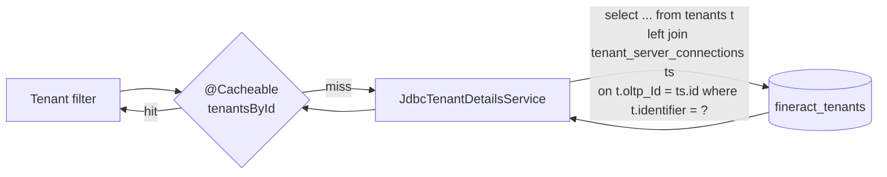

`TenantDetailsService` is the gateway between Apache Fineract's running JVM and the master tenant registry. It is the only component that issues SQL against the `fineract_tenants` database during normal operation, and it converts the registry rows into the immutable `FineractPlatformTenant` value object that is stuffed into `ThreadLocalContextUtil` on every authenticated request. This page documents the interface, its single production implementation (`JdbcTenantDetailsService`), the SQL it emits via `TenantMapper`, and the Spring cache that keeps it cheap.

## The interface

```java
package org.apache.fineract.infrastructure.core.service.tenant;

import java.util.List;
import org.apache.fineract.infrastructure.core.domain.FineractPlatformTenant;

public interface TenantDetailsService {

    FineractPlatformTenant loadTenantById(String tenantId);

    List<FineractPlatformTenant> findAllTenants();
}
```

Two methods, both returning `FineractPlatformTenant`:

| Method | Use case |
| ------ | -------- |
| `loadTenantById(String tenantId)` | Per-request lookup from `TenantAwareBasicAuthenticationFilter` / `TenantAwareAuthenticationFilter` after parsing the `Fineract-Platform-TenantId` header. |
| `findAllTenants()` | Bootstrap — `TenantDatabaseUpgradeService.upgradeIndividualTenants()` iterates every tenant on startup to run Liquibase; `TomcatJdbcDataSourcePerTenantService.onApplicationEvent(ContextRefreshedEvent)` warms the Hikari pool map. |

A second, security-flavoured wrapper, `AuthTenantDetailsService` (in `fineract-security`), exposes `loadTenantById(String tenantId, boolean isReportRequest)` and is what the HTTP filters call directly. Its default implementation delegates to `JdbcTenantDetailsService` but flips the `isReport` flag on `TenantMapper`.

## JdbcTenantDetailsService

```java
@Service("tenantDetailsService")
public class JdbcTenantDetailsService implements TenantDetailsService {

    private final JdbcTemplate jdbcTemplate;

    @Autowired
    public JdbcTenantDetailsService(@Qualifier("hikariTenantDataSource") final DataSource dataSource) {
        this.jdbcTemplate = new JdbcTemplate(dataSource);
    }

    @Override
    @Cacheable(value = "tenantsById")
    public FineractPlatformTenant loadTenantById(final String tenantIdentifier) {
        if (isBlank(tenantIdentifier)) {
            throw new IllegalArgumentException("tenantIdentifier cannot be blank");
        }
        try {
            final TenantMapper rm = new TenantMapper(false);
            final String sql = "select " + rm.schema() + " where t.identifier = ?";
            return this.jdbcTemplate.queryForObject(sql, rm, new Object[] { tenantIdentifier });
        } catch (final EmptyResultDataAccessException e) {
            throw new InvalidTenantIdentifierException(
                "The tenant identifier: " + tenantIdentifier + " is not valid.", e);
        }
    }

    @Override
    public List<FineractPlatformTenant> findAllTenants() {
        final TenantMapper rm = new TenantMapper(false);
        final String sql = "select  " + rm.schema();
        return this.jdbcTemplate.query(sql, rm);
    }
}
```

Three things to notice:

1. **It is wired to `hikariTenantDataSource`, not to the routing `dataSource`.** The `@Qualifier("hikariTenantDataSource")` injects the master pool directly — otherwise `JdbcTenantDetailsService` would try to look up a tenant inside the *tenant's* DB, which is a chicken-and-egg problem.
2. **`@Cacheable(value = "tenantsById")`.** Lookups are cached by `tenantIdentifier`. With the default `NoOpCacheManager` you get no caching; with ehcache enabled (`isEhcacheEnabled` configuration) the cache becomes effective. Cache eviction is manual — operators must clear the cache after rotating a tenant's DB credentials.
3. **`EmptyResultDataAccessException` is translated** into `InvalidTenantIdentifierException`, which bubbles up to `TenantAwareBasicAuthenticationFilter` and produces a `400 Bad Request` with `WWW-Authenticate: Basic realm="Fineract Platform API"`.

The `findAllTenants()` query has no `WHERE` clause and is unbounded by design — Fineract assumes the tenant count is small enough (tens to low thousands) that an unfiltered scan is acceptable. There is no soft-delete or "inactive" flag in the registry; if you want a tenant offline you remove its row.

## TenantMapper — the SQL surface

`TenantMapper` is a `RowMapper<FineractPlatformTenant>` that also generates the join clause. The full join template:

```java
private static final String TENANT_SERVER_CONNECTION_BUILDER = " t.id, ts.id as connectionId , "
        + " t.timezone_id as timezoneId , t.name,t.identifier, ts.schema_name as schemaName, "
        + " ts.schema_server as schemaServer,"
        + " ts.schema_server_port as schemaServerPort, ts.schema_connection_parameters as schemaConnectionParameters, "
        + " ts.auto_update as autoUpdate,"
        + " ts.schema_username as schemaUsername, ts.schema_password as schemaPassword , "
        + " ts.pool_initial_size as initialSize,"
        + " ts.pool_validation_interval as validationInterval, ts.pool_remove_abandoned as removeAbandoned, "
        + " ts.pool_remove_abandoned_timeout as removeAbandonedTimeout,"
        + " ts.pool_log_abandoned as logAbandoned, ts.pool_abandon_when_percentage_full as abandonedWhenPercentageFull, "
        + " ts.pool_test_on_borrow as testOnBorrow,"
        + " ts.pool_max_active as poolMaxActive, ts.pool_min_idle as poolMinIdle, ts.pool_max_idle as poolMaxIdle,"
        + " ts.pool_suspect_timeout as poolSuspectTimeout, "
        + " ts.pool_time_between_eviction_runs_millis as poolTimeBetweenEvictionRunsMillis,"
        + " ts.pool_min_evictable_idle_time_millis as poolMinEvictableIdleTimeMillis,"
        + " ts.readonly_schema_server as readOnlySchemaServer, "
        + " ts.readonly_schema_server_port as readOnlySchemaServerPort, "
        + " ts.readonly_schema_name as readOnlySchemaName, "
        + " ts.readonly_schema_username as readOnlySchemaUsername, "
        + " ts.readonly_schema_password as readOnlySchemaPassword, "
        + " ts.readonly_schema_connection_parameters as readOnlySchemaConnectionParameters, "
        + " ts.master_password_hash as masterPasswordHash "
        + " from tenants t left join tenant_server_connections ts ";

public String schema() {
    if (this.isReport) {
        this.sqlBuilder.append(" on t.report_Id = ts.id");
    } else {
        this.sqlBuilder.append(" on t.oltp_Id = ts.id");
    }
    return this.sqlBuilder.toString();
}
```

The `isReport` flag swaps the join column:

| Flag | Joined on | Used when |
| ---- | --------- | --------- |
| `false` | `t.oltp_Id = ts.id` | Normal API and JPA traffic |
| `true` | `t.report_Id = ts.id` | Requests whose URI contains `report` — they get the read-replica connection so heavy report SQL does not contend with OLTP |

The decision is made in `TenantAwareBasicAuthenticationFilter`:

```java
String pathInfo = request.getRequestURI();
boolean isReportRequest = false;
if (pathInfo != null && pathInfo.contains("report")) {
    isReportRequest = true;
}
final FineractPlatformTenant tenant =
    basicAuthTenantDetailsService.loadTenantById(tenantIdentifier, isReportRequest);
```

This is a deliberately wide net — any URL containing the substring `report` (e.g. `/api/v1/runreports/Loan%20Status`) gets the report connection.

## The FineractPlatformTenant value object

```java
@Jacksonized
@Builder
@EqualsAndHashCode
@RequiredArgsConstructor
@Getter
public class FineractPlatformTenant implements Serializable {
    private final Long id;
    private final String tenantIdentifier;
    private final String name;
    private final String timezoneId;
    private final FineractPlatformTenantConnection connection;
}
```

Five immutable fields. `id` is the surrogate key from `tenants.id`; `tenantIdentifier` is the user-visible slug (matches the `Fineract-Platform-TenantId` header value). `timezoneId` is the JVM-recognisable zone (e.g. `Asia/Kolkata`) — used by `DateUtils` whenever the platform needs the tenant's wall-clock.

`FineractPlatformTenantConnection` is the chunky one — it holds *all* JDBC connection details for both the primary and optional read-only schema plus every pool tuning knob:

```java
@Getter
@Builder
@AllArgsConstructor
@Jacksonized
public class FineractPlatformTenantConnection implements Serializable {
    private final Long connectionId;
    private final String schemaServer;
    private final String schemaServerPort;
    private final String schemaConnectionParameters;
    private final String schemaUsername;
    private final String schemaPassword;
    private final String schemaName;
    private final String readOnlySchemaServer;
    private final String readOnlySchemaServerPort;
    private final String readOnlySchemaName;
    private final String readOnlySchemaUsername;
    private final String readOnlySchemaPassword;
    private final String readOnlySchemaConnectionParameters;
    private final boolean autoUpdateEnabled;
    private final int initialSize;
    private final long validationInterval;
    private final boolean removeAbandoned;
    private final int removeAbandonedTimeout;
    private final boolean logAbandoned;
    private final int abandonWhenPercentageFull;
    private final int maxActive;
    private final int minIdle;
    private final int maxIdle;
    private final int suspectTimeout;
    private final int timeBetweenEvictionRunsMillis;
    private final int minEvictableIdleTimeMillis;
    private final boolean testOnBorrow;
    private final String masterPasswordHash;
    ...
}
```

`schemaPassword` is stored encrypted in `tenant_server_connections.schema_password`. `DataSourcePerTenantServiceFactory` decrypts it (`databasePasswordEncryptor.decrypt(schemaPassword)`) just before handing the cleartext to HikariCP. `masterPasswordHash` is a SHA-256 of the master encryption key that was used to encrypt that row — it is verified on every pool creation; a mismatched master password aborts pool creation with `IllegalArgumentException("Invalid master password on tenant connection N.")`.

Two static helpers are also exposed on `FineractPlatformTenantConnection`:

```java
public static String toJdbcUrl(String protocol, String host, String port, String db, String parameters) {
    StringBuilder sb = new StringBuilder(protocol).append("://").append(host).append(":").append(port).append('/').append(db);
    if (!StringUtils.isEmpty(parameters)) {
        sb.append('?').append(parameters);
    }
    return sb.toString();
}

public static String toProtocol(DataSource dataSource) {
    try (Connection connection = dataSource.getConnection()) {
        String url = connection.getMetaData().getURL();
        return url.substring(0, url.indexOf("://"));
    } catch (Exception e) {
        throw new RuntimeException(e);
    }
}
```

`DataSourcePerTenantServiceFactory.createNewDataSourceFor()` calls `toProtocol(tenantDataSource)` once at construction time to discover the JDBC protocol prefix (`jdbc:mariadb` or `jdbc:postgresql`) from the master pool, then reuses it for every per-tenant URL it builds — guaranteeing the same driver is used everywhere.

## The on-disk row model

The columns the mapper reads come from two tables created by the tenant-store changelog parts `0001_initial_schema.xml`, `0004_readonly_database_connection.xml`, `0005_jdbc_connection_string.xml`, `0006_drop_retry_parameter_columns.xml`, and `0007_encrypt_existing_tenant_passwords.xml`:

### `tenants`

| Column | Type | Notes |
| ------ | ---- | ----- |
| `id` | BIGINT PK | surrogate key, exposed as `FineractPlatformTenant.id` |
| `identifier` | VARCHAR(100) UNIQUE | the slug clients send in `Fineract-Platform-TenantId` |
| `name` | VARCHAR(100) | display name |
| `timezone_id` | VARCHAR(100) | JVM zone id |
| `oltp_id` | BIGINT FK → `tenant_server_connections.id` | primary connection |
| `report_id` | BIGINT FK → `tenant_server_connections.id` | optional report/replica connection (often equal to `oltp_id`) |
| `country_id` | INT | legacy metadata |
| `joined_date` | DATE | provisioning date |
| `created_date` | DATETIME | audit |
| `lastmodified_date` | DATETIME | audit |

### `tenant_server_connections`

The full set of columns is large; the ones consumed by `TenantMapper`:

| Column | Purpose |
| ------ | ------- |
| `id` | PK, exposed as `connectionId` (the routing key) |
| `schema_server`, `schema_server_port`, `schema_name`, `schema_connection_parameters` | Primary JDBC URL parts |
| `schema_username`, `schema_password` | Primary credentials (password is encrypted) |
| `readonly_schema_server`, `readonly_schema_server_port`, `readonly_schema_name`, `readonly_schema_username`, `readonly_schema_password`, `readonly_schema_connection_parameters` | Optional read replica |
| `auto_update` | Whether `TenantDatabaseUpgradeService` should run Liquibase against this tenant on startup |
| `pool_initial_size`, `pool_max_active`, `pool_min_idle`, `pool_max_idle` | Hikari pool sizing |
| `pool_validation_interval`, `pool_test_on_borrow` | Health checking |
| `pool_remove_abandoned`, `pool_remove_abandoned_timeout`, `pool_log_abandoned`, `pool_abandon_when_percentage_full` | Carried over from the historical Tomcat-JDBC pool — most are unused by Hikari, kept for backward compatibility |
| `pool_suspect_timeout`, `pool_time_between_eviction_runs_millis`, `pool_min_evictable_idle_time_millis` | Eviction tuning |
| `master_password_hash` | SHA-256 of the master encryption key, verified on pool creation |

## Caching

`@Cacheable("tenantsById")` produces a single cache entry per `tenantIdentifier`. Without ehcache it is a no-op (the `NoOpCacheManager` returns no cached value), so every request re-queries the master DB. With ehcache enabled — `TenantAwareBasicAuthenticationFilter` toggles between `CacheType.SINGLE_NODE` and `CacheType.NO_CACHE` at first request based on `ConfigurationDomainService.isEhcacheEnabled()` — the master DB is hit at most once per identifier until the cache is cleared.

If you change a row in `tenant_server_connections` and want the running JVM to pick it up:

1. Clear the `tenantsById` cache (e.g. via Fineract's `/api/v1/caches` endpoint).
2. Restart the JVM — `TomcatJdbcDataSourcePerTenantService` also keeps a `ConcurrentHashMap<Long, DataSource>` of live pools that is not invalidated when the cache is cleared. The map only changes when a tenant has never been touched (a `computeIfAbsent` miss). A full restart is the safe option.



## Failure modes

| Condition | Symptom | Source |
| --------- | ------- | ------ |
| Blank `Fineract-Platform-TenantId` and no `tenantIdentifier` parameter | `InvalidTenantIdentifierException` → 400 with `WWW-Authenticate` header | `TenantAwareBasicAuthenticationFilter` |
| Identifier present but unknown to the master DB | `EmptyResultDataAccessException` → `InvalidTenantIdentifierException` → 400 | `JdbcTenantDetailsService.loadTenantById` |
| `tenant_server_connections.master_password_hash` does not match the running `fineract.tenant.master-password` | `IllegalArgumentException("Invalid master password on tenant connection N.")` on first pool creation for that tenant | `DataSourcePerTenantServiceFactory.createNewDataSourceFor` |
| Cannot reach the master DB on startup | `BeanCreationException` during Spring context refresh | `hikariTenantDataSource` bean |
| `auto_update = false` on a tenant connection | `TenantDatabaseUpgradeService` skips Liquibase for that tenant — manual upgrades only | `TenantDatabaseUpgradeService` (filtered in `upgradeIndividualTenant`) |

## Testing TenantDetailsService

The class is straightforward to mock in unit tests — fake out `JdbcTemplate` and assert on the SQL produced. For integration testing, the `fineract-provider` test suite spins up a real master DB and inserts rows directly:

```sql
INSERT INTO tenant_server_connections (schema_server, schema_server_port, schema_name, schema_username, schema_password, ...)
VALUES ('localhost', '3306', 'fineract_test', 'root', :encrypted_pwd, ...);
INSERT INTO tenants (identifier, name, timezone_id, oltp_id, report_id)
VALUES ('test', 'Test', 'UTC', LAST_INSERT_ID(), LAST_INSERT_ID());
```

The same shape is what the [demo backups](/database/demo-backups) under `fineract-db/multi-tenant-demo-backups` use.

## Cross-references

- [Tenancy / Overview](/tenancy/overview)
- [Tenancy / Tenant Database Routing](/tenancy/tenant-database-routing)
- [Tenancy / Tenant Store vs Tenant DB](/tenancy/tenant-store-vs-tenant-db)
- [Database / Tenant vs Tenant Store](/database/tenant-vs-tenant-store)
- [Core / Datasource Tenant Routing](/core/datasource-tenant-routing)
- [Security / Basic and Tenant Filters](/security/basic-and-tenant-filters)
