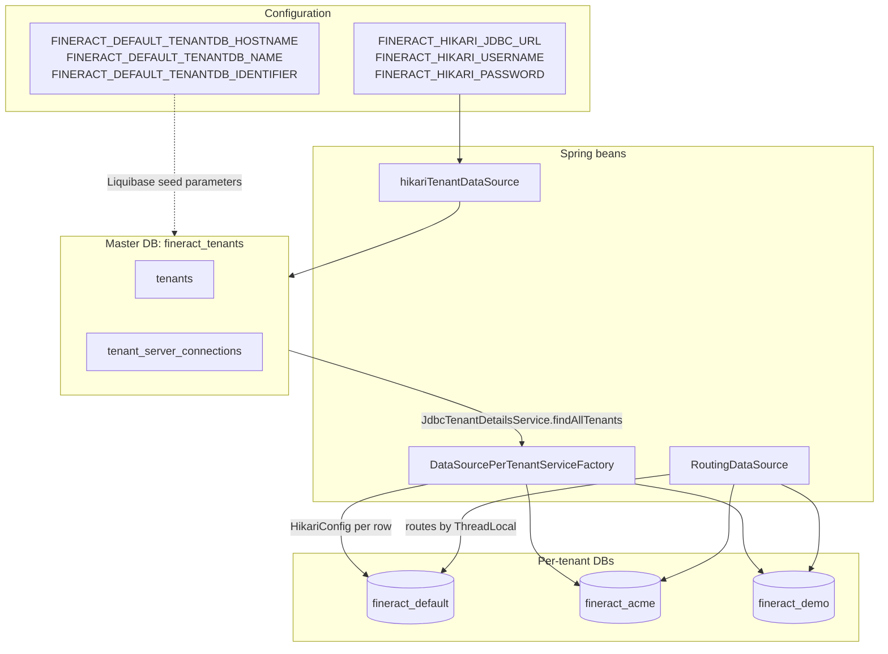

Apache Fineract maintains a strict separation between two kinds of database: the **tenant store** (a single master registry, conventionally named `fineract_tenants`) and the **per-tenant business databases** (one per tenant, conventionally named `fineract_<identifier>`). They have different schemas, different lifecycles, different Liquibase changelogs, and different Spring beans pointing at them. This page contrasts them column-by-column and walks through how the `fineract.tenant.*` properties wire the master pool while the rows inside `tenant_server_connections` wire each tenant pool at runtime.

## Side-by-side

| Concern | Tenant store (`fineract_tenants`) | Per-tenant DB (`fineract_<id>`) |
| ------- | --------------------------------- | ------------------------------- |
| Number per JVM | 1 | N (one per tenant) |
| Spring bean | `hikariTenantDataSource` (`@Qualifier`) | Created lazily by `DataSourcePerTenantServiceFactory` |
| Hikari pool name | `HikariPool-1` (or whatever Spring auto-assigns) | `<schemaName>_pool`, e.g. `fineract_default_pool` |
| Connection details | `spring.datasource.hikari.*` / `FINERACT_HIKARI_*` env vars | `tenant_server_connections` row, loaded by `JdbcTenantDetailsService` |
| Used by | `JdbcTenantDetailsService`, `TenantDatabaseUpgradeService` (for tenant-store DDL), Liquibase's `dataSourceForTenants` strategy | `RoutingDataSource` → `TomcatJdbcDataSourcePerTenantService` for all business JPA / JDBC |
| Liquibase context | `tenant_store_db` | `tenant_db` |
| Liquibase changelog root | `db/changelog/tenant-store/changelog-tenant-store.xml` | `db/changelog/tenant/changelog-tenant.xml` plus every `db/changelog/tenant/module/*` |
| Tables | `tenants`, `tenant_server_connections`, `timezones`, Liquibase internal | All `m_*`, `r_*`, `c_*`, `acc_*`, `mix_*` business tables |
| Schema migration on startup | `TenantDatabaseUpgradeService.upgradeTenantStore()` (single-threaded) | `TenantDatabaseUpgradeService.upgradeIndividualTenants()` (thread-pool, one tenant per task) |
| Created by | `mifospltaform-tenants-first-time-install.sql` (legacy) / initial-switch Liquibase | `0001_initial_schema.xml` (initial-switch) followed by hundreds of upgrade changesets |

## The master pool wiring

`application.properties` carries two distinct property prefixes:

### `spring.datasource.hikari.*` → master pool

```properties
spring.datasource.hikari.driverClassName=${FINERACT_HIKARI_DRIVER_SOURCE_CLASS_NAME:org.mariadb.jdbc.Driver}
spring.datasource.hikari.jdbcUrl=${FINERACT_HIKARI_JDBC_URL:jdbc:mariadb://localhost:3306/fineract_tenants}
spring.datasource.hikari.username=${FINERACT_HIKARI_USERNAME:root}
spring.datasource.hikari.password=${FINERACT_HIKARI_PASSWORD:mysql}
spring.datasource.hikari.minimumIdle=${FINERACT_HIKARI_MINIMUM_IDLE:3}
spring.datasource.hikari.maximumPoolSize=${FINERACT_HIKARI_MAXIMUM_POOL_SIZE:10}
spring.datasource.hikari.idleTimeout=${FINERACT_HIKARI_IDLE_TIMEOUT:60000}
spring.datasource.hikari.connectionTimeout=${FINERACT_HIKARI_CONNECTION_TIMEOUT:20000}
spring.datasource.hikari.connectionTestquery=${FINERACT_HIKARI_TEST_QUERY:SELECT 1}
spring.datasource.hikari.autoCommit=${FINERACT_HIKARI_AUTO_COMMIT:true}
spring.datasource.hikari.transactionIsolation=${FINERACT_HIKARI_TRANSACTION_ISOLATION:TRANSACTION_REPEATABLE_READ}
```

These configure the `HikariConfig` bean that Spring Boot picks up. `HikariCpConfig` then exposes it as `hikariTenantDataSource`. The default JDBC URL points at `fineract_tenants` on `localhost:3306`. This is the master pool — every JDBC call inside the master DB (Liquibase tenant-store upgrades, `JdbcTenantDetailsService` queries) lands here.

### `fineract.tenant.*` → default-tenant seed

```properties
fineract.tenant.host=${FINERACT_DEFAULT_TENANTDB_HOSTNAME:localhost}
fineract.tenant.port=${FINERACT_DEFAULT_TENANTDB_PORT:3306}
fineract.tenant.username=${FINERACT_DEFAULT_TENANTDB_UID:root}
fineract.tenant.password=${FINERACT_DEFAULT_TENANTDB_PWD:mysql}
fineract.tenant.parameters=${FINERACT_DEFAULT_TENANTDB_CONN_PARAMS:}
fineract.tenant.timezone=${FINERACT_DEFAULT_TENANTDB_TIMEZONE:Asia/Kolkata}
fineract.tenant.identifier=${FINERACT_DEFAULT_TENANTDB_IDENTIFIER:default}
fineract.tenant.name=${FINERACT_DEFAULT_TENANTDB_NAME:fineract_default}
fineract.tenant.description=${FINERACT_DEFAULT_TENANTDB_DESCRIPTION:Default Demo Tenant}
fineract.tenant.master-password=${FINERACT_DEFAULT_TENANTDB_MASTER_PASSWORD:fineract}
fineract.tenant.encrytion=${FINERACT_DEFAULT_TENANTDB_ENCRYPTION:"AES/CBC/PKCS5Padding"}

# read-only replica for the default tenant (optional)
fineract.tenant.read-only-host=${FINERACT_DEFAULT_TENANTDB_RO_HOSTNAME:}
fineract.tenant.read-only-port=${FINERACT_DEFAULT_TENANTDB_RO_PORT:}
fineract.tenant.read-only-username=${FINERACT_DEFAULT_TENANTDB_RO_UID:}
fineract.tenant.read-only-password=${FINERACT_DEFAULT_TENANTDB_RO_PWD:}
fineract.tenant.read-only-parameters=${FINERACT_DEFAULT_TENANTDB_RO_CONN_PARAMS:}
fineract.tenant.read-only-name=${FINERACT_DEFAULT_TENANTDB_RO_NAME:}

# global per-tenant overrides
fineract.tenant.config.min-pool-size=${FINERACT_CONFIG_MIN_POOL_SIZE:-1}
fineract.tenant.config.max-pool-size=${FINERACT_CONFIG_MAX_POOL_SIZE:-1}
fineract.tenant.config.rounding-mode=${FINERACT_CONFIG_ROUNDING_MODE:6}
```

These are read into `FineractProperties.FineractTenantProperties` and used in **two** distinct places:

1. **By the initial Liquibase switch** to seed the very first row in `tenants` and `tenant_server_connections`. The properties are passed as Liquibase parameters:
   ```properties
   spring.liquibase.parameters.fineract.tenant.identifier=${fineract.tenant.identifier}
   spring.liquibase.parameters.fineract.tenant.description=${fineract.tenant.description}
   spring.liquibase.parameters.fineract.tenant.timezone=${fineract.tenant.timezone}
   spring.liquibase.parameters.fineract.tenant.schema-name=${fineract.tenant.name}
   spring.liquibase.parameters.fineract.tenant.host=${fineract.tenant.host}
   spring.liquibase.parameters.fineract.tenant.port=${fineract.tenant.port}
   spring.liquibase.parameters.fineract.tenant.username=${fineract.tenant.username}
   spring.liquibase.parameters.fineract.tenant.password=${fineract.tenant.password}
   ...
   ```
   So when the `tenant_store/parts/0002_initial_data.xml` changeset inserts `tenants` and `tenant_server_connections` rows, it substitutes these values. The result: on a fresh install you get one tenant called `default` whose business DB is `fineract_default` on `localhost:3306`.
2. **By `DataSourcePerTenantServiceFactory`** when constructing each per-tenant `HikariConfig`. The values that aren't read from the tenant row (driver, autocommit, isolation, properties) come from the master `HikariConfig` so the same JDBC behavior holds across pools.

| Property | Master pool? | Default-tenant seed? | Per-tenant runtime? |
| -------- | ------------ | -------------------- | ------------------- |
| `spring.datasource.hikari.jdbcUrl` | ✅ | ❌ | inherits driver protocol only |
| `spring.datasource.hikari.username` | ✅ | ❌ | ❌ (per-tenant `schemaUsername` is used) |
| `spring.datasource.hikari.driverClassName` | ✅ | ❌ | ✅ (every tenant pool reuses the same driver) |
| `fineract.tenant.host` etc. | ❌ | ✅ (Liquibase seed) | ❌ |
| `tenant_server_connections.schema_*` | ❌ | (this row is *seeded from* the above) | ✅ |
| `fineract.tenant.master-password` | (used for password encryption) | (also stored as hash in seeded row) | ✅ (verified against `master_password_hash` on pool creation) |
| `fineract.tenant.config.max-pool-size` | ❌ | ❌ | ✅ (global override) |

## The default schema

`mifospltaform-tenants-first-time-install.sql` (under `fineract-db/`) is the **legacy** way to bootstrap the master DB on a fresh MySQL/MariaDB. Today the recommended path is to let Liquibase do it — the `tenant_store_db` + `initial_switch` contexts produce the same DDL. The legacy file is still useful for understanding the row model:

```sql
CREATE TABLE `tenants` (
  `id` BIGINT NOT NULL AUTO_INCREMENT,
  `identifier` varchar(100) NOT NULL,
  `name` varchar(100) NOT NULL,
  `schema_name` varchar(100) NOT NULL,
  `timezone_id` varchar(100) NOT NULL,
  ...
);
CREATE TABLE `tenant_server_connections` ( ... );
CREATE TABLE `timezones` ( ... );
```

The Liquibase variant (`tenant-store/parts/0001_initial_schema.xml`) is the same shape but in XML and applied transactionally.

## The per-tenant schema

When a tenant connection is provisioned (either via Liquibase seed or by manually inserting a `tenant_server_connections` row), `TenantDatabaseUpgradeService` runs the *initial_switch* Liquibase scripts against the new tenant DB. These bring it from empty to the latest schema:

```xml
<!-- db/changelog/db.changelog-master.xml -->
<include file="tenant/initial-switch-changelog-tenant.xml" relativeToChangelogFile="true"
         context="tenant_db AND initial_switch"/>
```

`initial-switch-changelog-tenant.xml`:

```xml
<include file="parts/0001_initial_schema.xml" relativeToChangelogFile="true" context="initial_switch"/>
<include file="parts/0002_initial_data.xml" relativeToChangelogFile="true" context="initial_switch"/>
<!-- The first 2 changelog files are ran with the initial_switch context to handle the Flyway -> Liquibase migration -->
<!-- The rest of the changelogs will not need this context set -->
```

After that, every subsequent boot runs only the new changesets in `db/changelog/tenant/changelog-tenant.xml` plus each module changelog (`db/changelog/tenant/module/<module>/module-changelog-master.xml`).

## The runtime split



## When to talk to which

| Concern | Talks to |
| ------- | -------- |
| Resolving a tenant from `Fineract-Platform-TenantId` | Tenant store |
| Starting up Liquibase against the master | Tenant store |
| Login (checking password in `m_appuser`) | Tenant DB |
| Loading a loan, computing schedules, posting journal entries | Tenant DB |
| Reading business date / COB date | Tenant DB (`m_business_date`) |
| Running a report | Tenant DB (or its read replica via `report_Id` join) |
| Running per-module Liquibase upgrades | Tenant DB |
| Adding a new tenant | Insert into tenant-store `tenant_server_connections` + `tenants`, restart JVM |

There is no domain code that *spans* both databases in a single transaction. Every query in the routing path expects to see only tenant-DB tables; every `JdbcTenantDetailsService` query expects to see only tenant-store tables. This separation is what makes `RoutingDataSource` viable as a `@Primary` `DataSource`.

## Master-password encryption

`fineract.tenant.master-password` (env: `FINERACT_DEFAULT_TENANTDB_MASTER_PASSWORD`, default `fineract`) is the **encryption key** for `tenant_server_connections.schema_password` and `readonly_schema_password`. It is never used as a database password.

On pool creation, `DataSourcePerTenantServiceFactory` verifies the master-password hash and then decrypts the column:

```java
if (!databasePasswordEncryptor.isMasterPasswordHashValid(tenantConnection.getMasterPasswordHash())) {
    throw new IllegalArgumentException(
        "Invalid master password on tenant connection %d.".formatted(tenantConnection.getConnectionId()));
}
...
config.setPassword(databasePasswordEncryptor.decrypt(schemaPassword));
```

So if you change `FINERACT_DEFAULT_TENANTDB_MASTER_PASSWORD` after data exists in `tenant_server_connections`, every tenant fails to start. To rotate:

1. Pre-compute the new SHA-256 of the new master password.
2. Re-encrypt every `schema_password` column with the new master.
3. Update `master_password_hash` rows to the new hash.
4. Restart with the new env var set.

The exact algorithm is `AES/CBC/PKCS5Padding` (`fineract.tenant.encrytion=AES/CBC/PKCS5Padding`).

## Mode interactions

`FineractProperties.Mode` has three flags — write-enabled, read-only, batch-only. They affect the two databases differently:

| Mode | Master DB | Tenant DB | Liquibase |
| ---- | --------- | --------- | --------- |
| Default (`write-enabled`) | read+write | read+write | runs for both |
| `read-only` | read only | uses `readonly_schema*` if present | **disabled** (`TenantDatabaseUpgradeService` exits early) |
| `batch-only` | read+write | read+write | runs |
| `liquibase-only` (profile) | read+write | read+write | runs Liquibase then exits |

The read-only mode is critical for blue/green deployments and for the historical "read replicas serving reports while OLTP serves writes" pattern.

## Adding a tenant

The supported recipe is:

1. **Create the schema** on your target DB server:
   ```sql
   CREATE DATABASE fineract_acme CHARACTER SET utf8mb4 COLLATE utf8mb4_unicode_ci;
   GRANT ALL PRIVILEGES ON fineract_acme.* TO 'fineract'@'%';
   ```
2. **Insert a connection row** into the master DB:
   ```sql
   INSERT INTO tenant_server_connections (
     schema_server, schema_server_port, schema_name,
     schema_username, schema_password,
     auto_update, pool_initial_size, pool_max_active,
     master_password_hash
   ) VALUES (
     'db.internal', '3306', 'fineract_acme',
     'fineract', :encrypted_password,
     true, 3, 10,
     :master_password_sha256
   );
   ```
3. **Insert a tenant row** pointing at it:
   ```sql
   INSERT INTO tenants (identifier, name, timezone_id, oltp_id, report_id)
   VALUES ('acme', 'Acme Microfinance', 'UTC',
           LAST_INSERT_ID(), LAST_INSERT_ID());
   ```
4. **Restart the JVM.** On `ContextRefreshedEvent`, `TomcatJdbcDataSourcePerTenantService.onApplicationEvent` calls `findAllTenants()` and warms the new pool; `TenantDatabaseUpgradeService.afterPropertiesSet` runs Liquibase against `fineract_acme` from empty.
5. **Send first request** with `Fineract-Platform-TenantId: acme`.

Cache clearing alone is not enough — the `TENANT_TO_DATA_SOURCE_MAP` is only seeded on `ContextRefreshedEvent`, so adding a tenant without restarting works only if you then send a real request that triggers `computeIfAbsent`.

## Cross-references

- [Tenancy / Overview](/tenancy/overview)
- [Tenancy / Tenant Details Service](/tenancy/tenant-details-service)
- [Tenancy / Tenant Database Routing](/tenancy/tenant-database-routing)
- [Database / Tenant vs Tenant Store](/database/tenant-vs-tenant-store)
- [Database / Liquibase Changesets](/database/liquibase-changesets)
- [Config / JDBC Environment Variables](/config/jdbc-env-variables)
