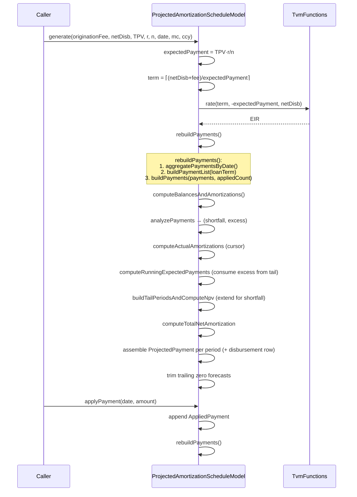
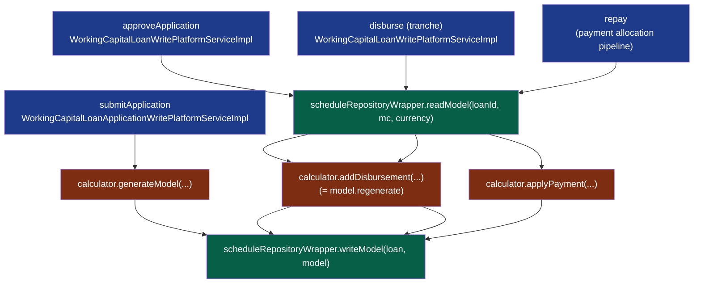

The calc engine under `fineract-working-capital-loan/.../portfolio/workingcapitalloan/calc/` is the heart of Fineract's Working Capital product. Where the classic progressive loan engine starts from a stated nominal interest rate and produces an EMI, the WC engine starts from a `totalPaymentValue` × `periodPaymentRate` ÷ `npvDayCount` daily payment, **back-solves the effective interest rate via Newton-Raphson**, then rolls a daily balance for the entire loan term. Every payment that lands rebuilds the schedule from scratch: tail periods get extended for shortfalls, excess payments compress the schedule, and the difference between *expected* and *actual* amortization produces the income-modification figure that the accounting layer consumes. This page is the per-class tour of `TvmFunctions`, `ProjectedAmortizationScheduleModel`, `ProjectedPayment`, the `ProjectedAmortizationScheduleCalculator` SPI and the Gson persistence wrapper.

## Files in scope

```
calc/
├── ProjectedAmortizationScheduleCalculator.java     ← SPI
├── DefaultProjectedAmortizationScheduleCalculator.java
├── ProjectedAmortizationScheduleModel.java          ← all the math
├── ProjectedPayment.java                            ← one row
└── TvmFunctions.java                                ← RATE + discountFactor
```

Plus the persistence/serialisation glue under `service/`:

```
service/
├── ProjectedAmortizationScheduleRepositoryWrapper.java
├── ProjectedAmortizationScheduleRepositoryWrapperImpl.java
├── ProjectedAmortizationScheduleModelParserService.java
└── ProjectedAmortizationScheduleModelParserServiceGsonImpl.java
```

Test coverage: `src/test/java/org/apache/fineract/portfolio/workingcapitalloan/calc/ProjectedAmortizationScheduleCalculatorTest.java` exercises the full lifecycle (generate → regenerate → applyPayment).

## SPI: `ProjectedAmortizationScheduleCalculator`

```java
public interface ProjectedAmortizationScheduleCalculator {

    @NonNull
    ProjectedAmortizationScheduleModel generateModel(
            @NonNull BigDecimal originationFeeAmount,
            @NonNull BigDecimal netDisbursementAmount,
            @NonNull BigDecimal totalPaymentValue,
            @NonNull BigDecimal periodPaymentRate,
            int        npvDayCount,
            @NonNull LocalDate expectedDisbursementDate,
            @NonNull MathContext mc,
            @NonNull MonetaryCurrency currency);

    @NonNull
    ProjectedAmortizationScheduleModel addDisbursement(
            @NonNull ProjectedAmortizationScheduleModel model,
            @NonNull BigDecimal newDiscountAmount,
            @NonNull BigDecimal newNetAmount,
            @NonNull LocalDate  newStartDate);

    void applyPayment(
            @NonNull ProjectedAmortizationScheduleModel model,
            @NonNull LocalDate paymentDate,
            @NonNull BigDecimal paymentAmount);
}
```

Three operations only:

- **`generateModel`** — at loan creation/submission, build the initial schedule.
- **`addDisbursement`** — at approval or disbursement, regenerate with updated principal / start date while preserving any applied payments.
- **`applyPayment`** — mutate the model in place; the model rebuilds its `payments` list on the next read.

### Default implementation

```java
@Component
public final class DefaultProjectedAmortizationScheduleCalculator
        implements ProjectedAmortizationScheduleCalculator {

    @Override @NonNull
    public ProjectedAmortizationScheduleModel generateModel(/*…*/) {
        return ProjectedAmortizationScheduleModel.generate(
                originationFeeAmount, netDisbursementAmount, totalPaymentValue,
                periodPaymentRate, npvDayCount, expectedDisbursementDate, mc, currency);
    }

    @Override @NonNull
    public ProjectedAmortizationScheduleModel addDisbursement(/*…*/) {
        return model.regenerate(newDiscountAmount, newNetAmount, newStartDate);
    }

    @Override
    public void applyPayment(/*…*/) {
        model.applyPayment(paymentDate, paymentAmount);
    }
}
```

The implementation is a thin delegate — the math lives in `ProjectedAmortizationScheduleModel` as static factory + instance methods, which makes the model directly Gson-serialisable.

## Inputs and outputs at a glance

```mermaid
flowchart LR
    subgraph in["Inputs"]
        I1["originationFeeAmount"]
        I2["netDisbursementAmount"]
        I3["totalPaymentValue (TPV)"]
        I4["periodPaymentRate (r)"]
        I5["npvDayCount (n)"]
        I6["expectedDisbursementDate"]
    end

    subgraph compute["Derived"]
        D1["expectedPayment = TPV × r / n"]
        D2["loanTerm = ⌈(netDisb + originationFee) / expectedPayment⌉"]
        D3["EIR = RATE(loanTerm, -expectedPayment, netDisbursement)"]
    end

    subgraph schedule["Schedule (daily)"]
        S1["balance[i] = balance[i-1]·(1+EIR) - expectedPayment"]
        S2["expectedAmort[i] = balance[i] + expectedPayment - balance[i-1]"]
        S3["DF[i] = 1 / (1+EIR)^paymentsLeft"]
        S4["npv[i] = forecast[i] × DF[i]"]
    end

    in --> compute --> schedule
```



## `TvmFunctions` — time-value of money primitives

```java
public final class TvmFunctions {
    private static final int        MAX_ITERATIONS = 100;
    private static final BigDecimal TOLERANCE      = new BigDecimal("1E-10");
    private static final BigDecimal DEFAULT_GUESS  = new BigDecimal("0.01");
    private static final BigDecimal TWO            = BigDecimal.valueOf(2);
    private TvmFunctions() {}
}
```

### `rate(nper, pmt, pv, mc)` — Excel's `RATE` equivalent

Solves for `r` in the present-value annuity equation `pv·(1+r)^n + pmt·((1+r)^n − 1) / r = 0` via Newton-Raphson, starting from a linear-approximation guess. The whole iteration:

```java
public static BigDecimal rate(int nper, BigDecimal pmt, BigDecimal pv, BigDecimal guess, MathContext mc) {
    if (nper <= 0) throw new IllegalArgumentException("nper must be positive, got: " + nper);
    final BigDecimal n = BigDecimal.valueOf(nper);

    // Zero-rate case: pv + pmt·n ≈ 0
    if (pv.add(pmt.multiply(n, mc), mc).abs().compareTo(TOLERANCE) < 0) return BigDecimal.ZERO;

    BigDecimal r = guess;
    for (int iter = 0; iter < MAX_ITERATIONS; iter++) {
        if (r.signum() == 0) r = TOLERANCE;  // nudge away from zero

        final BigDecimal onePlusR         = BigDecimal.ONE.add(r, mc);
        final BigDecimal compound         = onePlusR.pow(nper, mc);                  // (1+r)^n
        final BigDecimal compoundMinusOne = compound.subtract(BigDecimal.ONE, mc);   // (1+r)^n − 1

        // f(r)  = pv·(1+r)^n + pmt·((1+r)^n − 1) / r
        final BigDecimal f = pv.multiply(compound, mc)
                .add(pmt.multiply(compoundMinusOne, mc).divide(r, mc));

        // f'(r) = pv·n·(1+r)^(n−1) + pmt·[n·(1+r)^(n−1)·r − ((1+r)^n−1)] / r²
        final BigDecimal dCompound = n.multiply(onePlusR.pow(nper - 1, mc), mc);
        final BigDecimal rSquared  = r.multiply(r, mc);
        final BigDecimal fPrime    = pv.multiply(dCompound, mc)
                .add(pmt.multiply(dCompound.multiply(r, mc).subtract(compoundMinusOne, mc), mc).divide(rSquared, mc));

        if (fPrime.signum() == 0)
            throw new IllegalStateException("RATE: zero derivative at iteration " + iter + ", r=" + r);

        final BigDecimal correction = f.divide(fPrime, mc);
        r = r.subtract(correction, mc);
        if (correction.abs().compareTo(TOLERANCE) < 0) return r;
    }
    throw new IllegalStateException("RATE did not converge after " + MAX_ITERATIONS + " iterations");
}
```

Initial guess is `r ≈ 2 · (pmt·n + pv) / (pv·n)` (via `estimateInitialGuess`), falling back to `0.01` when non-positive.

<Tip>
The signs matter. `pv` is positive (the disbursement) and `pmt` is **negated** by the caller (`expectedPayment.negate()` in `ProjectedAmortizationScheduleModel.generate`), so the residual `f(r)` decreases when `r` increases — Newton-Raphson always corrects downward toward the zero crossing.
</Tip>

### `discountFactor(eir, days, mc)`

```java
public static BigDecimal discountFactor(final BigDecimal eir, final long days, final MathContext mc) {
    if (days == 0) return BigDecimal.ONE;
    if (days < 0 || days > Integer.MAX_VALUE)
        throw new IllegalArgumentException("days must be in [0, " + Integer.MAX_VALUE + "], got: " + days);
    return BigDecimal.ONE.divide(BigDecimal.ONE.add(eir, mc).pow((int) days, mc), mc);
}
```

`DF = 1 / (1 + EIR)^days`. Used inside the schedule rebuild to NPV each future payment back to disbursement.

## `ProjectedPayment` — one row of the schedule

`@Getter @Accessors(fluent = true) @AllArgsConstructor` immutable record-like class with the following fields:

```java
int        paymentNo;                   // 1-based; 0 = disbursement row
LocalDate  date;
long       count;                       // loanTerm + appliedPaymentCount − paymentNo
long       paymentsLeft;                // DF exponent; 0 for paid periods
Money      expectedPaymentAmount;       // (TPV × periodRate) / dayCount; negated for row 0
Money      forecastPaymentAmount;       // expected adjusted for tail excess
BigDecimal discountFactor;              // 1 / (1+EIR)^paymentsLeft
Money      npvValue;                    // forecast × DF
Money      balance;                     // balance[i] = balance[i-1]·(1+EIR) − expectedPayment
Money      expectedAmortizationAmount;  // balance[i] + expectedPayment − balance[i-1]
Money      netAmortizationAmount;       // first paid: Σ NPV; subsequent: netAmort[i-1] − actualAmort[i-1]
Money      actualPaymentAmount;
Money      actualAmortizationAmount;    // cursor-consumed expected amort
Money      incomeModification;          // actual − expected amortization
Money      deferredBalance;             // deferred[i-1] − actualAmort[i]
```

The fields are read directly by `ProjectedAmortizationScheduleMapper` to build `ProjectedAmortizationSchedulePaymentData` for the GET `…/amortization-schedule` response.

| Field | When non-null | Meaning |
| --- | --- | --- |
| `paymentNo` | always | 0 = disbursement, 1..n = future periods, n+1.. = tail extension |
| `expectedPaymentAmount` | always (except some tail rows) | `TPV × r / n`; negated for row 0 |
| `forecastPaymentAmount` | future periods + tail | `expected` adjusted for tail excess |
| `actualPaymentAmount` | only for periods with applied payment | the dated payment that landed |
| `actualAmortizationAmount` | only for paid rows | cursor-consumed portion of expected amortization |
| `incomeModification` | always for non-disbursement | `actual − expected` amortization |
| `deferredBalance` | always | running balance of unrecognised origination fee |

## `ProjectedAmortizationScheduleModel` — the calc engine

```java
@Getter @Accessors(fluent = true)
public final class ProjectedAmortizationScheduleModel {

    private static final String MODEL_VERSION = "1";

    private final Money       originationFeeAmount;
    private final Money       netDisbursementAmount;
    private final Money       totalPaymentValue;
    private final BigDecimal  periodPaymentRate;
    private final int         npvDayCount;
    private final LocalDate   expectedDisbursementDate;

    /** (TPV × periodPaymentRate) / npvDayCount — constant across payments. */
    private final Money       expectedPaymentAmount;

    /** roundUp((netDisbursementAmount + originationFeeAmount) / expectedPaymentAmount) */
    private final int         loanTerm;

    /** Periodic EIR from RATE(loanTerm, -expectedPayment, netDisbursementAmount). */
    private final BigDecimal  effectiveInterestRate;

    @JsonExclude private final MathContext      mc;
    @JsonExclude private final MonetaryCurrency currency;

    private final List<AppliedPayment> appliedPayments;
    private       List<ProjectedPayment> payments;
}
```

The `@JsonExclude` on `mc` and `currency` keeps them out of the persisted JSON; they're re-injected at deserialisation by `ProjectedAmortizationScheduleModelParserServiceGsonImpl`.

### Lifecycle

<Steps>
  <Step title="generate(...)">
    Static factory builds the initial model from raw `BigDecimal` inputs. Computes `expectedPayment`, derives `loanTerm` by **rounding up** `(netDisbursement + originationFee) / expectedPayment` (`RoundingMode.UP`), then solves `EIR = RATE(term, -expectedPayment, netDisbursement)`.
  </Step>
  <Step title="rebuildPayments()">
    Called inside the constructor and again after every `applyPayment`. Aggregates applied payments by date, builds the `loanTerm`-long expected payment list, runs `buildPayments` which produces the daily `ProjectedPayment` rows.
  </Step>
  <Step title="applyPayment(date, amount)">
    Validates that `date` is in `[expectedDisbursementDate + 1d, expectedDisbursementDate + loanTerm]`, appends to `appliedPayments`, calls `rebuildPayments()`.
  </Step>
  <Step title="regenerate(newDiscount, newNetAmount, newStartDate)">
    Creates a new model from the new disbursement parameters but **copies applied payments** from the old model, then rebuilds. Used at approval (when approvedPrincipal might differ from proposed) and at disbursement (when actual amount might differ from expected).
  </Step>
</Steps>

### Generation

```java
public static ProjectedAmortizationScheduleModel generate(
        BigDecimal originationFeeAmount, BigDecimal netDisbursementAmount,
        BigDecimal totalPaymentValue, BigDecimal periodPaymentRate, int npvDayCount,
        LocalDate expectedDisbursementDate, MathContext mc, MonetaryCurrency currency) {

    Objects.requireNonNull(originationFeeAmount, "originationFeeAmount");
    Objects.requireNonNull(netDisbursementAmount, "netDisbursementAmount");
    Objects.requireNonNull(totalPaymentValue, "totalPaymentValue");
    Objects.requireNonNull(periodPaymentRate, "periodPaymentRate");
    Objects.requireNonNull(expectedDisbursementDate, "expectedDisbursementDate");
    Objects.requireNonNull(currency, "currency");
    if (netDisbursementAmount.signum() <= 0) throw new IllegalArgumentException("netDisbursementAmount must be positive");
    if (npvDayCount <= 0)                    throw new IllegalArgumentException("npvDayCount must be positive");

    final BigDecimal expectedPayment = totalPaymentValue.multiply(periodPaymentRate, mc)
                                                       .divide(BigDecimal.valueOf(npvDayCount), mc);
    if (expectedPayment.signum() <= 0) throw new IllegalArgumentException(
            "expectedPaymentAmount must be positive (check totalPaymentValue and periodPaymentRate)");

    final int term = netDisbursementAmount.add(originationFeeAmount, mc)
            .divide(expectedPayment, mc).setScale(0, RoundingMode.UP).intValueExact();
    if (term <= 0) throw new IllegalArgumentException("computed loan term must be positive, got: " + term);

    final BigDecimal eir = TvmFunctions.rate(term, expectedPayment.negate(), netDisbursementAmount, mc);

    return new ProjectedAmortizationScheduleModel(
            Money.of(currency, originationFeeAmount, mc), Money.of(currency, netDisbursementAmount, mc),
            Money.of(currency, totalPaymentValue, mc), periodPaymentRate, npvDayCount, expectedDisbursementDate,
            Money.of(currency, expectedPayment, mc), term, eir, mc, currency);
}
```

Invariants enforced here: `netDisbursementAmount > 0`, `npvDayCount > 0`, `expectedPayment > 0`, `term > 0`. If any fails, no model is constructed.

### Balance roll

```java
private BalancesAndAmortizations computeBalancesAndAmortizations() {
    final BigDecimal onePlusRate    = BigDecimal.ONE.add(effectiveInterestRate, mc);
    final BigDecimal expectedPayment = expectedPaymentAmount.getAmount();
    final List<BigDecimal> balances              = new ArrayList<>(loanTerm);
    final List<BigDecimal> expectedAmortizations = new ArrayList<>(loanTerm);

    BigDecimal prevBalance = netDisbursementAmount.getAmount();
    for (int i = 0; i < loanTerm; i++) {
        final BigDecimal balance = prevBalance.multiply(onePlusRate, mc).subtract(expectedPayment, mc);
        balances.add(balance);
        expectedAmortizations.add(balance.add(expectedPayment, mc).subtract(prevBalance, mc));
        prevBalance = balance;
    }
    return new BalancesAndAmortizations(balances, expectedAmortizations);
}
```

For each daily index `i`:

```
balance[i]        = balance[i-1] · (1 + EIR) − expectedPayment
expectedAmort[i]  = balance[i] + expectedPayment − balance[i-1]   (== balance[i-1] · EIR)
```

`balance[-1]` is `netDisbursementAmount`. The amortization figure is the principal portion of the constant `expectedPayment` for that day — i.e. the accrual that the lender "earns" by holding the principal for one more period.

### Applying a payment

```java
public void applyPayment(final LocalDate paymentDate, final BigDecimal amount) {
    Objects.requireNonNull(paymentDate, "paymentDate");
    Objects.requireNonNull(amount, "amount");
    final int index = resolvePaymentIndex(paymentDate);
    if (index < 0 || index >= loanTerm) {
        throw new IllegalArgumentException("paymentDate " + paymentDate + " is outside the valid range ["
                + expectedDisbursementDate.plusDays(1) + " .. " + expectedDisbursementDate.plusDays(loanTerm) + "]");
    }
    appliedPayments.add(new AppliedPayment(paymentDate, amount));
    rebuildPayments();
}

private int resolvePaymentIndex(final LocalDate date) {
    return (int) ChronoUnit.DAYS.between(expectedDisbursementDate, date) - 1;
}
```

Multiple payments **on the same day** are merged by summation inside `aggregatePaymentsByDate()`:

```java
private Map<LocalDate, BigDecimal> aggregatePaymentsByDate() {
    final Map<LocalDate, BigDecimal> result = new HashMap<>();
    for (final AppliedPayment payment : appliedPayments) {
        result.merge(payment.date(), payment.amount(), BigDecimal::add);
    }
    return result;
}
```

### Shortfall / excess split

After each rebuild, each applied payment is classified vs the `expectedPayment` per period:

```java
private PaymentAnalysis analyzePayments(final List<BigDecimal> payments, final int appliedCount) {
    final BigDecimal expectedPayment = expectedPaymentAmount.getAmount();
    BigDecimal shortfall = BigDecimal.ZERO;
    BigDecimal excess    = BigDecimal.ZERO;
    for (int i = 0; i < appliedCount; i++) {
        final BigDecimal diff = payments.get(i).subtract(expectedPayment, mc);
        if (diff.signum() > 0)       excess    = excess.add(diff, mc);
        else if (diff.signum() < 0)  shortfall = shortfall.add(diff.negate(), mc);
    }
    return new PaymentAnalysis(shortfall, excess);
}
```

- **Excess** is "pre-paid future amount". It reduces `running[loanTerm-1]`, then `[loanTerm-2]`, …, working backward until consumed (see `computeRunningExpectedPayments`).
- **Shortfall** is amount missing relative to schedule. It generates **tail periods** appended after `loanTerm` (see `buildTailPeriodsAndComputeNpv`).

### Actual amortization (cursor-based)

A paid amount might span more than one period worth of expected amortization or only a fraction. The model walks a fractional cursor over the expected-amortization list:

```java
private List<BigDecimal> computeActualAmortizations(List<BigDecimal> expectedAmortizations,
        List<BigDecimal> payments, int appliedCount) {
    final BigDecimal expectedPayment = expectedPaymentAmount.getAmount();
    final List<BigDecimal> result = new ArrayList<>(appliedCount);
    BigDecimal cursor = BigDecimal.ZERO;
    for (int i = 0; i < appliedCount; i++) {
        final BigDecimal periodsConsumed = payments.get(i).divide(expectedPayment, mc);
        result.add(consumeExpectedAmortization(expectedAmortizations, cursor, periodsConsumed));
        cursor = cursor.add(periodsConsumed, mc);
    }
    return result;
}
```

`consumeExpectedAmortization(start, count)` advances a `pos` BigDecimal from `start` by `count` units, summing the expected amortization weighted by the fraction of each period consumed:

```java
while (remaining.signum() > 0 && pos.intValue() < expectedAmortizations.size()) {
    int periodIndex          = pos.intValue();
    BigDecimal posInPeriod   = pos.subtract(BigDecimal.valueOf(periodIndex), mc);
    BigDecimal availableInPd = BigDecimal.ONE.subtract(posInPeriod, mc);
    BigDecimal toConsume     = remaining.min(availableInPd);
    sum       = sum.add(toConsume.multiply(expectedAmortizations.get(periodIndex), mc), mc);
    pos       = pos.add(toConsume, mc);
    remaining = remaining.subtract(toConsume, mc);
}
```

A payment of `1.5 × expectedPayment` consumes the full amortization of one period plus half of the next.

### Tail-period extension

For each unit of shortfall the schedule grows by appending a new period at `paymentNo = loanTerm + tailIndex + 1`:

```java
while (remaining.signum() > 0) {
    int        periodNo = loanTerm + tailIndex + 1;
    long       dl       = paymentsLeft(periodNo, appliedCount);
    BigDecimal df       = safeDiscountFactor(dl);
    BigDecimal forecast = remaining.min(expectedPayment);
    BigDecimal npv      = MathUtil.negativeToZero(forecast.multiply(df, mc));

    tailNpv = tailNpv.add(npv, mc);
    tailPayments.add(new ProjectedPayment(periodNo,
            expectedDisbursementDate.plusDays(periodNo), (long) loanTerm + appliedCount - periodNo, dl,
            null, money(forecast), df, money(npv), null, null, money(BigDecimal.ZERO), null, null, null, null));

    remaining = remaining.subtract(forecast, mc);
    tailIndex++;
}
```

The tail's accumulated `npv` feeds into the total net amortization computation.

### Total net amortization (income line)

```java
/** totalNetAmortization = -netDisbursementAmount + sum(npvSource × DF) + tailNpv */
private BigDecimal computeTotalNetAmortization(
        final List<BigDecimal> payments, final List<BigDecimal> runningExpected,
        final int appliedCount, final BigDecimal tailNpv) {

    BigDecimal total = netDisbursementAmount.getAmount().negate();
    for (int i = 0; i < loanTerm; i++) {
        final BigDecimal npvSource = payments.get(i) != null ? payments.get(i) : runningExpected.get(i);
        final BigDecimal df        = safeDiscountFactor(paymentsLeft(i + 1, appliedCount));
        total = total.add(npvSource.multiply(df, mc), mc);
    }
    return total.add(tailNpv, mc);
}
```

It is **the NPV of all future cash flows minus the netDisbursement** — the unrealised income at the present instant.

### Deferred balance

For every period the model tracks how much of the `originationFee` has been recognised:

```java
final BigDecimal deferredBalance = originationFee.subtract(cumulativeActualAmort, mc);
```

`cumulativeActualAmort` runs across rows and is **clipped at `originationFee`**: the deferred balance never goes negative.

### Trailing-zero trim

After building all rows, the tail is trimmed of zero forecast rows:

```java
while (result.size() > 1) {
    final ProjectedPayment last = result.getLast();
    if (last.forecastPaymentAmount() != null && last.forecastPaymentAmount().isZero()) {
        result.removeLast();
    } else { break; }
}
```

This handles the case where excess payments compressed the schedule to fewer than `loanTerm` periods.

## End-to-end rebuild pipeline



## Persistence

`ProjectedAmortizationScheduleRepositoryWrapperImpl` is the single read/write entry point:

```java
@Override
public Optional<ProjectedAmortizationScheduleModel> readModel(Long loanId, MathContext mc, MonetaryCurrency ccy) {
    return repository.findByLoanId(loanId)
            .map(ProjectedAmortizationLoanModel::getJsonModel)
            .map(json -> parserService.fromJson(json, mc, ccy));
}

@Override @Transactional
public void writeModel(WorkingCapitalLoan loan, ProjectedAmortizationScheduleModel model) {
    final String jsonModel = parserService.toJson(model);
    final ProjectedAmortizationLoanModel entity = repository.findByLoanId(loan.getId()).orElseGet(() -> {
        final ProjectedAmortizationLoanModel e = new ProjectedAmortizationLoanModel();
        e.setLoan(loan);
        return e;
    });
    entity.setBusinessDate(ThreadLocalContextUtil.getBusinessDate());
    entity.setLastModifiedDate(DateUtils.getAuditOffsetDateTime());
    entity.setJsonModel(jsonModel);
    entity.setJsonModelVersion(ProjectedAmortizationScheduleModel.getModelVersion());
    repository.save(entity);
}
```

### Gson configuration

`ProjectedAmortizationScheduleModelParserServiceGsonImpl` registers a `LocalDateAdapter`, `MoneySerializer`, `ToNumberPolicy.BIG_DECIMAL` and the `JsonExcludeAnnotationBasedExclusionStrategy` for both directions; for deserialisation it adds a `MoneyDeserializer(mc, currency)` plus an `InstanceCreator<ProjectedAmortizationScheduleModel>` returning `ProjectedAmortizationScheduleModel.forDeserialization(mc, currency)`.

The `forDeserialization` instance creator hands Gson a "skeleton" — Gson sets the `final` fields via reflection while the `@JsonExclude`d `mc` and `currency` are pre-seeded from the caller's loan + product.

## Test fixture worth knowing about

`ProjectedAmortizationScheduleCalculatorTest` covers three scenarios:

1. **Pristine generation** — verifies that `expectedPayment`, `loanTerm`, `EIR` and per-period `balance` line up with hand-computed values.
2. **Disbursement regeneration** — generates, applies one payment, regenerates with a different `netDisbursement` and a `startDate` in the past, asserts the existing payment is still in the model and the schedule shifted forward.
3. **Payment series** — applies a sequence of payments of varying sizes (excess, exact, shortfall) and asserts: schedule length adjusts via tail / trim; cumulative `actualAmortization` equals `originationFee` at the end; `deferredBalance` rolls to zero.

## Integration with the loan lifecycle



<Tip>
`WorkingCapitalLoanAmortizationScheduleWriteServiceImpl` (testing-only, see [WC APIs](/working-capital-loan/working-capital-api)) is the **only** place today that calls `generate` with explicit request parameters from a REST body. In production, the loan-write services compose the same inputs from the persisted loan + product when the lifecycle commands fire.
</Tip>

## MathContext and Money

The engine never picks a `MathContext` of its own — callers pass `MoneyHelper.getMathContext()`, which is configured by Fineract's `MoneyHelper`. The model multiplies / divides through that `mc` everywhere and only converts to `Money` at the field-store boundary (`money(BigDecimal)` helper):

```java
private Money money(final BigDecimal amount) { return Money.of(currency, amount, mc); }
```

This decouples the **calculation precision** (typically 32 significant decimal digits) from the **storage rounding** (the currency's `digitsAfterDecimal`).

## API surface

The model is exposed read-only via the `WorkingCapitalLoanAmortizationScheduleReadService` which maps to `ProjectedAmortizationScheduleData`:

```java
@Getter @Builder @AllArgsConstructor
public class ProjectedAmortizationScheduleData {
    private final BigDecimal originationFeeAmount;
    private final BigDecimal netDisbursementAmount;
    private final BigDecimal totalPaymentValue;
    private final BigDecimal periodPaymentRate;
    private final int        npvDayCount;
    private final LocalDate  expectedDisbursementDate;
    private final BigDecimal expectedPaymentAmount;
    private final int        loanTerm;
    private final BigDecimal effectiveInterestRate;
    private final List<ProjectedAmortizationSchedulePaymentData> payments;
}
```

It's returned by `GET /v1/working-capital-loans/{loanId}/amortization-schedule` — see the [REST APIs](/working-capital-loan/working-capital-api) page.

For testing only, `POST /v1/internal/working-capital-loans/{loanId}/amortization-schedule` accepts:

```java
@Getter @Setter @NoArgsConstructor
public class ProjectedAmortizationScheduleGenerateRequest {
    private BigDecimal originationFeeAmount;
    private BigDecimal netDisbursementAmount;
    private BigDecimal totalPaymentValue;
    private BigDecimal periodPaymentRate;
    private int        npvDayCount;
    private LocalDate  expectedDisbursementDate;
}
```

…and forwards directly to `ProjectedAmortizationScheduleModel.generate`. This endpoint is gated by `@Profile(FineractProfiles.TEST)`.

## Common pitfalls

<Warning>
**`periodPaymentRate` and `npvDayCount` must be consistent.** A `periodPaymentRate` of `0.05` with `npvDayCount = 360` gives a different `expectedPayment` than `0.05` with `npvDayCount = 365`. The product configuration (`relatedDetail.periodPaymentRate` + `relatedDetail.npvDayCount`) is authoritative — loans inherit it via `WorkingCapitalLoanProductRelatedDetails`.
</Warning>

<Warning>
**`expectedPayment` of zero is not allowed.** If you ever pass `totalPaymentValue = 0` or `periodPaymentRate = 0` the model throws `IllegalArgumentException("expectedPaymentAmount must be positive (check totalPaymentValue and periodPaymentRate)")` and no row gets written. Validate at the API layer.
</Warning>

<Warning>
**`MAX_ITERATIONS = 100`.** If `RATE` does not converge, `IllegalStateException("RATE did not converge after 100 iterations")` is thrown. In practice convergence happens within 4–8 iterations; non-convergence has only been observed when test data combined absurdly large `pmt` with near-zero `pv`.
</Warning>

## Where to read next

<CardGroup cols={2}>
  <Card title="Domain & product" icon="database" href="/working-capital-loan/domain-and-product">
    `WorkingCapitalLoan`, embedded `WorkingCapitalLoanProductRelatedDetails`, and `m_wc_loan_amortization_model` where this engine's output is persisted.
  </Card>
  <Card title="WC schedule API" icon="globe" href="/api/working-capital-loans">
    GET `/v1/working-capital-loans/{loanId}/amortization-schedule` — the read-only externalisation of this calc engine.
  </Card>
  <Card title="Module REST surface" icon="globe" href="/working-capital-loan/working-capital-api">
    The four module-internal resources around the calc engine.
  </Card>
  <Card title="COB pipeline (module)" icon="bolt" href="/working-capital-loan/working-capital-cob">
    Where the model gets refreshed during nightly close-of-business for each WC loan.
  </Card>
  <Card title="COB framework side" icon="link" href="/cob/working-capital-loan-cob">
    Spring-Batch-side reference for the job that runs this engine.
  </Card>
  <Card title="Loan module" icon="book" href="/loan/overview">
    Classic loan engine — the EMI-based sibling of this calc engine.
  </Card>
</CardGroup>
