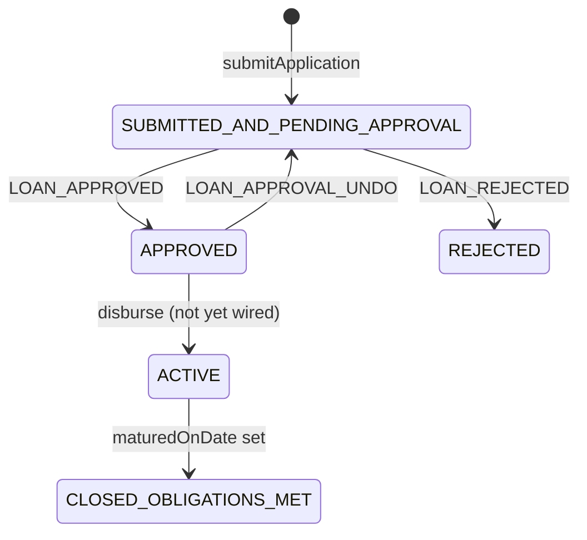
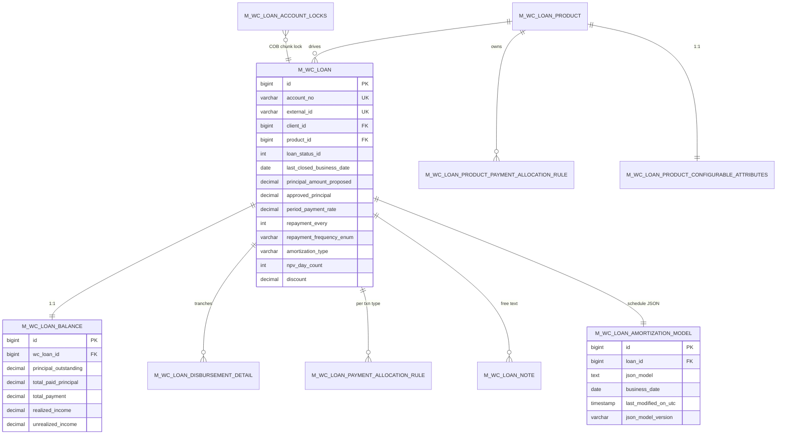

The Fineract Working Capital aggregate persists in seven tables headed by `m_wc_loan`. Unlike the classic `Loan` aggregate, Working Capital intentionally does **not** reuse `m_loan`, `m_loan_repayment_schedule` or `m_product_loan` — it carries its own lightweight aggregate that fits the discount-and-period-payment math the [calc engine](/working-capital-loan/calc-engine) implements. This page is the field-by-field reference for every entity, embeddable and enum the module ships, plus the lifecycle state machine that gates approval and rejection. Every code excerpt is a verbatim slice of `fineract-working-capital-loan/src/main/java/org/apache/fineract/portfolio/workingcapitalloan/domain/` and `…/workingcapitalloanproduct/domain/`.

## Aggregate root: `WorkingCapitalLoan`

```java
// fineract-working-capital-loan/.../portfolio/workingcapitalloan/domain/WorkingCapitalLoan.java
@Entity
@Table(name = "m_wc_loan", uniqueConstraints = {
        @UniqueConstraint(columnNames = {"account_no"},  name = "wc_loan_account_no_UNIQUE"),
        @UniqueConstraint(columnNames = {"external_id"}, name = "wc_loan_externalid_UNIQUE") })
@Getter
public class WorkingCapitalLoan extends AbstractAuditableWithUTCDateTimeCustom<Long> {

    @Version int version;

    @Setter @Column(name = "last_closed_business_date")
    private LocalDate lastClosedBusinessDate;

    @Setter @Column(name = "account_no", length = 20, unique = true, nullable = false)
    private String accountNumber;

    @Setter @Column(name = "external_id")
    private ExternalId externalId;

    @Setter @ManyToOne @JoinColumn(name = "client_id")        private Client client;
    @Setter @ManyToOne(fetch = FetchType.EAGER) @JoinColumn(name = "fund_id")
                                                              private Fund fund;
    @Setter @ManyToOne(fetch = FetchType.LAZY)
            @JoinColumn(name = "product_id", nullable = false)
                                                              private WorkingCapitalLoanProduct loanProduct;

    @Setter @Column(name = "loan_status_id", nullable = false)
    @Convert(converter = LoanStatusConverter.class)
    private LoanStatus loanStatus;
    …
}
```

`AbstractAuditableWithUTCDateTimeCustom<Long>` brings the standard `createdBy / createdDate / lastModifiedBy / lastModifiedDate` audit columns and the `Long id` primary key.

### Field table

| Column | Java field | Type | Notes |
| --- | --- | --- | --- |
| `id` | `id` (inherited) | `Long` | PK |
| `version` | `version` | `int` | `@Version` optimistic lock |
| `last_closed_business_date` | `lastClosedBusinessDate` | `LocalDate` | Written by `AbstractWorkingCapitalLoanCOBWorkerItemProcessor.setLastRun` |
| `account_no` | `accountNumber` | `String(20)` | Unique; generated by `AccountNumberGeneratorService` after first save |
| `external_id` | `externalId` | `ExternalId` | Unique; user-supplied or auto-generated |
| `client_id` | `client` | `Client` | LAZY ManyToOne |
| `fund_id` | `fund` | `Fund` | EAGER ManyToOne |
| `product_id` | `loanProduct` | `WorkingCapitalLoanProduct` | LAZY ManyToOne, **not null** |
| `loan_status_id` | `loanStatus` | `LoanStatus` | Reused enum from `fineract-loan` via `LoanStatusConverter` |
| `loan_counter` | `loanCounter` | `Integer` | Per-client sequential WC count |
| `loan_product_counter` | `loanProductCounter` | `Integer` | Per-client-per-product cycle |
| `submittedon_date` | `submittedOnDate` | `LocalDate` | |
| `rejectedon_date` | `rejectedOnDate` | `LocalDate` | |
| `rejectedon_userid` | `rejectedBy` | `AppUser` | |
| `approvedon_date` | `approvedOnDate` | `LocalDate` | |
| `approvedon_userid` | `approvedBy` | `AppUser` | |
| `closedon_date` | `closedOnDate` | `LocalDate` | |
| `closedon_userid` | `closedBy` | `AppUser` | |
| `expected_maturedon_date` | `expectedMaturityDate` | `LocalDate` | |
| `maturedon_date` | `maturedOnDate` | `LocalDate` | Set only when loan is fully paid |
| `principal_amount_proposed` | `proposedPrincipal` | `BigDecimal(19,6)` | Submitted amount |
| `approved_principal` | `approvedPrincipal` | `BigDecimal(19,6)` | Updated on approve |
| _embedded_ | `loanProductRelatedDetails` | `WorkingCapitalLoanProductRelatedDetails` | See below |

### Owned collections

```java
@OneToOne(mappedBy = "wcLoan", cascade = CascadeType.ALL, orphanRemoval = true)
private WorkingCapitalLoanBalance balance;

@OneToMany(cascade = CascadeType.ALL, mappedBy = "wcLoan", orphanRemoval = true, fetch = FetchType.LAZY)
private List<WorkingCapitalLoanPaymentAllocationRule> paymentAllocationRules = new ArrayList<>();

@OneToMany(cascade = CascadeType.ALL, mappedBy = "wcLoan", orphanRemoval = true, fetch = FetchType.LAZY)
private List<WorkingCapitalLoanDisbursementDetails> disbursementDetails = new ArrayList<>();
```

### Convenience navigation

```java
public Long getOfficeId() { return client != null && client.getOffice() != null ? client.getOffice().getId() : null; }
public Long getClientId() { return client != null ? client.getId() : null; }
```

The aggregate intentionally does **not** expose `WorkingCapitalLoanNote` as a collection — notes are stored independently and looked up by repository.

## Embedded snapshot: `WorkingCapitalLoanProductRelatedDetails`

This is the product-derived block that travels with every loan. It's persisted directly into `m_wc_loan` columns (the same row), which makes it an `@Embeddable`.

```java
// fineract-working-capital-loan/.../workingcapitalloanproduct/domain/WorkingCapitalLoanProductRelatedDetails.java
@Embeddable
@Getter @Setter
public class WorkingCapitalLoanProductRelatedDetails {

    @Embedded                                 private MonetaryCurrency currency;
    @Column(name = "principal_amount",        scale = 6, precision = 19) private BigDecimal principal;
    @Column(name = "period_payment_rate",     scale = 6, precision = 19, nullable = false) private BigDecimal periodPaymentRate;
    @Column(name = "repayment_every",         nullable = false) private Integer repaymentEvery;
    @Enumerated(EnumType.STRING)
    @Column(name = "repayment_frequency_enum",nullable = false) private WorkingCapitalLoanPeriodFrequencyType repaymentFrequencyType;
    @Enumerated(EnumType.STRING)
    @Column(name = "amortization_type",       nullable = false) private WorkingCapitalAmortizationType amortizationType;
    @Column(name = "npv_day_count",           nullable = false) private Integer npvDayCount;
    @Column(name = "discount",                scale = 6, precision = 19) private BigDecimal discount;
    @ManyToOne(fetch = FetchType.LAZY)
    @JoinColumn(name = "delinquency_bucket_classification_id")
    private DelinquencyBucket delinquencyBucket;
}
```

Note the **two parallel embeddables** in this module:

- `WorkingCapitalLoanProductRelatedDetails` (plural) — embedded on the **loan**.
- `WorkingCapitalLoanProductRelatedDetail` (singular) — embedded on the **product**.

They carry the same columns but are deliberately separate JPA types so the product can evolve its constraints without coupling the loan's mapping.

```java
// product side — fineract-working-capital-loan/.../workingcapitalloanproduct/domain/WorkingCapitalLoanProductRelatedDetail.java
@Embeddable @Getter @Setter
@AllArgsConstructor @NoArgsConstructor(access = AccessLevel.PROTECTED)
public class WorkingCapitalLoanProductRelatedDetail {

    @Enumerated(EnumType.STRING) @Column(name = "amortization_type", nullable = false)
    private WorkingCapitalAmortizationType amortizationType;

    @Column(name = "npv_day_count", nullable = false)             private Integer npvDayCount;
    @Column(name = "principal_amount", scale = 6, precision = 19, nullable = false) private BigDecimal principal;
    @Column(name = "period_payment_rate", scale = 6, precision = 19, nullable = false) private BigDecimal periodPaymentRate;
    @Column(name = "repayment_every", nullable = false)           private Integer repaymentEvery;
    @Enumerated(EnumType.STRING) @Column(name = "repayment_frequency_enum", nullable = false)
                                                                  private WorkingCapitalLoanPeriodFrequencyType repaymentFrequencyType;
    @Column(name = "discount", scale = 6, precision = 19)         private BigDecimal discount;
}
```

## Running balance: `WorkingCapitalLoanBalance`

A single row per loan keeps the cached totals that feed accounting and `/v1/working-capital-loans/{id}`. It's mutated as allocations are applied; the schedule itself remains in the JSON model.

```java
@Entity
@Table(name = "m_wc_loan_balance",
        uniqueConstraints = { @UniqueConstraint(columnNames = {"wc_loan_id"}, name = "uq_m_wc_loan_balance_loan_id") })
@Getter
public class WorkingCapitalLoanBalance extends AbstractAuditableWithUTCDateTimeCustom<Long> {

    @OneToOne(optional = false, fetch = FetchType.LAZY)
    @JoinColumn(name = "wc_loan_id", nullable = false, unique = true)
    private WorkingCapitalLoan wcLoan;

    @Setter @Column(name = "principal_outstanding",  scale = 6, precision = 19, nullable = false)
    private BigDecimal principalOutstanding = BigDecimal.ZERO;
    @Setter @Column(name = "total_paid_principal",   scale = 6, precision = 19, nullable = false)
    private BigDecimal totalPaidPrincipal   = BigDecimal.ZERO;
    @Setter @Column(name = "total_payment",          scale = 6, precision = 19, nullable = false)
    private BigDecimal totalPayment         = BigDecimal.ZERO;
    @Setter @Column(name = "realized_income",        scale = 6, precision = 19, nullable = false)
    private BigDecimal realizedIncome       = BigDecimal.ZERO;
    @Setter @Column(name = "unrealized_income",      scale = 6, precision = 19, nullable = false)
    private BigDecimal unrealizedIncome     = BigDecimal.ZERO;

    @Version @Column(name = "version") private Integer version;

    protected WorkingCapitalLoanBalance() {}

    public static WorkingCapitalLoanBalance createFor(final WorkingCapitalLoan loan) {
        final WorkingCapitalLoanBalance balance = new WorkingCapitalLoanBalance();
        balance.wcLoan = loan;
        return balance;
    }
}
```

| Column | Meaning |
| --- | --- |
| `principal_outstanding` | Disbursed principal not yet paid (`netDisbursement` − cumulative actual principal allocation) |
| `total_paid_principal` | Cumulative principal allocated from payments |
| `total_payment` | Cumulative payment amount applied (gross) |
| `realized_income` | Cumulative `actualAmortization` from `ProjectedPayment` |
| `unrealized_income` | `originationFee` − `realizedIncome`, also known as `deferredBalance` in the model |

## Tranches: `WorkingCapitalLoanDisbursementDetails`

```java
@Getter @Setter @Entity
@Table(name = "m_wc_loan_disbursement_detail")
public class WorkingCapitalLoanDisbursementDetails extends AbstractPersistableCustom<Long> {

    @ManyToOne(fetch = FetchType.LAZY) @JoinColumn(name = "wc_loan_id", nullable = false)
    private WorkingCapitalLoan wcLoan;

    @Column(name = "expected_disburse_date")            private LocalDate expectedDisbursementDate;
    @Column(name = "expected_amount", scale = 6, precision = 19) private BigDecimal expectedAmount;
    @Column(name = "expected_maturity_date")            private LocalDate expectedMaturityDate;

    @Column(name = "actual_disburse_date")              private LocalDate actualDisbursementDate;
    @Column(name = "actual_amount", scale = 6, precision = 19) private BigDecimal actualAmount;

    @ManyToOne(fetch = FetchType.LAZY) @JoinColumn(name = "disbursedon_userid") private AppUser disbursedBy;
}
```

The expected/actual split matches how WC loans get partially disbursed in tranches: the back office plans a series of disbursements (`expected_*`), the disburse command moves a row into `actual_*` and the calc engine's `regenerate(newDiscountAmount, newNetAmount, newStartDate)` re-bases the schedule.

## Payment allocation rules

Working Capital intentionally does **not** allocate to interest — only `PRINCIPAL`, `FEE`, `PENALTY`. The enum below makes that explicit.

```java
@Getter @RequiredArgsConstructor
public enum WorkingCapitalPaymentAllocationType implements ApiFacingEnum<WorkingCapitalPaymentAllocationType> {

    PENALTY("PENALTY", "Penalty"),
    FEE    ("FEE",     "Fee"),
    PRINCIPAL("PRINCIPAL", "Principal");

    private final String code;
    private final String humanReadableName;
}
```

The transaction-type → allocation-order rule is stored once per loan:

```java
@Entity
@Table(name = "m_wc_loan_payment_allocation_rule", uniqueConstraints = {
        @UniqueConstraint(columnNames = {"wc_loan_id", "transaction_type"},
                          name = "uq_m_wc_loan_payment_allocation_rule") })
@Getter @Setter
public class WorkingCapitalLoanPaymentAllocationRule extends AbstractAuditableWithUTCDateTimeCustom<Long> {

    @ManyToOne @JoinColumn(name = "wc_loan_id", nullable = false)
    private WorkingCapitalLoan wcLoan;

    @Column(name = "transaction_type", nullable = false)
    @Enumerated(EnumType.STRING)
    private PaymentAllocationTransactionType transactionType;   // reused from fineract-loan

    @Convert(converter = WorkingCapitalPaymentAllocationTypeListConverter.class)
    @Column(name = "allocation_types", nullable = false)
    private List<WorkingCapitalPaymentAllocationType> allocationTypes;
}
```

The same shape exists at the product level as `WorkingCapitalLoanProductPaymentAllocationRule` (table `m_wc_loan_product_payment_allocation_rule`) — the assembler copies the product's rules into the loan when the application is submitted.

`PaymentAllocationTransactionType` is imported from `fineract-loan` (`org.apache.fineract.portfolio.loanproduct.domain.PaymentAllocationTransactionType`) so the enum values stay aligned with the classic loan engine — but the **target** types (`PENALTY/FEE/PRINCIPAL`) are WC-specific.

## Lifecycle: `WorkingCapitalLoanLifecycleStateMachine`

The state machine accepts three events and reuses the `LoanStatus` enum:

```java
public enum WorkingCapitalLoanEvent {
    LOAN_APPROVED,
    LOAN_APPROVAL_UNDO,
    LOAN_REJECTED
}
```

```java
@Component
public class WorkingCapitalLoanLifecycleStateMachine {

    public void transition(final WorkingCapitalLoanEvent event, final WorkingCapitalLoan loan) {
        LoanStatus newStatus = getNextStatus(event, loan);
        if (newStatus != null) {
            loan.setLoanStatus(newStatus);
        } else {
            throw new PlatformApiDataValidationException(
                    "validation.msg.wc.loan.transition.not.allowed",
                    "Transition " + event + " is not allowed from status " + loan.getLoanStatus(),
                    "loanStatus");
        }
    }

    private LoanStatus getNextStatus(final WorkingCapitalLoanEvent event, final WorkingCapitalLoan loan) {
        LoanStatus from = loan.getLoanStatus();
        if (from == null) return null;

        return switch (event) {
            case LOAN_APPROVED       -> from.isSubmittedAndPendingApproval() ? LoanStatus.APPROVED : null;
            case LOAN_APPROVAL_UNDO  -> from.isApproved()                    ? LoanStatus.SUBMITTED_AND_PENDING_APPROVAL : null;
            case LOAN_REJECTED       -> from.isSubmittedAndPendingApproval() ? LoanStatus.REJECTED : null;
        };
    }
}
```



Note the current code path only wires the first three transitions through `WorkingCapitalLoanLifecycleStateMachine`. Disbursement and closure run through the assembler / amortization write services and modify `loanStatus` directly.

## Other domain enums

```java
@Getter @RequiredArgsConstructor
public enum WorkingCapitalLoanPeriodFrequencyType implements ApiFacingEnum<WorkingCapitalLoanPeriodFrequencyType> {
    DAYS  (1, "DAYS",   "Days"),
    MONTHS(2, "MONTHS", "Months"),
    YEARS (3, "YEARS",  "Years");

    private final Integer value;
    private final String  code;
    private final String  humanReadableName;
}
```

```java
@Getter @RequiredArgsConstructor
public enum WorkingCapitalAmortizationType implements ApiFacingEnum<WorkingCapitalAmortizationType> {
    EIR (1, "EIR",  "Effective Interest Rate"),
    FLAT(2, "FLAT", "Flat");

    public boolean isEIR() { return this.equals(WorkingCapitalAmortizationType.EIR); }
}
```

Only `EIR` is currently implemented in the calc engine — `FLAT` is reserved.

## Persistence: `m_wc_loan_amortization_model`

The materialised schedule is stored as JSON, **not** as repayment-schedule installments.

```java
@Entity
@Table(name = "m_wc_loan_amortization_model")
@Getter @Setter
public class ProjectedAmortizationLoanModel extends AbstractPersistableCustom<Long> {

    @Version int version;

    @OneToOne @JoinColumn(name = "loan_id", nullable = false)
    private WorkingCapitalLoan loan;

    @Column(name = "json_model", columnDefinition = "text", nullable = false)
    private String jsonModel;

    @Column(name = "business_date", nullable = false)              private LocalDate businessDate;
    @Column(name = "last_modified_on_utc", nullable = false)        private OffsetDateTime lastModifiedDate;
    @Column(name = "json_model_version", nullable = false)          private String jsonModelVersion;
}
```

Reads go through `ProjectedAmortizationScheduleRepositoryWrapper`, which deserialises via Gson (`ProjectedAmortizationScheduleModelParserServiceGsonImpl`). The model version (`ProjectedAmortizationScheduleModel.getModelVersion()`, currently `"1"`) is stored so a future model bump can be detected and migrated.

## Notes

`WorkingCapitalLoanNote` is a simple per-loan free-text note created on submit/modify/state-transition:

```java
@Entity @Table(name = "m_wc_loan_note") @Getter
public class WorkingCapitalLoanNote extends AbstractAuditableWithUTCDateTimeCustom<Long> {

    @ManyToOne(fetch = FetchType.LAZY) @JoinColumn(name = "wc_loan_id", nullable = false)
    private WorkingCapitalLoan wcLoan;

    @Column(name = "note", length = 1000) private String note;

    public static WorkingCapitalLoanNote create(final WorkingCapitalLoan wcLoan, final String note) {
        final WorkingCapitalLoanNote n = new WorkingCapitalLoanNote();
        n.wcLoan = wcLoan;
        n.note   = note;
        return n;
    }
}
```

`WorkingCapitalLoanApplicationWritePlatformServiceImpl.submitApplication` creates a note from the `submittedOnNote` request parameter; `modifyApplication` does the same.

## Product: `WorkingCapitalLoanProduct`

```java
@Entity @Getter @Setter
@NoArgsConstructor(access = AccessLevel.PROTECTED)
@Table(name = "m_wc_loan_product", uniqueConstraints = {
        @UniqueConstraint(columnNames = {"name"},        name = "unq_wc_loan_product_name"),
        @UniqueConstraint(columnNames = {"external_id"}, name = "unq_wc_loan_product_external_id"),
        @UniqueConstraint(columnNames = {"short_name"},  name = "unq_wc_loan_product_short_name") })
public class WorkingCapitalLoanProduct extends AbstractPersistableCustom<Long> {

    @Column(name = "name",        nullable = false) private String name;
    @Column(name = "short_name",  nullable = false) private String shortName;
    @Column(name = "external_id", length = 100)     private ExternalId externalId;

    @ManyToOne(fetch = FetchType.LAZY) @JoinColumn(name = "fund_id")                              private Fund fund;
    @ManyToOne(fetch = FetchType.LAZY) @JoinColumn(name = "delinquency_bucket_classification_id") private DelinquencyBucket delinquencyBucket;

    @Column(name = "start_date") private LocalDate startDate;
    @Column(name = "close_date") private LocalDate closeDate;
    @Column(name = "description") private String description;

    @Embedded private MonetaryCurrency currency;

    @Embedded private WorkingCapitalLoanProductRelatedDetail  relatedDetail;
    @Embedded private WorkingCapitalLoanProductMinMaxConstraints minMaxConstraints;

    @OneToMany(cascade = CascadeType.ALL, mappedBy = "wcProduct",
               orphanRemoval = true, fetch = FetchType.EAGER)
    private List<WorkingCapitalLoanProductPaymentAllocationRule> paymentAllocationRules = new ArrayList<>();

    @OneToOne(cascade = CascadeType.ALL, mappedBy = "wcProduct",
              orphanRemoval = true, fetch = FetchType.EAGER)
    private WorkingCapitalLoanProductConfigurableAttributes configurableAttributes;
    …
}
```

### Field table

| Column | Java field | Type | Notes |
| --- | --- | --- | --- |
| `name` | `name` | `String` | Unique |
| `short_name` | `shortName` | `String` | Unique |
| `external_id` | `externalId` | `ExternalId(100)` | Unique |
| `fund_id` | `fund` | `Fund` | Optional |
| `delinquency_bucket_classification_id` | `delinquencyBucket` | `DelinquencyBucket` | Optional |
| `start_date`, `close_date` | `startDate`, `closeDate` | `LocalDate` | Validity window |
| `description` | `description` | `String` | |
| _embedded_ | `currency` | `MonetaryCurrency` | currencyCode + digitsAfterDecimal + inMultiplesOf |
| _embedded_ | `relatedDetail` | `WorkingCapitalLoanProductRelatedDetail` | See above |
| _embedded_ | `minMaxConstraints` | `WorkingCapitalLoanProductMinMaxConstraints` | See below |

### Min/max constraints

```java
@Embeddable
@Getter @Setter @AllArgsConstructor @NoArgsConstructor(access = AccessLevel.PROTECTED)
public class WorkingCapitalLoanProductMinMaxConstraints {
    @Column(name = "min_principal_amount",        scale = 6, precision = 19) private BigDecimal minPrincipal;
    @Column(name = "max_principal_amount",        scale = 6, precision = 19) private BigDecimal maxPrincipal;
    @Column(name = "min_period_payment_rate",     scale = 6, precision = 19) private BigDecimal minPeriodPaymentRate;
    @Column(name = "max_period_payment_rate",     scale = 6, precision = 19) private BigDecimal maxPeriodPaymentRate;
}
```

Validated by `WorkingCapitalLoanProductDataValidator` on create/update; loan-side validation in `WorkingCapitalLoanApplicationDataValidator` confirms the loan's `principal` and `periodPaymentRate` fall in range.

### Configurable attributes

Stored in a separate table so attribute toggles never collide with the product's main row:

```java
@Entity @Table(name = "m_wc_loan_product_configurable_attributes")
@Getter @Setter @AllArgsConstructor @NoArgsConstructor
public class WorkingCapitalLoanProductConfigurableAttributes extends AbstractPersistableCustom<Long> {

    @OneToOne @JoinColumn(name = "wc_loan_product_id", nullable = false)
    private WorkingCapitalLoanProduct wcProduct;

    @Column(name = "delinquency_bucket_classification_overridable") private Boolean delinquencyBucketClassification;
    @Column(name = "discount_default_overridable")                  private Boolean discountDefault;
    @Column(name = "period_payment_frequency_overridable")          private Boolean periodPaymentFrequency;
    @Column(name = "period_payment_frequency_type_overridable")     private Boolean periodPaymentFrequencyType;
}
```

The JSON payload uses `allowAttributeOverrides` as the wrapper object. The four booleans gate whether a loan application can override the product's defaults for those fields.

## Entity relationship diagram



## Repository surface

`WorkingCapitalLoanRepository extends JpaRepository<WorkingCapitalLoan, Long>, JpaSpecificationExecutor<WorkingCapitalLoan>`. Highlights:

| Method | Purpose |
| --- | --- |
| `existsByExternalId`, `existsByAccountNumber` | uniqueness pre-checks at assemble time |
| `findByExternalId`, `findIdByExternalId` | external-id resolution for REST `external-id/…` paths |
| `findByIdWithFullDetails(id)` | EAGER fetch of `client`, `fund`, `loanProduct`, `paymentAllocationRules`, `disbursementDetails`, `disbursedBy` — single SQL for the GET-by-id read path |
| `findByExternalIdWithDetails(externalId)` | same fetch graph, external-id lookup |
| `findByIdInWithFullDetails(ids)` | batch read for catch-up |
| `findAllLoansByLastClosedBusinessDateAndMinAndMaxLoanIdAndStatuses(...)` | partitioner: ids in `(min, max)` whose `last_closed_business_date == :cobBusinessDate OR NULL` |
| `findAllLoansByLastClosedBusinessDateNotNullAndMinAndMaxLoanIdAndStatuses(...)` | catch-up variant: same but `last_closed_business_date IS NOT NULL` |
| `findAllLoansBehindByLoanIdsAndStatuses(...)` | catch-up: loans behind business date |
| `findAllLoansBehindOrNullByLoanIdsAndStatuses(...)` | catch-up: behind or never processed |
| `findAllLoansBehindOnDisbursementDate(...)` | first-pass catch-up on disbursement day |
| `findOldestCOBProcessedLoan(...)` | finds loans pinned at oldest COB date |
| `findAllStayedLockedByCobBusinessDate(...)` | reconciliation surface for lock rows |
| `existsByLoanProduct_Id(productId)` | deletion guard for product CRUD |
| `findByClient_Id(clientId)` | client-side aggregation |
| `findMaxLoanProductCounterByClientAndProduct(clientId, productId)` | drives `loanProductCounter` increment at assemble |

The lock-state queries are what the [COB partitioner](/working-capital-loan/working-capital-cob) feeds on — they're called by `WorkingCapitalLoanRetrieveIdServiceImpl`.

## Command handlers (domain side)

Each `@CommandType(entity = "WORKINGCAPITALLOAN", action = …)` handler is one file:

```text
handler/
  WorkingCapitalLoanApplicationSubmittalCommandHandler.java   @CommandType(CREATE)
  WorkingCapitalLoanApplicationModificationCommandHandler.java @CommandType(UPDATE)
  WorkingCapitalLoanApplicationDeletionCommandHandler.java    @CommandType(DELETE)
  ApproveWorkingCapitalLoanCommandHandler.java                @CommandType(APPROVE)
  RejectWorkingCapitalLoanCommandHandler.java                 @CommandType(REJECT)
  UndoApproveWorkingCapitalLoanCommandHandler.java            @CommandType(UNDOAPPROVAL)
```

```java
@Service @RequiredArgsConstructor
@CommandType(entity = "WORKINGCAPITALLOAN", action = "APPROVE")
public class ApproveWorkingCapitalLoanCommandHandler implements NewCommandSourceHandler {

    private final WorkingCapitalLoanWritePlatformService writePlatformService;

    @Transactional
    @Override public CommandProcessingResult processCommand(final JsonCommand command) {
        return this.writePlatformService.approveApplication(command.entityId(), command);
    }
}
```

Three product-side handlers live in `workingcapitalloanproduct/handler/`:

```text
CreateWorkingCapitalLoanProductCommandHandler.java   @CommandType(CREATE)
UpdateWorkingCapitalLoanProductCommandHandler.java   @CommandType(UPDATE)
DeleteWorkingCapitalLoanProductCommandHandler.java   @CommandType(DELETE)
```

Their `@CommandType(entity = "WORKINGCAPITALLOANPRODUCT")` is wired the same way.

## Validators

| Class | Responsibility |
| --- | --- |
| `WorkingCapitalLoanApplicationDataValidator` | Validates payload for submit/modify; enforces `principal` ∈ `[minPrincipal, maxPrincipal]`, `periodPaymentRate` ∈ `[minPeriodPaymentRate, maxPeriodPaymentRate]`, `submittedOnDate` vs `expectedDisbursementDate`, etc. Throws `WorkingCapitalLoanApplicationDateException` and `PlatformApiDataValidationException`. |
| `WorkingCapitalLoanDataValidator` | Validates command bodies for approve/reject/undo (approval date ≥ submit, principal within product bounds). |
| `WorkingCapitalLoanProductDataValidator` | Product CRUD payload validation. |
| `WorkingCapitalPaymentAllocationDataValidator` | Validates a single payment-allocation rule list (no duplicate `PaymentAllocationTransactionType`, allocation types non-empty). |
| `WorkingCapitalAdvancedPaymentAllocationsValidator` | Validates the full set of allocations parsed by `WorkingCapitalAdvancedPaymentAllocationsJsonParser`. |

The `WorkingCapitalLoanApplicationNotInSubmittedStateCannotBeDeletedException` and `WorkingCapitalLoanApplicationNotInSubmittedStateCannotBeModifiedException` are thrown by the **write platform service**, not the validator, because they need the loaded entity's status.

## DTO surface (read side)

`WorkingCapitalLoanData` (Builder + Lombok) carries: `id, accountNo, externalId, client, officeId, fundId/fundName, product, status, submittedOnDate, approvedOnDate, rejectedOnDate, proposedPrincipal, approvedPrincipal, currency, periodPaymentRate, repaymentEvery, repaymentFrequencyType, discount, delinquencyBucket, lastClosedBusinessDate, paymentAllocation (list), timeline, disbursementDetails (list), balance`.

`WorkingCapitalLoanTemplateData` wraps it plus dropdown options:

```java
WorkingCapitalLoanData                 loanData;
List<WorkingCapitalLoanProductData>    productOptions;
Collection<FundData>                   fundOptions;
Collection<DelinquencyBucketData>      delinquencyBucketOptions;
List<StringEnumOptionData>             periodFrequencyTypeOptions;
```

`WorkingCapitalLoanBalanceData` is a flat six-field snapshot of `m_wc_loan_balance` plus id.

## Mappers

MapStruct, all under `mapper/`:

| Mapper | Source → Target |
| --- | --- |
| `WorkingCapitalLoanMapper` | `WorkingCapitalLoan` → `WorkingCapitalLoanData` |
| `WorkingCapitalLoanSummaryMapper` | `WorkingCapitalLoan` → balance & status summary |
| `WorkingCapitalLoanBalanceMapper` | `WorkingCapitalLoanBalance` → `WorkingCapitalLoanBalanceData` |
| `WorkingCapitalLoanDisbursementDetailMapper` | `WorkingCapitalLoanDisbursementDetails` → `WorkingCapitalLoanDisbursementDetailData` |
| `WorkingCapitalLoanProductMapper` | `WorkingCapitalLoanProduct` → `WorkingCapitalLoanProductData` |
| `WorkingCapitalLoanProductBasicDetailsMapper` | minimal product for dropdowns |
| `ProjectedAmortizationScheduleMapper` | `ProjectedAmortizationScheduleModel` → `ProjectedAmortizationScheduleData` (used by the GET `…/amortization-schedule`) |

## Exception hierarchy

All under `exception/`:

| Class | Thrown when |
| --- | --- |
| `WorkingCapitalLoanNotFoundException` | id or externalId resolves to no row |
| `WorkingCapitalLoanApplicationDateException` | `submittedOnDate` / `expectedDisbursementDate` invalid |
| `WorkingCapitalLoanApplicationNotInSubmittedStateCannotBeDeletedException` | delete attempted on a loan whose status is not `SUBMITTED_AND_PENDING_APPROVAL` |
| `WorkingCapitalLoanApplicationNotInSubmittedStateCannotBeModifiedException` | modify attempted on a non-submitted loan |
| `ProjectedAmortizationScheduleNotFoundException` | GET `…/amortization-schedule` for a loan with no `m_wc_loan_amortization_model` row |
| `WorkingCapitalLoanProductNotFoundException` | product id/externalId resolves to nothing |
| `WorkingCapitalLoanProductCannotBeDeletedException` | product has at least one `m_wc_loan` row (`existsByLoanProduct_Id`) |
| `WorkingCapitalLoanProductDuplicateNameException` | `name` collides with existing product |
| `WorkingCapitalLoanProductDuplicateShortNameException` | `shortName` collides |
| `WorkingCapitalLoanProductDuplicateExternalIdException` | `externalId` collides |

## Liquibase parts

The aggregate's evolution is visible directly in `src/main/resources/db/changelog/tenant/module/workingcapitalloan/parts/`:

```text
0001_loan_product.xml            initial m_wc_loan_product schema
0002_wc_loan_schema.xml          m_wc_loan + foreign keys
0003_working_capital_loan_cob.xml  m_wc_loan_account_locks
0004_extend_working_capital_loan_entity.xml   adds last_closed_business_date, counters
0005_alter_wc_loan_add_columns.xml            adds expectedMaturityDate, maturedOnDate
0006_wc_loan_disbursement_details.xml         creates m_wc_loan_disbursement_detail
0007_drop_flat_percentage_amount.xml          schema cleanup
0008_delinquency_for_working_capital_loans.xml delinquency_bucket_classification_id
0009_wc_loan_amortization_model.xml           creates m_wc_loan_amortization_model
0010_loan_account_permissions.xml             seeds WCL/WCLP permissions
```

## What's adjacent

<CardGroup cols={2}>
  <Card title="Calc engine" icon="calculator" href="/working-capital-loan/calc-engine">
    How `ProjectedAmortizationScheduleModel.generate` consumes `loanProductRelatedDetails` and writes the schedule to `m_wc_loan_amortization_model`.
  </Card>
  <Card title="REST APIs" icon="globe" href="/working-capital-loan/working-capital-api">
    The endpoints that drive `submitApplication`, `approveApplication`, the product CRUD and schedule retrieval.
  </Card>
  <Card title="COB pipeline" icon="bolt" href="/working-capital-loan/working-capital-cob">
    The Spring Batch job that uses `lastClosedBusinessDate` + `m_wc_loan_account_locks` to advance the loan each business day.
  </Card>
  <Card title="Loan module" icon="book" href="/loan/overview">
    Sibling module that the WC aggregate borrows `LoanStatus` and `PaymentAllocationTransactionType` from.
  </Card>
</CardGroup>
