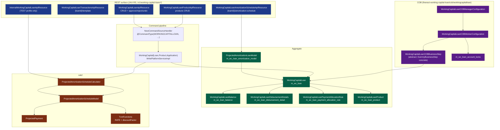

The `fineract-working-capital-loan` module is a self-contained portfolio module inside Apache Fineract that ships a **second loan product family** living side-by-side with the classic `fineract-loan` module. It owns its own JPA aggregate (`WorkingCapitalLoan` on `m_wc_loan`), its own product (`WorkingCapitalLoanProduct` on `m_wc_loan_product`), a dedicated [TVM-based projected amortization calculator](/working-capital-loan/calc-engine), its own command handlers, REST resources, and a fully parallel Close-of-Business pipeline (`WORKING_CAPITAL_LOAN_COB_JOB`) that the rest of the platform sees as just another job. This page is the entry index — every file under `fineract-working-capital-loan/src/main/java/org/apache/fineract/portfolio/workingcapitalloan/` and `…/cob/workingcapitalloan/` gets cross-referenced from here.

Working Capital lending is a short-term, discount-based product (think invoice financing / receivable advance) where the cash flow is `netDisbursement → fixed daily payments → maturity`. Instead of an EMI computed from a stated nominal interest rate, the **periodic payment is derived from a `periodPaymentRate` applied to a `totalPaymentValue`**, the effective interest rate is **back-solved via Newton-Raphson** (`TvmFunctions.rate`), and the schedule is rebuilt **every time a payment lands** to reflect actual vs expected amortization. Everything in this module exists because that calculation does not fit the progressive-loan EMI engine.

## What's in the module

<CardGroup cols={2}>
  <Card title="Aggregate root" icon="database">
    `WorkingCapitalLoan` (`m_wc_loan`) — clone of `Loan` shaped for WC product semantics. Has its own `WorkingCapitalLoanBalance`, `WorkingCapitalLoanDisbursementDetails`, payment allocation rules.
  </Card>
  <Card title="Product" icon="box">
    `WorkingCapitalLoanProduct` (`m_wc_loan_product`) — separate from `LoanProduct`. Drives `amortizationType` (EIR / FLAT), `periodPaymentRate`, `npvDayCount`, `discount`, min/max bounds, payment-allocation rules.
  </Card>
  <Card title="Calc engine" icon="calculator">
    `ProjectedAmortizationScheduleModel` + `TvmFunctions` — generates the full schedule, applies payments by date, rebuilds tail periods, computes deferred balance and income modification.
  </Card>
  <Card title="REST surface" icon="globe">
    Four JAX-RS resources under `/v1/working-capital-loans*` and `/v1/working-capital-loan-products` — applications, products, projected schedule retrieval, transactions template, plus an internal test API.
  </Card>
  <Card title="COB pipeline" icon="bolt">
    `WORKING_CAPITAL_LOAN_COB_JOB` — partitioned Spring Batch job with its own `m_wc_loan_account_locks` table, abstract `WorkingCapitalLoanCOBBusinessStep`, and a `DummyBusinessStep` placeholder.
  </Card>
  <Card title="Command handlers" icon="terminal">
    Submit / Modify / Delete / Approve / Reject / Undo-approve (loan) and Create / Update / Delete (product) — all routed via Fineract's `NewCommandSourceHandler` SPI.
  </Card>
</CardGroup>

## Package layout

```
fineract-working-capital-loan/src/main/java/org/apache/fineract/
├── cob/
│   ├── domain/                                       ← lock entity + repository
│   │   ├── WorkingCapitalLoanAccountLock.java
│   │   ├── WorkingCapitalAccountLockRepository.java
│   │   └── CustomWorkingCapitalLoanAccountLockRepositoryImpl.java
│   └── workingcapitalloan/                           ← COB pipeline
│       ├── WorkingCapitalLoanCOBConstant.java
│       ├── WorkingCapitalLoanCOBManagerConfiguration.java
│       ├── WorkingCapitalLoanCOBWorkerConfiguration.java
│       ├── WorkingCapitalLoanCOBPartitioner.java
│       ├── WorkingCapitalLoanCOBWorkerItemReader.java
│       ├── WorkingCapitalLoanCOBWorkerItemProcessor.java
│       ├── WorkingCapitalLoanCOBWorkerItemWriter.java
│       ├── WorkingCapitalLoanCOBWorkerItemListener.java
│       ├── WorkingCapitalLoanInlineCOBWorkerItemProcessor.java
│       ├── InlineWorkingCapitalLoanCOBWorkerItemWriter.java
│       ├── InlineWorkingCapitalLoanCOBWorkerItemListener.java
│       ├── AbstractWorkingCapitalLoanCOBWorkerItemProcessor.java
│       ├── AbstractWorkingCapitalLoanCOBWorkerItemWriter.java
│       ├── ApplyWorkingCapitalLoanLockTasklet.java
│       ├── WorkingCapitalLoanCOBCustomJobParametersResolverTasklet.java
│       ├── WorkingCapitalLoanLockingConfiguration.java
│       ├── WorkingCapitalLoanLockingServiceImpl.java
│       ├── WorkingCapitalAccountLockServiceImpl.java
│       ├── WorkingCapitalLoanRetrieveIdConfiguration.java
│       ├── WorkingCapitalLoanRetrieveIdService.java
│       ├── WorkingCapitalLoanRetrieveIdServiceImpl.java
│       └── businessstep/
│           ├── WorkingCapitalLoanCOBBusinessStep.java   ← abstract base
│           └── DummyBusinessStep.java                   ← seed step
└── portfolio/
    ├── workingcapitalloan/                          ← WC loan aggregate
    │   ├── WorkingCapitalLoanConstants.java
    │   ├── api/
    │   │   ├── WorkingCapitalLoanApiResource.java
    │   │   ├── WorkingCapitalLoanAmortizationScheduleApiResource.java
    │   │   ├── WorkingCapitalLoanTransactionsApiResource.java
    │   │   ├── InternalWorkingCapitalLoanApiResource.java
    │   │   └── WorkingCapitalLoanApiResourceSwagger.java
    │   ├── calc/
    │   │   ├── ProjectedAmortizationScheduleCalculator.java
    │   │   ├── DefaultProjectedAmortizationScheduleCalculator.java
    │   │   ├── ProjectedAmortizationScheduleModel.java
    │   │   ├── ProjectedPayment.java
    │   │   └── TvmFunctions.java
    │   ├── data/                                    ← DTOs
    │   ├── domain/                                  ← JPA entities
    │   │   ├── WorkingCapitalLoan.java
    │   │   ├── WorkingCapitalLoanBalance.java
    │   │   ├── WorkingCapitalLoanDisbursementDetails.java
    │   │   ├── WorkingCapitalLoanPaymentAllocationRule.java
    │   │   ├── WorkingCapitalLoanNote.java
    │   │   ├── WorkingCapitalLoanEvent.java
    │   │   ├── WorkingCapitalLoanLifecycleStateMachine.java
    │   │   ├── WorkingCapitalLoanPeriodFrequencyType.java
    │   │   └── ProjectedAmortizationLoanModel.java
    │   ├── exception/                               ← typed errors
    │   ├── handler/                                 ← command handlers
    │   ├── mapper/                                  ← MapStruct entity↔DTO
    │   ├── repository/                              ← Spring Data
    │   ├── serialization/                           ← JSON validators
    │   └── service/                                 ← read & write services
    └── workingcapitalloanproduct/                   ← WC product aggregate
        ├── WorkingCapitalLoanProductConstants.java
        ├── api/                                     ← product REST + Swagger
        ├── data/                                    ← product DTOs
        ├── domain/
        │   ├── WorkingCapitalLoanProduct.java
        │   ├── WorkingCapitalLoanProductRelatedDetail.java
        │   ├── WorkingCapitalLoanProductRelatedDetails.java
        │   ├── WorkingCapitalLoanProductMinMaxConstraints.java
        │   ├── WorkingCapitalLoanProductConfigurableAttributes.java
        │   ├── WorkingCapitalLoanProductPaymentAllocationRule.java
        │   ├── WorkingCapitalAmortizationType.java
        │   ├── WorkingCapitalPaymentAllocationType.java
        │   ├── WorkingCapitalPaymentAllocationTypeListConverter.java
        │   ├── WorkingCapitalAdvancedPaymentAllocationsJsonParser.java
        │   └── WorkingCapitalAdvancedPaymentAllocationsValidator.java
        ├── exception/
        ├── handler/
        ├── mapper/
        ├── repository/
        ├── serialization/
        └── service/
```

Database changelogs live in `src/main/resources/db/changelog/tenant/module/workingcapitalloan/parts/` (ten Liquibase parts, `0001_loan_product.xml` through `0010_loan_account_permissions.xml`). The static-weaving descriptor is at `src/main/resources/jpa/static-weaving/module/fineract-working-capital-loan/persistence.xml`.

## Module diagram



## Why it's a separate module

Read the package on disk: every file is namespaced under `org.apache.fineract.portfolio.workingcapitalloan*` or `org.apache.fineract.cob.workingcapitalloan`. The module does **not** extend `Loan`, `LoanProduct`, `LoanTransaction` or `LoanRepaymentScheduleInstallment`. It deliberately copies the parts of `fineract-loan` that fit and replaces the parts that do not:

<Steps>
  <Step title="Different cash-flow math">
    The progressive loan engine assumes a stated nominal rate, periods of one repayment unit each, and an EMI computed from it. Working capital loans start from `(totalPayment, periodPaymentRate, npvDayCount)` and back-solve the effective interest rate. The arithmetic could not be coerced into `EMICalculator` without breaking it for both products.
  </Step>
  <Step title="Different schedule shape">
    The schedule has one row per **day** between expected disbursement and maturity, not one row per repayment period. Storing those rows in `m_loan_repayment_schedule` would explode the table. Instead the schedule is materialised as a Gson JSON blob in `m_wc_loan_amortization_model.json_model` and rebuilt in-memory whenever a payment lands.
  </Step>
  <Step title="Different lock contention">
    Putting WC loans into `m_loan_account_locks` would couple online disbursement of a regular loan to whether a WC catch-up has finished. A dedicated `m_wc_loan_account_locks` plus its own `LockingService<WorkingCapitalLoanAccountLock>` keeps the two products' COB completely independent.
  </Step>
  <Step title="Different permissions namespace">
    `WCL_RESOURCE_NAME = "WORKINGCAPITALLOAN"` and `WCLP_RESOURCE_NAME = "WORKINGCAPITALLOANPRODUCT"` are distinct from the loan namespace — auditing, permissions, and `@CommandType(entity = …)` lookups treat the two products as siblings.
  </Step>
  <Step title="Different REST surface">
    All endpoints live under `/v1/working-capital-loans` and `/v1/working-capital-loan-products`. None of them piggy-back on the loan controller's path.
  </Step>
</Steps>

## Database root

`m_wc_loan` is the aggregate root. Its key relationships:

```sql
m_wc_loan
  ├─ product_id              → m_wc_loan_product (LAZY)
  ├─ client_id               → m_client
  ├─ fund_id                 → m_fund
  ├─ loan_status_id          (LoanStatus, reused enum)
  ├─ external_id             unique
  ├─ account_no              unique
  ├─ last_closed_business_date  ← updated by COB
  └─ embedded WorkingCapitalLoanProductRelatedDetails
       (currency + principal + periodPaymentRate + amortizationType + …)

m_wc_loan_balance              (1:1 with m_wc_loan)
m_wc_loan_disbursement_detail  (N:1 m_wc_loan, expected vs actual tranche)
m_wc_loan_payment_allocation_rule  (N:1 m_wc_loan, per PaymentAllocationTransactionType)
m_wc_loan_note                 (N:1 m_wc_loan)
m_wc_loan_amortization_model   (1:1 m_wc_loan, json_model + business_date)
m_wc_loan_product              (the product)
m_wc_loan_product_payment_allocation_rule
m_wc_loan_product_configurable_attributes
m_wc_loan_account_locks        (COB chunk lock)
```

## Build & Gradle

The module's `build.gradle` is a standard Fineract sub-project: it depends on `fineract-core`, `fineract-loan` (for `LoanStatus` and `PaymentAllocationTransactionType` which it reuses), and `fineract-cob` (for the partitioning, locking and business-step framework). Liquibase changelogs are wired in through the module-changelog master at `src/main/resources/db/changelog/tenant/module/workingcapitalloan/module-changelog-master.xml`.

```text
fineract-working-capital-loan/
├── build.gradle
├── dependencies.gradle
└── src/
    ├── main/
    │   ├── java/org/apache/fineract/…   (~110 classes)
    │   └── resources/
    │       ├── db/changelog/tenant/module/workingcapitalloan/
    │       │   ├── module-changelog-master.xml
    │       │   └── parts/
    │       │       ├── 0001_loan_product.xml
    │       │       ├── 0002_wc_loan_schema.xml
    │       │       ├── 0003_working_capital_loan_cob.xml
    │       │       ├── 0004_extend_working_capital_loan_entity.xml
    │       │       ├── 0005_alter_wc_loan_add_columns.xml
    │       │       ├── 0006_wc_loan_disbursement_details.xml
    │       │       ├── 0007_drop_flat_percentage_amount.xml
    │       │       ├── 0008_delinquency_for_working_capital_loans.xml
    │       │       ├── 0009_wc_loan_amortization_model.xml
    │       │       └── 0010_loan_account_permissions.xml
    │       └── jpa/static-weaving/module/fineract-working-capital-loan/persistence.xml
    └── test/
        └── java/org/apache/fineract/portfolio/workingcapitalloan/calc/
            └── ProjectedAmortizationScheduleCalculatorTest.java
```

## Where to read next

<CardGroup cols={2}>
  <Card title="Domain & product" icon="database" href="/working-capital-loan/domain-and-product">
    Field-by-field tour of `WorkingCapitalLoan`, `WorkingCapitalLoanBalance`, the embedded `WorkingCapitalLoanProductRelatedDetail`, payment-allocation rules and the lifecycle state machine.
  </Card>
  <Card title="Calc engine" icon="calculator" href="/working-capital-loan/calc-engine">
    `ProjectedAmortizationScheduleModel.generate` / `regenerate` / `applyPayment`, the TVM `rate` Newton-Raphson solver and the per-period balance roll.
  </Card>
  <Card title="REST APIs" icon="globe" href="/working-capital-loan/working-capital-api">
    Method × path × handler table for every WC ApiResource — applications, products, projected schedule retrieval, transaction template, internal test endpoint.
  </Card>
  <Card title="COB pipeline" icon="bolt" href="/working-capital-loan/working-capital-cob">
    `WORKING_CAPITAL_LOAN_COB_JOB`, the partitioner, the chunked reader→processor→writer, the inline variant and the abstract `WorkingCapitalLoanCOBBusinessStep`.
  </Card>
  <Card title="Loan COB framework" icon="link" href="/cob/working-capital-loan-cob">
    The Spring-Batch-side reference: how the two configurations are wired, `BatchManagerCondition` vs `BatchWorkerCondition`, the lock-owner contract.
  </Card>
  <Card title="Loan module" icon="book" href="/loan/overview">
    The sibling `fineract-loan` module — the classic Loan aggregate, EMICalculator, progressive schedule. Working capital deliberately mirrors its REST shape but not its persistence.
  </Card>
</CardGroup>

## Module dependencies (declared)

```text
fineract-working-capital-loan
  → fineract-core            (commands, JsonCommand, JobName, ExternalId, AppUser)
  → fineract-loan            (LoanStatus, LoanStatusConverter, PaymentAllocationTransactionType,
                              loan-application timeline/data, LoanCOBBusinessStep helpers)
  → fineract-cob             (CommonPartitioner, COBBusinessStep<T>, LockingService<T>,
                              ApplyCommonLockTasklet, AbstractItemProcessor, AbstractLoanItemListener)
```

`fineract-provider` and `fineract-investor` do not depend on this module — instead, the COB framework auto-discovers it because all of its `@Configuration` classes carry `BatchManagerCondition` / `BatchWorkerCondition` and Spring Boot's component scan picks them up.

## File inventory (Java, by area)

| Area | Files | Purpose |
| --- | --- | --- |
| `portfolio.workingcapitalloan.domain` | 9 | Aggregate + lifecycle + enums + amortization-model store |
| `portfolio.workingcapitalloan.data` | 7 | DTOs (`WorkingCapitalLoanData`, `WorkingCapitalLoanTemplateData`, `ProjectedAmortizationScheduleData`, `WorkingCapitalLoanBalanceData`, `WorkingCapitalLoanDisbursementDetailData`, `ProjectedAmortizationSchedulePaymentData`, `ProjectedAmortizationScheduleGenerateRequest`, `WorkingCapitalLoanCommandTemplateData`) |
| `portfolio.workingcapitalloan.repository` | 3 | Spring Data + `findOldestCOBProcessedLoan`, `findAllLoansBehindOnDisbursementDate`, etc. |
| `portfolio.workingcapitalloan.serialization` | 2 | `WorkingCapitalLoanApplicationDataValidator`, `WorkingCapitalLoanDataValidator` |
| `portfolio.workingcapitalloan.handler` | 6 | One handler per command (submit/modify/delete/approve/reject/undo) |
| `portfolio.workingcapitalloan.service` | 12 | Read + write platform services, assembler, amortization read/write, parser, repository wrapper |
| `portfolio.workingcapitalloan.api` | 5 | 4 REST resources + Swagger schema |
| `portfolio.workingcapitalloan.exception` | 5 | Typed exceptions (not-found, validation, lifecycle) |
| `portfolio.workingcapitalloan.calc` | 5 | TVM, schedule model, calculator |
| `portfolio.workingcapitalloan.mapper` | 5 | MapStruct entity-to-DTO |
| `portfolio.workingcapitalloanproduct.*` | ≈22 | Product domain, data, handler, service, validator, mapper, REST |
| `cob.workingcapitalloan` | 23 | Partitioner, reader/processor/writer/listener (manager + worker + inline), retrieve-id, locking, custom-params resolver, business-step abstract + DummyBusinessStep |
| `cob.domain` (WC-specific) | 3 | `WorkingCapitalLoanAccountLock`, `WorkingCapitalAccountLockRepository`, custom repo impl |

That's roughly 110 Java classes — small relative to `fineract-loan` (which is ~600+) because the persistence layer is one aggregate, not a dozen.

## Quick map: what to grep for

- `m_wc_loan` — table layer, all SQL touching the WC aggregate.
- `WCL_RESOURCE_NAME = "WORKINGCAPITALLOAN"` — permission entity name for the loan.
- `WCLP_RESOURCE_NAME = "WORKINGCAPITALLOANPRODUCT"` — permission entity name for the product.
- `@CommandType(entity = "WORKINGCAPITALLOAN"` — command handlers fanout point.
- `JobName.WORKING_CAPITAL_LOAN_COB_JOB` — job-name enum entry.
- `"WORKING_CAPITAL_LOAN_CLOSE_OF_BUSINESS"` — value persisted in `m_batch_business_steps.job_name` for steps registered against this job.
- `"INLINE_WORKING_CAPITAL_LOAN_COB"` — inline variant job name.
- `WorkingCapitalLoanCOBBusinessStep` — abstract base every COB step extends.
- `ProjectedAmortizationScheduleModel.generate` — the entry point of the calc engine.

## Test fixtures

There are exactly three production Java test files in this module:

```text
src/test/java/org/apache/fineract/portfolio/workingcapitalloan/calc/
    ProjectedAmortizationScheduleCalculatorTest.java
src/test/java/org/apache/fineract/portfolio/workingcapitalloanproduct/serialization/
    WorkingCapitalLoanApplicationDataValidatorTest.java
    WorkingCapitalLoanProductDataValidatorTest.java
```

End-to-end integration tests live one level up at `integration-tests/src/test/java/org/apache/fineract/integrationtests/common/workingcapitalloan/` (helpers for hitting the REST surface from JUnit).

## Profiles & conditions

The module's beans gate themselves with the standard Fineract conditions:

| Class | Active when |
| --- | --- |
| `WorkingCapitalLoanCOBManagerConfiguration` | `BatchManagerCondition` — the JVM is running as the batch coordinator |
| `WorkingCapitalLoanCOBWorkerConfiguration`  | `BatchWorkerCondition` — the JVM is running as a batch worker |
| `WorkingCapitalLoanLockingConfiguration`    | always (provides `LockingService<WorkingCapitalLoanAccountLock>`) |
| `WorkingCapitalLoanRetrieveIdConfiguration` | always |
| `InternalWorkingCapitalLoanApiResource`     | `@Profile(FineractProfiles.TEST)` — never active in production |

This page intentionally stays at the index level. Each of the next four documents pins down one slice: the persistence and product, the calc engine, the REST surface, and the COB pipeline.
