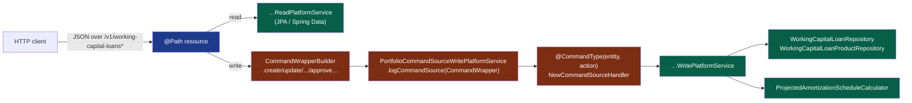

The Fineract Working Capital module exposes five JAX-RS resources under the `/v1/working-capital-loans*` and `/v1/working-capital-loan-products` paths. Two host the loan-application lifecycle (`WorkingCapitalLoanApiResource`, `WorkingCapitalLoanTransactionsApiResource`), one returns the projected amortization schedule (`WorkingCapitalLoanAmortizationScheduleApiResource`), one drives product CRUD (`WorkingCapitalLoanProductApiResource`), and one — gated by `@Profile(FineractProfiles.TEST)` — exists only to let integration tests synthesise schedules directly (`InternalWorkingCapitalLoanApiResource`). Write methods funnel through `PortfolioCommandSourceWritePlatformService.logCommandSource(CommandWrapper)` so they're audited and replayable the same way any other Fineract command is. This page is the per-method reference for engineers wiring clients or coding agents: method × path × handler × command-wrapper × response shape, with verbatim source.

## File inventory

```
portfolio/workingcapitalloan/api/
├── WorkingCapitalLoanApiResource.java                   ← lifecycle CRUD
├── WorkingCapitalLoanTransactionsApiResource.java       ← {loanId}/template
├── WorkingCapitalLoanAmortizationScheduleApiResource.java  ← schedule read
├── InternalWorkingCapitalLoanApiResource.java           ← TEST profile only
└── WorkingCapitalLoanApiResourceSwagger.java            ← Swagger schemas

portfolio/workingcapitalloanproduct/api/
├── WorkingCapitalLoanProductApiResource.java            ← product CRUD
└── WorkingCapitalLoanProductApiResourceSwagger.java     ← Swagger schemas
```

## End-to-end request flow



`logCommandSource` is the Fineract write boundary — it persists a `CommandSource` row, looks up the registered `NewCommandSourceHandler` by `@CommandType(entity, action)`, dispatches the command, and returns a `CommandProcessingResult`.

## `WorkingCapitalLoanApiResource` — `/v1/working-capital-loans`

```java
@Component
@Path("/v1/working-capital-loans")
@Tag(name = "Working Capital Loans", description = "Working Capital Loan applications")
@RequiredArgsConstructor
public class WorkingCapitalLoanApiResource {

    private static final String RESOURCE_NAME_FOR_PERMISSIONS = WorkingCapitalLoanConstants.WCL_RESOURCE_NAME;

    private final PlatformSecurityContext context;
    private final WorkingCapitalLoanApplicationReadPlatformService readPlatformService;
    private final PortfolioCommandSourceWritePlatformService commandsSourceWritePlatformService;
}
```

`WCL_RESOURCE_NAME = "WORKINGCAPITALLOAN"` — all read methods gate on `context.authenticatedUser().validateHasReadPermission(WCL_RESOURCE_NAME)`.

### Endpoints

| Method | Path | Handler method | Read service / Command wrapper | Response type |
| --- | --- | --- | --- | --- |
| GET | `/v1/working-capital-loans/template` | `retrieveTemplate(productId, clientId)` | `WorkingCapitalLoanApplicationReadPlatformService.retrieveTemplate` | `WorkingCapitalLoanTemplateData` |
| GET | `/v1/working-capital-loans` | `retrieveAll(externalId, accountNo, clientId, status, pageable)` | `…retrieveAllPaged(pageable, clientId, externalId, status, accountNo)` | `Page<WorkingCapitalLoanData>` |
| GET | `/v1/working-capital-loans/{loanId}` | `retrieveOne(loanId)` | `…retrieveOne(loanId)` | `WorkingCapitalLoanData` |
| GET | `/v1/working-capital-loans/external-id/{loanExternalId}` | `retrieveOne(String)` | `…retrieveOne(ExternalId)` | `WorkingCapitalLoanData` |
| POST | `/v1/working-capital-loans` | `submitLoanApplication(json)` | `createWorkingCapitalLoanApplication()` → `@CommandType(WORKINGCAPITALLOAN, CREATE)` | `CommandProcessingResult` |
| PUT | `/v1/working-capital-loans/{loanId}` | `modifyLoanApplicationById(loanId, command, json)` | `updateWorkingCapitalLoanApplication()` → `@CommandType(WORKINGCAPITALLOAN, UPDATE)` | `CommandProcessingResult` |
| PUT | `/v1/working-capital-loans/external-id/{loanExternalId}` | `modifyLoanApplicationByExternalId(...)` | same as PUT by id | `CommandProcessingResult` |
| DELETE | `/v1/working-capital-loans/{loanId}` | `deleteLoanApplication(loanId)` | `deleteWorkingCapitalLoanApplication()` → `@CommandType(WORKINGCAPITALLOAN, DELETE)` | `CommandProcessingResult` |
| DELETE | `/v1/working-capital-loans/external-id/{loanExternalId}` | `deleteLoanApplication(String)` | same as DELETE by id | `CommandProcessingResult` |
| POST | `/v1/working-capital-loans/{loanId}` | `stateTransitionById(loanId, command, json)` | one of `approveWorkingCapitalLoanApplication(loanId)`, `rejectWorkingCapitalLoanApplication(loanId)`, `undoWorkingCapitalLoanApplicationApproval(loanId)` | `CommandProcessingResult` |
| POST | `/v1/working-capital-loans/external-id/{loanExternalId}` | `stateTransitionByExternalId(...)` | same as POST by id | `CommandProcessingResult` |

### Template

```java
@GET @Path("template")
public WorkingCapitalLoanTemplateData retrieveTemplate(
        @QueryParam("productId") @Parameter(description = "productId") final Long productId,
        @QueryParam("clientId")  @Parameter(description = "clientId")  final Long clientId) {
    this.context.authenticatedUser().validateHasReadPermission(RESOURCE_NAME_FOR_PERMISSIONS);
    return this.readPlatformService.retrieveTemplate(productId, clientId);
}
```

Returns `WorkingCapitalLoanTemplateData` which wraps a `WorkingCapitalLoanData` skeleton plus dropdown options (`productOptions`, `fundOptions`, `delinquencyBucketOptions`, `periodFrequencyTypeOptions`).

### List

```java
@GET
public Page<WorkingCapitalLoanData> retrieveAll(
        @QueryParam("externalId") final String externalId,
        @QueryParam("accountNo")  final String accountNo,
        @QueryParam("clientId")   final Long   clientId,
        @QueryParam("status")     final String status,
        @Parameter(hidden = true) @Pagination(maximumSize = 200) final Pageable pageable) {
    this.context.authenticatedUser().validateHasReadPermission(RESOURCE_NAME_FOR_PERMISSIONS);
    return this.readPlatformService.retrieveAllPaged(pageable, clientId, externalId, status, accountNo);
}
```

- **Pagination** uses Spring Data `Pageable` capped at 200 per page (`@Pagination(maximumSize = 200)`).
- **Sort**: `?sort=id,asc` / `?sort=accountNumber,desc`.
- **Filters** (all optional, AND-combined): `clientId`, `externalId`, `accountNo`, `status`.
- **Response envelope**: `{ content, totalElements, totalPages, size, number }`.

### Retrieve one

```java
@GET @Path("{loanId}")
public WorkingCapitalLoanData retrieveOne(@PathParam("loanId") final Long loanId) {
    this.context.authenticatedUser().validateHasReadPermission(RESOURCE_NAME_FOR_PERMISSIONS);
    return this.readPlatformService.retrieveOne(loanId);
}

@GET @Path("external-id/{loanExternalId}")
public WorkingCapitalLoanData retrieveOne(@PathParam("loanExternalId") final String loanExternalId) {
    this.context.authenticatedUser().validateHasReadPermission(RESOURCE_NAME_FOR_PERMISSIONS);
    final ExternalId externalId = ExternalIdFactory.produce(loanExternalId);
    return this.readPlatformService.retrieveOne(externalId);
}
```

If the loan does not exist the read service throws `WorkingCapitalLoanNotFoundException` → 404.

### Submit (POST)

```java
@POST
public CommandProcessingResult submitLoanApplication(@Parameter(hidden = true) final String apiRequestBodyAsJson) {
    final CommandWrapper commandRequest = new CommandWrapperBuilder()
            .createWorkingCapitalLoanApplication().withJson(apiRequestBodyAsJson).build();
    return this.commandsSourceWritePlatformService.logCommandSource(commandRequest);
}
```

`CommandWrapperBuilder.createWorkingCapitalLoanApplication()` sets `actionName=CREATE`, `entityName=WORKINGCAPITALLOAN`, `entityId=null`, `loanId=null`, `href=/workingcapitalloans`. Dispatched to `WorkingCapitalLoanApplicationSubmittalCommandHandler` (`@CommandType(WORKINGCAPITALLOAN, CREATE)`) which delegates to `WorkingCapitalLoanApplicationWritePlatformService.submitApplication(command)`.

Payload fields required by `WorkingCapitalLoanApplicationDataValidator`:

```
clientId, productId, principalAmount, periodPaymentRate,
expectedDisbursementDate, submittedOnDate, locale, dateFormat
```

Optional: `fundId`, `accountNo`, `externalId`, `repaymentEvery`, `repaymentFrequencyType`, `paymentAllocation`, `discount`, `submittedOnNote`.

### Modify (PUT) and Delete

Both share a single private helper that resolves the id-or-externalId, then builds the matching CommandWrapper:

```java
private CommandProcessingResult modifyLoanApplication(final Long loanId,
        final String loanExternalIdStr, final String apiRequestBodyAsJson) {
    final Long resolvedLoanId = loanId != null ? loanId
            : readPlatformService.getResolvedLoanId(ExternalIdFactory.produce(loanExternalIdStr));
    if (resolvedLoanId == null) throw new WorkingCapitalLoanNotFoundException(ExternalIdFactory.produce(loanExternalIdStr));
    final CommandWrapper commandRequest = new CommandWrapperBuilder()
            .withJson(apiRequestBodyAsJson).withLoanId(resolvedLoanId)
            .updateWorkingCapitalLoanApplication().build();
    return this.commandsSourceWritePlatformService.logCommandSource(commandRequest);
}
```

`updateWorkingCapitalLoanApplication()` → `@CommandType(WORKINGCAPITALLOAN, UPDATE)` (`WorkingCapitalLoanApplicationModificationCommandHandler`). The write service throws `WorkingCapitalLoanApplicationNotInSubmittedStateCannotBeModifiedException` if the loan is not in `SUBMITTED_AND_PENDING_APPROVAL`.

The delete path mirrors this — `deleteWorkingCapitalLoanApplication()` → `@CommandType(WORKINGCAPITALLOAN, DELETE)` (`WorkingCapitalLoanApplicationDeletionCommandHandler`); the write service throws `WorkingCapitalLoanApplicationNotInSubmittedStateCannotBeDeletedException` for non-submitted loans.

### State transitions: approve / reject / undo

A single POST handler dispatches based on `?command=…`:

```java
@POST @Path("{loanId}")
public CommandProcessingResult stateTransitionById(
        @PathParam("loanId") final Long loanId,
        @QueryParam("command") @Parameter(required = true) final String commandParam,
        @Parameter(hidden = true) final String apiRequestBodyAsJson) {
    return handleStateTransition(loanId, null, commandParam, apiRequestBodyAsJson);
}

private CommandProcessingResult handleStateTransition(final Long loanId,
        final String loanExternalIdStr, final String commandParam, final String apiRequestBodyAsJson) {

    final Long resolvedLoanId = loanId != null ? loanId
            : readPlatformService.getResolvedLoanId(ExternalIdFactory.produce(loanExternalIdStr));
    if (resolvedLoanId == null) {
        throw new WorkingCapitalLoanNotFoundException(ExternalIdFactory.produce(loanExternalIdStr));
    }

    final CommandWrapperBuilder builder = new CommandWrapperBuilder().withJson(apiRequestBodyAsJson);
    CommandWrapper commandRequest = null;
    if (CommandParameterUtil.is(commandParam, "approve")) {
        commandRequest = builder.approveWorkingCapitalLoanApplication(resolvedLoanId).build();
    } else if (CommandParameterUtil.is(commandParam, "reject")) {
        commandRequest = builder.rejectWorkingCapitalLoanApplication(resolvedLoanId).build();
    } else if (CommandParameterUtil.is(commandParam, "undoapproval")) {
        commandRequest = builder.undoWorkingCapitalLoanApplicationApproval(resolvedLoanId).build();
    }
    if (commandRequest == null) throw new UnrecognizedQueryParamException("command", commandParam);
    return this.commandsSourceWritePlatformService.logCommandSource(commandRequest);
}
```

| `?command=` | CommandWrapper builder | Action name | Handler |
| --- | --- | --- | --- |
| `approve` | `approveWorkingCapitalLoanApplication(loanId)` | `APPROVE` | `ApproveWorkingCapitalLoanCommandHandler` |
| `reject` | `rejectWorkingCapitalLoanApplication(loanId)` | `REJECT` | `RejectWorkingCapitalLoanCommandHandler` |
| `undoapproval` | `undoWorkingCapitalLoanApplicationApproval(loanId)` | `APPROVALUNDO` | `UndoApproveWorkingCapitalLoanCommandHandler` |

Any other value of `command` → `UnrecognizedQueryParamException` → 400.

Action `APPROVALUNDO` is set by:

```java
public CommandWrapperBuilder undoWorkingCapitalLoanApplicationApproval(final Long loanId) {
    this.actionName = "APPROVALUNDO";
    this.entityName = "WORKINGCAPITALLOAN";
    this.entityId   = loanId;
    this.href       = "/workingcapitalloans/" + loanId;
    return this;
}
```

## `WorkingCapitalLoanTransactionsApiResource` — `{loanId}/template`

```java
@Component
@Path("/v1/working-capital-loans")
@Tag(name = "Working Capital Loan Transactions",
     description = "Working Capital Loan Transactions")
@RequiredArgsConstructor
public class WorkingCapitalLoanTransactionsApiResource {

    private static final String RESOURCE_NAME_FOR_PERMISSIONS = WorkingCapitalLoanConstants.WCL_RESOURCE_NAME;

    private final PlatformSecurityContext context;
    private final WorkingCapitalLoanApplicationReadPlatformService readPlatformService;
    private final WorkingCapitalLoanTransactionReadPlatformService readTransactionPlatformService;

    @GET @Path("{loanId}/template")
    public WorkingCapitalLoanCommandTemplateData retrieveWorkingCapitalLoanTemplate(
            @PathParam("loanId") final Long loanId,
            @QueryParam("templateType") final String templateType,
            @Context final UriInfo uriInfo) {

        this.context.authenticatedUser().validateHasReadPermission(RESOURCE_NAME_FOR_PERMISSIONS);
        return handleLoanTransactionTemplate(loanId, null, templateType);
    }

    private WorkingCapitalLoanCommandTemplateData handleLoanTransactionTemplate(
            final Long loanId, final String loanExternalIdStr, final String templateType) {

        final Long resolvedLoanId = loanId != null ? loanId
                : readPlatformService.getResolvedLoanId(ExternalIdFactory.produce(loanExternalIdStr));
        if (resolvedLoanId == null) {
            throw new WorkingCapitalLoanNotFoundException(ExternalIdFactory.produce(loanExternalIdStr));
        }
        final WorkingCapitalLoanCommandTemplateData data =
                readTransactionPlatformService.retrieveLoanTransactionTemplate(resolvedLoanId, templateType);
        if (data == null) throw new UnrecognizedQueryParamException("command", templateType);
        return data;
    }
}
```

| Method | Path | Query | Returns |
| --- | --- | --- | --- |
| GET | `/v1/working-capital-loans/{loanId}/template` | `templateType` (e.g. `approve`, `reject`, `disburse`) | `WorkingCapitalLoanCommandTemplateData` (loanId, approvalDate, approvalAmount, expectedDisbursementDate/Amount/MaturityDate, currencies, payment-type options) |

If `templateType` does not resolve a known template the read service returns `null` and the resource throws `UnrecognizedQueryParamException("command", templateType)`.

## `WorkingCapitalLoanAmortizationScheduleApiResource`

```java
@Path("/v1/working-capital-loans")
@Component
@Tag(name = "Working Capital Loans",
     description = "Working Capital Loan operations including projected amortization schedule.")
@RequiredArgsConstructor
public class WorkingCapitalLoanAmortizationScheduleApiResource {

    private final WorkingCapitalLoanAmortizationScheduleReadService readService;

    @GET @Path("{loanId}/amortization-schedule")
    @Operation(summary = "Retrieve Projected Amortization Schedule", description = """
            Returns the projected amortization schedule for a Working Capital Loan.

            The schedule contains per-payment details including expected and forecast payments, \
            discount factors, NPV values, balances, expected and actual amortization amounts, \
            income modifications, and deferred balance.

            Example Request:

            working-capital-loans/1/amortization-schedule""")
    public ProjectedAmortizationScheduleData retrieveAmortizationSchedule(
            @PathParam("loanId") final Long loanId) {
        return readService.retrieveAmortizationSchedule(loanId);
    }
}
```

| Method | Path | Handler | Returns |
| --- | --- | --- | --- |
| GET | `/v1/working-capital-loans/{loanId}/amortization-schedule` | `WorkingCapitalLoanAmortizationScheduleReadService.retrieveAmortizationSchedule(loanId)` | `ProjectedAmortizationScheduleData` |

Internally the read service:

1. Loads the loan (or throws `WorkingCapitalLoanNotFoundException`),
2. Calls `ProjectedAmortizationScheduleRepositoryWrapper.readModel(loanId, mc, currency)`,
3. If absent, throws `ProjectedAmortizationScheduleNotFoundException`,
4. Otherwise maps the `ProjectedAmortizationScheduleModel` via `ProjectedAmortizationScheduleMapper` into `ProjectedAmortizationScheduleData`.

Response shape:

```java
@Getter @Builder @AllArgsConstructor
public class ProjectedAmortizationScheduleData {
    private final BigDecimal originationFeeAmount;
    private final BigDecimal netDisbursementAmount;
    private final BigDecimal totalPaymentValue;
    private final BigDecimal periodPaymentRate;
    private final int        npvDayCount;
    private final LocalDate  expectedDisbursementDate;
    private final BigDecimal expectedPaymentAmount;
    private final int        loanTerm;
    private final BigDecimal effectiveInterestRate;
    private final List<ProjectedAmortizationSchedulePaymentData> payments;
}
```

Each `ProjectedAmortizationSchedulePaymentData` is the externalised form of `ProjectedPayment` (see [calc engine](/working-capital-loan/calc-engine)).

## `InternalWorkingCapitalLoanApiResource` — TEST ONLY

```java
@Slf4j @RequiredArgsConstructor
@Profile(FineractProfiles.TEST)
@Component
@Path("v1/internal/working-capital-loans")
@Tag(name = "Working Capital Loans",
     description = "Internal WCL testing API. This API should be disabled in production!")
public class InternalWorkingCapitalLoanApiResource implements InitializingBean {

    private final WorkingCapitalLoanAmortizationScheduleWriteService writeService;

    @Override
    public void afterPropertiesSet() throws Exception {
        log.warn("------------------------------------------------------------");
        log.warn("DO NOT USE THIS IN PRODUCTION!");
        log.warn("Internal client services mode is enabled");
        log.warn("DO NOT USE THIS IN PRODUCTION!");
        log.warn("------------------------------------------------------------");
    }

    @POST @Path("{loanId}/amortization-schedule")
    public void generateAmortizationSchedule(
            @PathParam("loanId") final Long loanId,
            final ProjectedAmortizationScheduleGenerateRequest request) {
        writeService.generateAndSaveAmortizationSchedule(loanId, request);
    }
}
```

| Method | Path | Returns |
| --- | --- | --- |
| POST | `/v1/internal/working-capital-loans/{loanId}/amortization-schedule` | `void` (201/204) |

Body:

```java
@Getter @Setter @NoArgsConstructor
public class ProjectedAmortizationScheduleGenerateRequest {
    private BigDecimal originationFeeAmount;
    private BigDecimal netDisbursementAmount;
    private BigDecimal totalPaymentValue;
    private BigDecimal periodPaymentRate;
    private int        npvDayCount;
    private LocalDate  expectedDisbursementDate;
}
```

Implementation:

```java
@Service @RequiredArgsConstructor @Transactional
public class WorkingCapitalLoanAmortizationScheduleWriteServiceImpl
        implements WorkingCapitalLoanAmortizationScheduleWriteService {

    private static final MonetaryCurrency DEFAULT_CURRENCY = new MonetaryCurrency("USD", 2, null);

    private final WorkingCapitalLoanRepository loanRepository;
    private final ProjectedAmortizationScheduleRepositoryWrapper scheduleRepositoryWrapper;

    @Override
    public void generateAndSaveAmortizationSchedule(final Long loanId,
            final ProjectedAmortizationScheduleGenerateRequest request) {

        final WorkingCapitalLoan loan = loanRepository.findById(loanId)
                .orElseThrow(() -> new WorkingCapitalLoanNotFoundException(loanId));

        final MathContext mc = MoneyHelper.getMathContext();
        final ProjectedAmortizationScheduleModel model = ProjectedAmortizationScheduleModel.generate(
                request.getOriginationFeeAmount(), request.getNetDisbursementAmount(),
                request.getTotalPaymentValue(), request.getPeriodPaymentRate(),
                request.getNpvDayCount(), request.getExpectedDisbursementDate(),
                mc, DEFAULT_CURRENCY);

        scheduleRepositoryWrapper.writeModel(loan, model);
    }
}
```

<Warning>
The class-level Javadoc explicitly says: *"TODO: This is a temporary testing implementation. In the real flow, the amortization schedule will be generated and saved as part of the loan lifecycle (approve/disburse) — not via a standalone endpoint."* The hard-coded `DEFAULT_CURRENCY = new MonetaryCurrency("USD", 2, null)` is a placeholder; production code paths use the loan's product currency.
</Warning>

## `WorkingCapitalLoanProductApiResource` — `/v1/working-capital-loan-products`

```java
@Path("/v1/working-capital-loan-products")
@Component
@Tag(name = "Working Capital Loan Products",
     description = "A Working Capital Loan Product is a template that is used when creating a Working Capital loan.")
@RequiredArgsConstructor
public class WorkingCapitalLoanProductApiResource {

    private static final String RESOURCE_NAME_FOR_PERMISSIONS = WorkingCapitalLoanProductConstants.WCLP_RESOURCE_NAME;

    private final PlatformSecurityContext context;
    private final WorkingCapitalLoanProductReadPlatformService readPlatformService;
    private final PortfolioCommandSourceWritePlatformService commandsSourceWritePlatformService;
    private final ApiRequestParameterHelper apiRequestParameterHelper;
}
```

`WCLP_RESOURCE_NAME = "WORKINGCAPITALLOANPRODUCT"` gates read methods.

### Endpoint table

| Method | Path | Handler method | Command wrapper / read service | Response |
| --- | --- | --- | --- | --- |
| POST | `/v1/working-capital-loan-products` | `createWorkingCapitalLoanProduct(json)` | `createWorkingCapitalLoanProduct()` → `@CommandType(WORKINGCAPITALLOANPRODUCT, CREATE)` | `CommandProcessingResult` |
| GET | `/v1/working-capital-loan-products` | `retrieveAllWorkingCapitalLoanProducts()` | `…retrieveAllWorkingCapitalLoanProducts()` | `List<WorkingCapitalLoanProductData>` |
| GET | `/v1/working-capital-loan-products/template` | `retrieveTemplate()` | `…retrieveNewWorkingCapitalLoanProductDetails()` | `WorkingCapitalLoanProductData` |
| GET | `/v1/working-capital-loan-products/{productId}` | `retrieveWorkingCapitalLoanProductDetails(productId, uriInfo)` | `…retrieveWorkingCapitalLoanProduct(productId)`; if `?template=true`, applies the template overlay | `WorkingCapitalLoanProductData` |
| GET | `/v1/working-capital-loan-products/external-id/{externalProductId}` | `retrieveWorkingCapitalLoanProductDetails(String, uriInfo)` | resolve id by externalId → same as above | `WorkingCapitalLoanProductData` |
| PUT | `/v1/working-capital-loan-products/{productId}` | `updateWorkingCapitalLoanProduct(productId, json)` | `updateWorkingCapitalLoanProduct(productId)` → `@CommandType(WORKINGCAPITALLOANPRODUCT, UPDATE)` | `CommandProcessingResult` |
| PUT | `/v1/working-capital-loan-products/external-id/{externalProductId}` | `updateWorkingCapitalLoanProduct(String, json)` | resolve id → same as PUT | `CommandProcessingResult` |
| DELETE | `/v1/working-capital-loan-products/{productId}` | `deleteWorkingCapitalLoanProduct(productId)` | `deleteWorkingCapitalLoanProduct(productId)` → `@CommandType(WORKINGCAPITALLOANPRODUCT, DELETE)` | `CommandProcessingResult` |
| DELETE | `/v1/working-capital-loan-products/external-id/{externalProductId}` | `deleteWorkingCapitalLoanProduct(String)` | resolve id → same as DELETE | `CommandProcessingResult` |

### Create

```java
@POST
@Operation(operationId = "createWorkingCapitalLoanProduct",
           summary = "Create a Working Capital Loan Product",
           description = """
                Creates a new Working Capital Loan Product.

                Mandatory Fields: name, shortName, currencyCode, digitsAfterDecimal, inMultiplesOf, \
                amortizationType, npvDayCount, principal, periodPaymentRate, repaymentEvery, \
                repaymentFrequencyType

                Optional Fields: externalId, fundId, startDate, closeDate, description, \
                delinquencyBucketClassification, minPrincipal, maxPrincipal, minPeriodPaymentRate, \
                maxPeriodPaymentRate, discount, paymentAllocation, allowAttributeOverrides""")
public CommandProcessingResult createWorkingCapitalLoanProduct(
        @Parameter(hidden = true) final String apiRequestBodyAsJson) {
    final CommandWrapper commandRequest = new CommandWrapperBuilder()
            .createWorkingCapitalLoanProduct()
            .withJson(apiRequestBodyAsJson)
            .build();
    return this.commandsSourceWritePlatformService.logCommandSource(commandRequest);
}
```

`createWorkingCapitalLoanProduct()`:

```java
public CommandWrapperBuilder createWorkingCapitalLoanProduct() {
    this.actionName = "CREATE";
    this.entityName = "WORKINGCAPITALLOANPRODUCT";
    this.entityId   = null;
    this.href       = "/working-capital-loan-products/template";
    return this;
}
```

Dispatched to `CreateWorkingCapitalLoanProductCommandHandler` (`@CommandType(WORKINGCAPITALLOANPRODUCT, CREATE)`) → `WorkingCapitalLoanProductWritePlatformService.createWorkingCapitalLoanProduct(command)`. Duplicate detection raises:

- `WorkingCapitalLoanProductDuplicateNameException` (name)
- `WorkingCapitalLoanProductDuplicateShortNameException` (shortName)
- `WorkingCapitalLoanProductDuplicateExternalIdException` (externalId)

### Read

```java
@GET @Path("{productId}")
public WorkingCapitalLoanProductData retrieveWorkingCapitalLoanProductDetails(
        @PathParam("productId") final Long productId, @Context final UriInfo uriInfo) {
    this.context.authenticatedUser().validateHasReadPermission(RESOURCE_NAME_FOR_PERMISSIONS);
    return getWorkingCapitalLoanProductDetails(productId, uriInfo);
}

private WorkingCapitalLoanProductData getWorkingCapitalLoanProductDetails(final Long productId, final UriInfo uriInfo) {
    final ApiRequestJsonSerializationSettings settings =
            this.apiRequestParameterHelper.process(uriInfo.getQueryParameters());
    final WorkingCapitalLoanProductData product = this.readPlatformService.retrieveWorkingCapitalLoanProduct(productId);
    if (settings.isTemplate()) {
        return product.applyTemplate(readPlatformService.retrieveNewWorkingCapitalLoanProductDetails());
    }
    return product;
}
```

`?template=true` overlays the template DTO (option lists, defaults) on top of the product record. `?fields=…` is supported via `ApiRequestParameterHelper`.

### External id deletes

```java
@DELETE @Path("external-id/{externalProductId}")
public CommandProcessingResult deleteWorkingCapitalLoanProduct(
        @PathParam("externalProductId") final String externalProductId) {
    final ExternalId externalId = ExternalIdFactory.produce(externalProductId);
    final Long productId = resolveProductId(externalId);
    if (productId == null) throw new WorkingCapitalLoanProductNotFoundException(externalId);

    final CommandWrapper commandRequest = new CommandWrapperBuilder()
            .deleteWorkingCapitalLoanProduct(productId).build();
    return this.commandsSourceWritePlatformService.logCommandSource(commandRequest);
}

private Long resolveProductId(final ExternalId externalProductId) {
    try {
        return readPlatformService.retrieveWorkingCapitalLoanProductByExternalId(externalProductId).getId();
    } catch (Exception e) {
        return null;
    }
}
```

If the product cannot be deleted because at least one loan references it (`WorkingCapitalLoanRepository.existsByLoanProduct_Id`), the write service throws `WorkingCapitalLoanProductCannotBeDeletedException`.

## Permission entity names

| Resource | `RESOURCE_NAME_FOR_PERMISSIONS` | Permission strings in `m_permission` |
| --- | --- | --- |
| `WorkingCapitalLoanApiResource` + `WorkingCapitalLoanTransactionsApiResource` | `WORKINGCAPITALLOAN` (`WCL_RESOURCE_NAME`) | `READ_WORKINGCAPITALLOAN`, `CREATE_WORKINGCAPITALLOAN`, `UPDATE_WORKINGCAPITALLOAN`, `DELETE_WORKINGCAPITALLOAN`, `APPROVE_WORKINGCAPITALLOAN`, `REJECT_WORKINGCAPITALLOAN`, `APPROVALUNDO_WORKINGCAPITALLOAN` |
| `WorkingCapitalLoanProductApiResource` | `WORKINGCAPITALLOANPRODUCT` (`WCLP_RESOURCE_NAME`) | `READ_WORKINGCAPITALLOANPRODUCT`, `CREATE_WORKINGCAPITALLOANPRODUCT`, `UPDATE_WORKINGCAPITALLOANPRODUCT`, `DELETE_WORKINGCAPITALLOANPRODUCT` |

These permissions are seeded by Liquibase part `0010_loan_account_permissions.xml`.

## Exception → HTTP code mapping

| Exception | HTTP code | Trigger |
| --- | --- | --- |
| `WorkingCapitalLoanNotFoundException` | 404 | id/externalId not found |
| `WorkingCapitalLoanApplicationDateException` | 400 | invalid submitted/expected dates |
| `WorkingCapitalLoanApplicationNotInSubmittedStateCannotBeModifiedException` | 403 | modify on non-submitted loan |
| `WorkingCapitalLoanApplicationNotInSubmittedStateCannotBeDeletedException` | 403 | delete on non-submitted loan |
| `ProjectedAmortizationScheduleNotFoundException` | 404 | GET schedule before any was written |
| `WorkingCapitalLoanProductNotFoundException` | 404 | product id/externalId not found |
| `WorkingCapitalLoanProductCannotBeDeletedException` | 403 | product still referenced by loans |
| `WorkingCapitalLoanProductDuplicateNameException` / `…DuplicateShortNameException` / `…DuplicateExternalIdException` | 409 | unique-constraint collision (also caught as `DataIntegrityViolationException` and re-raised by validators) |
| `UnrecognizedQueryParamException` | 400 | unknown `?command=` or unknown `templateType` |
| `PlatformApiDataValidationException` | 400 | data validator rejection (see `serialization/`) |

## Cross-reference: command wrappers

All builders live in `fineract-core/.../commands/service/CommandWrapperBuilder.java`:

| Builder | `entityName` | `actionName` |
| --- | --- | --- |
| `createWorkingCapitalLoanApplication()` | `WORKINGCAPITALLOAN` | `CREATE` |
| `updateWorkingCapitalLoanApplication()` | `WORKINGCAPITALLOAN` | `UPDATE` |
| `deleteWorkingCapitalLoanApplication()` | `WORKINGCAPITALLOAN` | `DELETE` |
| `approveWorkingCapitalLoanApplication(loanId)` | `WORKINGCAPITALLOAN` | `APPROVE` |
| `rejectWorkingCapitalLoanApplication(loanId)` | `WORKINGCAPITALLOAN` | `REJECT` |
| `undoWorkingCapitalLoanApplicationApproval(loanId)` | `WORKINGCAPITALLOAN` | `APPROVALUNDO` |
| `createWorkingCapitalLoanProduct()` | `WORKINGCAPITALLOANPRODUCT` | `CREATE` |
| `updateWorkingCapitalLoanProduct(productId)` | `WORKINGCAPITALLOANPRODUCT` | `UPDATE` |
| `deleteWorkingCapitalLoanProduct(productId)` | `WORKINGCAPITALLOANPRODUCT` | `DELETE` |

## Sample interactions

### Submit and approve a loan

```http
POST /fineract-provider/api/v1/working-capital-loans
Content-Type: application/json

{
  "clientId": 42,
  "productId": 7,
  "principalAmount": 10000.00,
  "periodPaymentRate": 0.0005,
  "expectedDisbursementDate": "2025-02-01",
  "submittedOnDate":         "2025-01-25",
  "locale": "en",
  "dateFormat": "yyyy-MM-dd",
  "submittedOnNote": "WC application from invoice batch INV-0193"
}
```

```http
POST /fineract-provider/api/v1/working-capital-loans/137?command=approve
Content-Type: application/json

{
  "approvedOnDate": "2025-01-30",
  "approvedLoanAmount": 10000.00,
  "expectedDisbursementDate": "2025-02-01",
  "discountAmount": 150.00,
  "note": "Approved by L2 underwriter",
  "locale": "en",
  "dateFormat": "yyyy-MM-dd"
}
```

### Read the projected schedule

```http
GET /fineract-provider/api/v1/working-capital-loans/137/amortization-schedule
```

```json
{
  "originationFeeAmount":     150.00,
  "netDisbursementAmount":    9850.00,
  "totalPaymentValue":       10500.00,
  "periodPaymentRate":         0.0005,
  "npvDayCount":              90,
  "expectedDisbursementDate": "2025-02-01",
  "expectedPaymentAmount":   58.33,
  "loanTerm":                172,
  "effectiveInterestRate":     0.0001247…,
  "payments": [ /* one row per period */ ]
}
```

## Where to read next

<CardGroup cols={2}>
  <Card title="Domain & product" icon="database" href="/working-capital-loan/domain-and-product">
    Entities and fields these APIs map to.
  </Card>
  <Card title="Calc engine" icon="calculator" href="/working-capital-loan/calc-engine">
    Math behind the projected schedule the GET endpoint returns.
  </Card>
  <Card title="COB pipeline" icon="bolt" href="/working-capital-loan/working-capital-cob">
    Nightly job that updates `lastClosedBusinessDate` so the read APIs return fresh data.
  </Card>
  <Card title="Loan COB framework" icon="link" href="/cob/working-capital-loan-cob">
    Spring-Batch-side reference for the WC COB infrastructure these APIs depend on.
  </Card>
</CardGroup>
