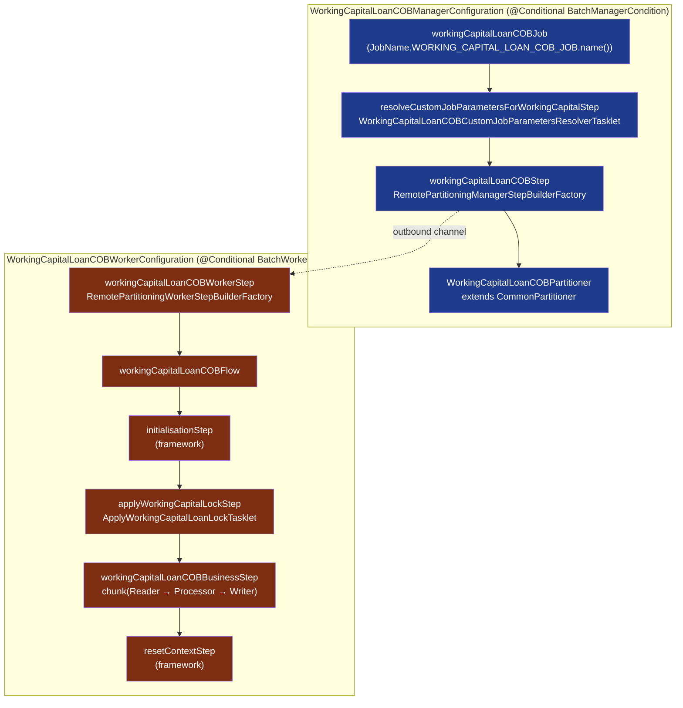

The Fineract Working Capital module ships its own nightly Close-of-Business pipeline, `WORKING_CAPITAL_LOAN_COB_JOB`. It is a deliberate clone of the loan COB job — partitioner + per-partition `ItemReader → ItemProcessor → ItemWriter` chunk loop, lock owner, fault-tolerant retry/skip, business-step abstraction — re-parameterised on `WorkingCapitalLoan`, with its own retrieve-id service (`WorkingCapitalLoanRetrieveIdService`), its own lock entity (`WorkingCapitalLoanAccountLock`) and an abstract `WorkingCapitalLoanCOBBusinessStep` that downstream callers extend. This page is the **module-internal** reference for every class under `fineract-working-capital-loan/src/main/java/org/apache/fineract/cob/workingcapitalloan/`; for the Spring-Batch-side reference (manager-vs-worker condition routing, Quartz wiring, stayed-locked handling) see [/cob/working-capital-loan-cob](/cob/working-capital-loan-cob).

## File inventory

```text
cob/workingcapitalloan/
├── WorkingCapitalLoanCOBConstant.java                   ← job names + bean names
├── WorkingCapitalLoanCOBManagerConfiguration.java       ← @Conditional(BatchManagerCondition)
├── WorkingCapitalLoanCOBWorkerConfiguration.java        ← @Conditional(BatchWorkerCondition)
├── WorkingCapitalLoanCOBPartitioner.java                ← extends CommonPartitioner
├── WorkingCapitalLoanCOBWorkerItemReader.java
├── WorkingCapitalLoanCOBWorkerItemProcessor.java        ← extends Abstract…ItemProcessor
├── WorkingCapitalLoanCOBWorkerItemWriter.java           ← extends Abstract…ItemWriter
├── WorkingCapitalLoanCOBWorkerItemListener.java         ← AbstractLoanItemListener
├── WorkingCapitalLoanInlineCOBWorkerItemProcessor.java  ← inline variant
├── InlineWorkingCapitalLoanCOBWorkerItemWriter.java
├── InlineWorkingCapitalLoanCOBWorkerItemListener.java
├── AbstractWorkingCapitalLoanCOBWorkerItemProcessor.java
├── AbstractWorkingCapitalLoanCOBWorkerItemWriter.java
├── ApplyWorkingCapitalLoanLockTasklet.java              ← ApplyCommonLockTasklet
├── WorkingCapitalLoanCOBCustomJobParametersResolverTasklet.java
├── WorkingCapitalLoanLockingConfiguration.java          ← LockingService bean
├── WorkingCapitalLoanLockingServiceImpl.java
├── WorkingCapitalAccountLockServiceImpl.java
├── WorkingCapitalLoanRetrieveIdConfiguration.java
├── WorkingCapitalLoanRetrieveIdService.java
├── WorkingCapitalLoanRetrieveIdServiceImpl.java
└── businessstep/
    ├── WorkingCapitalLoanCOBBusinessStep.java           ← abstract base
    └── DummyBusinessStep.java                           ← placeholder concrete step

cob/domain/  (still part of fineract-working-capital-loan)
├── WorkingCapitalLoanAccountLock.java                   ← @Entity m_wc_loan_account_locks
├── WorkingCapitalAccountLockRepository.java
└── CustomWorkingCapitalLoanAccountLockRepositoryImpl.java
```

## Job identity

```java
// WorkingCapitalLoanCOBConstant.java
public final class WorkingCapitalLoanCOBConstant extends COBConstant {

    public static final String WORKING_CAPITAL_JOB_NAME                  = "WC_LOAN_COB";
    public static final String WORKING_CAPITAL_JOB_HUMAN_READABLE_NAME   = "Working Capital Loan COB";
    public static final String WORKING_CAPITAL_LOAN_COB_JOB_NAME         = "WORKING_CAPITAL_LOAN_CLOSE_OF_BUSINESS";

    // Bean names
    public static final String WORKING_CAPITAL_LOAN_COB_STEP             = "workingCapitalLoanCOBStep";
    public static final String WORKING_CAPITAL_LOAN_COB_BUSINESS_STEP    = "workingCapitalLoanCOBBusinessStep";
    public static final String WORKING_CAPITAL_LOAN_COB_PARTITIONER      = "workingCapitalLoanCOBPartitioner";
    public static final String WORKING_CAPITAL_LOAN_COB_WORKER_STEP      = "workingCapitalLoanCOBWorkerStep";
    public static final String WORKING_CAPITAL_LOAN_COB_FLOW             = "workingCapitalLoanCOBFlow";

    public static final String INLINE_WORKING_CAPITAL_LOAN_COB_JOB_NAME  = "INLINE_WORKING_CAPITAL_LOAN_COB";
    public static final String WORKING_CAPITAL_LOAN_IDS_PARAMETER_NAME   = "LoanIds";

    public static final String WORKING_CAPITAL_LOAN_COB_PARTITIONER_STEP = "Working Capital Loan COB partition - Step";
}
```

`COBConstant` (inherited) brings:

- `BUSINESS_DATE_PARAMETER_NAME`
- `COB_PARAMETER` — execution-context key for the partition's `COBParameter(minAccountId, maxAccountId)`
- `NUMBER_OF_DAYS_BEHIND` — gap in days the partitioner allows behind the current business date

The corresponding `JobName` enum entry (in `fineract-core`):

```java
WORKING_CAPITAL_LOAN_COB_JOB("Working Capital Loan COB"),
```

The `InlineJobType` entry (in `fineract-provider`):

```java
WC_LOAN_COB("WC_LOAN_COB", "INLINE_WORKING_CAPITAL_LOAN_COB",
            InlineWorkingCapitalLoanCOBExecutorServiceImpl.class)
```

## Pipeline at a glance



Compared to `LOAN_COB`, the WC pipeline:

- **Lacks** a `stayedLockedStep` — failed/skipped accounts remain locked and are reconciled via catch-up; there is no `WorkingCapitalLoanAccountsStayedLockedBusinessEvent`.
- **Reuses** `propertyService.getChunkSize(JobName.LOAN_COB.name())` for the chunk size (intentional, so both jobs share one tuning knob).
- **Uses** its own `WorkingCapitalLoanRetrieveIdService` and `m_wc_loan_account_locks` table.

## Manager configuration

```java
@Configuration @EnableBatchIntegration @Conditional(BatchManagerCondition.class) @RequiredArgsConstructor
public class WorkingCapitalLoanCOBManagerConfiguration {

    @Bean(WORKING_CAPITAL_LOAN_COB_PARTITIONER) @StepScope
    public WorkingCapitalLoanCOBPartitioner workingCapitalLoanCOBPartitioner(
            @Value("#{stepExecution}") StepExecution stepExecution) {
        return new WorkingCapitalLoanCOBPartitioner(jobOperator, stepExecution,
                WorkingCapitalLoanCOBConstant.NUMBER_OF_DAYS_BEHIND,
                retrieveIdService, cobBusinessStepService, propertyService);
    }

    @Bean(WORKING_CAPITAL_JOB_HUMAN_READABLE_NAME)
    public Job workingCapitalLoanCOBJob(WorkingCapitalLoanCOBPartitioner partitioner,
            ExecutionContextPromotionListener customJobParametersPromotionListener) {
        return new JobBuilder(WORKING_CAPITAL_LOAN_COB_JOB.name(), jobRepository)
                .start(resolveCustomJobParametersForWorkingCapitalStep(customJobParametersPromotionListener))
                .next(workingCapitalLoanCOBStep(partitioner)).incrementer(new RunIdIncrementer()).build();
    }

    @Bean(WORKING_CAPITAL_LOAN_COB_STEP)
    public Step workingCapitalLoanCOBStep(WorkingCapitalLoanCOBPartitioner partitioner) {
        return stepBuilderFactory.get(WORKING_CAPITAL_LOAN_COB_PARTITIONER_STEP)
                .partitioner(WORKING_CAPITAL_LOAN_COB_WORKER_STEP, partitioner)
                .pollInterval(propertyService.getPollInterval(WORKING_CAPITAL_JOB_NAME))
                .outputChannel(outboundRequests).build();
    }
    // … resolveCustomJobParametersForWorkingCapitalStep + tasklet bean omitted for brevity
}
```

Constructor-injected dependencies (via `@RequiredArgsConstructor`): `JobRepository`, `CustomJobParameterResolver`, `PlatformTransactionManager`, `RemotePartitioningManagerStepBuilderFactory`, `COBBusinessStepService`, `JobOperator`, two `DirectChannel` (`inboundRequests`/`outboundRequests`), `PropertyService`, `WorkingCapitalLoanRetrieveIdService`.

Beans this contributes:

| Bean name | Type | Role |
| --- | --- | --- |
| `workingCapitalLoanCOBPartitioner` | `WorkingCapitalLoanCOBPartitioner` (`@StepScope`) | Computes `Map<String, ExecutionContext>` partitions |
| `Working Capital Loan COB` | `Job` | The Spring Batch job (its bean name is the human-readable string) |
| `resolveCustomJobParametersForWorkingCapitalTasklet` | `Tasklet` | Reads `BUSINESS_DATE_PARAMETER_NAME` from custom job params |
| `Resolve custom job parameters - Step` | `Step` | Hosts the tasklet above, listens via `ExecutionContextPromotionListener` |
| `workingCapitalLoanCOBStep` | `Step` (partitioned) | Outbound channel for remote-partitioned workers |

### Custom-params resolver tasklet

```java
@RequiredArgsConstructor
public class WorkingCapitalLoanCOBCustomJobParametersResolverTasklet implements Tasklet {

    private final CustomJobParameterResolver customJobParameterResolver;

    @Override
    public RepeatStatus execute(StepContribution contribution, ChunkContext chunkContext) throws Exception {
        customJobParameterResolver.resolve(contribution, chunkContext,
                BUSINESS_DATE_PARAMETER_NAME, BUSINESS_DATE_PARAMETER_NAME);
        return RepeatStatus.FINISHED;
    }
}
```

Single responsibility: pull `businessDate` from the launching `CustomJobParameter` payload and promote it into the step execution context so the partitioner and worker beans can see it.

### Partitioner

```java
@Slf4j
public class WorkingCapitalLoanCOBPartitioner extends CommonPartitioner implements Partitioner {

    private final COBBusinessStepService cobBusinessStepService;
    private final PropertyService propertyService;

    public WorkingCapitalLoanCOBPartitioner(JobOperator jobOperator, StepExecution stepExecution, Long numberOfDays,
            WorkingCapitalLoanRetrieveIdService retrieveIdService,
            COBBusinessStepService cobBusinessStepService, PropertyService propertyService) {
        super(jobOperator, stepExecution, numberOfDays, retrieveIdService);
        this.cobBusinessStepService = cobBusinessStepService;
        this.propertyService = propertyService;
    }

    @NonNull
    @Override
    public Map<String, ExecutionContext> partition(int gridSize) {
        int partitionSize = propertyService.getPartitionSize(WORKING_CAPITAL_JOB_NAME);
        Set<BusinessStepNameAndOrder> cobBusinessSteps =
                cobBusinessStepService.getCOBBusinessSteps(
                        WorkingCapitalLoanCOBBusinessStep.class,
                        WORKING_CAPITAL_LOAN_COB_JOB_NAME);
        return getPartitions(partitionSize, cobBusinessSteps);
    }
}
```

`CommonPartitioner.getPartitions(partitionSize, steps)` calls the underlying `RetrieveIdService.retrieveLoanCOBPartitions(numberOfDays, businessDate, isCatchUp, partitionSize)`, then writes one `ExecutionContext` per partition containing:

- `COB_PARAMETER` → `COBParameter(minAccountId, maxAccountId)`
- `BUSINESS_DATE_PARAMETER_NAME` → the business date
- The serialised list of `BusinessStepNameAndOrder` filtered for `WorkingCapitalLoanCOBBusinessStep.class` and the job name `"WORKING_CAPITAL_LOAN_CLOSE_OF_BUSINESS"`.

## Worker configuration

```java
@Configuration @Conditional(BatchWorkerCondition.class) @RequiredArgsConstructor
public class WorkingCapitalLoanCOBWorkerConfiguration {

    @Bean(WORKING_CAPITAL_LOAN_COB_FLOW)
    public Flow workingCapitalLoanCOBFlow(Step initialisationStep, Step applyWorkingCapitalLockStep,
            Step workingCapitalLoanCOBBusinessStep, Step resetContextStep) {
        return new FlowBuilder<Flow>(WORKING_CAPITAL_LOAN_COB_FLOW)
                .start(initialisationStep).next(applyWorkingCapitalLockStep)
                .next(workingCapitalLoanCOBBusinessStep).next(resetContextStep).build();
    }

    @Bean(WORKING_CAPITAL_LOAN_COB_WORKER_STEP)
    public Step workingCapitalLoanCOBWorkerStep(Flow workingCapitalLoanCOBFlow) {
        return stepBuilderFactory.get(WORKING_CAPITAL_LOAN_COB_WORKER_STEP)
                .inputChannel(inboundRequests).flow(workingCapitalLoanCOBFlow).build();
    }

    @Bean(WORKING_CAPITAL_LOAN_COB_BUSINESS_STEP) @StepScope
    public Step workingCapitalLoanCOBBusinessStep(@Value("#{stepExecutionContext['partition']}") String partitionName,
            TaskExecutor workingCapitalCobTaskExecutor, COBBusinessStepService cobBusinessStepService) {

        SimpleStepBuilder<WorkingCapitalLoan, WorkingCapitalLoan> stepBuilder =
                new StepBuilder("Loan Business - Step:" + partitionName, jobRepository)
                .<WorkingCapitalLoan, WorkingCapitalLoan>chunk(
                        propertyService.getChunkSize(JobName.LOAN_COB.name()), transactionManager)
                .reader(new WorkingCapitalLoanCOBWorkerItemReader(workingCapitalLoanRepository,
                        new BeforeStepLockingItemReaderHelper<>(retrieveIdService, wpcLoanLockingService)))
                .processor(new WorkingCapitalLoanCOBWorkerItemProcessor(cobBusinessStepService))
                .writer(new WorkingCapitalLoanCOBWorkerItemWriter(wpcLoanLockingService, workingCapitalLoanRepository))
                .faultTolerant()
                .retry(Exception.class).retryLimit(propertyService.getRetryLimit(WORKING_CAPITAL_JOB_NAME))
                .skip (Exception.class).skipLimit (propertyService.getChunkSize (WORKING_CAPITAL_JOB_NAME) + 1)
                .listener(workingCapitalLoanItemListener())
                .transactionManager(transactionManager);

        if (propertyService.getThreadPoolMaxPoolSize(WORKING_CAPITAL_JOB_NAME) > 1) {
            stepBuilder.taskExecutor(workingCapitalCobTaskExecutor);
        }
        return stepBuilder.build();
    }
    // + applyWorkingCapitalLockStep, workingCapitalCobTaskExecutor, workingCapitalLoanItemListener beans
}
```

### Task executor

`workingCapitalCobTaskExecutor()` returns `new SyncTaskExecutor()` when `getThreadPoolMaxPoolSize("WC_LOAN_COB") == 1`, otherwise a `ThreadPoolTaskExecutor` with thread-name prefix `COB-Thread-`, group `COB-Thread`, the configured core/max/queue sizes, `allowCoreThreadTimeOut = true`, and a `ContextAwareTaskDecorator` that copies the calling thread's `TenantContext`, `SecurityContext` and request attributes to worker threads so business steps see the same tenant.

### Lock-apply step

```java
public class ApplyWorkingCapitalLoanLockTasklet extends ApplyCommonLockTasklet<WorkingCapitalLoanAccountLock> {
    @Override public String   getCOBParameter() { return WorkingCapitalLoanCOBConstant.COB_PARAMETER; }
    @Override public LockOwner getLockOwner()    { return LockOwner.LOAN_COB_CHUNK_PROCESSING; }
}
```

`ApplyCommonLockTasklet` inserts one row into `m_wc_loan_account_locks` per loan id in the partition's `(minAccountId, maxAccountId)` range, with `lock_owner = LOAN_COB_CHUNK_PROCESSING` and `lock_placed_on_cob_business_date = businessDate`.

## Reader → Processor → Writer

### Reader

```java
@Slf4j @RequiredArgsConstructor
public class WorkingCapitalLoanCOBWorkerItemReader implements ItemReader<WorkingCapitalLoan> {

    private final WorkingCapitalLoanRepository repository;
    private final BeforeStepLockingItemReaderHelper<WorkingCapitalLoanAccountLock> itemReaderHelper;

    @Setter(AccessLevel.PROTECTED) private LinkedBlockingQueue<Long> remainingData;

    @Override @Nullable
    public WorkingCapitalLoan read() throws Exception {
        final Long loanId = remainingData.poll();
        if (loanId != null) {
            try { return repository.findById(loanId).orElseThrow(() -> new LoanNotFoundException(loanId)); }
            catch (Exception e) { throw new LockedReadException(loanId, e); }
        }
        return null;
    }

    @BeforeStep
    public void beforeStep(@NonNull StepExecution stepExecution) {
        setRemainingData(itemReaderHelper.filterRemainingData(stepExecution));
    }
}
```

`BeforeStepLockingItemReaderHelper.filterRemainingData` walks the partition's id range via `WorkingCapitalLoanRetrieveIdService.retrieveAllNonClosedLoansByLastClosedBusinessDateAndMinAndMaxLoanIdAndStatuses(...)`, then filters out ids whose lock owner is already someone else. Read failures wrap as `LockedReadException` so the framework can choose skip vs retry.

### Processor

The chunk processor is a concrete `BeforeStep` binder around the abstract `setBusinessDate / setExecutionContext` helpers in `AbstractItemProcessor<WorkingCapitalLoan>`:

```java
public class WorkingCapitalLoanCOBWorkerItemProcessor extends AbstractWorkingCapitalLoanCOBWorkerItemProcessor {

    public WorkingCapitalLoanCOBWorkerItemProcessor(COBBusinessStepService cobBusinessStepService) {
        super(cobBusinessStepService);
    }

    @BeforeStep
    public void beforeStep(StepExecution stepExecution) {
        setExecutionContext(stepExecution.getExecutionContext());
        setBusinessDate(stepExecution);
    }
}
```

```java
public abstract class AbstractWorkingCapitalLoanCOBWorkerItemProcessor extends AbstractItemProcessor<WorkingCapitalLoan> {

    public AbstractWorkingCapitalLoanCOBWorkerItemProcessor(COBBusinessStepService cobBusinessStepService) {
        super(cobBusinessStepService);
    }

    @Override
    public void setLastRun(WorkingCapitalLoan processedLoan) {
        processedLoan.setLastClosedBusinessDate(getBusinessDate());
    }
}
```

The framework's `AbstractItemProcessor.process(item)` does roughly:

```text
for each (order, beanName) in this partition's BusinessStepNameAndOrder set:
    step = applicationContext.getBean(beanName, WorkingCapitalLoanCOBBusinessStep.class)
    item = step.execute(item)
setLastRun(item)   // sets lastClosedBusinessDate
return item
```

That makes `setLastRun` the single point where the WC processor advances `m_wc_loan.last_closed_business_date`.

### Writer

```java
@Slf4j
public class WorkingCapitalLoanCOBWorkerItemWriter extends AbstractWorkingCapitalLoanCOBWorkerItemWriter {
    public WorkingCapitalLoanCOBWorkerItemWriter(LockingService<WorkingCapitalLoanAccountLock> loanLockingService,
            CrudRepository<WorkingCapitalLoan, Long> repository) {
        super(loanLockingService, repository);
    }
    @Override protected LockOwner getLockOwner() { return LockOwner.LOAN_COB_CHUNK_PROCESSING; }
}
```

```java
@Slf4j
public abstract class AbstractWorkingCapitalLoanCOBWorkerItemWriter extends RepositoryItemWriter<WorkingCapitalLoan> {

    private final LockingService<WorkingCapitalLoanAccountLock> loanLockingService;

    public AbstractWorkingCapitalLoanCOBWorkerItemWriter(
            LockingService<WorkingCapitalLoanAccountLock> loanLockingService,
            CrudRepository<WorkingCapitalLoan, Long> repository) {
        this.loanLockingService = loanLockingService;
        setRepository(repository);
    }

    @Override
    public void write(@NonNull Chunk<? extends WorkingCapitalLoan> items) throws Exception {
        if (!items.isEmpty()) {
            super.write(items);
            List<Long> loanIds = items.getItems().stream().map(AbstractPersistableCustom::getId).toList();
            loanLockingService.deleteByLoanIdInAndLockOwner(loanIds, getLockOwner());
        }
    }

    protected abstract LockOwner getLockOwner();
}
```

Two acts inside a chunk-level transaction:

1. `super.write(items)` → JPA `saveAll(items)` — persists the loan's mutations including `lastClosedBusinessDate`.
2. `loanLockingService.deleteByLoanIdInAndLockOwner(loanIds, LOAN_COB_CHUNK_PROCESSING)` — releases the lock.

If either fails, the transaction rolls back and the lock stays in place; the listener decides retry vs skip.

### Listener

```java
public class WorkingCapitalLoanCOBWorkerItemListener
        extends AbstractLoanItemListener<WorkingCapitalLoanAccountLock, Loan> {

    public WorkingCapitalLoanCOBWorkerItemListener(LockingService<WorkingCapitalLoanAccountLock> lockingService,
            TransactionTemplate transactionTemplate) {
        super(lockingService, transactionTemplate);
    }

    @Override protected LockOwner getLockOwner() { return LockOwner.LOAN_COB_CHUNK_PROCESSING; }
}
```

`AbstractLoanItemListener` from `fineract-cob` implements `SkipListener` / `RetryListener` / `ItemProcessListener`. On skip, it logs the offending id and **upgrades** the lock's owner to `LOAN_COB_PROCESSING_FAILED` so the item is excluded from retry attempts within the same run.

## Business steps

```java
public abstract class WorkingCapitalLoanCOBBusinessStep
        implements COBBusinessStep<WorkingCapitalLoan> {}
```

The `COBBusinessStep<T>` SPI (in `fineract-cob`) defines:

```java
T      execute(T input);
String getEnumStyledName();
String getHumanReadableName();
```

A concrete WC step extends `WorkingCapitalLoanCOBBusinessStep` and is picked up automatically by `COBBusinessStepService.getCOBBusinessSteps(WorkingCapitalLoanCOBBusinessStep.class, "WORKING_CAPITAL_LOAN_CLOSE_OF_BUSINESS")` provided it has a row in `m_batch_business_steps` for that job name.

### Seed step

```java
@Slf4j @RequiredArgsConstructor
@Component
public class DummyBusinessStep extends WorkingCapitalLoanCOBBusinessStep {

    @Override
    public WorkingCapitalLoan execute(WorkingCapitalLoan input) {
        log.info("Executing DummyBusinessStep... WorkingCapitalLoan ID = {}", input.getId());
        return input;
    }

    @Override public String getEnumStyledName()   { return "DUMMY_BUSINESS_STEP"; }
    @Override public String getHumanReadableName() { return "Dummy Business Step"; }
}
```

A placeholder so the job has at least one step to run while real Working Capital business steps (interest accrual, payment-allocation roll, delinquency tag) are being implemented.

### Adding a new step

<Steps>
  <Step title="Extend the abstract class">
    Create a `@Component` that extends `WorkingCapitalLoanCOBBusinessStep`, implement `execute / getEnumStyledName / getHumanReadableName`. The bean must live somewhere in the component-scan path (`fineract-working-capital-loan` or downstream module).
  </Step>
  <Step title="Register in m_batch_business_steps">
    Insert a row with `job_name = 'WORKING_CAPITAL_LOAN_CLOSE_OF_BUSINESS'`, `step_name = getEnumStyledName()`, and an integer `step_order` so `COBBusinessStepService` can return it in the right place.
  </Step>
  <Step title="Make it idempotent">
    The `faultTolerant().retry(Exception.class)` means your `execute` will be retried after a transient failure. Mutating fields like `WorkingCapitalLoanBalance.realizedIncome` must use diff-based updates that tolerate repetition.
  </Step>
</Steps>

## Locking

### Lock entity

```java
@Entity @Table(name = "m_wc_loan_account_locks") @Getter @NoArgsConstructor
public class WorkingCapitalLoanAccountLock extends AccountLock {
    public WorkingCapitalLoanAccountLock(Long loanId, LockOwner lockOwner, LocalDate lockPlacedOnCobBusinessDate) {
        super(loanId, lockOwner, lockPlacedOnCobBusinessDate);
    }
}
```

Inherits `AccountLock` columns: `id, loan_id, version, lock_owner, lock_placed_on, lock_placed_on_cob_business_date, error, stale_information_date`.

### Locking service

`WorkingCapitalLoanLockingServiceImpl extends AbstractLockingService<WorkingCapitalLoanAccountLock>` and provides two batched SQL statements:

```sql
-- BATCH_LOAN_LOCK_INSERT
INSERT INTO m_wc_loan_account_locks
  (loan_id, version, lock_owner, lock_placed_on, lock_placed_on_cob_business_date)
VALUES (?,?,?,?,?)

-- BATCH_LOAN_LOCK_UPGRADE
UPDATE m_wc_loan_account_locks
SET version = version + 1, lock_owner = ?, lock_placed_on = ?
WHERE loan_id = ?
```

The bean is published by `WorkingCapitalLoanLockingConfiguration` as `LockingService<WorkingCapitalLoanAccountLock>` (`@ConditionalOnMissingBean`).

`WorkingCapitalAccountLockServiceImpl extends AbstractAccountLockService<WorkingCapitalLoanAccountLock>` is the **online-side** companion — write services call it to lock-or-throw so HTTP requests can't disturb a loan currently being processed by the batch.

### Lock-owner contract

| Owner | Holder |
| --- | --- |
| `LOAN_COB_CHUNK_PROCESSING` | Batch chunk currently writing the loan (placed by `ApplyWorkingCapitalLoanLockTasklet`, released by the writer) |
| `LOAN_COB_PROCESSING_FAILED` | Item that was skipped at least once; reconciled by catch-up |
| `LOAN_INLINE_COB_PROCESSING` | Inline catch-up job currently processing this loan |

## Retrieve-id service

```java
public interface WorkingCapitalLoanRetrieveIdService extends RetrieveIdService {}
```

`WorkingCapitalLoanRetrieveIdServiceImpl` exposes `NON_CLOSED_LOAN_STATUSES = { SUBMITTED_AND_PENDING_APPROVAL, APPROVED, ACTIVE, TRANSFER_IN_PROGRESS, TRANSFER_ON_HOLD }` and partitions over `m_wc_loan`:

```java
@Override
public List<COBPartition> retrieveLoanCOBPartitions(Long numberOfDays, LocalDate businessDate,
        boolean isCatchUp, int partitionSize) {
    StringBuilder sql = new StringBuilder();
    sql.append("select min(id) as min, max(id) as max, page, count(id) as count from ");
    sql.append("  (select floor(((row_number() over(order by id))-1) / :pageSize) as page, t.* from ");
    sql.append("      (select id from m_wc_loan where loan_status_id in (:statusIds) and ");
    if (isCatchUp) sql.append("last_closed_business_date = :businessDate ");
    else           sql.append("(last_closed_business_date = :businessDate or last_closed_business_date is null) ");
    sql.append("order by id) t) t2 group by page order by page");

    MapSqlParameterSource parameters = new MapSqlParameterSource();
    parameters.addValue("pageSize",     partitionSize);
    parameters.addValue("statusIds",    List.of(100, 200, 300, 303, 304));
    parameters.addValue("businessDate", businessDate.minusDays(numberOfDays));
    return namedParameterJdbcTemplate.query(sql.toString(), parameters, RetrieveIdService::mapRow);
}
```

Key behaviours:

- Status int codes `100, 200, 300, 303, 304` match the named enums above.
- The base SQL paginates `m_wc_loan` by id, returning one `COBPartition(min, max, page, count)` per page.
- `isCatchUp = true` includes only loans whose `last_closed_business_date == businessDate − numberOfDays`; `false` also includes never-processed (NULL) loans.

Other interface methods delegate to repository queries (see [Domain & Product](/working-capital-loan/domain-and-product#repository-surface)). The bean is published by `WorkingCapitalLoanRetrieveIdConfiguration` (`@ConditionalOnMissingBean`).

## Inline variant

Two `Inline*` siblings of the chunk components live next to the main pipeline:

```java
public class WorkingCapitalLoanInlineCOBWorkerItemProcessor extends AbstractWorkingCapitalLoanCOBWorkerItemProcessor {

    public WorkingCapitalLoanInlineCOBWorkerItemProcessor(COBBusinessStepService cobBusinessStepService) {
        super(cobBusinessStepService);
    }

    @BeforeStep
    public void beforeStep(StepExecution stepExecution) {
        setExecutionContext(stepExecution.getJobExecution().getExecutionContext());  // ← job, not step
        setBusinessDate(stepExecution);
    }
}
```

The only difference from the regular processor is **where the execution context is fetched**: an inline run uses one job execution per loan list, so the partitioning context lives at the job level.

```java
public class InlineWorkingCapitalLoanCOBWorkerItemWriter extends AbstractWorkingCapitalLoanCOBWorkerItemWriter {
    public InlineWorkingCapitalLoanCOBWorkerItemWriter(/*…*/) { super(/*…*/); }
    @Override protected LockOwner getLockOwner() { return LockOwner.LOAN_INLINE_COB_PROCESSING; }
}

public class InlineWorkingCapitalLoanCOBWorkerItemListener
        extends AbstractLoanItemListener<WorkingCapitalLoanAccountLock, Loan> {
    @Override protected LockOwner getLockOwner() { return LockOwner.LOAN_INLINE_COB_PROCESSING; }
}
```

Inline rows acquire a **different lock owner** (`LOAN_INLINE_COB_PROCESSING`) so they don't collide with concurrent batch chunks owning `LOAN_COB_CHUNK_PROCESSING`.

The inline executor service (in `fineract-provider`) routes through `InlineJobType.WC_LOAN_COB`:

```java
WC_LOAN_COB("WC_LOAN_COB", "INLINE_WORKING_CAPITAL_LOAN_COB",
            InlineWorkingCapitalLoanCOBExecutorServiceImpl.class)
```

```java
@Service @Slf4j
@Conditional(LoanCOBEnabledCondition.class)
public class InlineWorkingCapitalLoanCOBExecutorServiceImpl
        extends InlineCommonLockableCOBExecutorService<WorkingCapitalLoanAccountLock> {

    @Override
    public WorkingCapitalLoanAccountLock createAccountLock(Long loanId, LockOwner owner, LocalDate businessDate) {
        return new WorkingCapitalLoanAccountLock(loanId, owner, businessDate);
    }
}
```

It accepts an explicit list of loan ids via `WORKING_CAPITAL_LOAN_IDS_PARAMETER_NAME = "LoanIds"`, runs them through the same business steps as the nightly job, then releases the inline locks.

## Catch-up surface

The catch-up endpoint (`/v1/working-capital-cob-catchup`) drives the same machinery via an inline job for ids returned by `findAllLoansBehindOrNullByLoanIdsAndStatuses`, `findAllLoansBehindByLoanIdsAndStatuses` or `findOldestCOBProcessedLoan`. See [`/api/working-capital-cob-catchup`](/api/working-capital-cob-catchup) for the surface.

## Field updates per pass

A successful pass through the worker step updates the loan as follows:

```text
m_wc_loan
    last_closed_business_date  ← businessDate           (set by AbstractItemProcessor.setLastRun)
    + any field a business step decided to mutate during execute(...)

m_wc_loan_account_locks
    INSERT  during applyWorkingCapitalLockStep
    DELETE  at chunk commit time
```

If skipped:

```text
m_wc_loan_account_locks
    UPDATE  lock_owner = LOAN_COB_PROCESSING_FAILED   (by the listener)
```

If failed (transaction rollback):

```text
m_wc_loan                  no row change
m_wc_loan_account_locks    lock row remains (lock_owner stays LOAN_COB_CHUNK_PROCESSING)
                           → eventually swept by catch-up
```

## Tuning knobs

All resolved via `PropertyService` against `WORKING_CAPITAL_JOB_NAME = "WC_LOAN_COB"` (except chunk size, shared with `LOAN_COB`):

| Knob | Used at |
| --- | --- |
| `getPartitionSize("WC_LOAN_COB")` | Partitioner — ids per partition |
| `getPollInterval("WC_LOAN_COB")` | Manager step — partition completion poll |
| `getRetryLimit("WC_LOAN_COB")` | Worker chunk retry limit |
| `getChunkSize(JobName.LOAN_COB.name())` | Worker chunk size (shared) |
| `getChunkSize("WC_LOAN_COB") + 1` | Worker skip limit |
| `getThreadPool{Core,Max}PoolSize / QueueCapacity("WC_LOAN_COB")` | Sync vs ThreadPool executor |

## Cross-references

<CardGroup cols={2}>
  <Card title="Spring-Batch side (framework)" icon="link" href="/cob/working-capital-loan-cob">
    Reader/Writer wiring inside the COB framework, condition routing (`BatchManagerCondition` vs `BatchWorkerCondition`), Quartz wiring and stayed-locked behaviour.
  </Card>
  <Card title="Domain entities" icon="database" href="/working-capital-loan/domain-and-product">
    `WorkingCapitalLoan`, `WorkingCapitalLoanBalance`, the lock entity and the repository queries the partitioner uses.
  </Card>
  <Card title="Calc engine" icon="calculator" href="/working-capital-loan/calc-engine">
    `ProjectedAmortizationScheduleModel` — a future business step that posts daily accruals will consume this model.
  </Card>
  <Card title="Module overview" icon="layer-group" href="/working-capital-loan/overview">
    Back to the module index.
  </Card>
  <Card title="WC catch-up API" icon="rotate" href="/api/working-capital-cob-catchup">
    Surface that drives the inline variant of the pipeline above.
  </Card>
  <Card title="Loan COB business steps" icon="bolt" href="/cob/loan-cob-business-steps">
    Reference for the parallel loan-side pipeline this WC pipeline mirrors.
  </Card>
</CardGroup>

## Summary

`WORKING_CAPITAL_LOAN_COB_JOB` is a small, focused clone of the loan-COB pipeline. Six classes hold the chunked Reader → Processor → Writer trio; two abstract classes parameterise the lock owner; one tasklet acquires locks per partition; one partitioner extends `CommonPartitioner` to feed loan ids from `m_wc_loan`. The contract every implementer cares about is `WorkingCapitalLoanCOBBusinessStep.execute(WorkingCapitalLoan)` — everything around it is plumbing whose only job is to ensure your step runs exactly once per loan per business day, inside a transaction, while the loan is locked from online writers.
